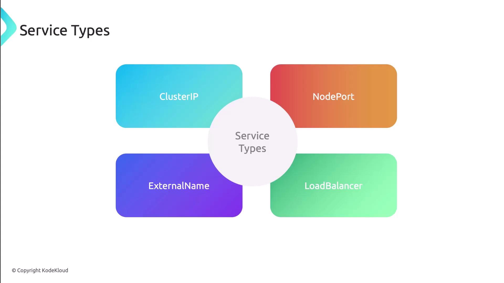

# Service Types

Source: https://notes.kodekloud.com/docs/Kubernetes-Networking-Deep-Dive/Kubernetes-Services/Service-Types/page

This article explains Kubernetes service types, detailing how they route network traffic to pods and their specific use cases.

Kubernetes service types are powerful abstractions that expose applications running inside a cluster to both internal and external clients. Each service type determines how network traffic is routed to your pods. In this guide, we’ll cover the four primary service types—ClusterIP, NodePort, LoadBalancer, and ExternalName—as well as Headless Services for direct pod addressing.

<Frame>
  
</Frame>

Every Service resource sets its type in `spec.type`. Use this template to get started:

```yaml theme={null}
apiVersion: v1
kind: Service
metadata:
  name: my-service
spec:
  type: TYPE            # ClusterIP | NodePort | LoadBalancer | ExternalName
  selector:
    app: my-app
  ports:
    - protocol: TCP
      port: 80
      targetPort: 8080
```

## ClusterIP

ClusterIP is the default service type. It provisions a stable internal IP address, enabling reliable communication between pods and services within the cluster. Because it’s not exposed externally, ClusterIP is ideal for backend components like databases, the Kubernetes API server, and DNS resolution.

```yaml theme={null}
