# ClusterIP example (default)
apiVersion: v1
kind: Service
metadata:
  name: internal-service
spec:
  selector:
    app: backend
  ports:
    - port: 5432
      targetPort: 5432
```

<Frame>
  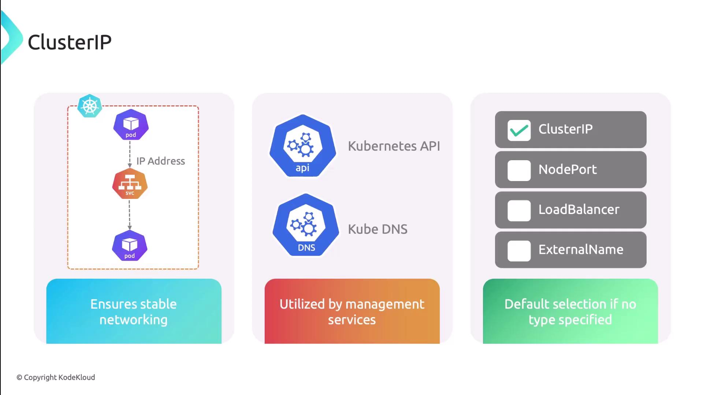
</Frame>

## NodePort

NodePort opens a static port (default range 30000–32767) on every node’s IP address. Clients can reach your service using `<NodeIP>:<NodePort>`. This is useful for development or testing when you need quick external access without configuring a cloud load balancer.

```yaml theme={null}
apiVersion: v1
kind: Service
metadata:
  name: my-nodeport-service
spec:
  type: NodePort
  selector:
    app: web
  ports:
    - name: http
      protocol: TCP
      port: 80
      targetPort: 80
      nodePort: 31000
```

<Callout icon="triangle-alert">
  Ensure your nodes’ network security groups and firewalls allow traffic to the chosen `nodePort` range.
</Callout>

<Frame>
  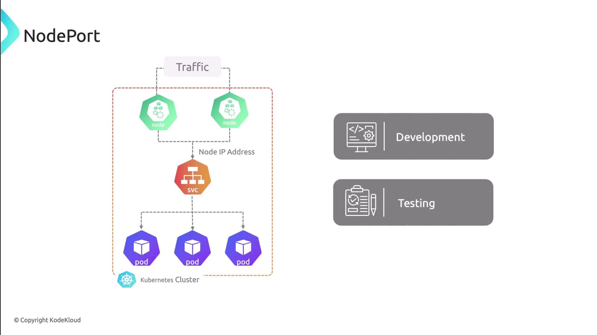
</Frame>

## LoadBalancer

LoadBalancer automatically provisions an external load balancer through your cloud provider. It allocates a public IP address and distributes incoming requests across your service’s pods. This is the recommended approach for production workloads requiring high availability and scalability.

```yaml theme={null}
apiVersion: v1
kind: Service
metadata:
  name: my-loadbalancer-service
spec:
  type: LoadBalancer
  selector:
    app: frontend
  ports:
    - port: 80
      targetPort: 8080
```

<Callout icon="lightbulb">
  When using a cloud provider, ensure your Kubernetes cluster is configured with the appropriate CNI plugin to support load balancer integrations.
</Callout>

<Frame>
  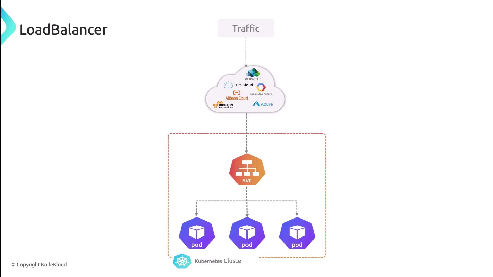
</Frame>

<Frame>
  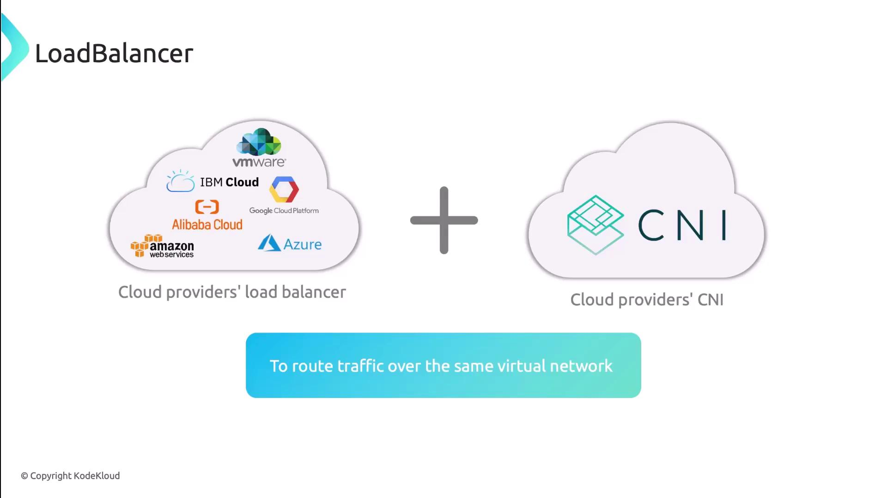
</Frame>

## ExternalName

ExternalName maps a Kubernetes service to an external DNS name. Instead of proxying through cluster networking, DNS queries resolve directly to the external hostname. Use this to integrate external APIs, databases, or SaaS offerings.

```yaml theme={null}
apiVersion: v1
kind: Service
metadata:
  name: external-db
spec:
  type: ExternalName
  externalName: db.example.com
```

<Callout icon="lightbulb">
  ExternalName services do not use selectors or ports. Kubernetes returns a CNAME record for DNS resolution.
</Callout>

<Frame>
  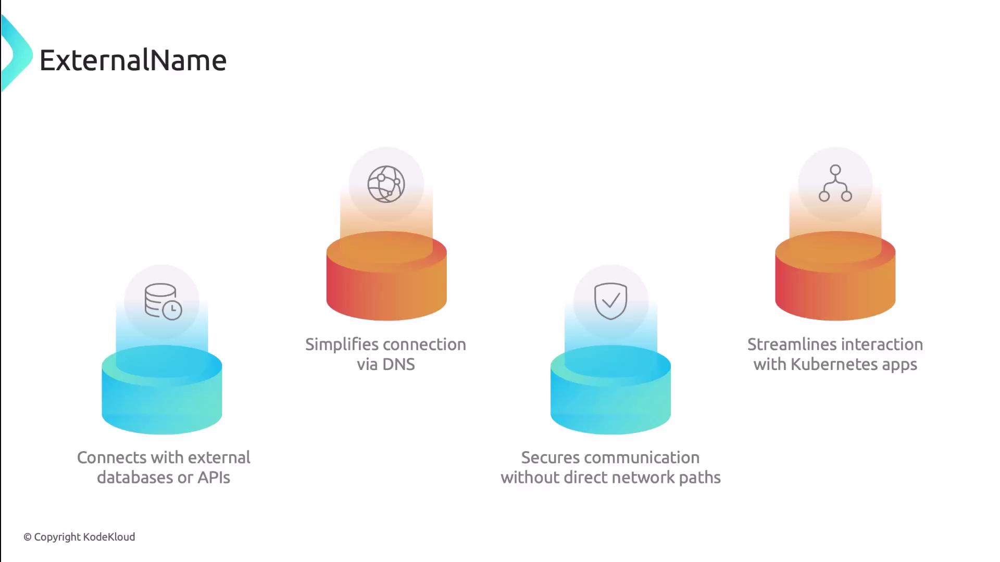
</Frame>

## Headless Service

Headless Services omit the virtual IP by setting `clusterIP: None`. DNS queries return the pod IPs directly. This pattern is ideal for stateful applications like databases, message queues, and distributed systems requiring direct pod addressing.

```yaml theme={null}
apiVersion: v1
kind: Service
metadata:
  name: headless-app
spec:
  clusterIP: None
  selector:
    app: stateful
  ports:
    - protocol: TCP
      port: 6379
      targetPort: 6379
```

<Frame>
  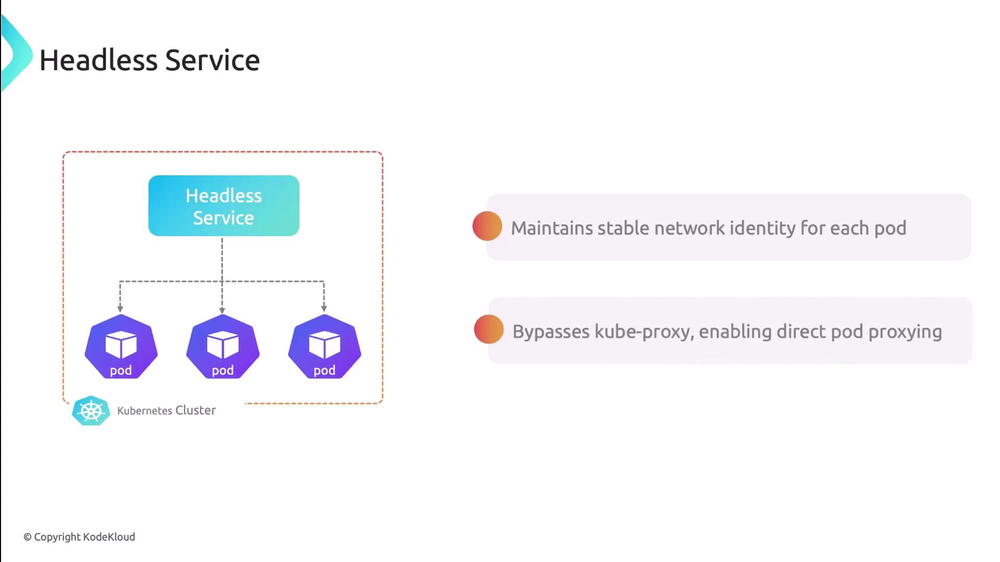
</Frame>

***

## Comparison of Service Types

| Service Type | Exposure                | Use Case                                |
| ------------ | ----------------------- | --------------------------------------- |
| ClusterIP    | Internal only           | Core services, internal APIs            |
| NodePort     | NodeIP:`nodePort`       | Dev/testing, simple external access     |
| LoadBalancer | Public IP via cloud LB  | Production-grade external access        |
| ExternalName | DNS CNAME               | External dependencies (DBs, APIs)       |
| Headless     | Direct pod IPs (no VIP) | Stateful sets, direct pod communication |

<Frame>
  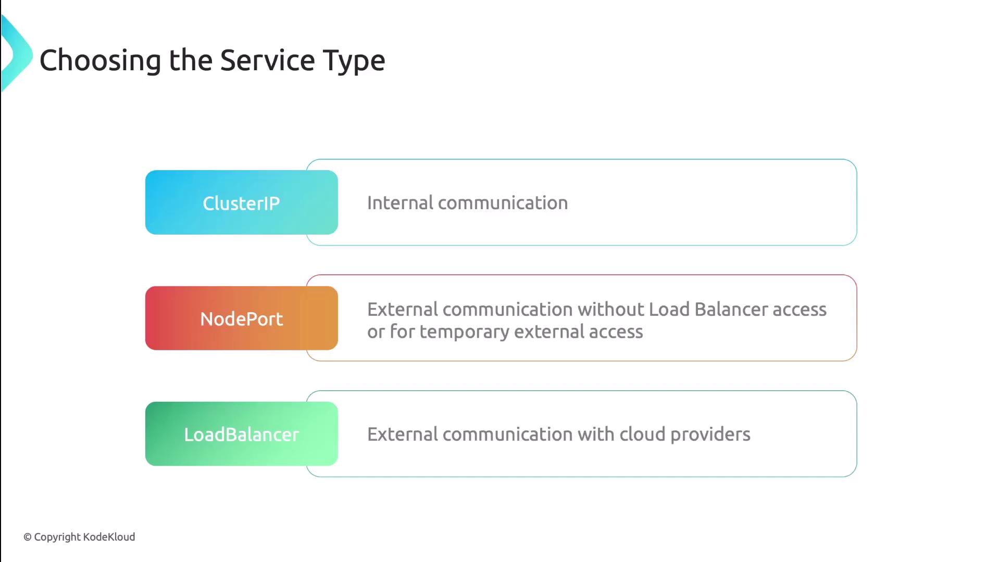
</Frame>

***

## Next Steps

* Explore [Kubernetes Services documentation](https://kubernetes.io/docs/concepts/services-networking/service/) for in-depth details.
* Try creating each service type in your cluster to observe traffic flow.
* Integrate these service types into your CI/CD pipelines for smooth deployments.

## References

* [Kubernetes Networking](https://kubernetes.io/docs/concepts/cluster-administration/networking/)
* [Kubernetes CNI Plugins](https://kubernetes.io/docs/concepts/extend-kubernetes/compute-storage-net/network-plugins/)
* [Service Type Examples](https://kubernetes.io/docs/concepts/services-networking/service/#publishing-services-service-types)

<CardGroup>
  <Card title="Watch Video" icon="video" href="https://learn.kodekloud.com/user/courses/kubernetes-networking/module/00c6db37-72b0-44e1-8c3a-81e22c8d8af6/lesson/4cdb0996-6358-49d8-a017-cdfebc7f44f6" />
</CardGroup>


# Services Overview

Source: https://notes.kodekloud.com/docs/Kubernetes-Networking-Deep-Dive/Kubernetes-Services/Services-Overview/page

Kubernetes Services provide stable network endpoints for pods, ensuring consistent communication across the cluster while abstracting their dynamic IPs.

Kubernetes Services provide a stable network endpoint for pods, abstracting their dynamic IPs and ensuring consistent communication across the cluster.

<Frame>
  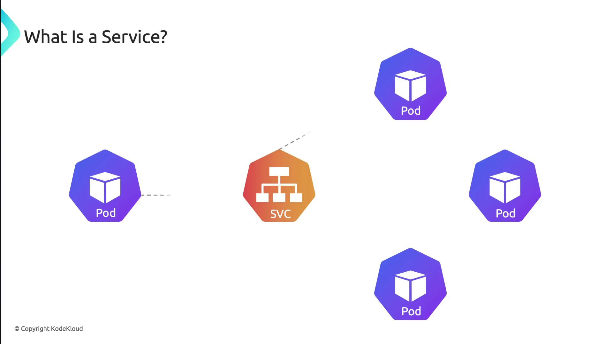
</Frame>

A Service definition looks like any other Kubernetes object. You give it a name, set a selector for matching pods, declare ports, and choose a Service type:

```yaml theme={null}
apiVersion: v1
kind: Service
metadata:
  name: my-service
  namespace: my-namespace
spec:
  selector:
    app: my-app
  ports:
    - protocol: TCP
      port: 80         # Service port
      targetPort: 8080 # Pod port
  type: ClusterIP
```

* selector: `app: my-app` matches pods labeled accordingly.
* ports: exposes port 80 and forwards traffic to pod port 8080.
* type: `ClusterIP` (default) makes the Service reachable only within the cluster.

<Callout icon="lightbulb">
  Kubernetes uses EndpointSlices to track pod endpoints automatically. Clients always connect to the Service IP, unaware of pod restarts or IP changes.
</Callout>

***

## Service Discovery

Kubernetes exposes Service endpoints to pods in two ways:

1. **Environment variables**\
   The kubelet injects:
   * `MY_SERVICE_SERVICE_HOST`
   * `MY_SERVICE_SERVICE_PORT`\
     into each container at startup.

2. **DNS**\
   With [CoreDNS](https://coredns.io/) (or another DNS add-on), every Service gets an A record and SRV records:

<Frame>
  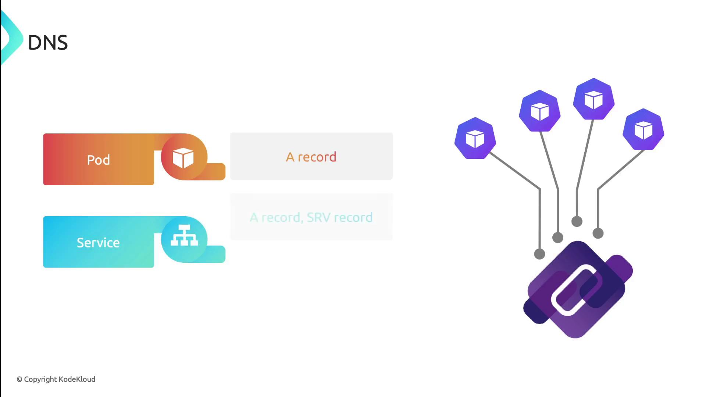
</Frame>

* **A record**: `service-name.namespace.svc.cluster.local`
* **SRV records**: one per named port, for example:
  ```text theme={null}
  _http._tcp.my-service.my-namespace.svc.cluster.local
  ```

<Frame>
  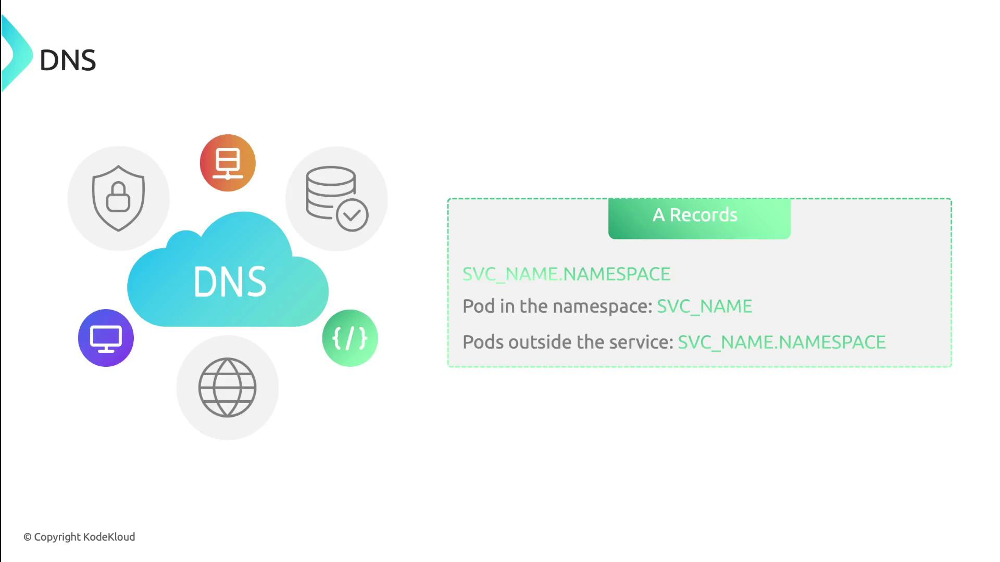
</Frame>

***

## Service Types

Kubernetes supports four Service types, each controlling how traffic reaches your application.

| Service Type | Exposure Scope        | Port Mapping                       |
| ------------ | --------------------- | ---------------------------------- |
| ClusterIP    | Internal cluster only | Virtual cluster IP                 |
| NodePort     | Host nodes            | NodeIP:`NodePort`                  |
| LoadBalancer | External via LB       | Provisioned cloud load balancer IP |
| ExternalName | DNS redirection       | CNAME record to external hostname  |

### 1. ClusterIP

Exposes the Service on a cluster-internal IP address. Use it for internal microservice communications or when fronted by an Ingress.

<Frame>
  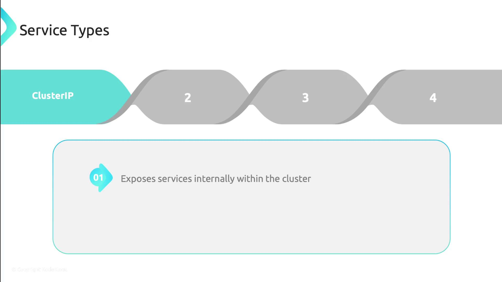
</Frame>

### 2. NodePort

Allocates a port on each node’s IP. External clients use `NodeIP:NodePort` to reach the Service.

<Frame>
  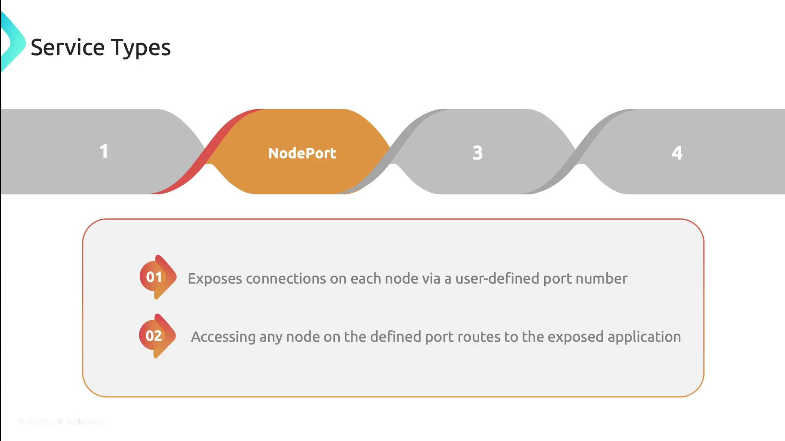
</Frame>

### 3. LoadBalancer

Integrates with cloud-provider load balancers. Kubernetes provisions an external load balancer and maps it to your Service.

<Frame>
  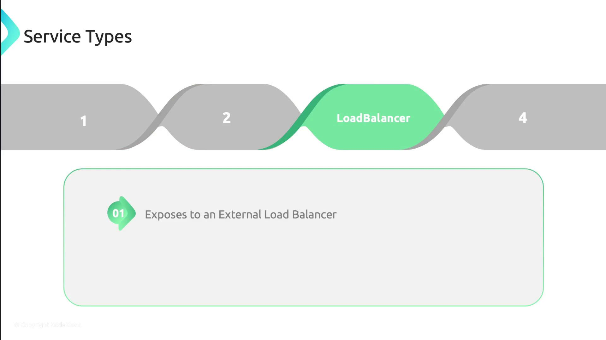
</Frame>

### 4. ExternalName

Creates a DNS CNAME record that maps the Service to an external DNS name. No proxies or IPs are provisioned in the cluster.

<Frame>
  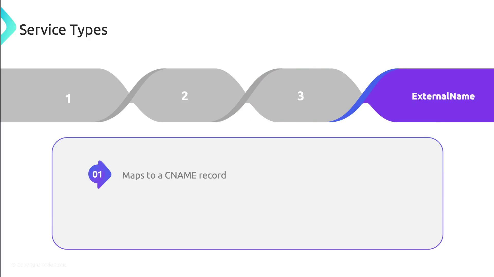
</Frame>

<Callout icon="triangle-alert">
  `ExternalName` Services do not support port mapping or protocols. They simply return a DNS CNAME.
</Callout>

***

## Links and References

* [Kubernetes Services Concept](https://kubernetes.io/docs/concepts/services-networking/service/)
* [CoreDNS Documentation](https://coredns.io/)
* [DNS SRV Records (Wikipedia)](https://en.wikipedia.org/wiki/SRV_record)

<CardGroup>
  <Card title="Watch Video" icon="video" href="https://learn.kodekloud.com/user/courses/kubernetes-networking/module/00c6db37-72b0-44e1-8c3a-81e22c8d8af6/lesson/d61813c6-5c95-4a69-b044-1a6656a6b3e1" />
</CardGroup>
