# Troubleshooting Internal Networking

Source: https://notes.kodekloud.com/docs/Kubernetes-Networking-Deep-Dive/Kubernetes-Services/Troubleshooting-Internal-Networking/page

This guide highlights common troubleshooting scenarios in Kubernetes networking, including CNI issues, network policies, DNS, and service-endpoint-pod connectivity.

When Kubernetes networking breaks, identifying the root cause quickly is crucial. This guide highlights common troubleshooting scenarios—CNI issues, network policies, DNS/service discovery, and service-endpoint-pod connectivity. Follow the structured steps below to restore cluster networking.

<Frame>
  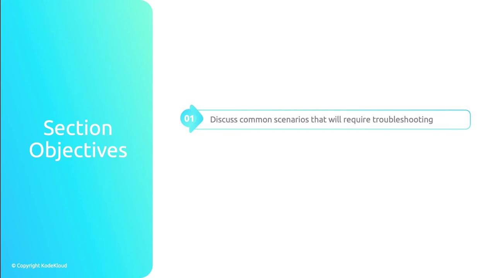
</Frame>

Networking in Kubernetes depends on:

<Frame>
  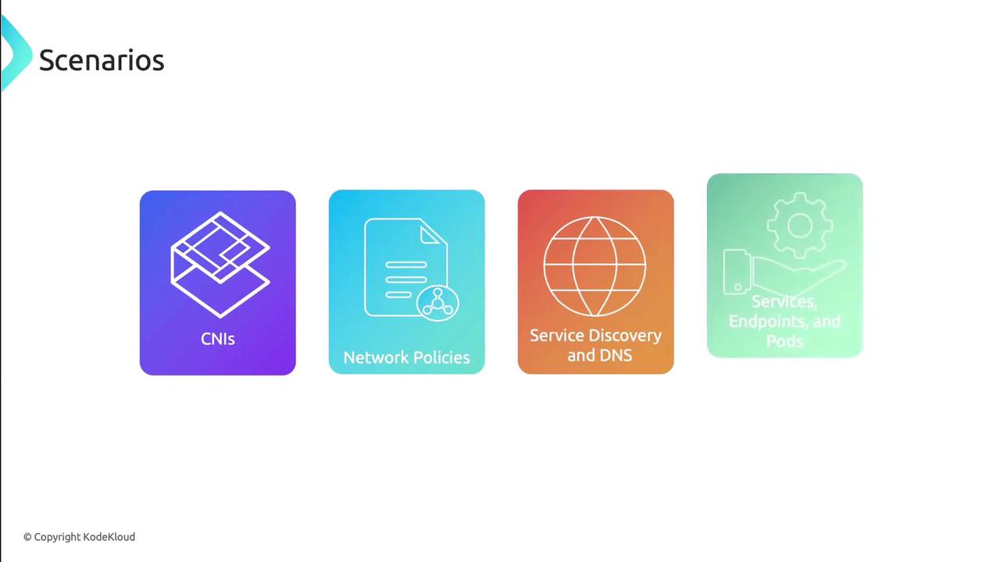
</Frame>

| Scenario                | Focus                             | Key Commands                                        |
| ----------------------- | --------------------------------- | --------------------------------------------------- |
| CNI                     | Pod network agents & connectivity | `kubectl get pods -n kube-system`, `cilium status`  |
| Network Policies        | Ingress/Egress filters            | `kubectl get networkpolicies`, `ping`, `nc`, `curl` |
| Service Discovery & DNS | CoreDNS health & resolution       | `kubectl logs coredns`, `nslookup`, `dig`           |
| Services & Endpoints    | Service definitions & backends    | `kubectl describe svc`, `kubectl get endpoints`     |

***

## 1. Troubleshooting CNIs

All Container Network Interfaces (CNIs) run as pods. Start by validating their status:

1. **Check CNI pod status**
   * Run `kubectl get pods -n kube-system` and look for restarts or CrashLoop.
   * Inspect events: `kubectl describe pod <cni-pod> -n kube-system`.
   * Review logs: `kubectl logs <cni-pod> -n kube-system`.

<Frame>
  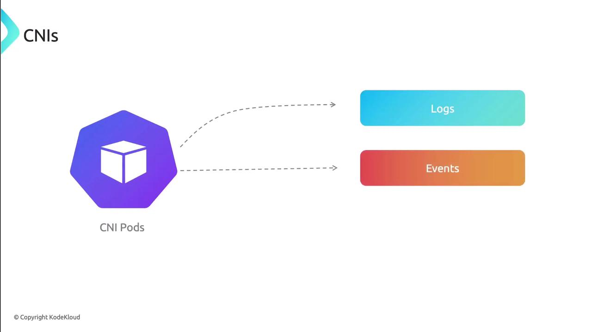
</Frame>

2. **Verify node health**
   * Confirm `kubelet` and the container runtime (Docker, containerd) are Running.
   * For Cilium users, `cilium node status` shows kernel modules, BPF maps, and node health.

<Frame>
  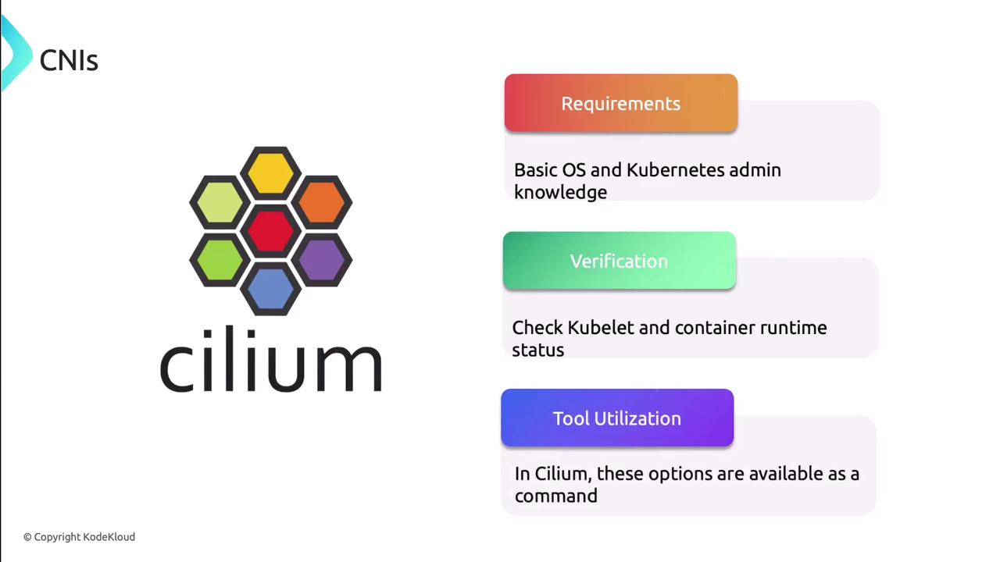
</Frame>

3. **Use CNI-specific tools**\
   Many CNIs include CLIs and connectivity tests:
   * **Cilium CLI**: `cilium status`, `cilium connectivity test`
   * **Hubble**: Visualize flows and policy enforcement

<Callout icon="lightbulb">
  Deploy automated connectivity tests to validate pod-to-pod networking before diving deeper.
</Callout>

<Frame>
  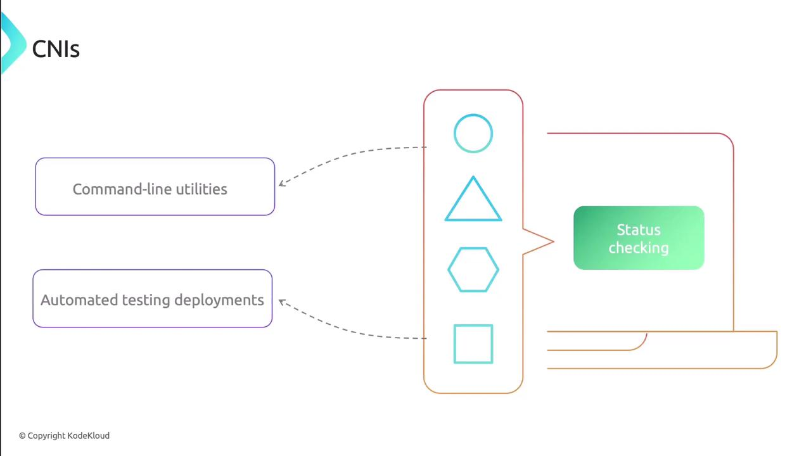
</Frame>

<Frame>
  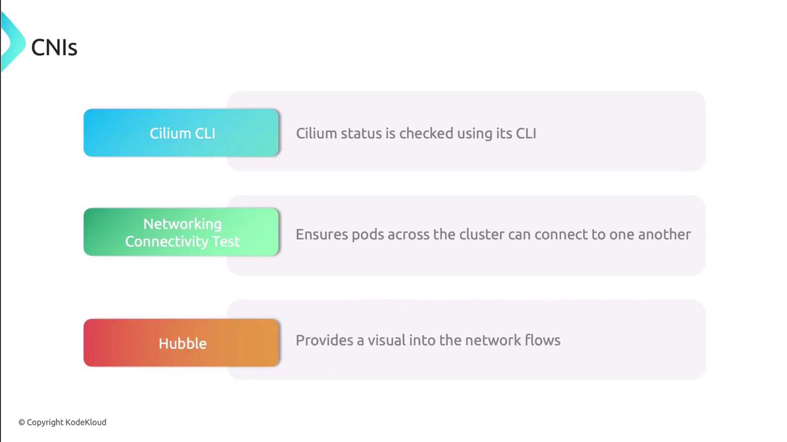
</Frame>

***

## 2. Troubleshooting Network Policies

Misconfigured or missing NetworkPolicies can silently block traffic:

1. **Locate policies**
   ```bash theme={null}
   kubectl get networkpolicies --all-namespaces
   ```
   If no policies exist, skip to other troubleshooting areas.

2. **Review selectors and intent**
   * Ensure `podSelector` and `namespaceSelector` match the intended workload.
   * Overly broad selectors may catch nothing; too narrow may block all traffic.

3. **Verify ingress/egress rules**\
   An empty list blocks traffic by default. Confirm each rule explicitly allows the necessary ports and protocols.

<Callout icon="triangle-alert">
  An empty network policy blocks all ingress and egress. Always define at least one rule.
</Callout>

<Frame>
  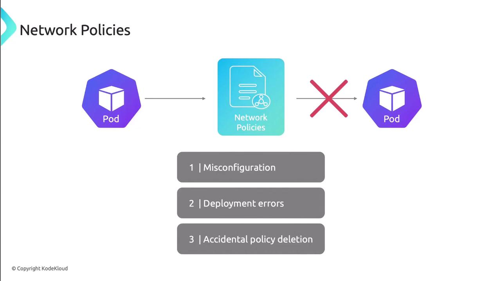
</Frame>

<Frame>
  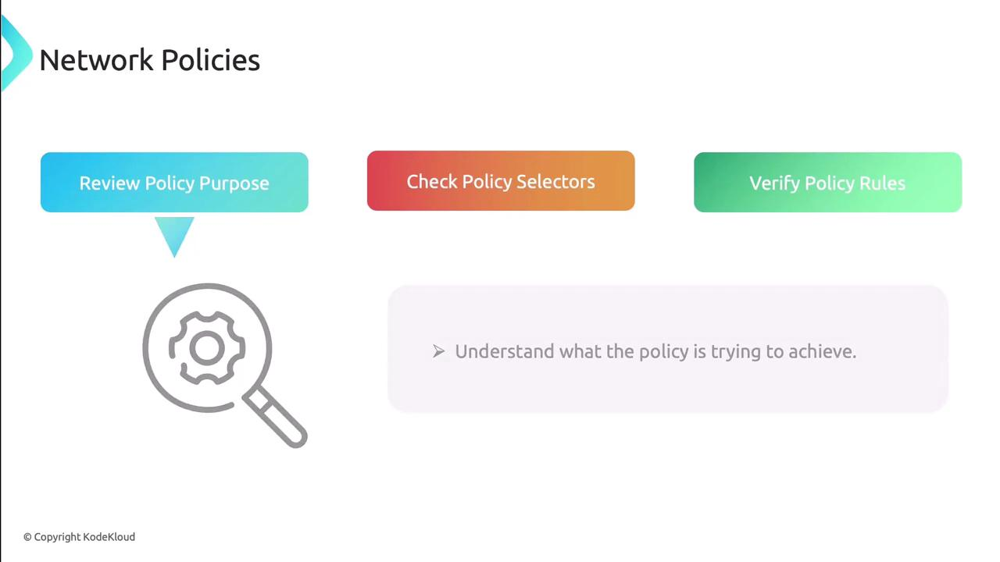
</Frame>

<Frame>
  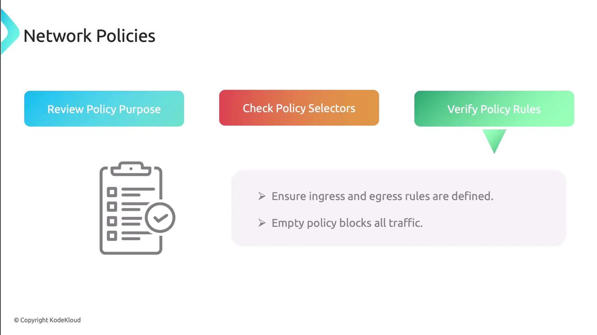
</Frame>

4. **Test connectivity**\
   Launch pods in both allowed and denied namespaces and validate traffic flows:
   * `ping <pod-IP>`
   * `nc -zv <pod-IP> <port>`
   * `curl http://<service>`

<Frame>
  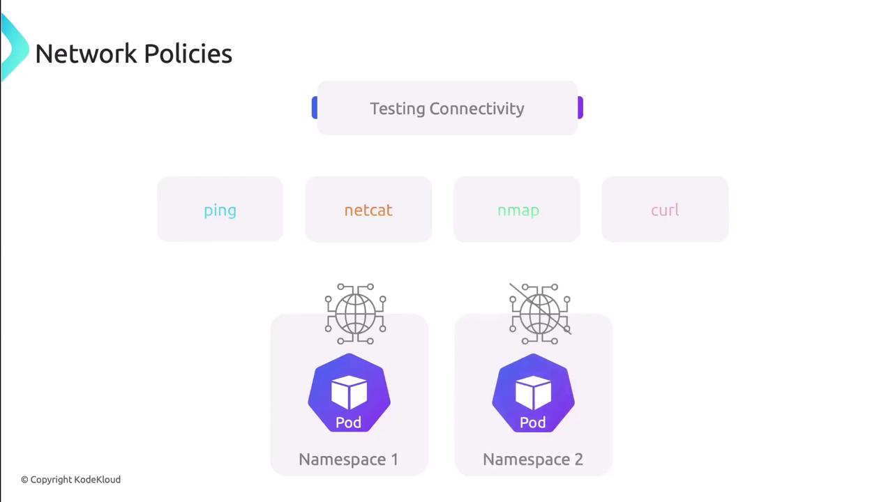
</Frame>

***

## 3. Troubleshooting Service Discovery & DNS

CoreDNS manages internal name resolution. Follow these steps:

1. **Check CoreDNS pods**
   ```bash theme={null}
   kubectl get pods -n kube-system -l k8s-app=kube-dns
   ```
   Ensure pods are Running, then `kubectl logs` for errors.

2. **Inspect ConfigMap**
   ```bash theme={null}
   kubectl get configmap coredns -n kube-system -o yaml
   ```
   Look for syntax errors or missing zones.

3. **Validate pod DNS settings**\
   Inside a test pod, check `/etc/resolv.conf` matches your cluster DNS IP.

4. **Test DNS resolution**
   ```bash theme={null}
   nslookup kubernetes.default
   dig @<coredns-ip> my-service.my-namespace.svc.cluster.local
   ```

<Frame>
  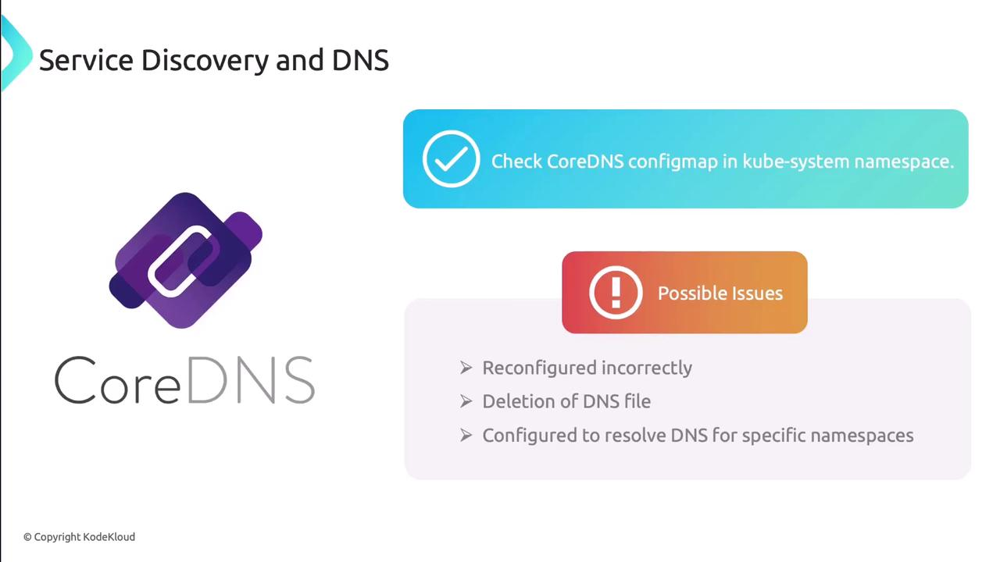
</Frame>

***

## 4. Troubleshooting Services, Endpoints & Pods

Connectivity issues here often stem from selector or port mismatches:

1. **Check pod health**
   * Pods should be Running without restarts.
   * Look for CrashLoopBackOff in `kubectl describe pod`.
   * Review logs for errors or resource exhaustion.

<Frame>
  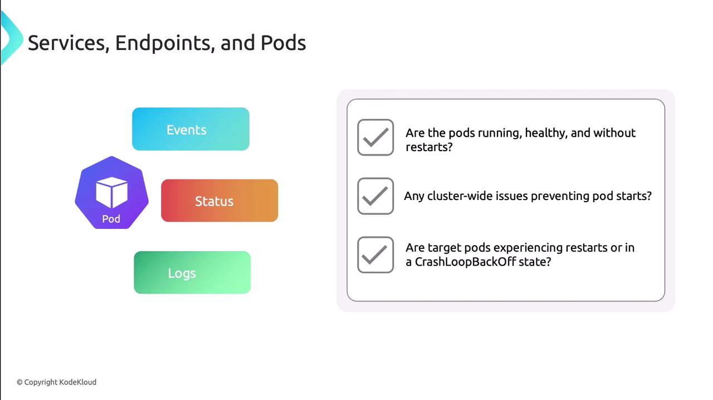
</Frame>

2. **Validate services**
   * Confirm service type suits your use case (ClusterIP, NodePort, LoadBalancer).
   * Check `spec.selector` labels match pod labels.
   * Verify service ports map to container ports.
   * Ensure the application listens on the advertised port.

<Frame>
  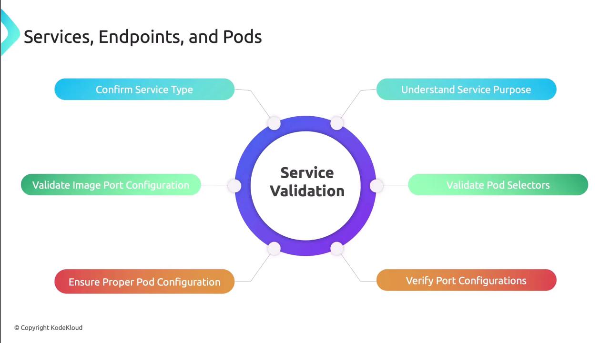
</Frame>

3. **Compare Services and Endpoints**\
   Each Service should have a corresponding Endpoints object:
   ```bash theme={null}
   kubectl get endpoints <service-name>
   ```
   Verify the IPs match the target pods to avoid silent failures.

<Frame>
  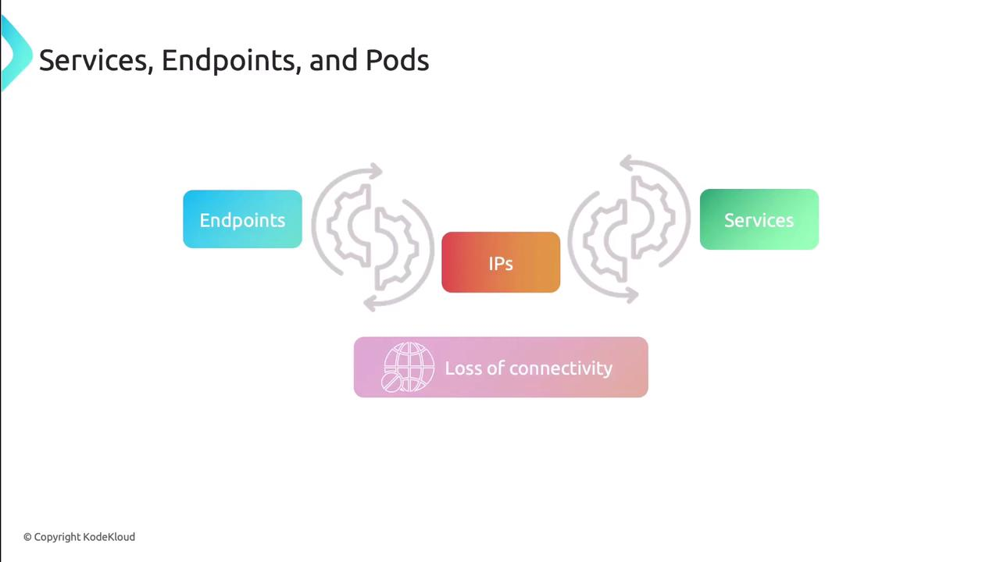
</Frame>

4. **Port-forward as needed**
   ```bash theme={null}
   kubectl port-forward svc/<service> 8080:<port>
   ```
   This isolates the service without external load balancers.

***

Next, apply these techniques on a live cluster to reinforce your troubleshooting skills.

## Links and References

* [Kubernetes Networking Concepts](https://kubernetes.io/docs/concepts/cluster-administration/networking/)
* [Cilium Documentation](https://docs.cilium.io/)
* [CoreDNS Official Guide](https://coredns.io/manual/toc/)
* [NetworkPolicy Reference](https://kubernetes.io/docs/concepts/services-networking/network-policies/)

<CardGroup>
  <Card title="Watch Video" icon="video" href="https://learn.kodekloud.com/user/courses/kubernetes-networking/module/00c6db37-72b0-44e1-8c3a-81e22c8d8af6/lesson/026468d5-50d5-4836-a33d-63da44f7ca51" />
</CardGroup>
