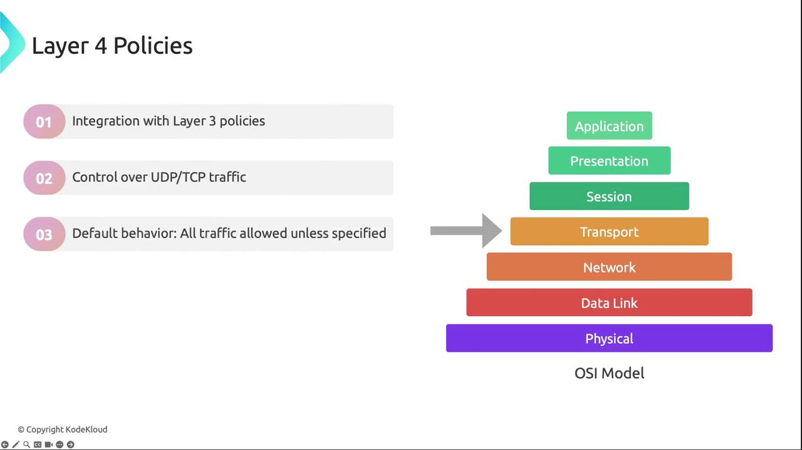
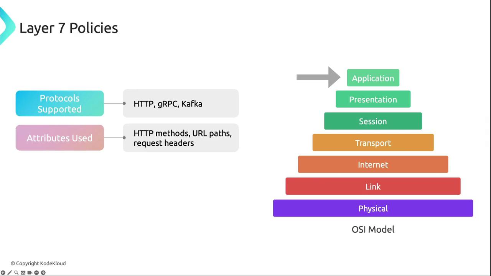
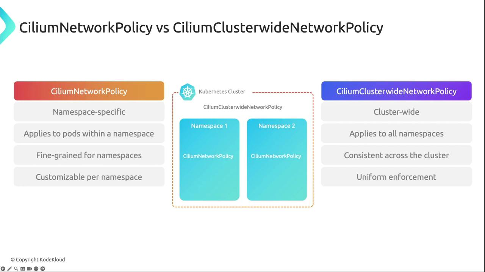
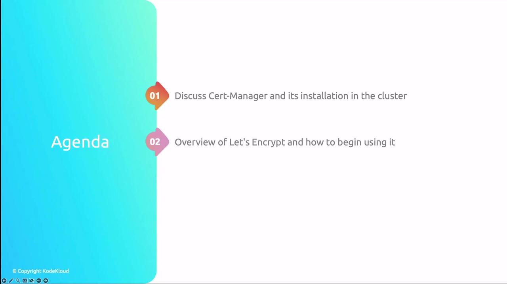
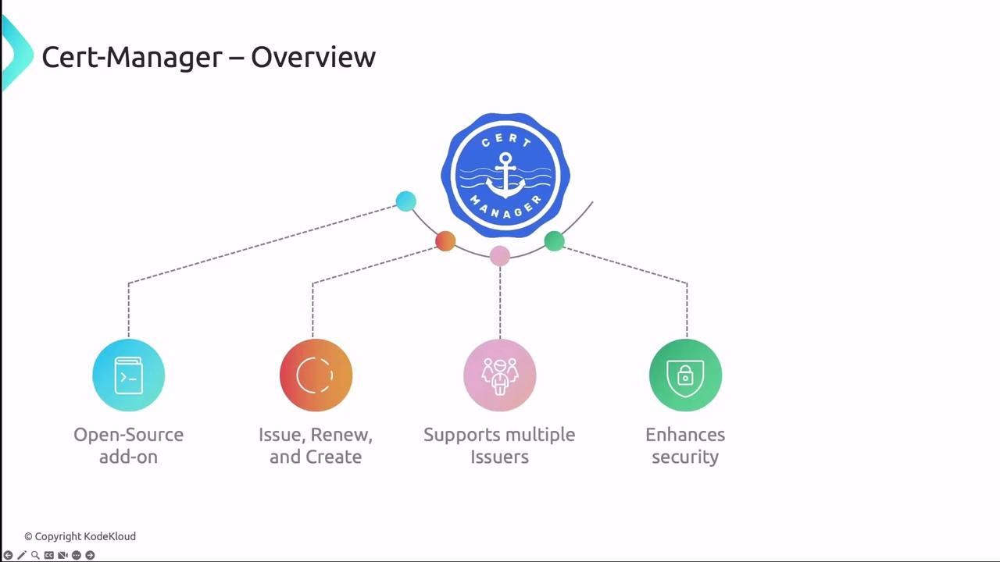
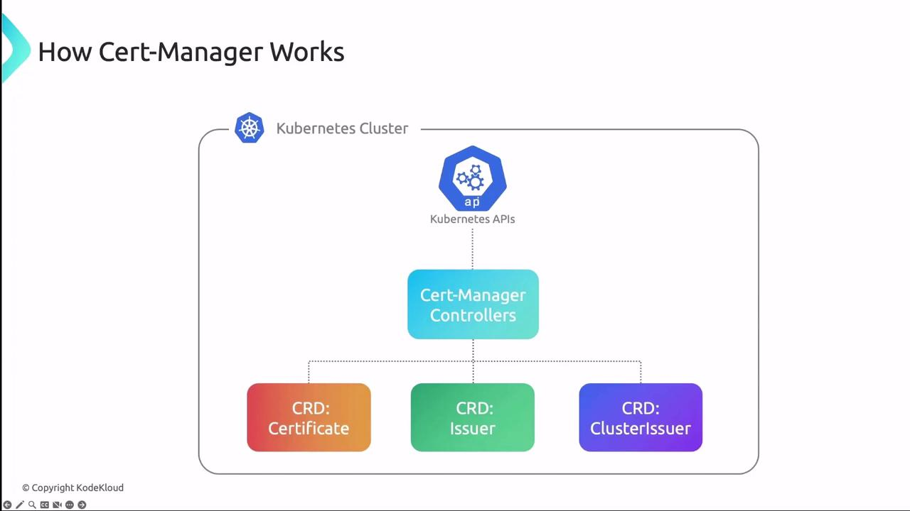
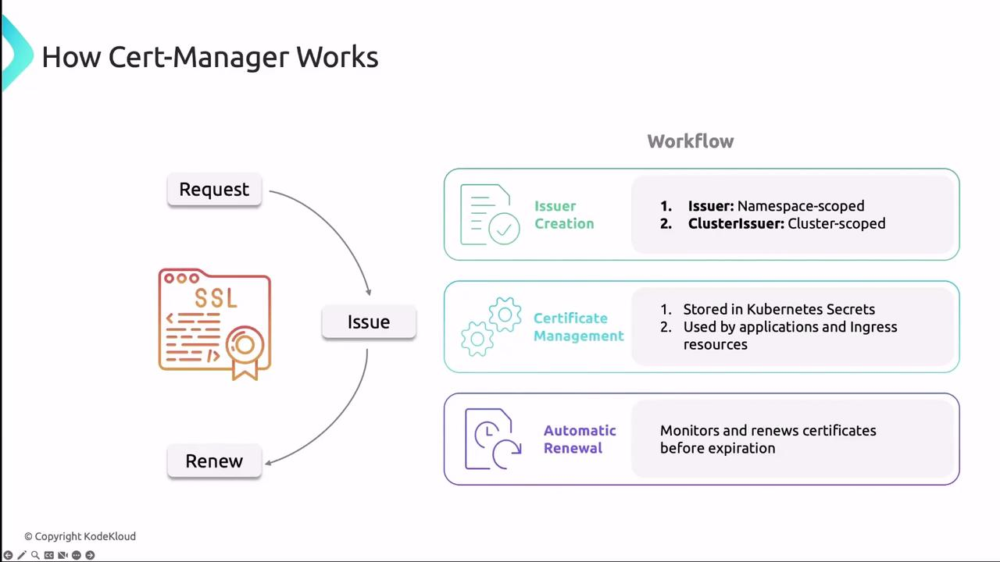

# 1. Allow ingress from frontend pods to backend pods
apiVersion: "cilium.io/v2"
kind: CiliumNetworkPolicy
metadata:
  name: layer3-ingress-only
spec:
  endpointSelector:
    matchLabels:
      role: backend
  ingress:
    - fromEndpoints:
        - matchLabels:
            role: frontend
```

```yaml theme={null}
# 2. Allow egress to specific CIDRs, excluding cluster service CIDR
apiVersion: "cilium.io/v2"
kind: CiliumNetworkPolicy
metadata:
  name: layer3-egress-cidr
spec:
  endpointSelector:
    matchLabels:
      role: backend
  egress:
    - toCIDR:
        - "20.1.1.1/32"
    - toCIDRSet:
        - cidr: "10.0.0.0/8"
          except:
            - "10.96.0.0/12"
```

***

## Layer 4 Policies

Layer 4 rules govern transport-layer connectivity (TCP/UDP). By default, Cilium blocks ICMP unless explicitly permitted.

<Frame>
  
</Frame>

### Example: Restrict Egress to TCP Port 80

```yaml theme={null}
apiVersion: "cilium.io/v2"
kind: CiliumNetworkPolicy
metadata:
  name: layer4-example
spec:
  endpointSelector:
    matchLabels:
      app: myService
  egress:
    - toPorts:
        - ports:
            - port: "80"
              protocol: TCP
```

This policy permits only TCP traffic on port 80 for pods labeled `app=myService`.

***

## Layer 7 Policies

Layer 7 policies enable application-layer inspection and enforcement for HTTP, gRPC, Kafka, and more.

<Frame>
  
</Frame>

### Example: HTTP Methods, Paths & Headers

```yaml theme={null}
apiVersion: "cilium.io/v2"
kind: CiliumNetworkPolicy
metadata:
  name: layer7-example
spec:
  endpointSelector:
    matchLabels:
      app: myService
  ingress:
    - toPorts:
        - ports:
            - port: "80"
              protocol: TCP
      rules:
        http:
          - method: GET
            path: "/path1$"
          - method: PUT
            path: "/path2$"
            headers:
              - "X-My-Header: true"
```

This policy allows:

* HTTP GET requests to `/path1`
* HTTP PUT requests to `/path2` only if `X-My-Header: true` is present

***

## Namespace vs. Cluster-Wide Policies

Cilium supports two scope levels:

| Resource Type                  | Scope            |
| ------------------------------ | ---------------- |
| CiliumNetworkPolicy            | Single Namespace |
| CiliumClusterwideNetworkPolicy | All Namespaces   |

<Callout icon="lightbulb">
  Combining namespace-specific and cluster-wide policies ensures both granular control and consistent, global security enforcement.
</Callout>

<Frame>
  
</Frame>

***

Now that we’ve covered the theory behind CNI network policies, explore our hands-on [Cilium policy lab](/docs/cilium-lab) to see them in action.

## Links and References

* [Kubernetes Network Policies](https://kubernetes.io/docs/concepts/services-networking/network-policies/)
* [Cilium Documentation](https://docs.cilium.io/)
* [Calico Networking](https://docs.projectcalico.org/)
* [Weave Net](https://www.weave.works/docs/net/latest/kubernetes/kube-addon/)
* [Istio Service Mesh](https://istio.io)
* [Linkerd Service Mesh](https://linkerd.io)

<CardGroup>
  <Card title="Watch Video" icon="video" href="https://learn.kodekloud.com/user/courses/kubernetes-networking/module/5a70ab6c-2094-4bf2-9f49-e441919fc8c2/lesson/213062d7-7c18-4532-81dd-0a42de9333e6" />
</CardGroup>


# Cert Manager and Lets Encrypt Overview

Source: https://notes.kodekloud.com/docs/Kubernetes-Networking-Deep-Dive/Network-Security/Cert-Manager-and-Lets-Encrypt-Overview/page

This guide explains how to automate SSL/TLS certificate management in Kubernetes using cert-manager and Let’s Encrypt.

In this guide, you’ll learn how to use cert-manager and Let’s Encrypt together to automate SSL/TLS certificate management in Kubernetes. We’ll cover:

1. What cert-manager is and how to install it.
2. An introduction to Let’s Encrypt and its ACME workflow.
3. How to integrate cert-manager with Let’s Encrypt for automatic certificate issuance and renewal.

<Frame>
  
</Frame>

***

## What Is cert-manager?

cert-manager is an open-source Kubernetes add-on that automates the issuance, renewal, and management of TLS certificates. It supports multiple issuers—such as Let’s Encrypt, HashiCorp Vault, and self-signed certificates—and integrates seamlessly with Kubernetes resources like Ingress.

Key features include:

* Automated certificate requests & renewals
* Support for standard, wildcard, and self-signed certificates
* Kubernetes-native CRDs: Issuer, ClusterIssuer, and Certificate
* Secrets storage for TLS key/cert pairs

<Frame>
  
</Frame>

### cert-manager Architecture

cert-manager runs as a set of controllers that watch CRDs and reconcile the desired certificate state. Each controller interacts with the Kubernetes API to request, store, and renew certificates.

<Frame>
  
</Frame>

Table: cert-manager CRDs at a Glance

| CRD           | Scope      | Purpose                                                |
| ------------- | ---------- | ------------------------------------------------------ |
| Issuer        | Namespaced | Defines how to request certificates within a namespace |
| ClusterIssuer | Cluster    | Defines certificate requests at the cluster level      |
| Certificate   | Namespaced | Specifies desired certificate, secret name, and DNS    |

When an Issuer or ClusterIssuer is created, cert-manager requests a certificate from the configured CA, then stores the key and certificate in a Kubernetes Secret. Controllers monitor expiry dates and perform automatic renewals.

<Frame>
  
</Frame>

<Callout icon="lightbulb">
  cert-manager can issue both standard and wildcard certificates. Use wildcard certificates to secure multiple subdomains with a single certificate.
</Callout>

***

## Installing cert-manager

The easiest way to install cert-manager and its CRDs is with Helm:

```bash theme={null}
helm repo add jetstack https://charts.jetstack.io
helm repo update
helm install cert-manager jetstack/cert-manager \
  --namespace cert-manager \
  --create-namespace \
  --version <VERSION> \
  --set installCRDs=true
```

Alternatively, install via `kubectl`:

```bash theme={null}
kubectl apply -f https://github.com/jetstack/cert-manager/releases/download/<VERSION>/cert-manager.yaml
```

<Callout icon="triangle-alert">
  Always match the `<VERSION>` placeholder with the latest stable release from the [cert-manager GitHub releases](https://github.com/jetstack/cert-manager/releases).
</Callout>

For diagnostics and manual operations, use `cmctl`:

```bash theme={null}
