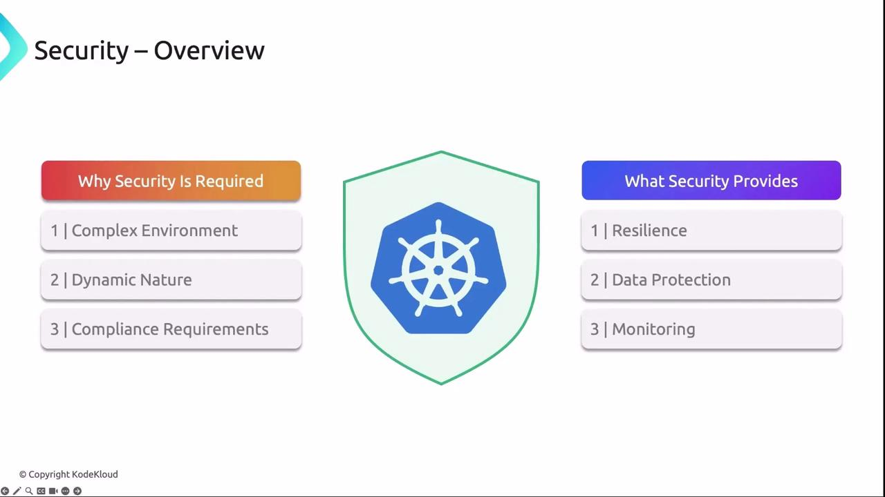
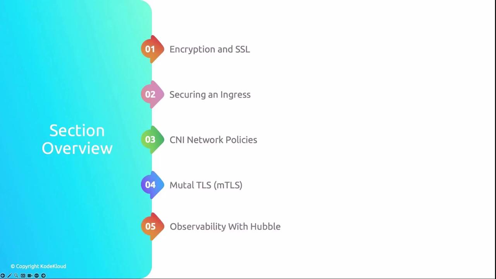
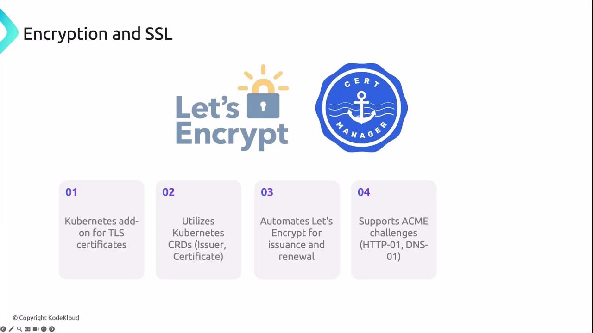
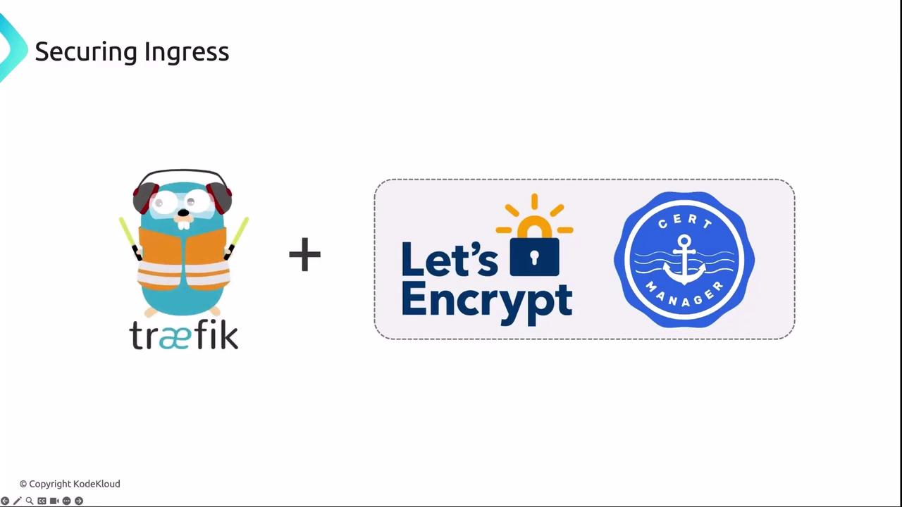
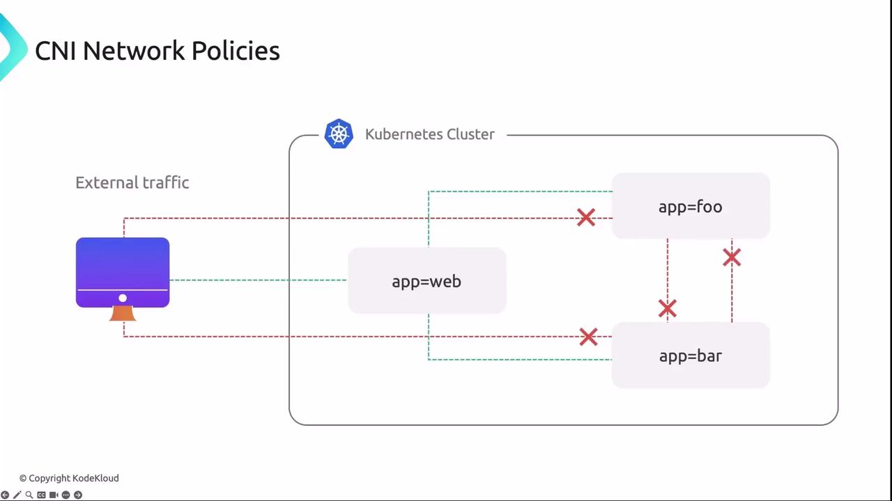
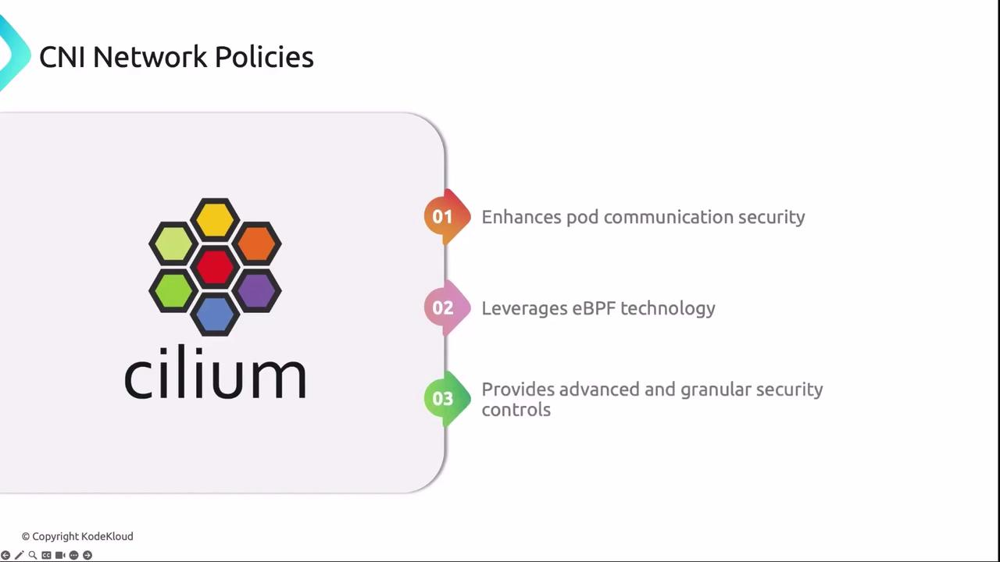
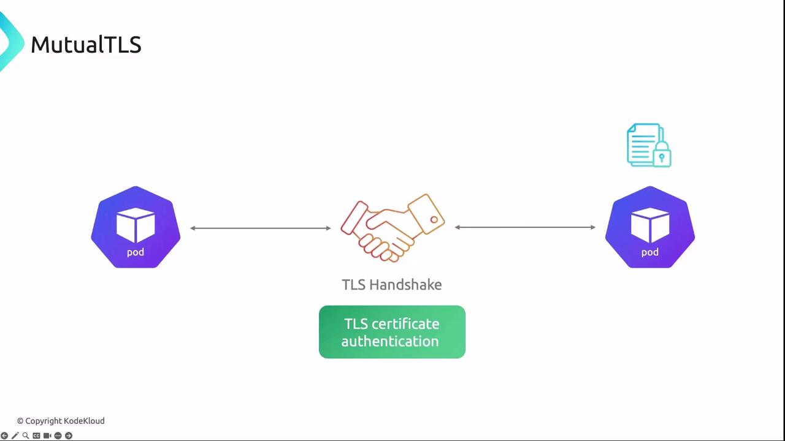

# Unlabeled Pod → denied:
kubectl run --rm -i --tty client --image=curlimages/curl \
  --restart=Never -- \
  curl --connect-timeout 2 app-svc-80
# Labeled Pod → allowed:
kubectl run --rm -i --tty admin --image=curlimages/curl \
  --labels app=admin --restart=Never -- \
  curl --connect-timeout 2 app-svc-5000
# → Have a great day!
```

***

## 3. Cilium Layer 4 Policy

Tighten access to only TCP port 80. Update to `cilium-l4.yaml`:

```yaml theme={null}
apiVersion: cilium.io/v2
kind: CiliumNetworkPolicy
metadata:
  name: demo-cilium-l4
spec:
  endpointSelector:
    matchLabels:
      app: demo
  ingress:
    - fromEndpoints:
        - matchLabels:
            app: admin
      toPorts:
        - ports:
            - port: "80"
              protocol: TCP
```

```bash theme={null}
kubectl apply -f cilium-l4.yaml

# Port 80 → allowed:
kubectl run --rm -i --tty admin --image=curlimages/curl \
  --labels app=admin --restart=Never -- \
  curl --connect-timeout 2 app-svc-80
# Port 5000 → denied:
kubectl run --rm -i --tty admin --image=curlimages/curl \
  --labels app=admin --restart=Never -- \
  curl --connect-timeout 2 app-svc-5000
# → curl: (28) Failed to connect...
```

***

## 4. Cilium Layer 7 HTTP Policy

Leverage Cilium’s L7 HTTP inspection to allow only `GET /healthz` and `GET /api`. Define `cilium-l7.yaml`:

```yaml theme={null}
apiVersion: cilium.io/v2
kind: CiliumNetworkPolicy
metadata:
  name: demo-cilium-l7
spec:
  endpointSelector:
    matchLabels:
      app: demo
  ingress:
    - fromEndpoints:
        - matchLabels:
            app: admin
      toPorts:
        - ports:
            - port: "80"
              protocol: TCP
          rules:
            http:
              - method: GET
                path: /healthz
              - method: GET
                path: /api
```

```bash theme={null}
kubectl apply -f cilium-l7.yaml

# Default path → denied:
kubectl run --rm -i --tty admin --image=curlimages/curl \
  --labels app=admin --restart=Never -- \
  curl --connect-timeout 2 app-svc-80
# /api → allowed:
kubectl run --rm -i --tty admin --image=curlimages/curl \
  --labels app=admin --restart=Never -- \
  curl --connect-timeout 2 app-svc-80/api
# /healthz → allowed:
kubectl run --rm -i --tty admin --image=curlimages/curl \
  --labels app=admin --restart=Never -- \
  curl --connect-timeout 2 app-svc-80/healthz
# → {"status":"OK"}
```

***

## 5. Adding an API Key Header

Finally, require an `X-API-KEY` header for the `/api` endpoint. Update to `cilium-l7-header.yaml`:

```yaml theme={null}
apiVersion: cilium.io/v2
kind: CiliumNetworkPolicy
metadata:
  name: demo-cilium-l7-header
spec:
  endpointSelector:
    matchLabels:
      app: demo
  ingress:
    - fromEndpoints:
        - matchLabels:
            app: admin
      toPorts:
        - ports:
            - port: "80"
              protocol: TCP
          rules:
            http:
              - method: GET
                path: /healthz
              - method: GET
                path: /api
                headers:
                  - name: X-API-KEY
                    value: ABC123
```

```bash theme={null}
kubectl apply -f cilium-l7-header.yaml

# Missing header → denied:
kubectl run --rm -i --tty admin --image=curlimages/curl \
  --labels app=admin --restart=Never -- \
  curl --connect-timeout 2 app-svc-80/api
# With header → allowed:
kubectl run --rm -i --tty admin --image=curlimages/curl \
  --labels app=admin --restart=Never -- \
  curl -H "X-API-KEY: ABC123" --connect-timeout 2 app-svc-80/api
# → Have a great day!
```

***

## Policy Progression

| Stage      | Layer | File                    | Description                             |
| ---------- | ----- | ----------------------- | --------------------------------------- |
| Kubernetes | L3    | `demo-netpol`           | Pod selector + ingress from `app=admin` |
| Cilium     | L3    | `cilium-l3.yaml`        | Same selector using Cilium CRD          |
| Cilium     | L4    | `cilium-l4.yaml`        | Restrict to TCP port 80                 |
| Cilium     | L7    | `cilium-l7.yaml`        | Allow only GET `/healthz` & `/api`      |
| Cilium     | L7+H  | `cilium-l7-header.yaml` | Adds `X-API-KEY` header check           |

***

## Further Reading

* [Cilium Documentation](https://docs.cilium.io/)
* [Kubernetes Network Policies](https://kubernetes.io/docs/concepts/services-networking/network-policies/)
* [Envoy L7 Proxy](https://www.envoyproxy.io/)

With Cilium Network Policies, you have full L3–L7 control to secure your workloads. Experiment with custom rules to fit your security requirements!

<CardGroup>
  <Card title="Watch Video" icon="video" href="https://learn.kodekloud.com/user/courses/kubernetes-networking/module/5a70ab6c-2094-4bf2-9f49-e441919fc8c2/lesson/ceb679c9-31ba-47e1-9480-c417727d3f02" />

  <Card title="Practice Lab" icon="installation" href="https://learn.kodekloud.com/user/courses/kubernetes-networking/module/5a70ab6c-2094-4bf2-9f49-e441919fc8c2/lesson/1c730398-0410-4b97-b560-df89fc2c5a76" />
</CardGroup>


# Security Overview

Source: https://notes.kodekloud.com/docs/Kubernetes-Networking-Deep-Dive/Network-Security/Security-Overview/page

This guide outlines strategies to strengthen Kubernetes security, including TLS automation, network policies, and observability.

As Kubernetes scales to manage hundreds or thousands of containers across multiple nodes, securing your cluster becomes mission-critical. A single vulnerability can cascade through workloads, compromise sensitive data, or disrupt services. This guide outlines proven strategies—from TLS automation to network policies and observability—to strengthen your Kubernetes security posture.

<Frame>
  
</Frame>

<Frame>
  
</Frame>

| Section                      | Focus                       | Benefit                           |
| ---------------------------- | --------------------------- | --------------------------------- |
| 1. Encryption & SSL          | Automated TLS certificates  | Secure HTTPS endpoints            |
| 2. Securing Ingress          | Ingress controller security | Encrypted entry points            |
| 3. CNI Network Policies      | Pod network isolation       | Reduced lateral attack surface    |
| 4. Mutual TLS (mTLS)         | Service-to-service auth     | Prevent man-in-the-middle attacks |
| 5. Observability With Hubble | Traffic & event visibility  | Faster troubleshooting and alerts |

## 1. Encryption and SSL

Automating TLS certificate issuance and renewal is essential for 24/7 uptime and risk reduction. Let’s Encrypt and cert-manager work together to keep your cluster’s endpoints secure:

* **Let’s Encrypt** ([letsencrypt.org](https://letsencrypt.org/)) provides free SSL/TLS certificates via the ACME protocol.
* **cert-manager** ([cert-manager.io](https://cert-manager.io/)) automates certificate lifecycles using Kubernetes CRDs (`Issuer`, `ClusterIssuer`, `Certificate`).

```yaml theme={null}
apiVersion: cert-manager.io/v1
kind: ClusterIssuer
metadata:
  name: letsencrypt-prod
spec:
  acme:
    server: https://acme-v02.api.letsencrypt.org/directory
    email: admin@example.com
    privateKeySecretRef:
      name: letsencrypt-prod-key
    solvers:
    - http01:
        ingress:
          class: traefik
---
apiVersion: cert-manager.io/v1
kind: Certificate
metadata:
  name: example-com-tls
spec:
  secretName: example-com-tls
  dnsNames:
  - example.com
  issuerRef:
    name: letsencrypt-prod
    kind: ClusterIssuer
```

<Callout icon="lightbulb">
  Make sure your DNS records are properly configured for HTTP-01 or DNS-01 challenges before deploying cert-manager.
</Callout>

cert-manager stores issued certificates in Kubernetes Secrets and renews them automatically before expiration.

<Frame>
  
</Frame>

## 2. Securing Ingress

Exposed services must serve traffic securely. Traefik is a popular Ingress controller that integrates seamlessly with cert-manager and Let’s Encrypt to automate SSL/TLS:

```yaml theme={null}
apiVersion: traefik.containo.us/v1alpha1
kind: IngressRoute
metadata:
  name: secure-web
  annotations:
    cert-manager.io/cluster-issuer: letsencrypt-prod
spec:
  entryPoints:
    - websecure
  routes:
    - match: Host(`app.example.com`)
      kind: Rule
      services:
        - name: web
          port: 80
  tls:
    secretName: example-com-tls
```

With this configuration, Traefik delegates certificate requests to cert-manager, enabling HTTPS without manual steps.

<Frame>
  
</Frame>

## 3. CNI Network Policies

NetworkPolicies define traffic rules at the pod level, isolating workloads and preventing unauthorized lateral movement:

```yaml theme={null}
apiVersion: networking.k8s.io/v1
kind: NetworkPolicy
metadata:
  name: allow-from-frontend
spec:
  podSelector:
    matchLabels:
      role: web
  ingress:
    - from:
        - podSelector:
            matchLabels:
              role: frontend
      ports:
        - protocol: TCP
          port: 80
```

### Advanced Policies with Cilium

Cilium uses eBPF for kernel-level enforcement and richer policy definitions:

```yaml theme={null}
apiVersion: cilium.io/v2
kind: CiliumNetworkPolicy
metadata:
  name: allow-frontend-to-web
spec:
  endpointSelector:
    matchLabels:
      role: web
  ingress:
    - fromEndpoints:
        - matchLabels:
            role: frontend
      toPorts:
        - ports:
            - port: "80"
              protocol: TCP
```

<Frame>
  
</Frame>

<Frame>
  
</Frame>

## 4. Mutual TLS (mTLS)

Mutual TLS ensures both clients and servers verify each other’s identity before exchanging data. This two-way authentication thwarts man-in-the-middle attacks and enforces strict service-level trust.

<Frame>
  
</Frame>

<Callout icon="triangle-alert">
  Expired or misconfigured certificates will break mTLS connections. Monitor certificate lifecycles and automate renewals.
</Callout>

## 5. Observability With Hubble

Cilium’s Hubble provides deep visibility into network flows, application performance, and security events:

```bash theme={null}
