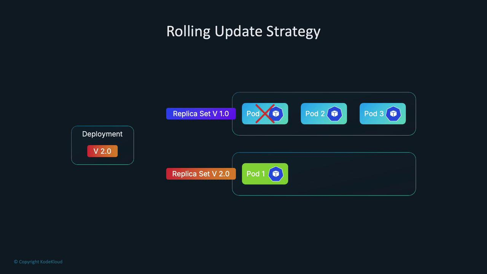
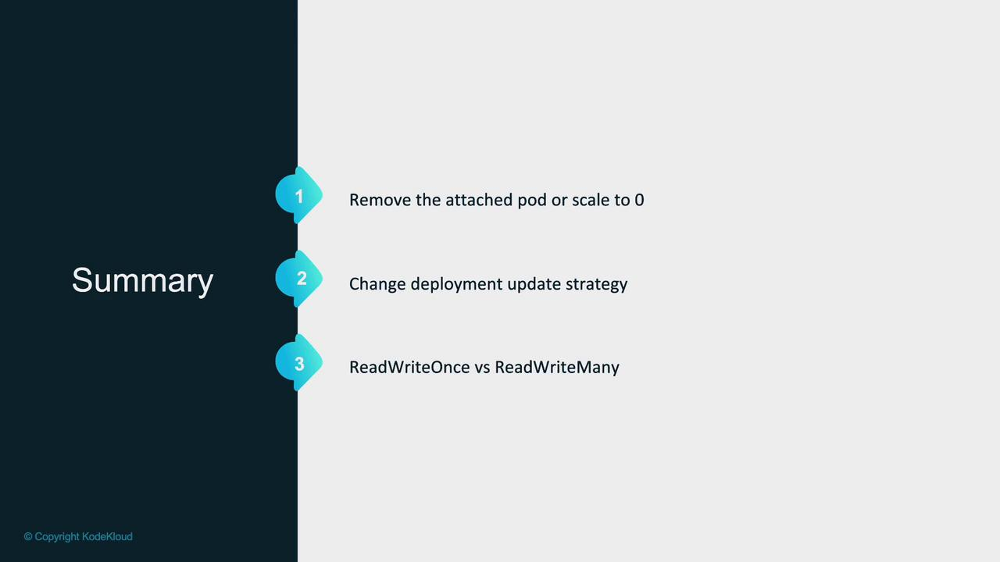
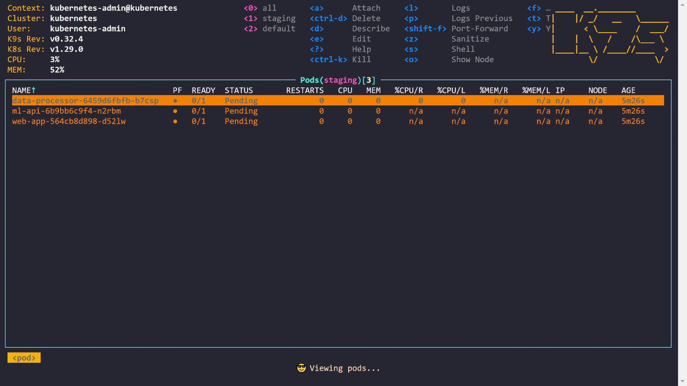
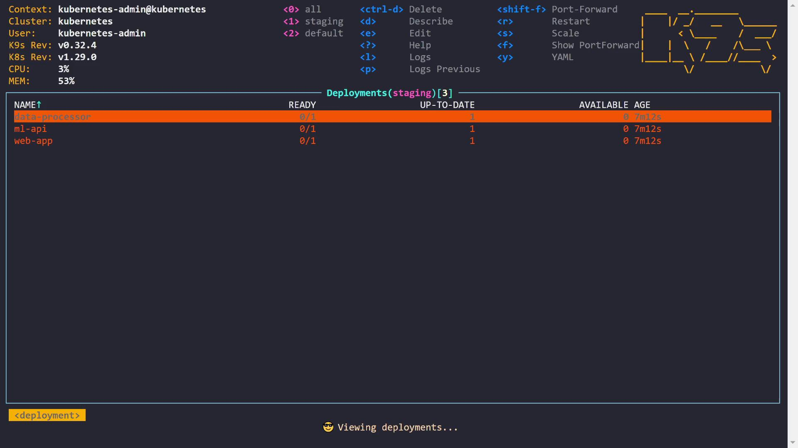

# (No pods running)
kk_lab_user_main-c76398c34414452 [ ~ ]$ kubectl scale deployment logger --replicas=1 -n monitoring
kk_lab_user_main-c76398c34414452 [ ~ ]$ kubectl get pods -n monitoring --watch
logger-5bd9b574f-k858q  0/1     ContainerCreating   2s
logger-5bd9b574f-k858q  1/1     Running             15s
```

While this quick fix works, it is not ideal for production environments where automatic deployments are critical. An alternative approach involves changing the update strategy.

## Update Strategies: RollingUpdate vs. Recreate

Kubernetes Deployments use the `RollingUpdate` strategy by default. This creates new pods while keeping the old one running until the new pod is ready, maintaining availability during updates. However, because new pods are created before the old ones are terminated, the volume may temporarily attach to both pods, triggering a multi-attach error when the underlying storage does not support simultaneous attachments.

Below is a snippet of the Deployment configuration using RollingUpdate:

```yaml theme={null}
matchLabels:
  app: logger
strategy:
  rollingUpdate:
    maxSurge: 25%
    maxUnavailable: 25%
  type: RollingUpdate
template:
  metadata:
    annotations:
      kubectl.kubernetes.io/restartedAt: "2024-08-24T15:25:31Z"
    labels:
      app: logger
  spec:
    affinity:
      podAntiAffinity:
        requiredDuringSchedulingIgnoredDuringExecution:
          - labelSelector:
              matchExpressions:
                - key: app
                  operator: In
                  values:
                    - logger
            topologyKey: kubernetes.io/hostname
    containers:
      - image: nginx:latest
        imagePullPolicy: Always
        name: logger
        resources: {}
        terminationMessagePath: /dev/termination-log
        terminationMessagePolicy: File
    volumes:
      - name: logger-volume
        persistentVolumeClaim:
          claimName: azure-managed-disk
```

<Frame>
  
</Frame>

### Switching to the Recreate Strategy

The `Recreate` strategy terminates all old pods before creating new ones, thereby preventing overlapping volume attachments. This is useful when your application cannot support multiple versions running simultaneously.

To test this workaround, update your Deployment YAML to change the strategy:

```yaml theme={null}
strategy:
  type: Recreate
```

After saving the change, execute a rollout restart:

```bash theme={null}
kk_lab_user_main-c76398c34414452 [~]$ kubectl edit deployment logger -n monitoring
kk_lab_user_main-c76398c34414452 [~]$ kubectl rollout restart deployment logger -n monitoring
deployment.apps/logger restarted
kk_lab_user_main-c76398c34414452 [~]$ kubectl get pods -n monitoring --watch
NAME                       READY   STATUS    RESTARTS   AGE
logger-7877b5c98d-57htv   1/1     Running   0          4s
```

With the Recreate strategy, the old pod is terminated before the new one starts, avoiding the multi-attach error. However, be aware that this solution may reduce availability during updates.

## Assessing Storage Backend Access Modes

Another factor contributing to the multi-attach error is the access mode of the storage backend. Each persistent volume is linked to a storage class that supports specific access modes, such as ReadWriteOnce (RWO) or ReadWriteMany (RWX).

For example, if multiple pods on the same node access a volume with RWO, you might not face issues. However, if the pods are scheduled on different nodes, RWO will trigger a multi-attach error because it allows attachment to only one node. In our demo, the Azure Disk supports only RWO:

```bash theme={null}
kk_lab_user_main-c76398c34414452 [ ~ ]$ k get pv
NAME                                         CAPACITY   ACCESS MODES   RECLAIM POLICY   STATUS   CLAIM                                   STORAGECLASS   VOLUMEATTIBUTESCLASS
pvc-4ce98f56-f335-4c82-894a-1b8cfd8772b6   1Gi        RWO            Delete           Bound    monitoring/azure-managed-disk           managed-csi    <unset>
pvc-6ff3912e-b286-4b4e-8667-548126037bd4   1Gi        RWX            Delete           Bound    monitoring/my-azurefile                 my-azurefile   <unset>
kk_lab_user_main-c76398c34414452 [ ~ ]$
```

If your application requires RWX support, consider using a storage backend like Azure Files. In our example, we switch the Deployment to use a PVC based on Azure File. Update the volume claim reference and, if needed, restore the RollingUpdate strategy:

```yaml theme={null}
volumes:
  - name: logger-volume
    persistentVolumeClaim:
      claimName: my-azurefile
```

Below is a snippet of the updated Deployment configuration, which also includes pod anti-affinity rules forcing the new pod to be scheduled on a different node:

```yaml theme={null}
affinity:
  podAntiAffinity:
    requiredDuringSchedulingIgnoredDuringExecution:
      - labelSelector:
          matchExpressions:
            - key: app
              operator: In
              values:
                - logger
        topologyKey: kubernetes.io/hostname
containers:
  - image: nginx:latest
    imagePullPolicy: Always
    name: logger
    volumeMounts:
      - mountPath: /usr/share/nginx/html
        name: logger-volume
volumes:
  - name: logger-volume
    persistentVolumeClaim:
      claimName: my-azurefile
```

After applying these changes, restart the Deployment:

```bash theme={null}
kk_lab_user_main-c76398c34414452 [ ~ ]$ kubectl edit deployment logger -n monitoring
kk_lab_user_main-c76398c34414452 [ ~ ]$ kubectl rollout restart deployment logger -n monitoring
deployment.apps/logger restarted
kk_lab_user_main-c76398c34414452 [ ~ ]$ kubectl get pods -n monitoring
NAME                       READY   STATUS    RESTARTS   AGE
logger-5f6fd55f8-dvghn   1/1     Running   0          7s
kk_lab_user_main-c76398c34414452 [ ~ ]$
```

Now, with a volume that supports RWX, multiple pods running on different nodes can attach the volume concurrently without triggering a multi-attach error.

The following command displays sample output for persistent volumes:

```bash theme={null}
kk_lab_user_main-c76398c344144452 [ ~ ]$ k get pv
NAME                                               CAPACITY   ACCESS MODES   RECLAIM POLICY   STATUS   CLAIM                               STORAGECLASS        VOLUMEATTIBUTESCLASS
pvc-4ce98f56-f355-4c82-894a-18bcfd87726b           1Gi       RWO            Delete           Bound    monitoring/azure-managed-disk    managed-csi         <unset>
pvc-6ff3912e-b286-4b4e-8677-5481260378d4           1Gi       RWX            Delete           Bound    monitoring/my-azurefile          my-azurefile        <unset>
kk_lab_user_main-c76398c344144452 [ ~ ]$ k edit deployment logger -n monitoring
deployment.apps/logger edited

kk_lab_user_main-c76398c344144452 [ ~ ]$ kubectl rollout restart deployment logger -n monitoring
kk_lab_user_main-c76398c344144452 [ ~ ]$ k get pods -n monitoring
NAME                     READY   STATUS    RESTARTS   AGE
logger-5f6fd55f8-dwvgh   1/1     Running   0          7s
kk_lab_user_main-c76398c344144452 [ ~ ]$
```

Now multiple pods can run across different nodes simultaneously without encountering a multi-attach volume error.

## Summary of Solutions

| Approach               | Description                                                                                                                                                         | Use Case                                                                                   |
| ---------------------- | ------------------------------------------------------------------------------------------------------------------------------------------------------------------- | ------------------------------------------------------------------------------------------ |
| Manual Scaling         | Scale the Deployment down to zero and then back up to ensure only one pod is running and attached to the volume at any time.                                        | Quick fix during rollouts in non-production environments.                                  |
| Update Strategy Change | Switch the Deployment update strategy from `RollingUpdate` to `Recreate` so the old pod terminates before a new pod is created, preventing overlapping attachments. | Environments where application downtime during updates is acceptable.                      |
| Adjust Access Modes    | Use a storage backend that supports the required access mode (e.g., RWX for multi-node attachments) instead of one that allows only RWO.                            | Applications requiring simultaneous volume access by multiple pods across different nodes. |

<Frame>
  
</Frame>

<Callout icon="lightbulb">
  Before deploying any storage volume, review the storage class documentation to verify which access modes are supported. Choose a storage solution that aligns with your application requirements.
</Callout>

This article outlines the causes of multi-attach volume errors and provides several workarounds, from manual scaling to configuration updates. By understanding your storage backend’s access modes and adjusting your Deployment strategy accordingly, you can ensure your Kubernetes applications run smoothly in production.

<CardGroup>
  <Card title="Watch Video" icon="video" href="https://learn.kodekloud.com/user/courses/kubernetes-troubleshooting-for-application-developers/module/143d3913-caef-4dab-bde6-b77e96dbb161/lesson/57ded90b-0a99-4616-8a23-435539235d7b" />

  <Card title="Practice Lab" icon="installation" href="https://learn.kodekloud.com/user/courses/kubernetes-troubleshooting-for-application-developers/module/143d3913-caef-4dab-bde6-b77e96dbb161/lesson/4861dd03-9c62-43d7-ba16-72c263d46b0a" />
</CardGroup>


# Pending Pods

Source: https://notes.kodekloud.com/docs/Kubernetes-Troubleshooting-for-Application-Developers/Troubleshooting-Scenarios/Pending-Pods/page

This article explores common Kubernetes issues causing pods to remain in a pending state and provides actionable solutions for each scenario.

In this lesson, we explore a common Kubernetes issue—pods remaining in the pending state. This guide covers three scenarios that cause pods to get stuck during scheduling and provides actionable solutions.

When a pod is in the pending state, Kubernetes has received the request to run it, but no available node meets the pod’s scheduling requirements. Let’s start by checking the pods in our cluster. As seen below, three pods are currently pending:

<Frame>
  
</Frame>

Below, we examine three examples that highlight different causes for pending pods.

***

## Example 1: Data Processor Pod – Insufficient CPU

The first scenario involves the data processor pod. Running the describe command reveals that our cluster has two nodes. The scheduler indicates failures due to insufficient CPU on one node and an untolerated taint on the control plane node. The output is as follows:

```python theme={null}
Describe(staging/data-processor-64596d6fbfb-b7csp)
Environment: <none>
Mounts:
  /var/run/secrets/kubernetes.io/serviceaccount from kube-api-access-htgcx (ro)
Conditions:
  Type            Status
  PodScheduled    False
Volumes:
  kube-api-access-htgcx:
    Type: Projected (a volume that contains injected data from multiple sources)
    TokenExpirationSeconds: 3607
    ConfigMapName: kube-root-ca.crt
    ConfigMapOptional: <nil>
    DownwardAPI: true
QoS Class: Burstable
Node-Selectors: <none>
Tolerations:
  node.kubernetes.io/not-ready:NoExecute op=Exists for 300s
  node.kubernetes.io/unreachable:NoExecute op=Exists for 300s
  workload-machine-learning:NoSchedule
Events:
  Type    Reason              Age                  From                  Message
  ------  -----               ---                  ----                  -------
  Warning FailedScheduling    27s (x2 over 5m49s)  default-scheduler     0/2 nodes are available: 1 Insufficient cpu, 1 node(s) had untolerated taint {node-role.kubernetes.io/control-plane: }. preemption: 0/2 nodes are available: 1 No preemption victims found for incoming pod, 1 Preemption is not helpful for scheduling.
```

The event logs indicate that the first node flagged "Insufficient cpu". To understand this, we inspect the pod's CPU requests:

```python theme={null}
Describe(staging/data-processor-64596d6fbfb-b7csp)
Environment: <none>
Mounts:
  /var/run/secrets/kubernetes.io/serviceaccount from kube-api-access-htgxc (ro)
Conditions:
  Type             Status
  PodScheduled     False
Volumes:
  kube-api-access-htgxc:
    Type: Projected (a volume that contains injected data from multiple sources)
    TokenExpirationSeconds: 3607
    ConfigMapName: kube-root-ca.crt
    ConfigMapOptional: <nil>
    DownwardAPI: true
QoS Class: Burstable
Node-Selectors: <none>
Tolerations:
  node.kubernetes.io/not-ready:NoExecute op=Exists for 300s
  node.kubernetes.io/unreachable:NoExecute op=Exists for 300s
  workload=machine-learning:NoSchedule
Events:
  Type    Reason              Age                  From                  Message
  ----    ------              ----                 ----                  -------
  Warning FailedScheduling    27s (x2 over 5m49s)  default-scheduler     0/2 nodes are available: 1 Insufficient cpu, 1 node(s) had untolerated taint {node-role.kubernetes.io/control-plane: }. preemption: 0/2 nodes are available: 1 No preemption victims found for incoming pod, 1 Preemption is not helpful for scheduling.
```

The pod requires two CPUs. However, the node (ignoring the control plane) has a total of two CPUs and is already running three pods, leaving no capacity to satisfy the new request:

```python theme={null}
Describe(staging/data-processor-6459d6fbfb-b7csp)
Port:                    <none>
Host Port:               <none>
Limits:
  cpu:                   2
Requests:
  cpu:                   2
Environment:             <none>
Mounts:
  /var/run/secrets/kubernetes.io/serviceaccount from kube-api-access-htgcx (ro)
Conditions:
  Type            Status
  PodScheduled    False
Volumes:
  kube-api-access-htgcx:
    Type:               Projected (a volume that contains injected data from multiple sources)
    TokenExpirationSeconds: 3607
    ConfigMapName:      kube-root-ca.crt
    ConfigMapOptional:  <nil>
    DownwardAPI:        true
QoS Class:              Burstable
Node-Selectors:         <none>
Tolerations:            node.kubernetes.io/not-ready:NoExecute op=Exists for 300s
```

<Callout icon="lightbulb">
  To resolve the issue, you can reduce the CPU request (for example, from "2" to "1") so that the pod fits into the available node capacity.
</Callout>

The pod specification defines both CPU requests and limits as shown below:

<Frame>
  
</Frame>

Here is the YAML snippet for the data processor deployment:

```yaml theme={null}
generation: 1
name: data-processor
namespace: staging
resourceVersion: "1550"
uid: 5456ffa2-213b-4bb1-a02b-7cab5327388

spec:
  progressDeadlineSeconds: 600
  replicas: 1
  revisionHistoryLimit: 10
  selector:
    matchLabels:
      app: data-processor
  strategy:
    rollingUpdate:
      maxSurge: 25%
      maxUnavailable: 25%
    type: RollingUpdate
  template:
    metadata:
      labels:
        app: data-processor
    spec:
      containers:
      - image: vish/stress
        imagePullPolicy: Always
        name: data-processor
        resources:
          limits:
            cpu: "2"
          requests:
            cpu: "2"
        terminationMessagePath: /dev/termination-log
        terminationMessagePolicy: File
      dnsPolicy: ClusterFirst
```

The Kubernetes scheduler only considers the CPU requests, not the limits. If a node has sufficient free resources based on requests, the pod is scheduled; otherwise, it remains pending. After updating the CPU request, the pod transitions from pending to running. If your workload truly demands the original allocation, consider scaling your cluster by adding a new node.

***

## Example 2: ML API Pod – Node Selector Mismatch

The second example focuses on the ML API pod. The scheduler logs indicate that one node did not meet the pod's node affinity and that the control plane node carries an untolerated taint:

```python theme={null}
Context: kubernetes-admin@kubernetes
Cluster: kubernetes
User: kubernetes-admin
K9S Rev: v0.32.4
K8S Rev: v1.29.0
CPU: 3%
MEM: 53%

Describe(staging/ml-api-6b9bb6c9f4-n2rbm)

Environment: <none>
Mounts:
  /var/run/secrets/kubernetes.io/serviceaccount from kube-api-access-4wb5b (ro)
Conditions:
  Type            Status
  PodScheduled    False
Volumes:
  kube-api-access-4wb5b:
    Type: Projected (a volume that contains injected data from multiple sources)
    TokenExpirationSeconds: 3607
    ConfigMapName: kube-root-ca.crt
    ConfigMapOptional: <nil>
    DownwardAPI: true
QoS Class: BestEffort
Node-Selectors:
  type: gpu
Tolerations:
  node.kubernetes.io/not-ready:NoExecute op=Exists for 300s
  node.kubernetes.io/unreachable:NoExecute op=Exists for 300s
  workload-machine-learning:NoSchedule
Events:
  Type    Reason              Age                Message
  ----    ------              ---                -------
  Warning FailedScheduling    3m55s (x2 over 9m17s) default-scheduler  0/2 nodes are available: 1 node(s) didn't match Pod's node affinity /selector, 1 node(s) had untolerated taint {node-role.kubernetes.io/control-plane: }. preemption: 0/2 nodes are available: 2 Preemption is not helpful for scheduling.
```

The pod specifies a node selector with the label "type=gpu", but none of the nodes have this label. To confirm, running:

```plaintext theme={null}
kubectl describe pod staging/ml-api-6b9bb6c9f4-n2rbm
```

shows that the pod requires a node with "type: gpu". The solution is to label the appropriate node:

```plaintext theme={null}
kubectl label nodes node01 type=gpu
```

After adding the label, the ML API pod moves to the ContainerCreating state, indicating that it has been successfully scheduled.

***

## Example 3: Web App Pod – Untolerated Taint

The final scenario involves the web app pod, which remains pending due to untolerated taints related to the control plane and a taint from "workload: machine-learning". The pod description highlights this condition:

```plaintext theme={null}
Context: kubernetes-admin@kubernetes
Cluster: kubernetes
User: kubernetes-admin
K9S Rev: v0.32.4
K8S Rev: v1.29.0
CPU: 3%
MEM: 52%

Name: web-app-564cb8d898-d521w
Namespace: staging
Priority: 0
Service Account: default
Node: <none>
Labels: app=webapp-color
pod-template-hash=564cb8d898
Annotations: <none>
Status: Pending
IP: <none>
IPs: <none>
Controlled By: ReplicaSet/web-app-564cb8d898
Containers:
  webapp-color:
    Image: kodekloud/webapp-color
    Port: 8080/TCP
    Host Port: 0/TCP
    Environment: <none>
    Mounts: /var/run/secrets/kubernetes.io/serviceaccount from kube-api-access-s6w5r (ro)
Conditions:
  Type: Status
  PodScheduled: False
Volumes:
  kube-api-access-s6w5r:
```

A closer look at the pod details confirms the absence of a toleration for the key "workload" with value "machine-learning":

```python theme={null}
Describe(staging/web-app-564cb8d898-d521w)

Host Port: 0/TCP
Environment: <none>
Mounts:
  /var/run/secrets/kubernetes.io/serviceaccount from kube-api-access-s6w5r (ro)
Conditions:
  Type         Status
  PodScheduled False
Volumes:
  kube-api-access-s6w5r:
    Type: Projected (a volume that contains injected data from multiple sources)
    TokenExpirationSeconds: 3607
    ConfigMapName: kube-root-ca.crt
    ConfigMapOptional: <nil>
    DownwardAPI: true
QoS Class: BestEffort
Node-Selectors: <none>
Tolerations:
  - node.kubernetes.io/not-ready:NoExecute op=Exists for 300s
  - node.kubernetes.io/unreachable:NoExecute op=Exists for 300s
Events:
  Type     Reason               Age                         From                    Message
  ----     ------               ---                         ----                    -------
  Warning  FailedScheduling     265s (x3 over 10m)          default-scheduler       0/2 nodes are available: 1 node(s) had untolerated taint {node-role.kubernetes.io/control-plane: }, 1 node(s) had untolerated taint {workload: machine-learning}. preemption: 0/2 nodes are available: 2 Preemption is not helpful for scheduling.
```

A taint prevents pods from being scheduled on a node unless they have an appropriate toleration. To fix this issue, modify the web app deployment to include the toleration for the taint "workload: machine-learning". Below is the deployment YAML snippet before the change:

```yaml theme={null}
apiVersion: apps/v1
kind: Deployment
metadata:
  name: web-app
  namespace: staging
  annotations: {}
  resourceVersion: "4365"
  uid: 662b25b6-6953-4ab0-8b74-eaa4c00bc150
spec:
  progressDeadlineSeconds: 600
  replicas: 1
  revisionHistoryLimit: 10
  selector:
    matchLabels:
      app: webapp-color
  strategy:
    rollingUpdate:
      maxSurge: 25%
      maxUnavailable: 25%
    type: RollingUpdate
  template:
    metadata:
      labels:
        app: webapp-color
    spec:
      containers:
      - name: webapp-color
        image: kodekloud/webapp-color
        imagePullPolicy: Always
        ports:
        - containerPort: 8080
          protocol: TCP
```

Include the following toleration in the pod specification to resolve the issue:

```yaml theme={null}
    spec:
      tolerations:
      - key: workload
        operator: Equal
        value: machine-learning
      containers:
      - name: webapp-color
        image: kodekloud/webapp-color
        imagePullPolicy: Always
        ports:
        - containerPort: 8080
          protocol: TCP
```

After applying these changes, the updated deployment allows the pod to tolerate the taint, and it is scheduled successfully. A sample of the updated deployment is shown below:

```yaml theme={null}
creationTimestamp: "2024-06-07T23:08:07Z"
generation: 18
name: web-app
namespace: staging
resourceVersion: "4365"
uid: 662b25b6-6953-4ab0-8b74-eaa4c00bc150
spec:
  progressDeadlineSeconds: 600
  replicas: 1
  revisionHistoryLimit: 10
  selector:
    matchLabels:
      app: webapp-color
  strategy:
    rollingUpdate:
      maxSurge: 25%
      maxUnavailable: 25%
    type: RollingUpdate
  template:
    metadata:
      labels:
        app: webapp-color
    spec:
      tolerations:
      - key: workload
        operator: Equal
        value: machine-learning
      containers:
      - name: webapp-color
        image: kodekloud/webapp-color
        imagePullPolicy: Always
        ports:
        - containerPort: 8080
          protocol: TCP
```

***

## Summary

In this lesson, we reviewed three common scenarios that cause pods to remain in the pending state:

1. The data processor pod was pending due to insufficient CPU availability. The issue was resolved by reducing the CPU request (or by scaling the cluster).
2. The ML API pod was pending because it required a node that matched a specific node selector ("type: gpu"). Labeling the node correctly allowed it to schedule.
3. The web app pod was pending due to an untolerated taint. Adding an appropriate toleration in the deployment enabled the pod to be scheduled.

By understanding these challenges and solutions, you can ensure your pods are scheduled successfully in Kubernetes. Happy troubleshooting!

<CardGroup>
  <Card title="Watch Video" icon="video" href="https://learn.kodekloud.com/user/courses/kubernetes-troubleshooting-for-application-developers/module/143d3913-caef-4dab-bde6-b77e96dbb161/lesson/889721c1-14b7-4b16-b8a1-1c0b97530ab3" />
</CardGroup>
