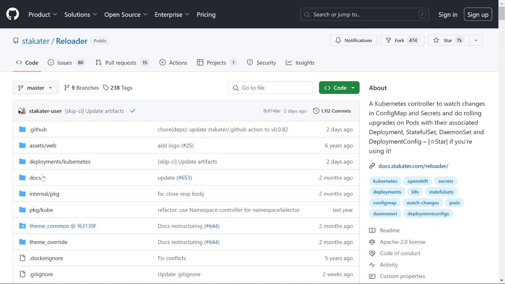
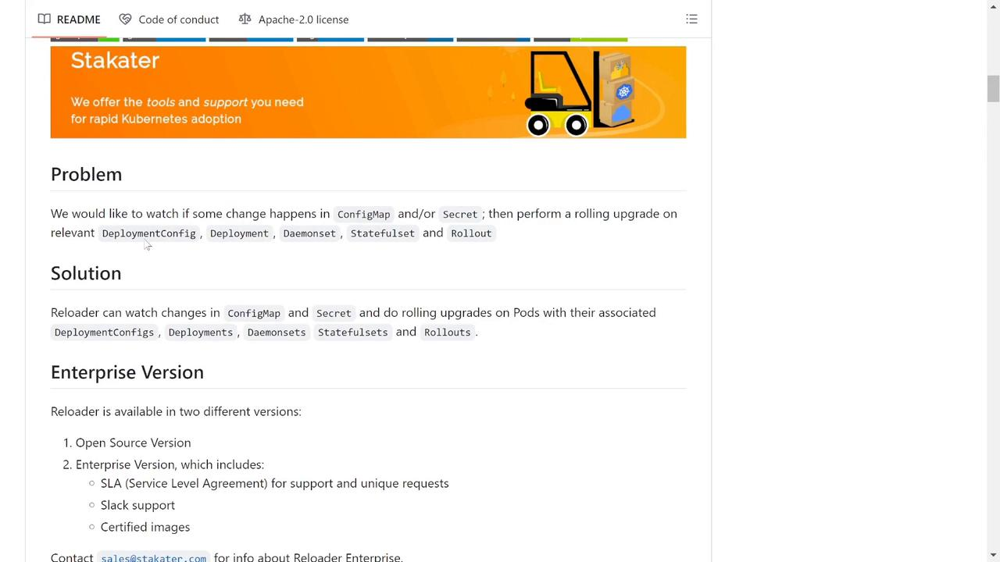

# Reloader

Source: https://notes.kodekloud.com/docs/Kubernetes-Troubleshooting-for-Application-Developers/Troubleshooting-Scenarios/Reloader/page

This guide introduces Reloader, a Kubernetes controller that automates rolling upgrades of Deployments, DaemonSets, or StatefulSets when ConfigMap or Secret changes occur.

In modern Kubernetes environments, troubleshooting can become cumbersome when ConfigMap or Secret updates don't automatically trigger pod restarts. This guide introduces Reloader, a Kubernetes controller designed to automate rolling upgrades of your Deployments, DaemonSets, or StatefulSets whenever there's a change in ConfigMap or Secret objects.

<Frame>
  
</Frame>

Reloader continuously monitors for modifications in your ConfigMaps and Secrets. When a change is detected, it triggers a rolling upgrade, ensuring that your Kubernetes resources are immediately redeployed without any manual intervention.

<Frame>
  
</Frame>

## How Reloader Works

To leverage Reloader in your Kubernetes cluster, add the following annotation to your Deployment, StatefulSet, or any applicable resource. This annotation instructs Reloader to monitor the associated ConfigMap(s) and Secret(s) for changes and automatically restart the resource when necessary.

```yaml theme={null}
kind: Deployment
metadata:
  annotations:
    reloader.stakater.com/auto: "true"
spec:
  template:
    metadata:
      # your pod metadata here
```

You can configure Reloader to monitor all associated ConfigMaps and Secrets or restrict its scope to specific ones. In this guide, we use the generic annotation for simplicity.

## Deploying Reloader

Deploy the Reloader controller to your Kubernetes cluster using the vanilla manifest. While Helm is available for more complex deployments, the default manifest installation is straightforward:

```bash theme={null}
kubectl apply -f https://raw.githubusercontent.[AWS_SECRET_ACCESS_KEY]/kubernetes
```

Once deployed (by default in the `default` namespace), verify its status using:

```bash theme={null}
kubectl get pods
```

You should see an output similar to:

```bash theme={null}
NAME                              READY   STATUS    RESTARTS   AGE
reloader-reloader-d88cf475-bbqhh   1/1     Running   0          3m12s
```

<Callout icon="lightbulb">
  Ensure your cluster has the necessary permissions for Reloader to manage your deployments.
</Callout>

## Integrating Reloader with Your Application

Consider a scenario where a web application relies on a ConfigMap named "web-message". This ConfigMap provides a greeting message for the application. Use the following command to deploy the Reloader components:

```bash theme={null}
kubectl apply -f https://raw.githubusercontent.com/stakater[AWS_SECRET_ACCESS_KEY]/reloader.yaml
```

A sample output might be:

```bash theme={null}
serviceaccount/reloader-reloader unchanged
clusterrole.rbac.authorization.k8s.io/reloader-reloader-role unchanged
clusterrolebinding.rbac.authorization.k8s.io/reloader-reloader-role-binding unchanged
deployment.apps/reloader-reloader unchanged
```

To inspect the pods and ConfigMaps in the production namespace, run:

```bash theme={null}
kubectl get pods -n production
```

```bash theme={null}
kubectl get cm -n production
```

For example, if your web application is configured with a ConfigMap value of "Hello, World", verify it by executing:

```bash theme={null}
kubectl exec -n production -it web-app-58c4f787c-lm7s7 -- /bin/sh
