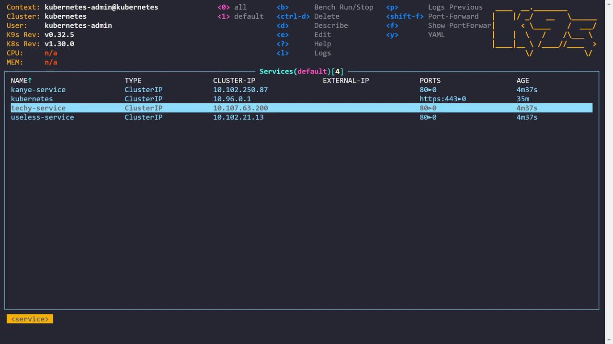

# What the Ingress

Source: https://notes.kodekloud.com/docs/Kubernetes-Troubleshooting-for-Application-Developers/Troubleshooting-Scenarios/What-the-Ingress/page

This article covers troubleshooting Ingress for Kubernetes applications, focusing on path handling and implementing URL path rewriting to resolve 404 errors.

In this lesson, we troubleshoot a sample application that exposes web services through an Ingress. The application consists of three pods—Kanye, Techie, and Useless—each paired with its corresponding service. These services deliver distinct types of quotes: Kanye quotes, tech-related quotes, and random humorous quotes.

## Examining the Kubernetes Environment

Below is an example of our Kubernetes environment displaying the available pods:

```bash theme={null}
Context: kubernetes-admin@kubernetes
Cluster: kubernetes
User: kubernetes-admin
K9s Rev: v0.32.5
K8s Rev: v1.30.0
CPU: n/a
MEM: n/a

Pods(default)[3]
NAME     PF   READY  STATUS   RESTARTS  IP             NODE    AGE
kanye    ●    1/1    Running  0         10.244.192.2  node01  4m27s
techy    ●    1/1    Running  0         10.244.192.1  node01  4m27s
useless  ●    1/1    Running  0         10.244.192.3  node01  4m27s
```

<Frame>
  
</Frame>

All services are hosted behind an Ingress controller. The Ingress resource routes incoming requests based on the URL path. For instance, requests to `/techy` are directed to the Techie service—similarly for the Kanye and Useless services. This configuration utilizes the Nginx Ingress Controller.

## Ingress Configuration Overview

The following excerpt illustrates the Ingress configuration that implements load balancing and reverse proxying behavior:

```yaml theme={null}
service:
  name: techy-service
  port:
    number: 80
  path: /techy
  pathType: Prefix
- backend:
    service:
      name: kanye-service
      port:
        number: 80
      path: /kanye
      pathType: Prefix
- backend:
    service:
      name: useless-service
      port:
        number: 80
      path: /useless
      pathType: Prefix
status:
  loadBalancer:
    ingress:
      - ip: 10.109.243.168
```

This setup directs HTTP requests to their respective backend services based on the request path.

## Verifying Ingress Behavior

First, retrieve the Ingress IP address with:

```bash theme={null}
controlplane ~ ➜ k get ingress
NAME         CLASS     HOSTS   ADDRESS       PORTS   AGE
app-ingress  <none>    *       10.109.243.168  80      5m36s
```

Curling the Ingress IP without specifying a path returns an HTML 404 error accompanied by an image:

```bash theme={null}
controlplane ~ ➜ curl 10.109.243.168
<!doctype html>
<title>Hello from Flask</title>
<body style="background: #3e169d;">
<div style="color: #e4e4e4;
    text-align: center;
    height: 90px;
    vertical-align: middle;">

</div>
</body>
</html>
```

When using a specific service path (e.g., `/techy`), the response is:

```bash theme={null}
controlplane ~ ➜ curl 10.109.243.168/techy
<!DOCTYPE html>
<html lang="en">
<head>
<meta charset="utf-8">
<title>Error</title>
</head>
<body>
<pre>Cannot GET /techy</pre>
</body>
</html>
```

Using verbose curl output confirms the 404 status:

```bash theme={null}
bash
curl -v 10.109.243.168/techy
*   Trying 10.109.243.168:80...
* Connected to 10.109.243.168 (10.109.243.168) port 80 (#0)
> GET /techy HTTP/1.1
> Host: 10.109.243.168
> User-Agent: curl/7.81.0
> Accept: */*
* Mark bundle as not supporting multiuse
< HTTP/1.1 404 Not Found
< Date: Sat, 13 Jul 2024 23:51:47 GMT
< Content-Type: text/html; charset=utf-8
< Content-Length: 144
< Connection: keep-alive
< X-Powered-By: Express
< Content-Security-Policy: default-src 'none'
< X-Content-Type-Options: nosniff
<
<!DOCTYPE html>
<html lang="en">
<head>
<meta charset="utf-8">
<title>Error</title>
</head>
<body>
<pre>Cannot GET /techy</pre>
</body>
</html>
* Connection #0 to host 10.109.243.168 left intact
```

Similarly, requests to `/kanye` yield a 404 error:

```bash theme={null}
bash
controlplane ~ ➜ curl -v 10.109.243.168/kanye
*   Trying 10.109.243.168:80...
* Connected to 10.109.243.168 (10.109.243.168) port 80 (#0)
> GET /kanye HTTP/1.1
> Host: 10.109.243.168
> User-Agent: curl/7.81.0
> Accept: */*
* Mark bundle as not supporting multiuse
< HTTP/1.1 404 Not Found
< Date: Sat, 13 Jul 2024 23:52:08 GMT
< Content-Type: text/html; charset=utf-8
< Content-Length: 144
< Connection: keep-alive
< X-Powered-By: Express
< Content-Security-Policy: default-src 'none'
< X-Content-Type-Options: nosniff
<
<!DOCTYPE html>
<html lang="en">
<head>
<meta charset="utf-8">
<title>Error</title>
</head>
<body>
<pre>Cannot GET /kanye</pre>
</body>
</html>
* Connection #0 to host 10.109.243.168 left intact
```

<Callout icon="lightbulb">
  The Ingress Controller logs indicate that the requests are reaching the controller, but the backend services return a 404 because they are not configured to handle the prefixed path.
</Callout>

## Diagnosing the Issue with Port-Forwarding

To isolate the problem, we use `kubectl port-forward` to bypass the Ingress and directly access the Techie service:

```bash theme={null}
