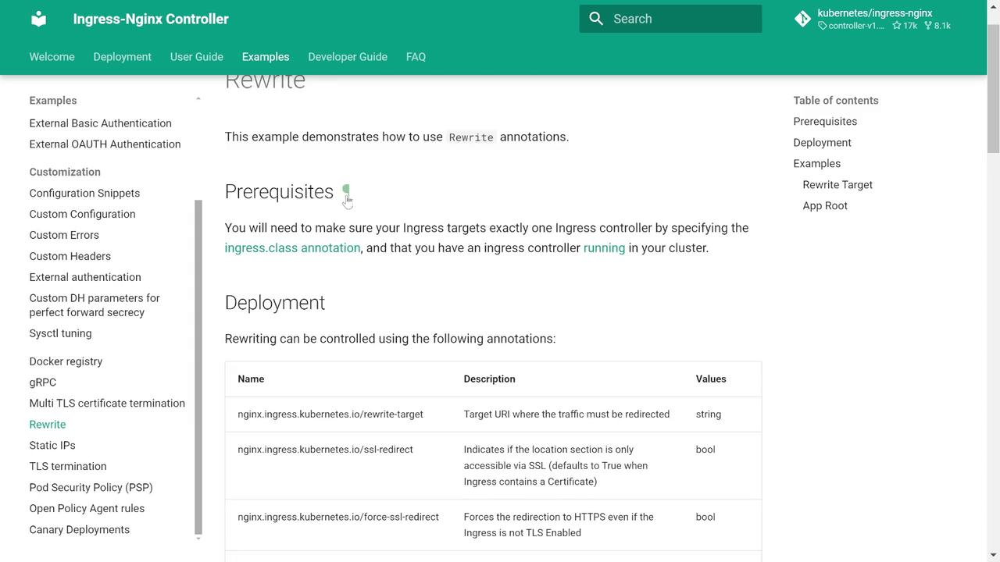
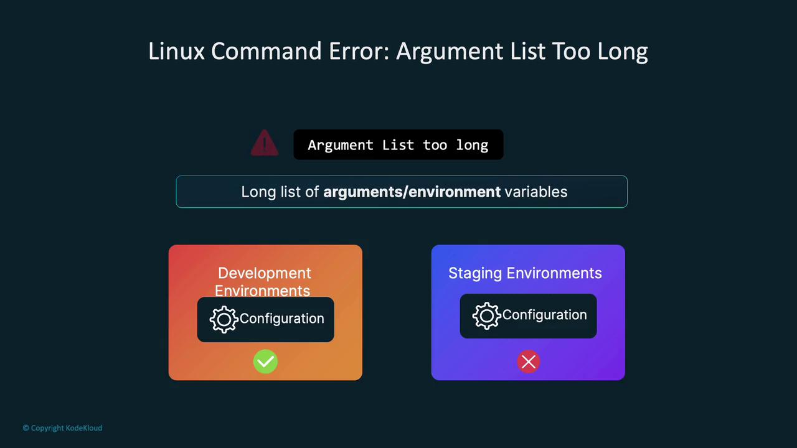
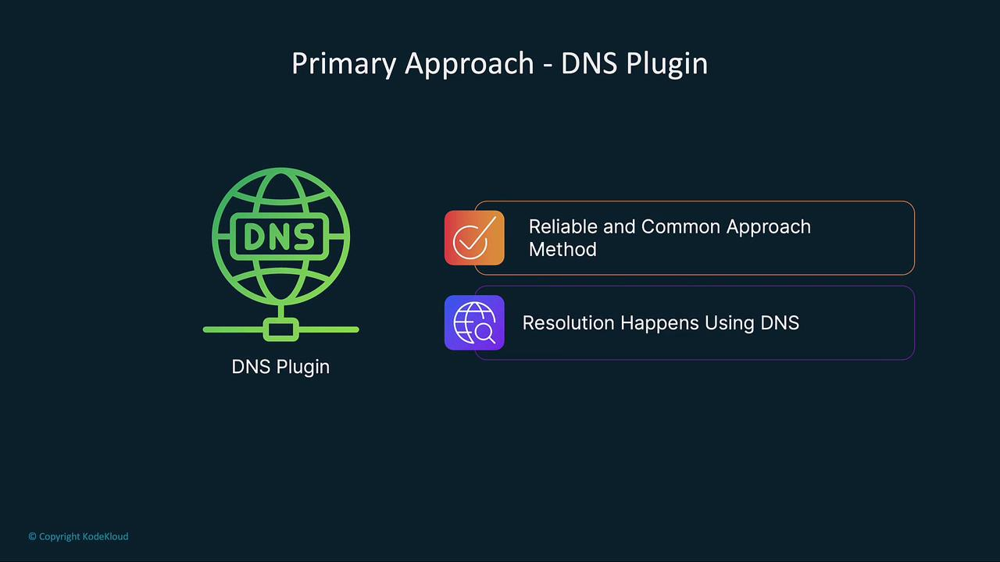
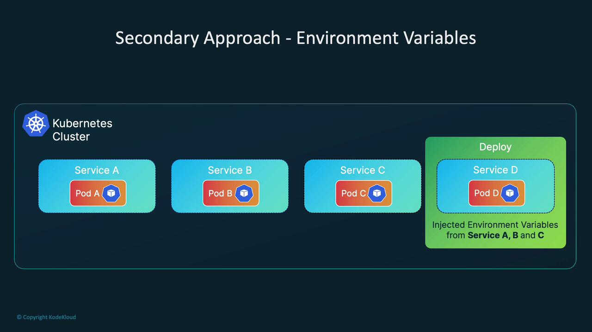
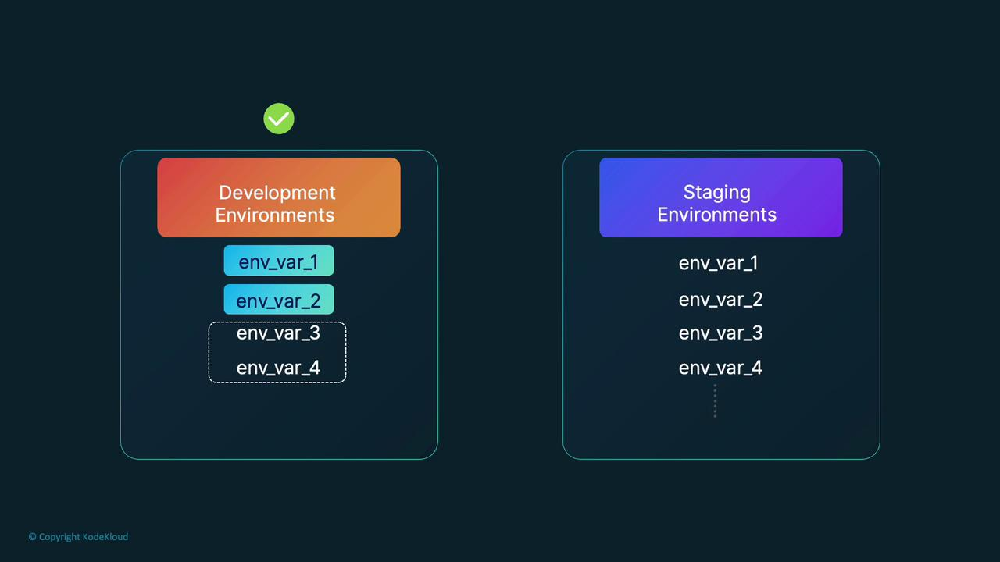

# Forward a local port (4444) to the techy-service on port 80 (mapped internally to 3000)
controlplane ~ ➜ k port-forward svc/techy-service 4444:80

# In another terminal, test the service with curl:
curl -v localhost:4444
```

The direct request returns a valid Techie quote:

```bash theme={null}
bash
controlplane ~ ➜ curl localhost:4444
All you have to do is hash the capacity adapter
controlplane ~ ➜
```

This confirms that the application is functioning as expected and that the issue lies in the path handling between the Ingress and the backend services. When the Ingress passes the original path (e.g., `/kanye`), the backend applications do not recognize the prefix, resulting in a 404 response.

## Implementing the Rewrite Target

The solution involves using the Nginx Ingress Controller's Rewrite Target annotation. This annotation modifies the URL path before it reaches your backend service. In other words, it strips the service-specific prefix so that the service receives requests on its root path.

Refer to the [Nginx Ingress Controller documentation on rewrite annotations](https://kubernetes.github.io/ingress-nginx/user-guide/nginx-configuration/annotations/) for additional details.

<Frame>
  
</Frame>

A common pattern uses a capture group in a regular expression to pass only the desired part of the path to the backend. Consider this example configuration:

```yaml theme={null}
apiVersion: networking.k8s.io/v1
kind: Ingress
metadata:
  annotations:
    nginx.ingress.kubernetes.io/use-regex: "true"
    nginx.ingress.kubernetes.io/rewrite-target: /$2
  name: rewrite
  namespace: default
spec:
  ingressClassName: nginx
  rules:
  - host: rewrite.bar.com
    http:
      paths:
      - path: /something(/|$)(.*)
        pathType: ImplementationSpecific
        backend:
          service:
            name: http-svc
            port:
              number: 80
```

In this example, the following rewrite behaviors occur when running the configuration with `kubectl create -f -`:

* rewrite.bar.com/something rewrites to rewrite.bar.com/
* rewrite.bar.com/something/ rewrites to rewrite.bar.com/
* rewrite.bar.com/something/new rewrites to rewrite.bar.com/new

Back in our setup, we can apply a simple rewrite target to strip the service-specific path:

```yaml theme={null}
apiVersion: networking.k8s.io/v1
kind: Ingress
metadata:
  annotations:
    nginx.ingress.kubernetes.io/rewrite-target: /
  kubectl.kubernetes.io/last-applied-configuration: |
    {"apiVersion":"networking.k8s.io/v1","kind":"Ingress","metadata":{"annotations":{"nginx.ingress.kubernetes.io/ssl-redirect":"false"},"name":"app-ingress","namespace":"default"},"spec":{"rules":[{"http":{"paths":[{"backend":{"service":{"name":"techy-service","port":{"number":80}}},"path":"/techy","pathType":"Prefix"},{"backend":{"service":{"name":"kanye-service","port":{"number":80}}},"path":"/kanye","pathType":"Prefix"},{"backend":{"service":{"name":"useless-service","port":{"number":80}}},"path":"/useless","pathType":"Prefix"}]}}]}}
  creationTimestamp: "2024-07-13T23:45:38Z"
  generation: 1
  name: app-ingress
  namespace: default
  resourceVersion: "3463"
  uid: 73b9e3a6-1d41-4ad2-9dec-8827b3ebc2aa
spec:
  rules:
  - http:
      paths:
      - backend:
          service:
            name: techy-service
            port:
              number: 80
        path: /techy
        pathType: Prefix
      - backend:
          service:
            name: kanye-service
            port:
              number: 80
        path: /kanye
        pathType: Prefix
      - backend:
          service:
            name: useless-service
            port:
              number: 80
        path: /useless
        pathType: Prefix
```

After applying this updated Ingress configuration, testing with curl shows that the services now receive the expected, rewritten requests. For example:

```bash theme={null}
bash
controlplane ~ ➜ curl -v 10.109.243.168/techy
*   Trying 10.109.243.168...
* Connected to 10.109.243.168 (10.109.243.168) port 80 (#0)
> GET /techy HTTP/1.1
> Host: 10.109.243.168
> User-Agent: curl/7.81.0
> Accept: */*
...
< HTTP/1.1 200 OK
...
I spent a lot of time setting up the modulation coupling
```

Other services can be verified similarly:

```bash theme={null}
controlplane ~ ➜ curl 10.109.243.168/kanye
{"quote":"Life is the ultimate gift"}
```

```bash theme={null}
controlplane ~ ➜ curl 10.109.243.168/useless
{"id":"6df415f6379dc42d110a6e5353b1da41","text":"Obsession is the most popular boat name.","source":"djtech.net","source_url":"http://www.djtech.net/humor/useless_facts.htm","language":"en","permalink":"https://uselessfacts.jsph.[SECRET_REDACTED]"}
```

This demonstrates the importance of both correctly defining an Ingress resource and understanding how request path rewrites impact backend service behavior.

## Reviewing the Generated Nginx Configuration

To further troubleshoot, it is useful to examine the Nginx configuration generated by the Ingress Controller. This configuration defines the load balancer behavior, including the evaluation order for location blocks and timeout settings.

```nginx theme={null}
# Backend for when default-backend-service is not configured or lacks endpoints
server {
    listen 8181 default_server reuseport backlog=4096;
    listen [::]:8181 default_server reuseport backlog=4096;
    set $proxy_upstream_name "internal";

    access_log off;
    location / {
        return 404;
    }
}

# Default server used for NGINX healthcheck and stats access
server {
    listen 127.0.0.1:10246;
    set $proxy_upstream_name "internal";

    keepalive_timeout 0;
    gzip off;

    access_log off;
    location /healthz {
        return 200;
    }

    location /is-dynamic-lb-initialized {
        content_by_lua_block {
        }
    }
}
```

Additional configuration snippets such as timeout settings can be defined by annotations or directly in the configuration file:

```nginx theme={null}
lua_add_variable $proxy_upstream_name;
log_format log_stream '[{$remote_addr} {[$time_local]} $protocol $status $bytes_sent $bytes_received $session_time';
access_log /var/log/nginx/access.log log_stream;
error_log /var/log/nginx/error.log notice;
upstream upstream_balancer {
    server 0.0.0.1:1234; # placeholder
    balancer_by_lua_block {
        tcp_udp_balancer.balance()
    }
}
server {
    listen 127.0.0.1:10247;
    access_log off;
    content_by_lua_block {
        tcp_udp_configuration.call()
    }
    # TCP services
    # UDP services
    # Stream Snippets
}
```

A sample grep on the Nginx configuration might reveal:

```bash theme={null}
keepalive_timeout 75s;
client_header_timeout 60s;
client_body_timeout 60s;
ssl_session_timeout 10m;
keepalive_timeout 60s;
proxy_connect_timeout 5s;
proxy_send_timeout 60s;
proxy_read_timeout 60s;
proxy_next_upstream error timeout;
proxy_next_upstream_timeout 0;
```

<Callout icon="lightbulb">
  Reviewing the effective Nginx configuration is critical to ensure that your timeout and proxy settings match your expectations. Adjust these values as necessary to optimize your application's performance.
</Callout>

## Conclusion

This troubleshooting session has demonstrated not only how to define an Ingress resource but also the importance of proper URL path rewriting. By implementing the Nginx Ingress Controller's rewrite-target annotation, we ensure that backend services receive requests in the expected format—eliminating 404 errors caused by unexpected path prefixes.

Mastering the nuances of Ingress configurations is essential for managing traffic routing and resolving production issues effectively. Happy troubleshooting!

<CardGroup>
  <Card title="Watch Video" icon="video" href="https://learn.kodekloud.com/user/courses/kubernetes-troubleshooting-for-application-developers/module/143d3913-caef-4dab-bde6-b77e96dbb161/lesson/78d21774-d968-41cb-ab3e-64c0f60fee14" />

  <Card title="Practice Lab" icon="installation" href="https://learn.kodekloud.com/user/courses/kubernetes-troubleshooting-for-application-developers/module/143d3913-caef-4dab-bde6-b77e96dbb161/lesson/71a34877-3a04-43c2-a31e-f7bebad3f29c" />
</CardGroup>


# enableServiceLinks

Source: https://notes.kodekloud.com/docs/Kubernetes-Troubleshooting-for-Application-Developers/Troubleshooting-Scenarios/enableServiceLinks/page

This article explains the enableServiceLinks parameter in Kubernetes and its impact on environment variable injection in pods.

In this lesson, we dive into the Kubernetes pod specification parameter called enableServiceLinks. This parameter, although not frequently encountered by beginners, is crucial for controlling how service-related environment variables are injected into your pods. Below, you'll find a detailed explanation and a real-world scenario that demonstrates the effect of this setting.

## Real-World Scenario: Troubleshooting Environment Variable Injection

While developing an application and writing the Kubernetes manifest, I initially tested the configuration in my development namespace. Everything worked as expected:

```plaintext theme={null}
Context: kubernetes-admin@kubernetes
Cluster: kubernetes
User: kubernetes-admin
K9s Rev: v0.32.5
K8s Rev: v1.30.0
CPU: 0%
MEM: 0%

NAME                            PF   READY    STATUS      RESTARTS    CPU    MEM    %CPU/R    %CPU/L    %MEM/R    %MEM/L
app-backend-784d8b488-n46z7    ●    1/1      Running     0           0      0      7         n/a       n/a       n/a
app-frontend-5659bf9bf4-22xt4   ●    1/1      Running     0           0      0      5         n/a       n/a       n/a
```

However, upon deploying the same manifest to the staging namespace, the application began crashing. The only difference was the namespace—the manifest remained unchanged. Container logs revealed the following error:

```plaintext theme={null}
standard_init_linux.go:228: exec user process caused: argument list too long
```

This error is common on Linux when a process is provided with an excessively long list of arguments, which in this case was due to a large number of environment variables injected into the pod. Although my application did not originally require many environment variables, the staging namespace had numerous additional services, leading to the buildup of excessive environment variables.

<Callout icon="lightbulb">
  Kubernetes automatically injects environment variables for every service in the namespace into each pod, ensuring that pods can discover and connect with services without relying solely on DNS.
</Callout>

<Frame>
  
</Frame>

## Diagnosing the Issue

To diagnose the problem, I recreated both the staging and development namespaces. After starting a shell in the container and executing a simple print command, I discovered a lengthy list of environment variables in the staging namespace. These included variables such as DevOps, Auth, API, ML Pipeline, Recommendations, and Security, corresponding to other applications running in that namespace.

For instance, the staging namespace had many service-related environment variables:

```plaintext theme={null}
SERVICE_PAYMENTS_PORT_80_TCP=tcp://10.111.106.141:80
SERVICE_USER_MANAGEMENT_PORT_80_TCP=tcp://10.110.195.14:80
SERVICE_ML_PORT_80_TCP_ADDR=10.98.108.170
SERVICE_CUSTOMER_SUPPORT_PORT=tcp://10.106.113.178:80
KUBERNETES_SERVICE_HOST=10.96.0.1
KUBERNETES_PORT=tcp://10.96.0.1:443
...
```

In contrast, the development namespace only injected environment variables for two services—the frontend and the backend:

```bash theme={null}
root@app-frontend-5659bf9bf4-hszqp:/# printenv
KUBERNETES_SERVICE_PORT_HTTPS=443
KUBERNETES_SERVICE_PORT=443
HOSTNAME=app-frontend-5659bf9bf4-hszqp
SERVICE_FRONTEND_SERVICE_PORT=80
SERVICE_BACKEND_PORT_88_TCP_PROTO=tcp
SERVICE_FRONTEND_PORT_80_TCP_PROTO=tcp
PWD=/
...
```

This comparison highlights how the default behavior of Kubernetes leads to the accumulation of environment variables, which can cause issues such as the "argument list too long" error.

<Frame>
  
</Frame>

## Impact of Environment Variable Injection

When a new pod starts, let's say for Service D, Kubernetes injects environment variables from existing services (A, B, and C) into that pod. For example, the logging application in such a scenario might show the following output when running:

```bash theme={null}
printenv | grep LO
```

This command outputs several logging-related variables:

```bash theme={null}
root@app-frontend-5659bf9bf4-g5mkv:/# printenv | grep LOGGING
SERVICE_LOGGING_PORT=tcp://10.107.148.177:80
SERVICE_LOGGING_PORT_80_TCP=tcp://10.107.148.177:80
SERVICE_LOGGING_PORT_80_TCP_ADDR=10.107.148.177
SERVICE_LOGGING_PORT_80_TCP_PROTO=tcp
SERVICE_LOGGING_PORT_80_TCP_PORT=80
SERVICE_LOGGING_SERVICE_HOST=10.107.148.177
SERVICE_LOGGING_SERVICE_PORT=80
```

Such injected information enables applications to connect to services without DNS queries. However, in environments with thousands of services, the cumulative length of environment variables can become unmanageable.

<Frame>
  
</Frame>

A side-by-side comparison between development and staging environments might look like this:

<Frame>
  
</Frame>

## Disabling Service Links with enableServiceLinks

Since we use CoreDNS in production, the automatically injected environment variables are redundant. Kubernetes provides an option to disable this behavior by setting enableServiceLinks to false in your pod specification. This prevents the injection of unrelated service environment variables, addressing issues like the "argument list too long" error.

Below is an example of a deployment manifest with enableServiceLinks disabled:

```yaml theme={null}
apiVersion: apps/v1
kind: Deployment
metadata:
  name: app-frontend
  namespace: staging
  annotations:
    deployment.kubernetes.io/revision: "1"
    kubectl.kubernetes.io/last-applied-configuration: |
      {"apiVersion":"apps/v1","kind":"Deployment","metadata":{"name":"app-frontend","namespace":"staging"},"spec":{"replicas":1,"selector":{"matchLabels":{"app":"frontend"}},"template":{"metadata":{"labels":{"app":"frontend"}},"spec":{"containers":[{"image":"nginx:1.19","name":"app-frontend","ports":[{"containerPort":80}]}]}}}}
spec:
  replicas: 1
  selector:
    matchLabels:
      app: frontend
  template:
    metadata:
      labels:
        app: frontend
    spec:
      enableServiceLinks: false
      containers:
        - image: nginx:1.19
          name: app-frontend
          ports:
            - containerPort: 80
```

After applying this updated manifest, your new pods will no longer include the extraneous service environment variables. Verify this by executing a print command within the pod:

```bash theme={null}
root@app-frontend-5f84894df8-xqpp4:/# printenv
KUBERNETES_SERVICE_PORT=443
KUBERNETES_SERVICE_PORT_HTTPS=443
HOSTNAME=app-frontend-5f84894df8-xqpp4
PWD=/
PKG_RELEASE=1~buster
HOME=/root
KUBERNETES_PORT_443_TCP=tcp://10.96.0.1:443
NJS_VERSION=0.5.3
TERM=term
SHLVL=1
KUBERNETES_PORT_443_TCP_PROTO=tcp
KUBERNETES_PORT_443_TCP_ADDR=10.96.0.1
KUBERNETES_SERVICE_HOST=10.96.0.1
KUBERNETES_PORT=tcp://10.96.0.1:443
KUBERNETES_PORT_443_TCP_PORT=443
PATH=/usr/local/sbin:/usr/local/bin:/usr/sbin:/usr/bin:/sbin:/bin
NGINX_VERSION=1.19.10
_= /usr/bin/printenv
```

<Callout icon="lightbulb">
  The enableServiceLinks parameter is enabled by default, leading to the injection of environment variables for every service in the namespace. When using a DNS plugin like CoreDNS, disable this behavior by setting enableServiceLinks to false to prevent potential errors.
</Callout>

## Summary

In summary, enableServiceLinks controls how Kubernetes injects service environment variables into your pods. By setting enableServiceLinks to false, you can improve resource efficiency and avoid errors like "argument list too long," especially when many services coexist in the same namespace. Leveraging DNS via CoreDNS for service discovery is a best practice that renders these environment variables unnecessary.

Happy deploying, and see you in the next article!

## Additional Resources

* [Kubernetes Documentation](https://kubernetes.io/docs/)
* [Getting Started with CoreDNS](https://coredns.io/)
* [Kubernetes Pod Design Best Practices](https://kubernetes.io/docs/concepts/workloads/pods/)

<CardGroup>
  <Card title="Watch Video" icon="video" href="https://learn.kodekloud.com/user/courses/kubernetes-troubleshooting-for-application-developers/module/143d3913-caef-4dab-bde6-b77e96dbb161/lesson/145f4424-ee1d-4e0c-b117-321501e6db15" />

  <Card title="Practice Lab" icon="installation" href="https://learn.kodekloud.com/user/courses/kubernetes-troubleshooting-for-application-developers/module/143d3913-caef-4dab-bde6-b77e96dbb161/lesson/03d199f6-ed62-4459-98fc-bb88f6842b77" />
</CardGroup>
