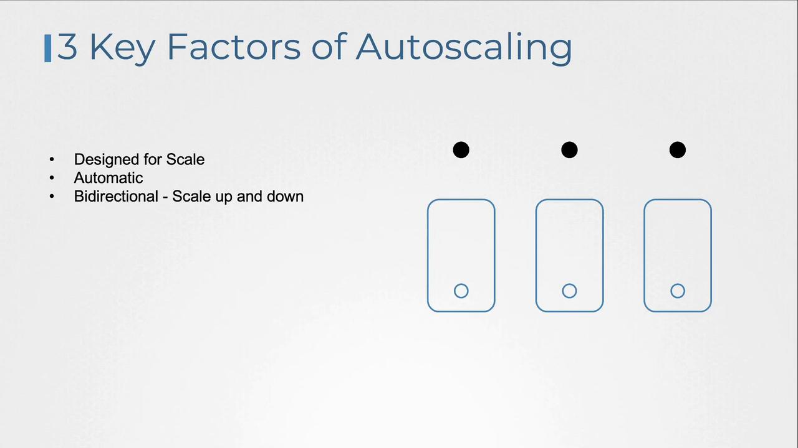
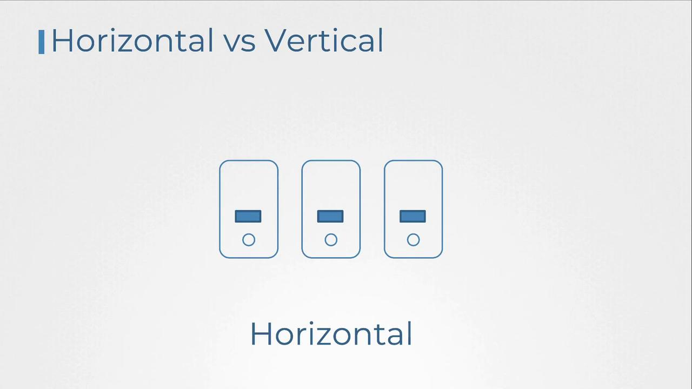
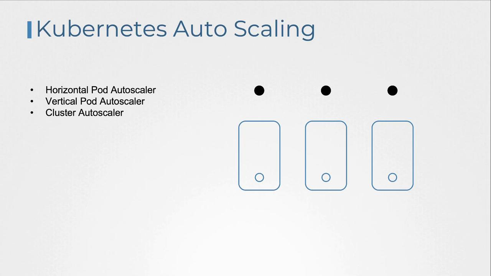

# Autoscaling

Source: https://notes.kodekloud.com/docs/Kubernetes-and-Cloud-Native-Associate-KCNA/Cloud-Native-Architecture/Autoscaling/page

This article explores Kubernetes autoscaling capabilities and essential features for efficient resource management based on real-time application demand.

In this article, we explore the autoscaling capabilities available in Kubernetes and detail the essential features that make this process robust and efficient.

Autoscaling is the automated adjustment of resource counts—such as servers, virtual machines, or application instances—based on real-time demand for an application or service. This dynamic allocation helps applications gracefully handle sudden surges or declines in traffic, ensuring optimal resource utilization without overprovisioning or underutilizing.

To achieve true Cloud Native autoscaling, three key elements are necessary:

1. The application and its underlying infrastructure must be designed for scalability. This ensures rapid adjustments in resource allocation as demand changes.
2. The autoscaling process must be automated, continuously monitoring workloads and provisioning resources without manual intervention.
3. Autoscaling needs to be bidirectional, scaling up to handle increased load and scaling down during periods of reduced demand, which in turn improves cost efficiency.

<Frame>
  
</Frame>

Before diving deeper into Kubernetes autoscaling, it is important to understand two common scaling strategies:

* **Vertical Scaling:** Involves increasing the resources (CPU, RAM, etc.) of an existing instance. While effective, it is typically constrained by the server's maximum capacity.
* **Horizontal Scaling:** Focuses on adding more units—such as servers or instances—to distribute the load. This approach provides greater flexibility and enhanced fault tolerance.

<Frame>
  
</Frame>

Kubernetes offers three distinct autoscaling features to optimize resource management:

* **Horizontal Pod Autoscaler (HPA):** Automatically scales the number of pods in a deployment based on metrics such as CPU or memory usage.
* **Vertical Pod Autoscaler (VPA):** Adjusts resource limits and requests for pods based on their actual consumption.
* **Cluster Autoscaler:** Manages the overall cluster by adding or removing nodes in response to workload requirements.

<Callout icon="lightbulb">
  Understanding the differences between HPA, VPA, and Cluster Autoscaler is crucial for designing a robust and cost-effective Kubernetes architecture.
</Callout>

Let's take a closer look at each autoscaling feature and understand how they contribute to a flexible, resilient cloud-native environment.

<Frame>
  
</Frame>

<CardGroup>
  <Card title="Watch Video" icon="video" href="https://learn.kodekloud.com/user/courses/kubernetes-and-cloud-native-associate-kcna/module/c5b96591-7106-4a51-abe1-d77b53e1a92c/lesson/afb40a9c-585e-4c78-989e-c6b3cc2a8f5c" />
</CardGroup>
