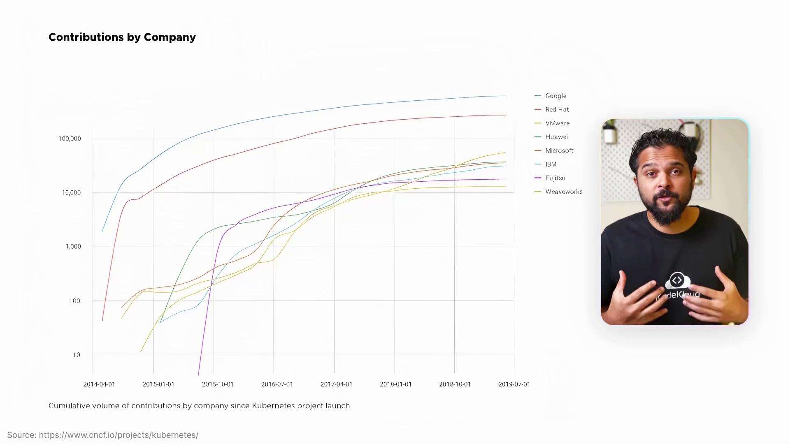
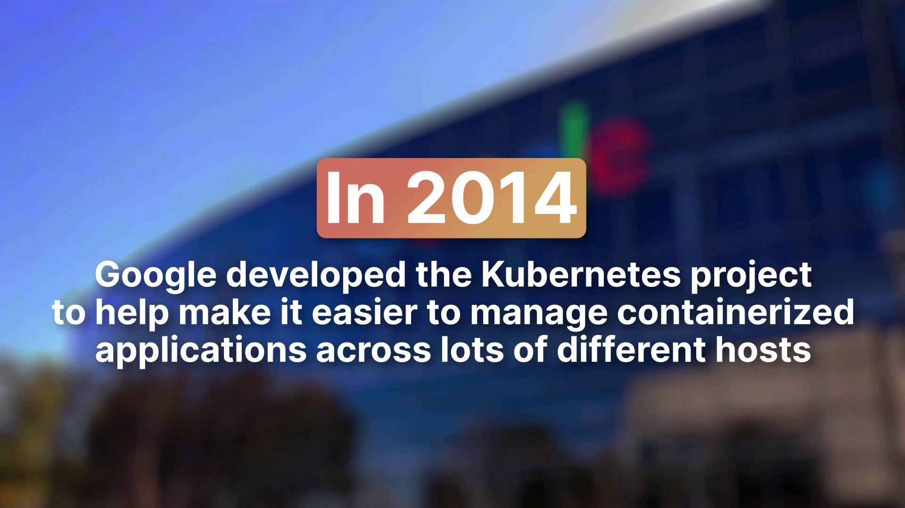
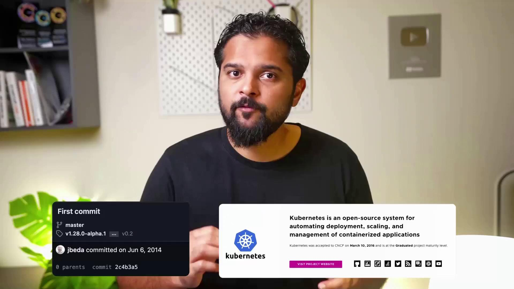
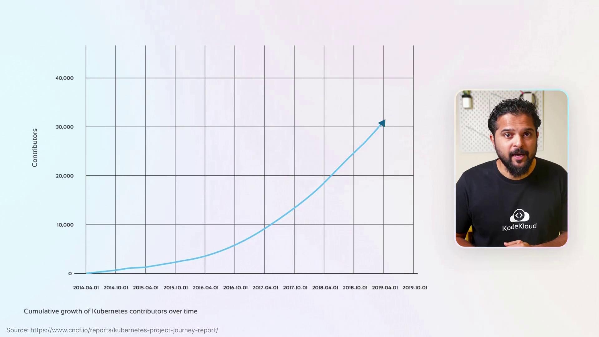
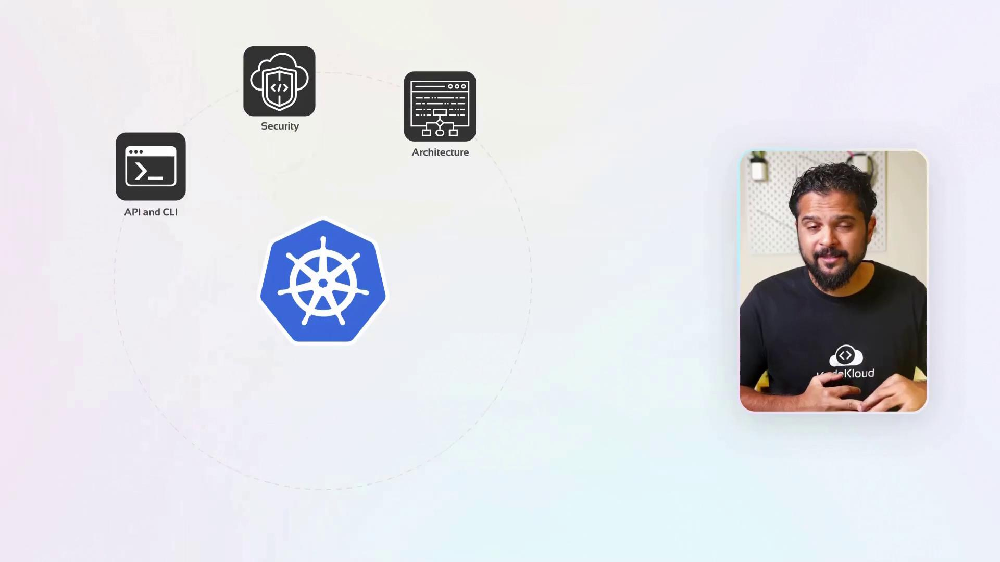
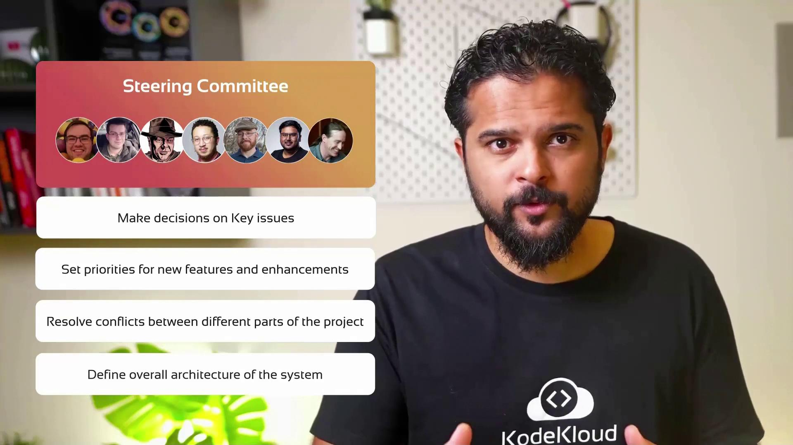
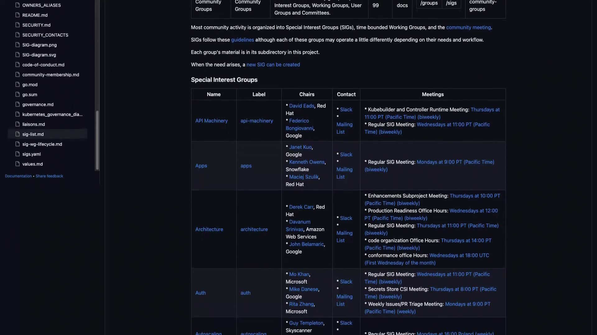
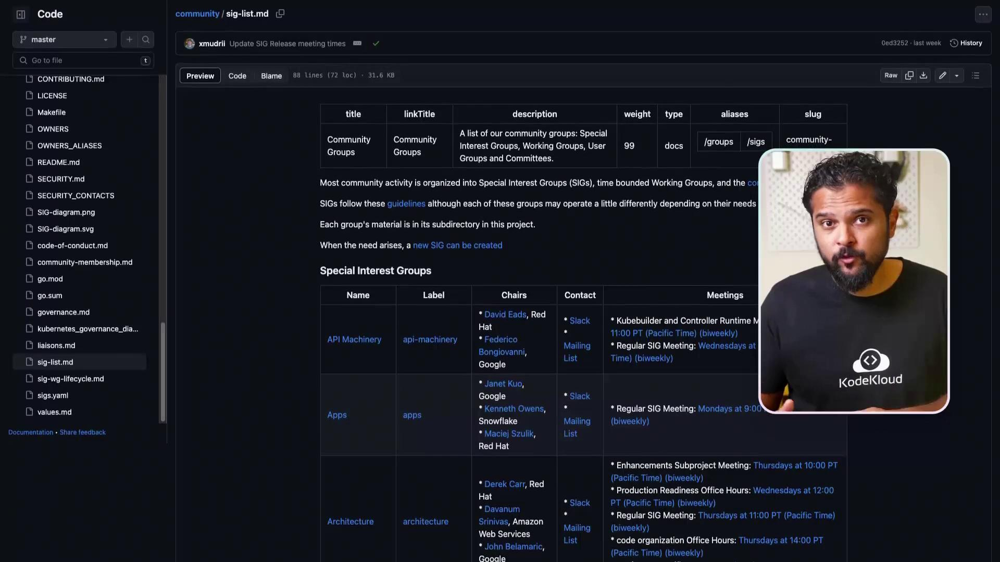
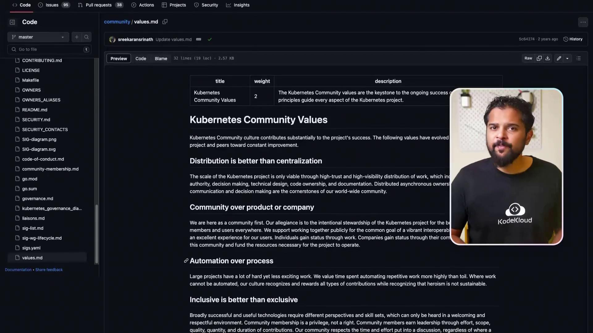

# deployment.yaml
apiVersion: apps/v1
kind: Deployment
metadata:
  name: myapp
spec:
  replicas: 3
  selector:
    matchLabels:
      app: myapp
  template:
    metadata:
      labels:
        app: myapp
    spec:
      containers:
      - name: myapp
        image: myapp:latest
        resources:
          limits:
            cpu: 500m
          requests:
            cpu: 200m
```

The following YAML defines the Horizontal Pod Autoscaler to ensure the Deployment can scale based on CPU utilization:

```yaml theme={null}
# hpa.yaml
apiVersion: autoscaling/v2beta2
kind: HorizontalPodAutoscaler
metadata:
  name: myapp-hpa
spec:
  scaleTargetRef:
    apiVersion: apps/v1
    kind: Deployment
    name: myapp
  minReplicas: 1
  maxReplicas: 10
  metrics:
  - type: Resource
    resource:
      name: cpu
      target:
        type: Utilization
        averageUtilization: 50
```

### Explanation

* The `scaleTargetRef` section specifies that the HPA targets the Deployment named "myapp".
* The autoscaler will maintain the replica count between 1 and 10 based on CPU usage.
* It continuously monitors the average CPU utilization and aims to maintain a 50% utilization threshold across all pods.

## Managing the HPA

To create the HPA, run the following command:

```bash theme={null}
kubectl create -f hpa.yaml
```

Upon successful creation, you will receive a confirmation message:

```plaintext theme={null}
HorizontalPodAutoscaler Created
```

To view details of the created HPA, use the following command:

```bash theme={null}
kubectl get hpa
```

The expected output might resemble:

```plaintext theme={null}
NAME        REFERENCE             TARGETS      MINPODS   MAXPODS   REPLICAS   AGE
myapp-hpa   Deployment/myapp      50%/50%      1         10        3          10m
```

In the output:

* The "TARGETS" column shows both the current and the desired average CPU utilization.
* "MINPODS" and "MAXPODS" indicate the minimum and maximum replica limits.
* "REPLICAS" reflects the current number of running pods.
* "AGE" shows the duration for which the HPA has been active.

<Callout icon="triangle-alert">
  Ensure your metrics server is properly configured and running, as the HPA relies on accurate metrics to make scaling decisions.
</Callout>

To remove the HPA, execute the following command:

```bash theme={null}
kubectl delete hpa myapp-hpa
```

## Conclusion

This lesson demonstrated how to configure and monitor a Horizontal Pod Autoscaler for a Kubernetes Deployment. By dynamically adjusting the number of pods according to real-time resource usage, Kubernetes ensures that your application efficiently handles varying loads while optimizing resource use.

<CardGroup>
  <Card title="Watch Video" icon="video" href="https://learn.kodekloud.com/user/courses/kubernetes-and-cloud-native-associate-kcna/module/c5b96591-7106-4a51-abe1-d77b53e1a92c/lesson/a58b677c-9c44-4180-9689-45cb46736983" />
</CardGroup>


# Kubernetes SIG

Source: https://notes.kodekloud.com/docs/Kubernetes-and-Cloud-Native-Associate-KCNA/Cloud-Native-Architecture/Kubernetes-SIG/page

This article discusses the Kubernetes project, its community structure, and the role of Special Interest Groups in driving innovation and maintaining quality standards.

Kubernetes is one of today's most popular open source projects, boasting over 80,000 stars on GitHub, contributed to by more than 2,500 developers and over 1 million contributions. This powerful container orchestration platform is the backbone for managing modern, container-based applications.

Big industry players such as Google, Microsoft, and AWS rely on Kubernetes not only for their container management needs but also for its innovative hosting solutions and significant contributions to its development.

<Frame>
  
</Frame>

Kubernetes was originally developed by Google in 2014 to simplify the deployment and management of containerized applications across multiple hosts. The project's first commit was on June 6th, 2014, and its evolution accelerated when it joined the Cloud Native Computing Foundation (CNCF) in 2016, reinforcing its importance in container orchestration.

<Frame>
  
</Frame>

<Frame>
  
</Frame>

Starting with just a few developers, Kubernetes has experienced exponential growth. Initially, there were around 20 developers; this number increased to approximately 400 after joining the CNCF. Today, over 3,000 contributors drive the project forward. The following chart from a CNCF report illustrates the cumulative growth of Kubernetes contributors over the years.

<Frame>
  
</Frame>

Managing a project as massive as Kubernetes is complex. Imagine constructing a skyscraper in a busy city: coordinating construction workers, managing supply chains, and ensuring safety all at once. Similarly, Kubernetes requires meticulous handling of architecture, security, APIs, command line interfaces (CLI), autoscaling features, networking, and storage solutions—especially with integrations across various cloud providers.

<Frame>
  
</Frame>

<Callout icon="lightbulb">
  A robust project management system is essential for coordinating feature development, bug fixes, testing, and release cycles within the Kubernetes ecosystem.
</Callout>

Due to its open source nature, Kubernetes is managed by a diverse community rather than a centralized organization. The success of this approach lies in its well-defined community governance model.

At the top of this hierarchy is the Kubernetes Steering Committee. This diverse group is responsible for setting the overall project direction, defining system architecture, prioritizing new features, and resolving conflicts across different areas. They provide guidance to various working groups and Special Interest Groups (SIGs), which are integral to Kubernetes' operational structure.

<Frame>
  
</Frame>

As of this recording, the Steering Committee consists of:

* Benjamin Elder (Google)
* Christoph Blecker (Red Hat)
* Carlos Taddeu Panato Jr. (ChainGuard Inc.)
* Stephen Augustus (Cisco)
* Bob Killen (Google)
* Nabarun Pal (VMware)
* Tim Pepper (VMware)

Following the Steering Committee are various working groups and SIGs. While working groups address cross-cutting challenges spanning multiple domains, SIGs serve as specialized teams responsible for distinct facets of Kubernetes.

Consider the Kubernetes SIG for Architecture—it functions similarly to a team of architects designing a skyscraper, focusing on evolving design principles and ensuring a consistent architectural approach throughout the platform. SIGs streamline development, foster rapid innovation, and maintain organizational clarity by avoiding overlap between responsibilities.

Key responsibilities of SIGs include:

1. **Code Development:** Introducing new features, resolving bugs, and improving the codebase.
2. **Testing and Validation:** Ensuring that releases meet rigorous community quality standards.
3. **Documentation:** Keeping user guides, reference materials, and API documentation up to date.
4. **Community Outreach and Education:** Organizing meetups, webinars, and conferences to engage and educate users.
5. **Release Management:** Coordinating the entire release process, from feature development to documentation updates.
6. **Architecture and Design Guidance:** Ensuring Kubernetes remains scalable, reliable, and maintainable.

SIGs conduct their discussions openly via video conferences, chat rooms, mailing lists, Slack groups, GitHub issues, and pull requests. All meeting details are accessible on the public Kubernetes community calendar, with recordings available online for later review.

Technical proposals and design changes are managed through the Kubernetes Enhancement Proposal (KEP) process. KEPs invite community feedback as SIG members review proposals through GitHub, mailing lists, and dedicated SIG meetings.

Each SIG is led by one or more chairs who facilitate discussions and drive decision-making. A comprehensive list of SIGs, including their co-chairs, communication channels, and meeting schedules, is publicly available.

<Frame>
  
</Frame>

For example:

* **SIG Architecture:** Oversees Kubernetes’ overall design and API consistency. At the time of recording, it is chaired by Derek Carr (Red Hat), Davanam Srinivas or DIMMS (AWS), and John Bellamarak (Google).
* **SIG Cluster Lifecycle:** Manages the creation, management, and upgrading of clusters. It is chaired by Justin Santabarbero (Google) and Vince Brignano (Red Hat).
* **SIG Storage:** Focuses on storage management, ensuring consistent API definitions across storage providers, chaired by Saad Ali (Google) and Jing Yang (VMware).
* **SIG Network:** Handles networking functionalities with a consistent API across providers, chaired by Michael Zappa (Microsoft), Shane (Kong), and Tim Hockin (Google).

New SIGs or membership expansion begins with community proposals, which are reviewed by the Kubernetes Steering Committee to ensure alignment with overall community goals. Once approved, the SIG adopts its own governance structure through a nomination and election process, electing its leaders accordingly.

This collaborative model has enabled Kubernetes—a global open source project—to flourish through collective contributions.

<Frame>
  
</Frame>

In summary, the Kubernetes community thrives on open collaboration, technical excellence, and inclusivity. Whether your interests lie in code development, testing, documentation, or community outreach, there is a SIG that aligns with your expertise. Participation is highly encouraged—join the Kubernetes Slack channel and mailing lists, attend SIG meetings, and contribute to one of the most dynamic open source projects available.

<Frame>
  
</Frame>

We hope this article has provided clear insights into Kubernetes SIGs and their role in driving innovation while upholding robust quality standards. Explore further by joining your preferred SIG, participating in community discussions, and contributing to one of the most influential open source projects in existence.

<CardGroup>
  <Card title="Watch Video" icon="video" href="https://learn.kodekloud.com/user/courses/kubernetes-and-cloud-native-associate-kcna/module/c5b96591-7106-4a51-abe1-d77b53e1a92c/lesson/940ce832-07fa-4270-93e3-68018a7e9b76" />
</CardGroup>
