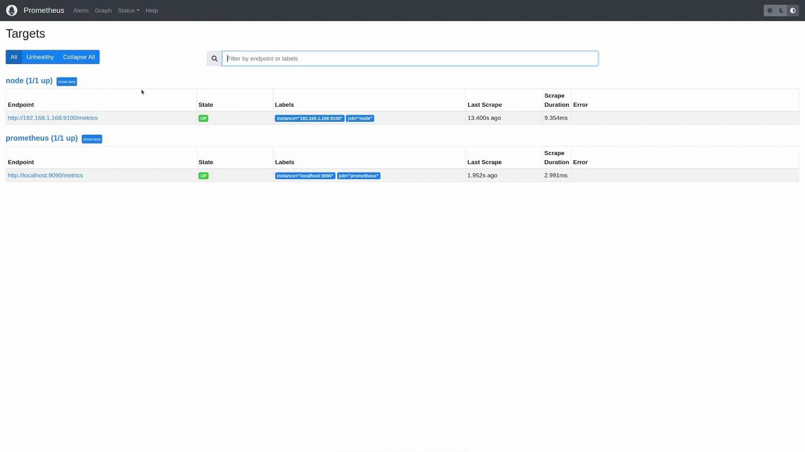
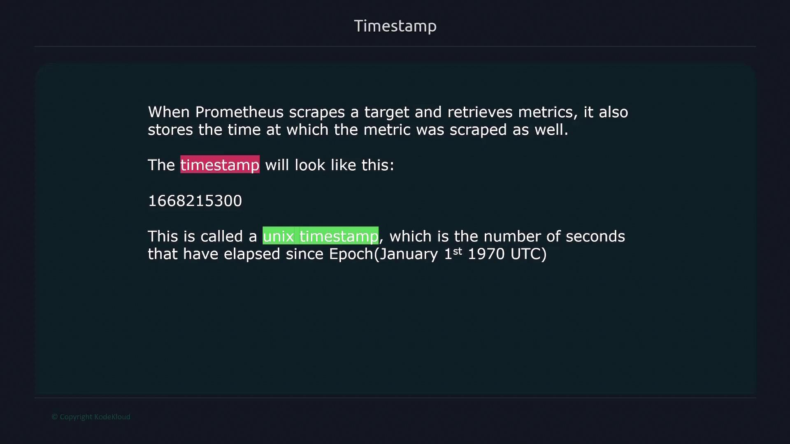

# my global config
global:
  scrape_configs:
    - job_name: "prometheus"
      static_configs:
        - targets: ["localhost:9090"]
```

In this configuration:

* The **global** section defines default parameters, which can be inherited or overridden by other sections.
* The **scrape\_configs** section specifies the target endpoints for scraping metrics.

***

## Detailed Scrape Configuration

Prometheus uses the **scrape\_configs** block to identify targets for metric collection. In this enhanced example, additional parameters—such as `scrape_interval`, `scrape_timeout`, and `sample_limit`—allow you to fine-tune the scraper’s behavior.

```yaml theme={null}
global:
  scrape_interval: 1m
  scrape_timeout: 10s

scrape_configs:
  - job_name: 'node'
    scrape_interval: 15s
    scrape_timeout: 5s
    sample_limit: 1000
    static_configs:
      - targets: ['172.16.12.1:9090']

# Configuration related to AlertManager
alerting:

# Rule files specifying where rules are read from
rule_files:

# Remote read/write settings
remote_read:
remote_write:

# Storage-related settings
storage:
```

Key points in this configuration:

* Global defaults specify a 1-minute scrape interval and a 10-second timeout.
* The **node** job overrides these defaults, setting a 15-second interval and a 5-second timeout.
* The **static\_configs** block clearly indicates the target IP and port for scraping metrics.

Additional configuration blocks like **alerting**, **rule\_files**, **remote\_read**, **remote\_write**, and **storage** are available for extended use cases.

***

## Customizing Job Configurations

When adding a new job under **scrape\_configs**, you must specify details such as the job name, scrape interval, timeout, scheme (HTTP/HTTPS), and the metrics path. By default, Prometheus scrapes metrics from the `/metrics` endpoint; however, customization is possible if your target uses a different endpoint.

For instance, the following configuration demonstrates how to scrape two targets over HTTPS using a custom metrics path:

```yaml theme={null}
scrape_configs:
  - job_name: 'nodes'
    scrape_interval: 30s
    scrape_timeout: 3s
    scheme: https
    metrics_path: /stats/metrics
    static_configs:
      - targets: ['10.231.1.2:9090', '192.168.43.9:9090']
```

This configuration shows:

* A job called **nodes** that scrapes every 30 seconds.
* A 3-second scrape timeout.
* Usage of HTTPS for securing the connection.
* Changing the default metrics path from `/metrics` to `/stats/metrics`.
* Two specified target nodes with their respective IP addresses and ports.

The section below summarizes common adjustable options in the **scrape\_configs**:

```yaml theme={null}
scrape_configs:
  # Frequency to scrape targets from this job.
  [ scrape_interval: <duration> | default = <global_config.scrape_interval> ]
  
  # Per-scrape timeout for this job.
  [ scrape_timeout: <duration> | default = <global_config.scrape_timeout> ]
  
  # HTTP resource path for fetching metrics.
  [ metrics_path: <path> | default = /metrics ]
  
  # Protocol scheme used for requests.
  [ scheme: <scheme> | default = http ]
  
  # Sets the 'Authorization' header for each scrape request.
  # Note: 'password' and 'password_file' are mutually exclusive.
  basic_auth:
    [ username: <string> ]
    [ password: <secret> ]
    [ password_file: <string> ]
```

These options allow you to tailor the timing, endpoint, and authentication settings for each job as needed.

***

## Updating the Prometheus Configuration

After modifying the prometheus.yaml file, Prometheus does not automatically reload changes. You must restart the Prometheus process. If running Prometheus manually (e.g., using `./prometheus`), you can simply press Ctrl+C and restart the process. For Prometheus running under systemd, use one of the following methods:

```bash theme={null}
$ ctrl+c  -> ./prometheus
$ kill -HUP <pid>
```

Or restart via systemd with:

```bash theme={null}
sudo systemctl restart prometheus
```

Consider an updated prometheus.yaml configuration that adds a new job for scraping a Node Exporter on a specific Linux machine:

```yaml theme={null}
# my global config
global:
  scrape_interval: 15s # Scrape every 15 seconds (default is 1 minute).
  evaluation_interval: 15s # Evaluate rules every 15 seconds (default is 1 minute).
  # scramble_timeout uses the global default (10s).

# Alertmanager configuration
alerting:
  alertmanagers:
    - static_configs:
        - targets:
          - alertmanager:9093

# Load rules periodically based on the global evaluation interval.
rule_files:
  # - "first_rules.yml"
  # - "second_rules.yml"

# Scrape configuration:
# Prometheus scrapes itself via the "prometheus" job.
scrape_configs:
  - job_name: "prometheus"
    # metrics_path defaults to `/metrics`
    # scheme defaults to `http`.
    static_configs:
      - targets: ["localhost:9090"]

  - job_name: "node"
    static_configs:
      - targets: ["192.168.1.168:9100"]
```

In this updated configuration:

* The **prometheus** job continues to scrape Prometheus itself.
* A new **node** job is added to scrape a Linux machine running Node Exporter on IP 192.168.1.168 at port 9100.

After updating the configuration, restart the Prometheus service to apply the changes:

```bash theme={null}
user1 in ~/prometheus-2.37.2.linux-amd64
➜  sudo vi /etc/prometheus/prometheus.yml
user1 in ~/prometheus-2.37.2.linux-amd64 took 1m52s
➜  sudo systemctl restart prometheus
```

<Callout icon="lightbulb">
  Remember to save your changes to prometheus.yaml and restart Prometheus to apply the new configuration.
</Callout>

***

## Verifying the Configuration

After restarting Prometheus, open the Prometheus web UI and navigate to the “Status” -> “Targets” page. Here you can inspect all configured targets and their scrape status. Both the Prometheus target and the new node target should display an "UP" status for successful metric collection.

<Frame>
  
</Frame>

You can further verify the configuration by executing queries such as:

```promql theme={null}
up{instance="192.168.1.100",job="node"}
up{instance="localhost:9090",job="prometheus"}
```

A returned value of 1 confirms that the instances are active and functional.

***

This article demonstrated how to modify your Prometheus configuration file to add new scrape targets and adjust parameters such as scrape interval, timeout, and metrics path. By following these steps, Prometheus can successfully collect metrics from both itself and external nodes running Node Exporters.

<CardGroup>
  <Card title="Watch Video" icon="video" href="https://learn.kodekloud.com/user/courses/kubernetes-and-cloud-native-associate-kcna/module/70e17eea-7e9b-4f65-87a4-1cdb5631e0dc/lesson/932a11ff-da56-4759-99fe-8fe6e7c8e8d9" />
</CardGroup>


# Prometheus Metrics

Source: https://notes.kodekloud.com/docs/Kubernetes-and-Cloud-Native-Associate-KCNA/Cloud-Native-Observability/Prometheus-Metrics/page

This guide explains the components and structure of Prometheus metrics, including metric names, labels, values, and their role in monitoring.

This guide explains how Prometheus metrics work by breaking down their key components and structure. Prometheus metrics are composed of three fundamental parts:

1. A descriptive metric name.
2. One or more labels (key-value pairs) that add valuable context.
3. A numerical value representing the measured quantity at a specific time.

***

## Metric Structure

Consider the example metric generated by the node exporter:

```plaintext theme={null}
node_cpu_seconds_total{cpu="0",mode="idle"} 258277.86
```

In this example:

* The metric name, `node_cpu_seconds_total`, represents the total CPU seconds.
* The labels `cpu` and `mode` specify which CPU (CPU 0) and its state (idle).
* The numerical value `258277.86` indicates the total seconds that CPU 0 has been idle.

For multi-CPU systems, you will observe similar metrics with different label values, such as:

```plaintext theme={null}
node_cpu_seconds_total{cpu="0",mode="idle"} 258277.86
node_cpu_seconds_total{cpu="0",mode="idle"} 258244.86
node_cpu_seconds_total{cpu="1",mode="idle"} 427262.54
node_cpu_seconds_total{cpu="2",mode="idle"} 283288.12
node_cpu_seconds_total{cpu="3",mode="idle"} 258202.33
```

Each line records the CPU time for a specific CPU and state, allowing deeper insights through label-based filtering.

***

## Timestamps and Data Scraping

Every time Prometheus scrapes a target, it collects not only the metric value but also the timestamp—a Unix timestamp that records the number of seconds since January 1, 1970, UTC. This ensures that all measurements are accurately recorded in time.

<Frame>
  
</Frame>

<Callout icon="lightbulb">
  You can convert Unix timestamps to human-readable formats using various online tools, although most modern dashboarding tools perform this conversion automatically based on your local timezone.
</Callout>

***

## Time Series

In Prometheus, a time series is a sequence of timestamped data points that share the same metric name and labels. For example, consider these metrics collected from two different servers:

```plaintext theme={null}
node_filesystem_files{device="sda2", instance="server1"}
node_filesystem_files{device="sda3", instance="server1"}
node_filesystem_files{device="sda2", instance="server2"}
node_filesystem_files{device="sda3", instance="server2"}

node_cpu_seconds_total{cpu="0", instance="server1"}
node_cpu_seconds_total{cpu="1", instance="server1"}
node_cpu_seconds_total{cpu="0", instance="server2"}
node_cpu_seconds_total{cpu="1", instance="server2"}
```

* Two distinct metrics are present: `node_filesystem_files` and `node_cpu_seconds_total`.
* With different combinations of labels (such as `device`, `cpu`, and `instance`), there are eight unique time series.

Each scrape by Prometheus—typically at intervals of 15 or 30 seconds—appends new timestamped entries to the respective time series.

***

## Metric Attributes

Every Prometheus metric has two key attributes:

* **Help attribute:** Provides a natural language description of what the metric measures.
* **Type attribute:** Specifies the metric type, such as counter, gauge, histogram, or summary.

For example:

```plaintext theme={null}
