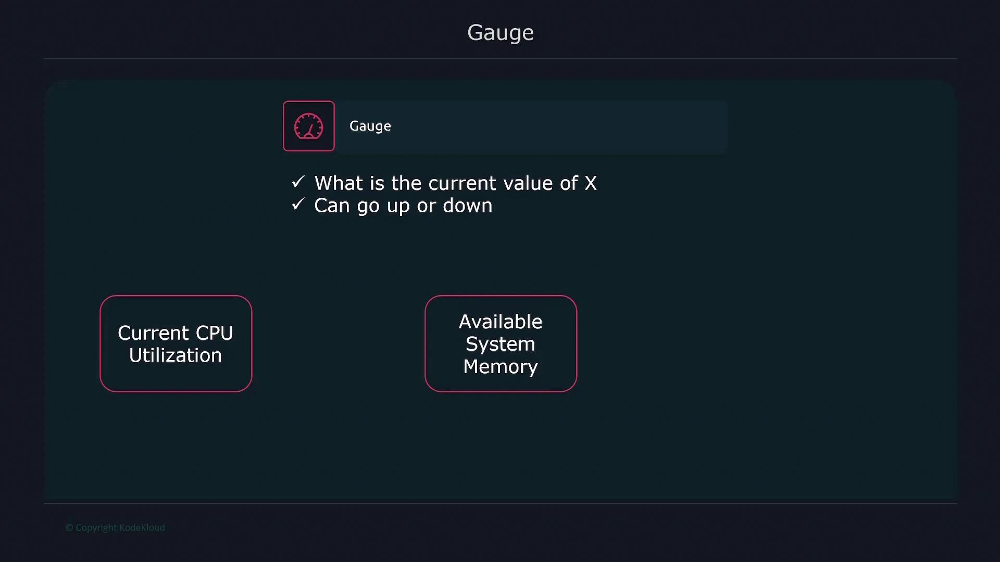
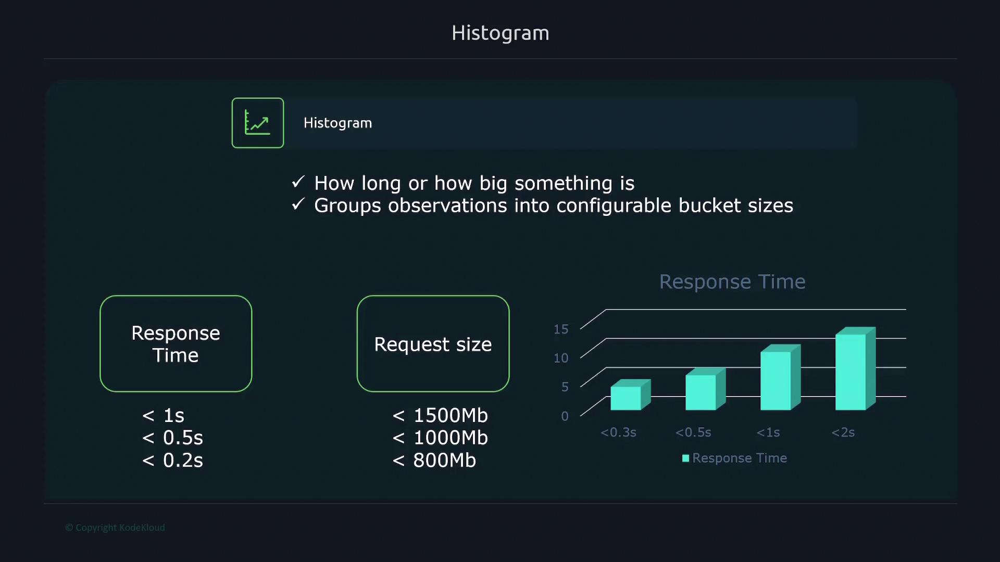
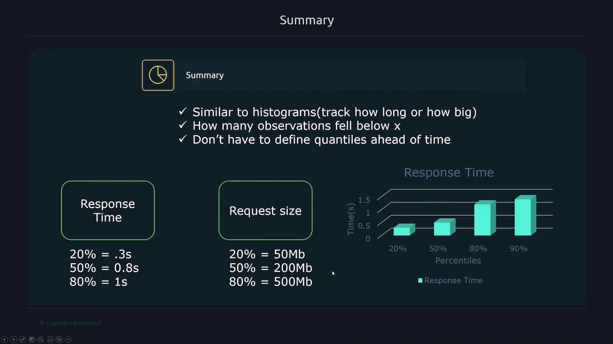
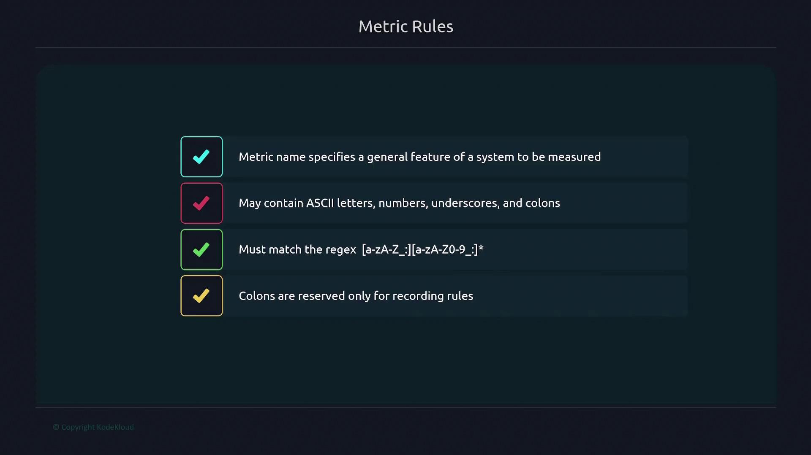
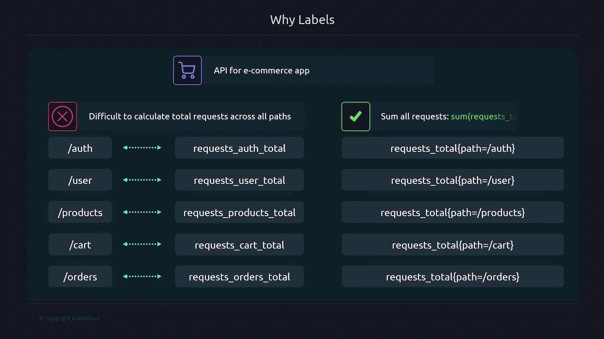
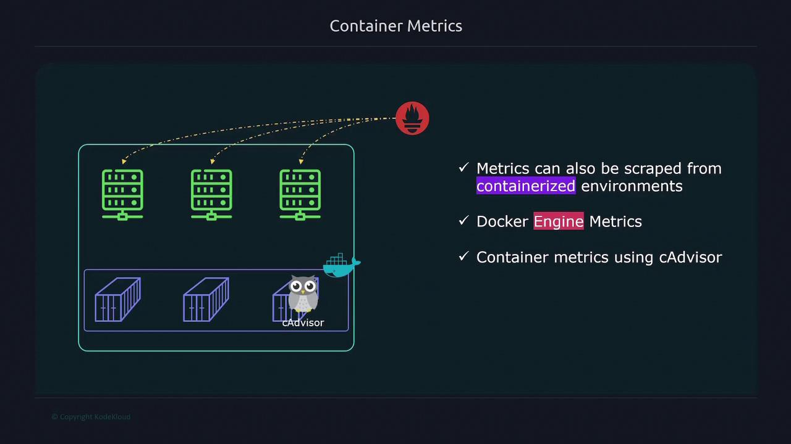
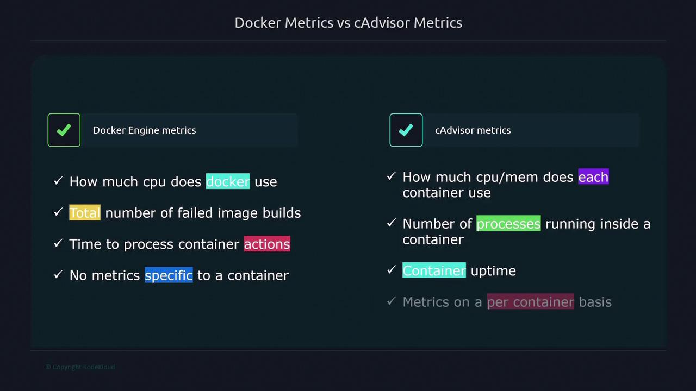

# HELP node_disk_discard_time_seconds_total This is the total number of seconds spent by all discards.
# TYPE node_disk_discard_time_seconds_total counter
node_disk_discard_time_seconds_total{device="sda"} 0
node_disk_discard_time_seconds_total{device="sr0"} 0
```

***

### Metric Types

1. **Counter:**\
   Counters are used to count events with values that only increase. They are typically used for metrics like total requests, error counts, or job executions.

2. **Gauge:**\
   Gauges measure values that can increase or decrease, such as current CPU utilization or memory usage.

<Frame>
  
</Frame>

3. **Histogram:**\
   Histograms record the distribution of values, such as response times or request sizes, by sorting observations into configurable buckets. For example, you might define buckets for requests that take 0.2, 0.5, or 1 second to complete.

<Frame>
  
</Frame>

4. **Summary:**\
   Summaries provide quantile information (such as percentiles) for durations or sizes, offering an alternative method to histograms for understanding data distributions. For instance, a summary might show that 20% of requests completed in under 0.3 seconds, 50% under 0.8 seconds, and 80% under one second.

<Frame>
  
</Frame>

***

## Metric Naming Conventions

Metric names should clearly indicate the system feature being measured. Valid characters include ASCII letters, numbers, underscores, and colons. However, avoid using colons in metric names since they are reserved for recording rules in Prometheus.

<Frame>
  
</Frame>

***

## Labels in Depth

Labels are key-value pairs that add dimensions to your metrics. Instead of creating separate metrics for each variant (for example, different API endpoints), you can use a single metric differentiated by labels.

Consider API request metrics:

* Without labels:
  * `requests_auth_total` for the authentication endpoint.
  * `requests_user_total` for the user endpoint.

This separation complicates aggregating total requests. Instead, using labels provides a more flexible approach:

* With labels:
  * Use a single metric (`requests_total`) with a `path` label, like so:

    ```plaintext theme={null}
    requests_total{path="/auth", method="get"}
    ```

This approach greatly simplifies queries and allows aggregation functions (like `sum`) to combine values across endpoints. Labels can represent multiple dimensions; for instance, adding an HTTP method label (GET, POST, PATCH, DELETE) further refines the data.

Remember, the metric name is internally treated as a label called `__name__`, and other labels prefixed or suffixed with double underscores are reserved for internal use by Prometheus.

Moreover, every metric automatically includes the `instance` and `job` labels. The `instance` label identifies the target (as defined in your configuration), while the `job` label corresponds to the job name specified in your Prometheus configuration file:

```yaml theme={null}
job_name: "node"
scheme: https
basic_auth:
  username: prometheus
  password: password
static_configs:
  - targets:
      - "192.168.1.168:9100"
```

These labels ensure that each metric can be traced back to its source, facilitating effective monitoring and troubleshooting.

<Frame>
  ![The image explains labels as key-value pairs for metrics, allowing criteria-based splitting, multiple labels, and ASCII characters, matching the regex \[a-zA-Z0-9\_\]\*.](https://kodekloud.com/kk-media/image/upload/v1752880540/notes-assets/images/Kubernetes-and-Cloud-Native-Associate-KCNA-Prometheus-Metrics/frame_660.jpg)
</Frame>

<Frame>
  
</Frame>

***

This article has provided a comprehensive overview of Prometheus metrics. You now have a solid foundation in understanding metric structure, timestamp usage during data scraping, the nature of time series, various metric types, naming conventions, and the crucial role that labels play in monitoring. With this knowledge, you are better equipped to model and query your monitoring data effectively in Prometheus.

<CardGroup>
  <Card title="Watch Video" icon="video" href="https://learn.kodekloud.com/user/courses/kubernetes-and-cloud-native-associate-kcna/module/70e17eea-7e9b-4f65-87a4-1cdb5631e0dc/lesson/451d5d9a-c017-4fd3-a1bc-a751727a63fd" />
</CardGroup>


# Prometheus Monitoring Containers

Source: https://notes.kodekloud.com/docs/Kubernetes-and-Cloud-Native-Associate-KCNA/Cloud-Native-Observability/Prometheus-Monitoring-Containers/page

Learn to extend Prometheus monitoring from Linux hosts to containerized environments using cAdvisor for comprehensive system performance insights.

In this lesson, you will learn how to extend Prometheus monitoring from Linux hosts to containerized environments. By collecting metrics from both the Docker engine and individual containers using cAdvisor, you can gain comprehensive insights into your system’s performance.

<Frame>
  
</Frame>

## Enabling Docker Engine Metrics

To collect metrics from your Docker engine, perform the following steps on your Docker host:

1. Open or create the `/etc/docker/daemon.json` file and add the configuration below. This configuration exposes the Docker metrics endpoint and enables experimental features.

   ```json theme={null}
   {
     "metrics-addr": "127.0.0.1:9323",
     "experimental": true
   }
   ```

2. Restart the Docker service to apply the changes:

   ```bash theme={null}
   $ sudo systemctl restart docker
   ```

3. Verify that the Docker metrics endpoint is accessible by running:

   ```bash theme={null}
   $ curl localhost:9323/metrics
   ```

<Callout icon="lightbulb">
  Ensure that the experimental flag is enabled to properly expose Docker engine metrics.
</Callout>

Once you have verified the endpoint, update your Prometheus configuration to scrape Docker engine metrics. For example:

```yaml theme={null}
scrape_configs:
  - job_name: "docker"
    static_configs:
      - targets: ["12.1.13.4:9323"]
```

Replace `12.1.13.4` with the actual IP address of your Docker host.

## Monitoring Container Metrics with cAdvisor

cAdvisor is a powerful tool for collecting container-specific metrics, including CPU usage, memory consumption, process counts, and uptime.

To deploy cAdvisor, follow these steps:

1. Create a Docker Compose file (e.g., `docker-compose.yml`) with the content below. This configuration is based on the official cAdvisor documentation:

   ```yaml theme={null}
   version: '3.4'
   services:
     cadvisor:
       image: gcr.io/cadvisor/cadvisor
       container_name: cadvisor
       privileged: true
       devices:
         - "/dev/kmsg:/dev/kmsg"
       volumes:
         - /:/rootfs:ro
         - /var/run:/var/run:ro
         - /sys:/sys:ro
         - /var/lib/docker:/var/lib/docker:ro
         - /dev/disk:/dev/disk:ro
       ports:
         - 8080:8080
   ```

2. Start the cAdvisor service using Docker Compose:

   ```bash theme={null}
   $ docker-compose up -d
   ```

3. Verify that cAdvisor is collecting metrics by accessing its endpoint:

   ```bash theme={null}
   $ curl localhost:8080/metrics
   ```

After confirming the metrics are available, update your Prometheus configuration to add a new job for scraping cAdvisor metrics:

```yaml theme={null}
scrape_configs:
  - job_name: "cAdvisor"
    static_configs:
      - targets: ["12.1.13.4:8080"]
```

Replace `12.1.13.4` with the IP address where cAdvisor is running.

<Frame>
  
</Frame>

## Docker vs. cAdvisor Metrics

Understanding the difference between Docker engine metrics and cAdvisor metrics is important for effective monitoring:

* **Docker Engine Metrics:**\
  These metrics provide information about the overall Docker engine performance, such as:
  * Overall CPU usage of the Docker engine.
  * Counts of failed image builds.
  * Time taken to process container actions.\
    They are ideal for monitoring the overall health of the Docker engine but do not offer detailed per-container insights.

* **cAdvisor Metrics:**\
  cAdvisor provides granular metrics for each container including:
  * CPU and memory usage.
  * Number of processes running inside a container.
  * Container uptime.\
    Use cAdvisor metrics when you require detailed, container-specific performance data.

<Callout icon="lightbulb">
  Use Docker engine metrics for a holistic view of your host's performance and cAdvisor for in-depth analysis of each container. Adjust your Prometheus configuration accordingly to ensure efficient monitoring.
</Callout>

<CardGroup>
  <Card title="Watch Video" icon="video" href="https://learn.kodekloud.com/user/courses/kubernetes-and-cloud-native-associate-kcna/module/70e17eea-7e9b-4f65-87a4-1cdb5631e0dc/lesson/2318384c-8892-4c7a-869c-ee002e33ed3e" />
</CardGroup>
