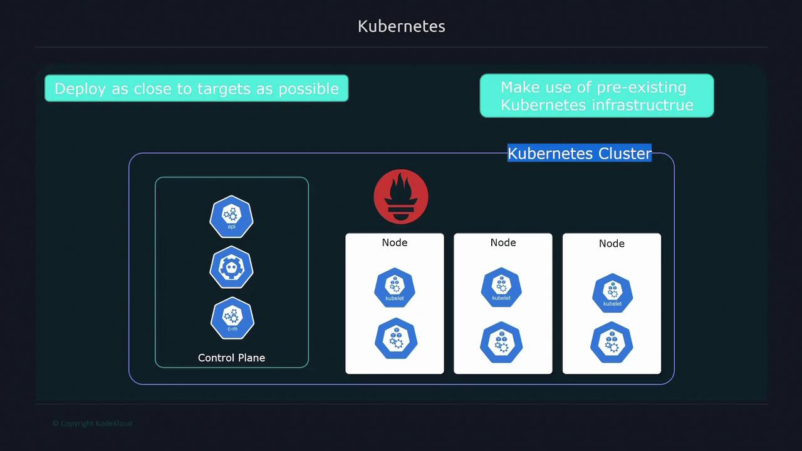
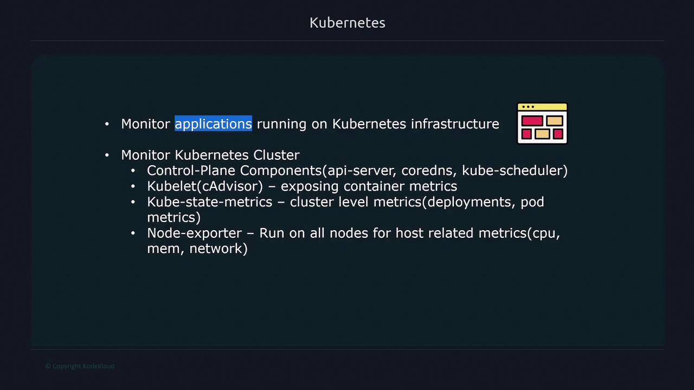
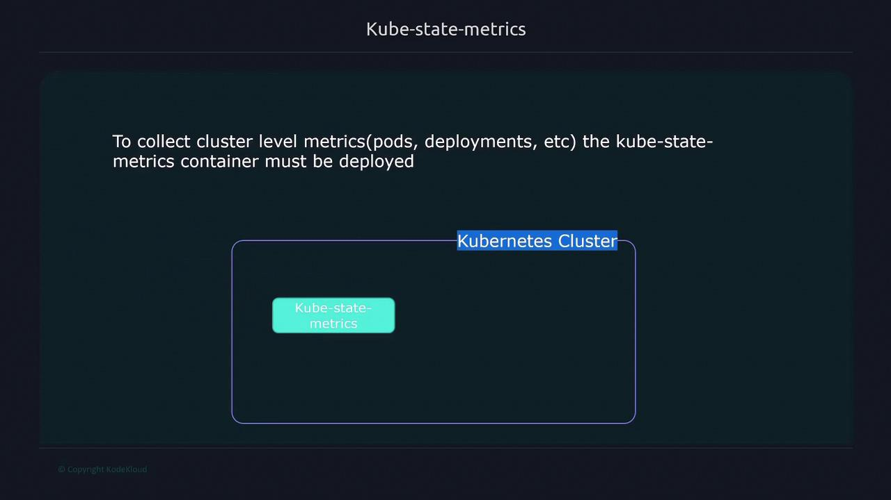
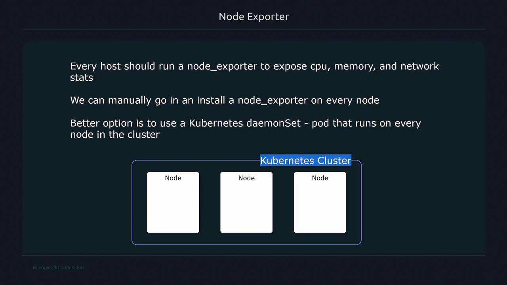
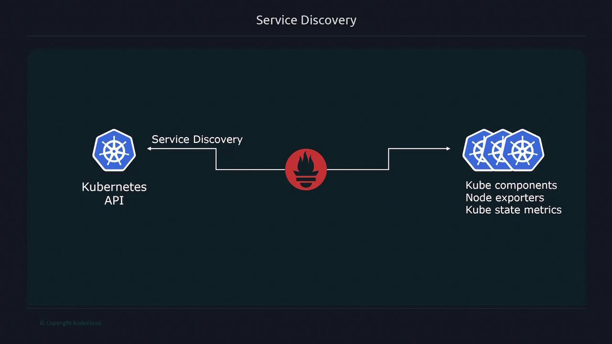
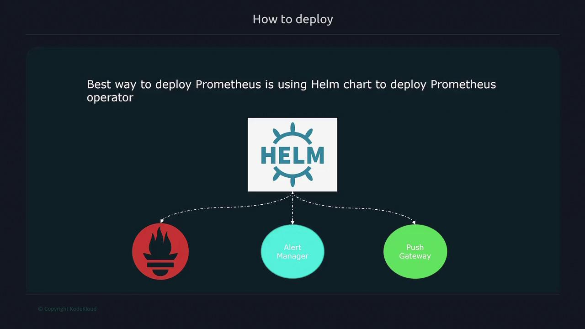
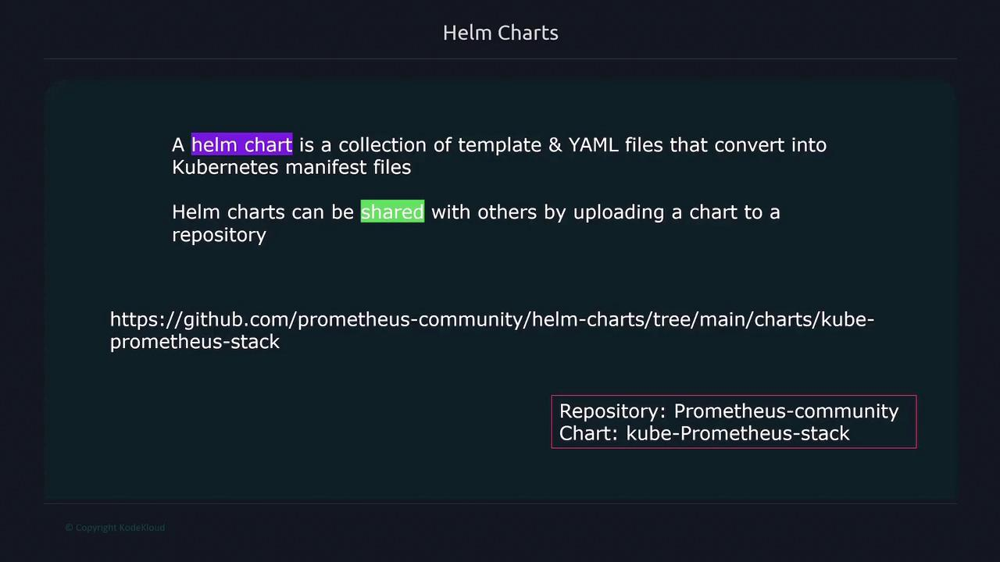
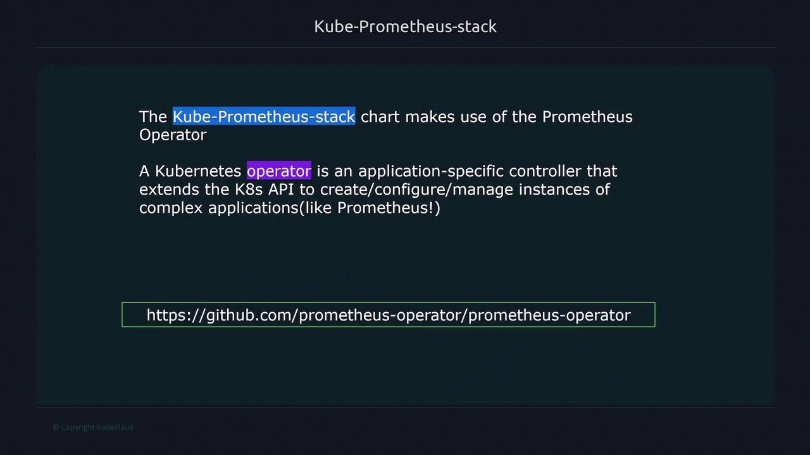

# Prometheus Monitoring Kubernetes

Source: https://notes.kodekloud.com/docs/Kubernetes-and-Cloud-Native-Associate-KCNA/Cloud-Native-Observability/Prometheus-Monitoring-Kubernetes/page

This article explores using Prometheus for monitoring applications and Kubernetes clusters, detailing deployment, monitoring targets, and management with Helm and the Prometheus operator.

In this lesson, we explore how to leverage Prometheus for monitoring both your applications and the Kubernetes cluster itself. By deploying Prometheus directly on the cluster, you can efficiently observe your applications while utilizing Kubernetes’ built-in features to monitor infrastructure components.

<Frame>
  
</Frame>

Deploying Prometheus on Kubernetes offers two main advantages:

* It colocates the monitoring tool near your applications.
* It utilizes the existing Kubernetes infrastructure, eliminating the need for separate servers or virtual machines.

## Monitoring Targets in Kubernetes

There are two primary targets when monitoring Kubernetes with Prometheus:

1. **Applications on the Cluster**: This includes web applications, servers, or any service running on Kubernetes.
2. **Cluster-Level Components**: This covers control plane elements (like the API server, kube scheduler, CoreDNS), the kubelet (which provides container-level metrics similar to cAdvisor), and metrics exposed by the kube-state-metrics container.

Additionally, every node in your cluster (essentially a Linux server) should run a node exporter to expose CPU, memory, and network statistics.

<Frame>
  
</Frame>

<Callout icon="lightbulb">
  Kubernetes does not natively expose cluster-level metrics such as pods, deployments, or services. To gain access to these metrics, you must deploy the kube-state-metrics container.
</Callout>

<Frame>
  
</Frame>

## Using DaemonSets for Node Exporters

Every host in the cluster should run a node exporter to expose essential system statistics such as CPU, memory, and network utilization. The recommended approach is to deploy the node exporter as a Kubernetes DaemonSet. This ensures that:

* Each node runs a node exporter pod.
* The system automatically schedules the node exporter on any new nodes added to the cluster.

<Frame>
  
</Frame>

Kubernetes service discovery further simplifies this process by accessing the Kubernetes API. It automatically identifies all the targets that Prometheus must scrape, including Kubernetes components, node exporters, and kube-state-metrics endpoints.

<Frame>
  
</Frame>

## Deploying Prometheus with Helm

While Prometheus can be installed manually by creating deployments, services, config maps, and secrets, this method can be complex. A more efficient approach is to deploy Prometheus using Helm charts, specifically the Prometheus operator chart, which automates the configuration of all necessary components.

<Frame>
  
</Frame>

Helm, the package manager for Kubernetes, simplifies deployment by bundling all configuration files into a single package known as a Helm chart. With Helm, deploying Prometheus becomes as simple as executing the following command:

```bash theme={null}
helm install
```

Helm charts are collections of templates and YAML files, bundled in a repository for easy sharing—similar to how you share code on GitHub or GitLab. In this case, the Prometheus setup uses the Kube Prometheus Stack from the Prometheus community repository, which includes components such as Alertmanager, Pushgateway, and the Prometheus operator.

<Frame>
  
</Frame>

## The Prometheus Operator

The Prometheus operator is a Kubernetes extension that simplifies managing the Prometheus lifecycle. By extending the Kubernetes API, the operator streamlines tasks such as initialization, configuration, and automated restarts when configurations change. Although it can be run independently, using the operator with Helm streamlines the entire deployment process.

<Frame>
  
</Frame>

With the Prometheus operator, you have access to various custom resources that simplify management. Instead of manually creating standard Kubernetes objects like Deployments or StatefulSets, you define higher-level abstractions such as the Prometheus resource. For example, consider the following custom resource to define a Prometheus instance:

```yaml theme={null}
apiVersion: monitoring.coreos.com/v1
kind: Prometheus
metadata:
  annotations:
    meta.helm.sh/release-name: prometheus
    meta.helm.sh/release-namespace: default
  creationTimestamp: "2022-11-18T01:19:29Z"
  generation: 1
  labels:
    app: kube-prometheus-stack-prometheus
    name: prometheus-kube-prometheus-prometheus
spec:
  alerting:
    alertmanagers:
      - apiVersion: v2
        name: prometheus-kube-prometheus-alertmanager
        namespace: default
        pathPrefix: /
        port: http-web
```

This abstraction allows you to customize the Prometheus deployment using a more simplified API. Similar abstractions exist for Alertmanager, Prometheus rules, and configurations pertaining to alerting. Additionally, resources like ServiceMonitor and PodMonitor let you define which endpoints Prometheus should scrape.

<Callout icon="lightbulb">
  These high-level abstractions not only simplify the management of Prometheus instances but also allow for easier modifications and maintenance of your monitoring setup within a Kubernetes environment.
</Callout>

<CardGroup>
  <Card title="Watch Video" icon="video" href="https://learn.kodekloud.com/user/courses/kubernetes-and-cloud-native-associate-kcna/module/70e17eea-7e9b-4f65-87a4-1cdb5631e0dc/lesson/3d7419b6-4100-4307-9cfa-7111461b21b1" />
</CardGroup>
