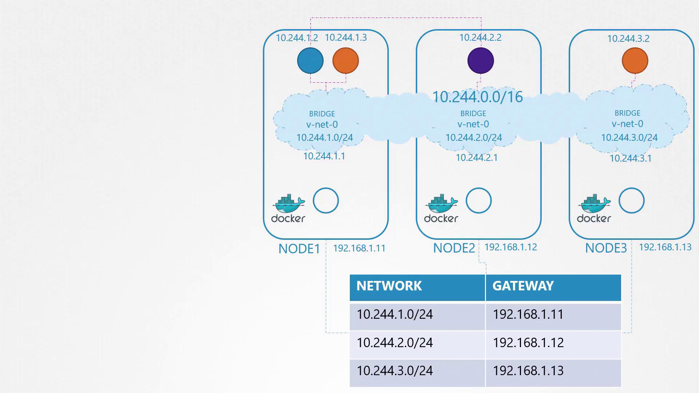
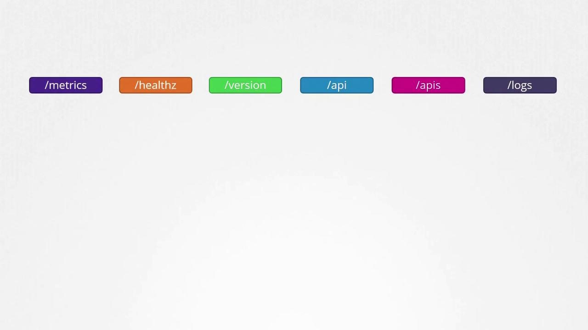
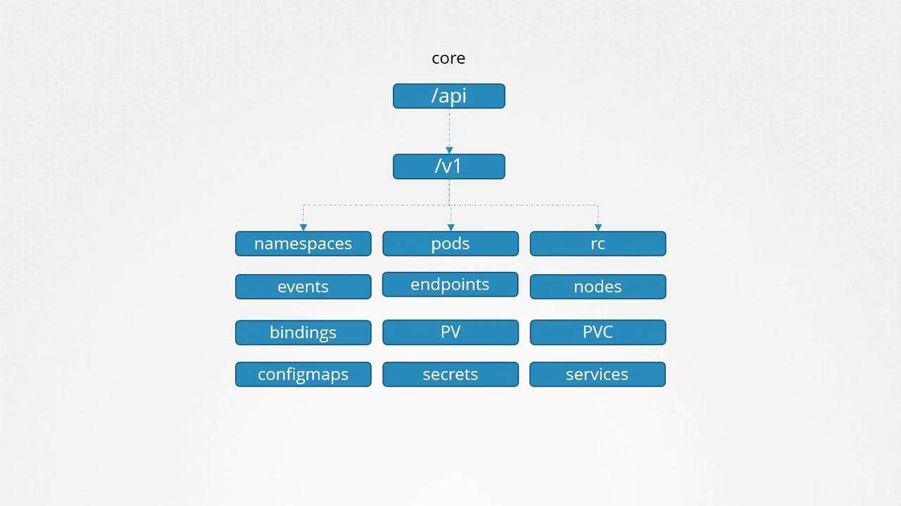
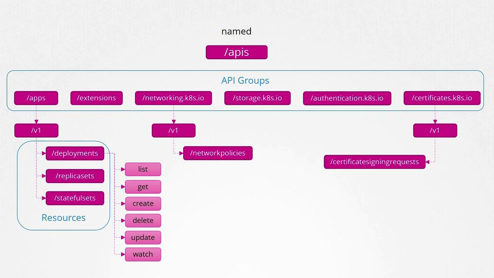
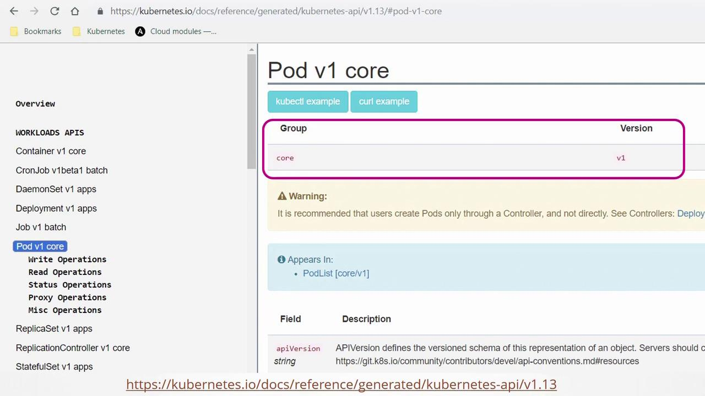
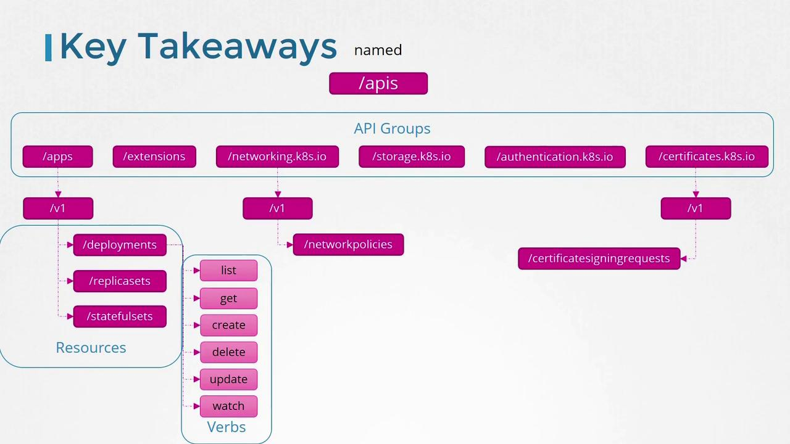

# On node 1
ip addr add 10.244.1.1/24 dev v-net-0

# On node 2
ip addr add 10.244.2.1/24 dev v-net-0

# On node 3
ip addr add 10.244.3.1/24 dev v-net-0
```

Each container requires additional network configuration. A script that runs the following commands can automate the process for every new container:

1. Create a virtual Ethernet pair (veth pair) connecting the container’s network namespace with the node’s bridge.
2. Configure an IP address within the container and set up a default gateway.

For example, assume the free IP address 10.244.1.2 is allocated to a container:

```bash theme={null}
# Create veth pair
ip link add <veth_container> type veth peer name <veth_bridge>

# Attach veth pair to the appropriate network namespace and bridge
ip link set <veth_container> netns <namespace>
ip link set <veth_bridge> master v-net-0

# Assign IP address and configure routing inside the container’s namespace
ip -n <namespace> addr add 10.244.1.2/24 dev <veth_container>
ip -n <namespace> route add default via 10.244.1.1

# Bring up the interface in the namespace
ip -n <namespace> link set <veth_container> up
```

These commands configure a single container. To scale your Kubernetes deployment, replicate and automate this script across nodes.

## Enabling Inter-Node Communication

After establishing unique IP addresses for each pod on every node, the next challenge is to enable cross-node communication. Consider a scenario where a pod at 10.244.1.2 on node 1 needs to communicate with a pod at 10.244.2.2 on node 2. Without an appropriate route, node 1 wouldn’t know how to reach the pod on node 2.

To resolve this issue, add a route in node 1’s routing table that directs traffic for the 10.244.2.0/24 subnet via node 2’s external IP address (192.168.1.12):

```bash theme={null}
# On node 1
ip route add 10.244.2.2 via 192.168.1.12
```

After configuring this route, pods on node 1 can communicate with those on node 2. Similar routes should be configured on all nodes to ensure seamless inter-node connectivity.

<Callout icon="triangle-alert">
  Manually configuring routes on each node may suffice for small setups, but as your infrastructure grows, consider using a centralized router or dynamic routing protocols to manage these routes efficiently.
</Callout>

For more complex networks, a centralized router can simplify the management of the aggregated subnet (e.g., combining 10.244.1.0/24, 10.244.2.0/24, and 10.244.3.0/24 into a single 10.244.0.0/16 network).

<Frame>
  
</Frame>

## Automating Networking with CNI

Manually configuring bridge networks and routing for every container is impractical in large environments where thousands of pods could be created per minute. The Container Network Interface (CNI) automates these tasks by executing networking scripts as pods are initiated.

The container runtime on each node reads a CNI configuration that specifies the networking script. Upon pod creation, the runtime invokes the script with the "add" command, passing the necessary container details (such as container name and namespace). The script then sets up the pod’s networking. Here is a simplified example of such a script:

```bash theme={null}
# Create a virtual Ethernet pair
ip link add <veth_container> type veth peer name <veth_bridge>

# Attach veth pair to the designated namespace and bridge
ip link set <veth_container> netns <namespace>
ip link set <veth_bridge> master v-net-0

# Assign an IP address and configure default routing in the container's namespace
ip -n <namespace> addr add <container_ip>/24 dev <veth_container>
ip -n <namespace> route add default via <bridge_ip>

# Bring up the interface in the container's namespace
ip -n <namespace> link set <veth_container> up
```

To maintain consistency with CNI standards, the script must also support a delete operation to clean up the container’s network interfaces and free the assigned IP address when the pod is terminated:

```bash theme={null}
ip -n <namespace> link set <veth_container> down
ip link del <veth_bridge>
```

The container runtime executes the script as follows when a container is created:

```bash theme={null}
./net-script.sh add <container> <namespace>
```

And when a container is deleted:

```bash theme={null}
./net-script.sh del <container> <namespace>
```

## Conclusion

In this guide, we explored the fundamental principles of pod networking in Kubernetes. We explained how each pod receives a unique IP address and established connectivity by configuring bridge networks on nodes and setting up inter-node routing. We also introduced the Container Network Interface (CNI), which automates these processes in dynamic environments.

In upcoming articles, we will examine additional networking solutions and provide deeper insights into IP address management and network troubleshooting within Kubernetes clusters.

Happy networking!

<CardGroup>
  <Card title="Watch Video" icon="video" href="https://learn.kodekloud.com/user/courses/kubernetes-and-cloud-native-associate-kcna/module/35623c9b-b30e-4a5d-a868-cc9f30de96d2/lesson/5fc02d13-2254-43f5-a8d3-ed559ff74fca" />
</CardGroup>


# API Groups

Source: https://notes.kodekloud.com/docs/Kubernetes-and-Cloud-Native-Associate-KCNA/Container-Orchestration-Security/API-Groups/page

This article explains the organization of Kubernetes API groups and their role in cluster interactions and resource management.

Before diving into Kubernetes authorization, it is essential to understand how API groups are organized. The Kubernetes API forms the backbone of all cluster interactions. Whether you are using the kubectl utility or directly accessing the API via REST, every operation communicates with the Kubernetes API server.

For example, to check the cluster version, you can send a request to the master node on the default port 6443 using:

```bash theme={null}
curl https://kube-master:6443/version
```

The response will include version details similar to the example below:

```bash theme={null}
{
  "major": "1",
  "minor": "13",
  "gitVersion": "v1.13.0",
  "gitCommit": "ddf47ac13c1a9483ea035a79cd7c10005ff21a6d",
  "gitTreeState": "clean",
  "buildDate": "2018-12-03T20:56:12Z",
  "goVersion": "go1.11.2",
  "compiler": "gc",
  "platform": "linux/amd64"
}
```

Similarly, to retrieve a list of pods, you can access:

```bash theme={null}
curl https://kube-master:6443/api/v1/pods
```

This command returns a JSON response containing pod details. For example:

```bash theme={null}
{
  "kind": "PodList",
  "apiVersion": "v1",
  "metadata": {
    "selfLink": "/api/v1/pods",
    "resourceVersion": "153068"
  },
  "items": [
    {
      "metadata": {
        "name": "nginx-5c7588df-ghsbd",
        "generateName": "nginx-5c7588df-",
        "namespace": "default",
        "creationTimestamp": "2019-03-20T10:57:48Z",
        "labels": {
          "app": "nginx",
          "pod-template-hash": "5c7588df"
        },
        "ownerReferences": [
          {
            "apiVersion": "apps/v1",
            "kind": "ReplicaSet",
            "name": "nginx-5c7588df",
            "uid": "398ec179-4af9-11e9-beb6-020d3114c7a7",
            "controller": true,
            "blockOwnerDeletion": true
          }
        ]
      }
    }
  ]
}
```

Kubernetes organizes its API into multiple groups based on functionality. There are separate groups for metrics, health, version, logging, and more. The diagram below illustrates several of these endpoints:

<Frame>
  
</Frame>

The version API provides essential cluster version details, while the metrics and health APIs are used for monitoring cluster health. Additionally, the logs API integrates with third-party logging systems.

In this lesson, our focus is on the APIs that drive core cluster functionality, divided into two major categories:

1. **Core API Group**\
   This group includes essential resources such as:
   * Namespaces
   * Pods
   * Replication Controllers
   * Events
   * Endpoints
   * Nodes
   * Bindings
   * Persistent Volumes
   * Persistent Volume Claims
   * Config Maps
   * Secrets
   * Services

2. **Named API Groups**\
   These groups organize newer features and resources, such as:
   * Apps (for Deployments, ReplicaSets, StatefulSets)
   * Extensions
   * Networking (for Network Policies)
   * Storage
   * Authentication
   * Authorization
   * And others (including certificate signing requests)

Below is a hierarchical view of core Kubernetes API resources, including namespaces, pods, nodes, and services:

<Frame>
  
</Frame>

Within the named API groups, resources are further organized by category. For example, the "apps" group contains deployments, replica sets, and stateful sets. Similarly, the "networking" group includes network policies, and additional groups manage certificate signing requests and other resources.

Each Kubernetes resource supports a set of operations, known as verbs, which include actions such as listing, retrieving, creating, deleting, updating, and watching resources. The diagram below provides an overview of Kubernetes API groups, resources, and available actions:

<Frame>
  
</Frame>

For detailed information about each API group and resource, refer to the [Kubernetes API reference page](https://kubernetes.io/docs/reference/). Selecting an object on this page provides group-specific details. For example, the "Pod v1 core" documentation highlights that core APIs are part of the v1 group:

<Frame>
  
</Frame>

You can also view API group information directly from your Kubernetes cluster. Simply accessing the API server at port 6443 without specifying a path will list all available API groups. For instance, running the command:

```bash theme={null}
curl http://localhost:6443 -k
```

might return:

```bash theme={null}
{
  "paths": [
    "/api",
    "/api/v1",
    "/apis/",
    "/apis/",
    "/healthz",
    "/logs",
    "/metrics",
    "/openapi/v2",
    "/swagger-2.0.0.json"
  ]
}
```

To filter the output for named API groups, you can use:

```bash theme={null}
curl http://localhost:6443/apis -k | grep "name"
```

This command could output entries such as:

* "extensions"
* "apps"
* "events.k8s.io"
* "authentication.k8s.io"
* "authorization.k8s.io"
* "autoscaling"
* "batch"
* "certificates.k8s.io"
* "networking.k8s.io"
* "policy"
* "rbac.authorization.k8s.io"
* "storage.k8s.io"
* "admissionregistration.k8s.io"
* "apiregistration.k8s.io"
* "scheduling.k8s.io"

<Callout icon="triangle-alert">
  If you attempt to access the API directly using curl without proper authentication, you will receive a forbidden error message. For instance:

  ```bash theme={null}
  curl http://localhost:6443 -k
  ```

  returns:

  ```bash theme={null}
  {
    "kind": "Status",
    "apiVersion": "v1",
    "metadata": {},
    "status": "Failure",
    "message": "Forbidden: User \"system:anonymous\" cannot get path \"/\"",
    "reason": "Forbidden",
    "details": {},
    "code": 403
  }
  ```
</Callout>

To authenticate, you can pass certificate files via the command line, or alternatively, use the kubectl proxy.

The `kubectl proxy` command launches a local HTTP proxy on port 8001 that uses the credentials and certificates from your kubeconfig file. This approach avoids the need to manually specify authentication parameters with curl. Once the proxy is running, you can access the API server by executing:

```bash theme={null}
kubectl proxy
```

The output will indicate the proxy is running:

```bash theme={null}
Starting to serve on 127.0.0.1:8001
```

Then, accessing the API proxy with:

```bash theme={null}
curl http://localhost:8001 -k
```

will return:

```bash theme={null}
{
  "paths": [
    "/api/",
    "/api/v1",
    "/apis/",
    "/healthz",
    "/logs",
    "/metrics",
    "/openapi/v2",
    "/swagger-2.0.0.json"
  ]
}
```

<Callout icon="lightbulb">
  Remember that kube-proxy and kubectl proxy are distinct components. The kube-proxy facilitates network communication between pods and services across cluster nodes, whereas the kubectl proxy is an HTTP proxy that forwards your requests to the Kubernetes API server using your kubeconfig credentials.
</Callout>

In summary, Kubernetes organizes its resources into different API groups:

* **Core API Group:** Contains fundamental resources such as namespaces, pods, nodes, and services.
* **Named API Groups:** Organize additional and newer functionalities such as deployments, networking, storage, and more.

Each resource within these groups supports a set of verbs (list, get, create, delete, update, watch) defining the operations you can perform.

The diagram below outlines the overall structure and hierarchy of Kubernetes API groups, resources, and verbs:

<Frame>
  
</Frame>

This concludes our discussion on Kubernetes API groups. In the next lesson, we will continue exploring further aspects of cluster operations.

<CardGroup>
  <Card title="Watch Video" icon="video" href="https://learn.kodekloud.com/user/courses/kubernetes-and-cloud-native-associate-kcna/module/9cdabd48-a7e9-400d-b6b7-e8f2c2f7ee5f/lesson/1ada86c5-650a-45d0-878f-7c115816d42b" />
</CardGroup>
