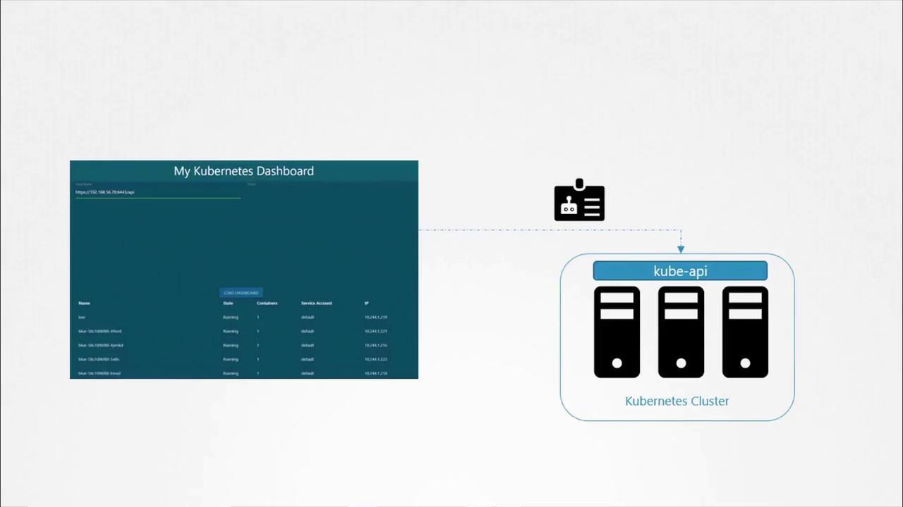

# Service Accounts

Source: https://notes.kodekloud.com/docs/Kubernetes-and-Cloud-Native-Associate-KCNA/Container-Orchestration-Security/Service-Accounts/page

This article provides a comprehensive guide on Kubernetes service accounts, their security roles, management, and token handling.

Welcome to this comprehensive guide on Kubernetes service accounts. In this article, we will explore how service accounts work in Kubernetes, their role in security, and how to manage tokens. This guide is especially useful for exam preparation and practical usage. For more advanced security concepts, refer to the [CKA Certification Course - Certified Kubernetes Administrator](https://learn.kodekloud.com/user/courses/cka-certification-course-certified-kubernetes-administrator).

Kubernetes supports two main account types:

* **User Account:** Used by humans, such as administrators and developers.
* **Service Account:** Intended for machine-to-machine interactions; for example, monitoring tools like Prometheus or build tools like Jenkins use service accounts to interact with the Kubernetes API.

## Example Scenario: Python Kubernetes Dashboard

Imagine you have developed a simple Python dashboard application that retrieves a list of pods from your Kubernetes cluster and displays them on a web page. In order for your application to query the Kubernetes API securely, it must authenticate using a service account.

To create a service account named `dashboard-sa`, run the following command. This command not only creates the account but also automatically generates a token for API authentication:

<Frame>
  
</Frame>

```bash theme={null}
kubectl create serviceaccount dashboard-sa
