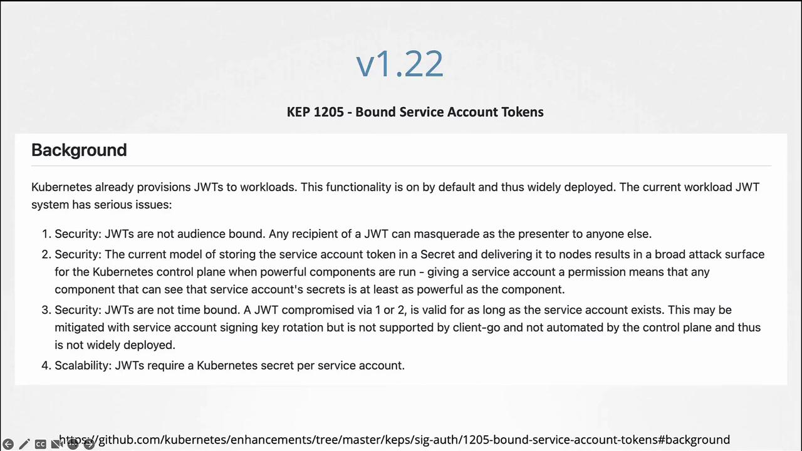
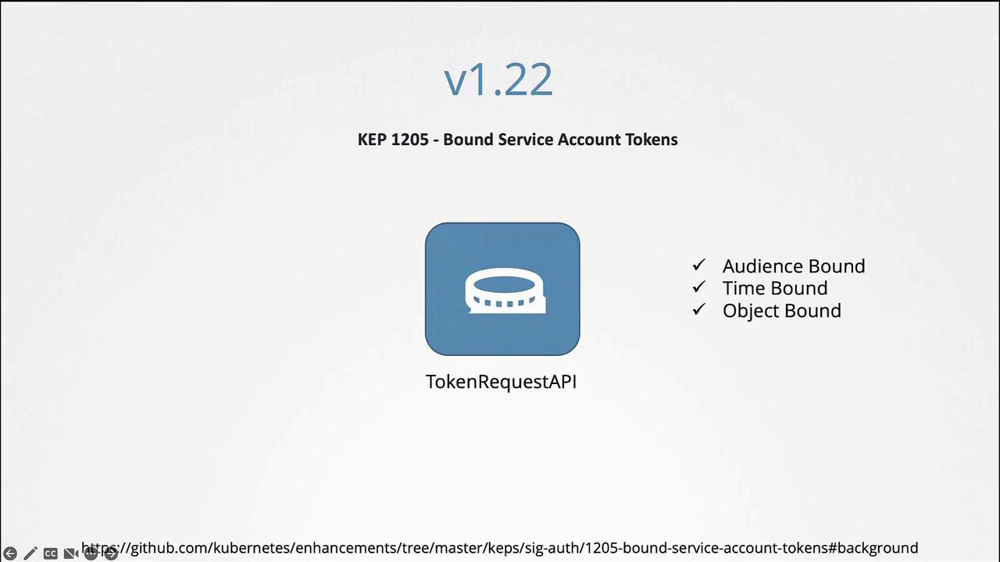
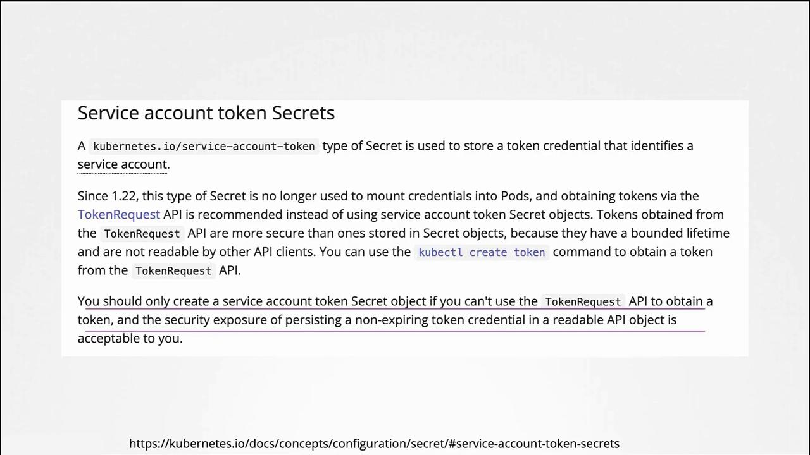
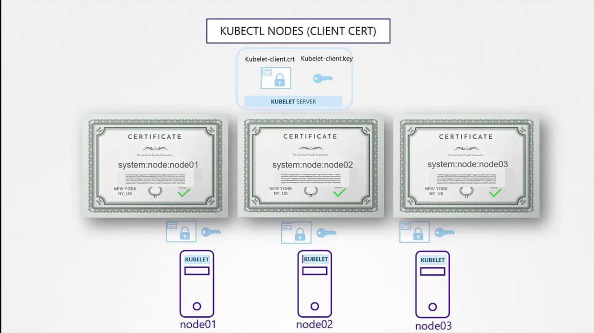
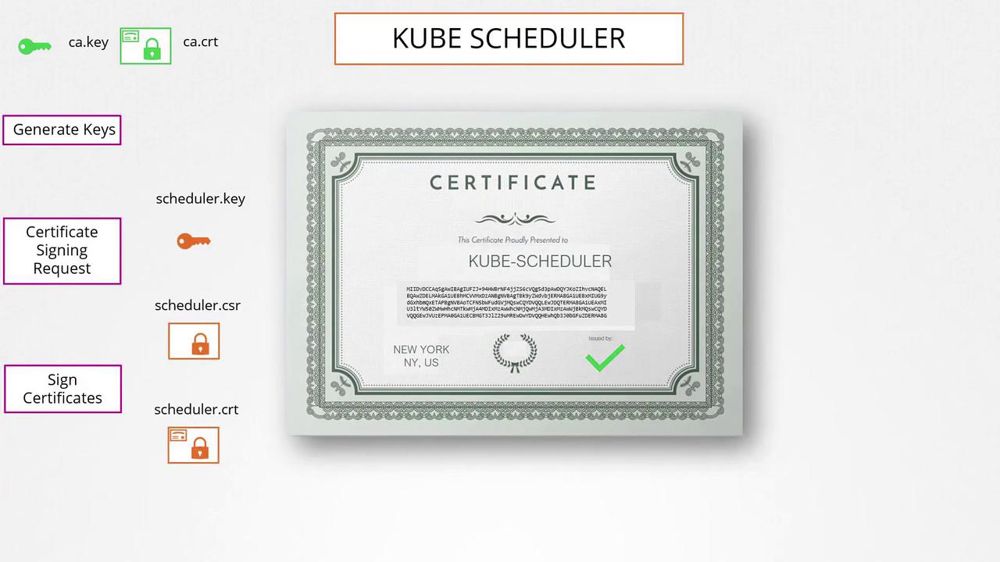
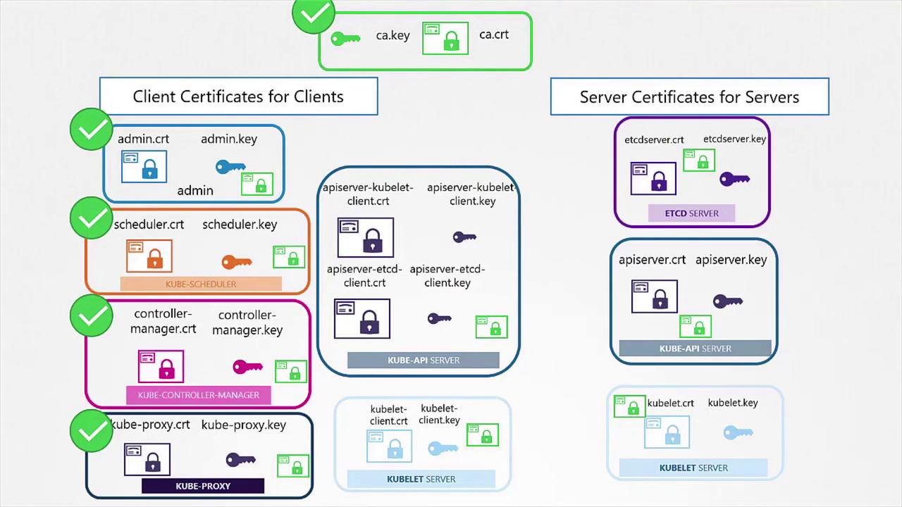

# Expected output:
# serviceaccount "dashboard-sa" created
```

You can verify the newly created service account with:

```bash theme={null}
kubectl get serviceaccounts
```

Example output:

```plaintext theme={null}
NAME            SECRETS   AGE
default         1         218d
dashboard-sa    1         4d
```

Describing the service account confirms that a token has been automatically created and stored in a secret object:

```bash theme={null}
kubectl describe serviceaccount dashboard-sa
```

Example output:

```plaintext theme={null}
Name:                dashboard-sa
Namespace:           default
Labels:              <none>
Annotations:         <none>
Image pull secrets:  <none>
Mountable secrets:   dashboard-sa-token-kbbdm
Tokens:              dashboard-sa-token-kbbdm
Events:              <none>
```

To inspect the token details, view the secret:

```bash theme={null}
kubectl describe secret dashboard-sa-token-kbbdm
```

This token is then used as a bearer token for authentication when making REST calls. For example, using curl:

```bash theme={null}
curl https://192.168.56.70:6443/api --insecure --header "Authorization: Bearer eyJhbG..."
```

## Automatic Token Mounting in Pods

When your application (such as a custom dashboard or Prometheus) is hosted on the Kubernetes cluster, the service account token can be automatically mounted into the pod as a volume. This removes the need to manually manage the token. Every namespace includes a default service account that is automatically used if no other account is specified.

Consider the following simple pod definition that uses your custom Kubernetes dashboard image. Although the pod specification does not explicitly mount the token, Kubernetes automatically mounts the default service account token:

```bash theme={null}
kubectl get serviceaccount
```

Output:

```plaintext theme={null}
NAME          SECRETS   AGE
default       1         218d
dashboard-sa  1         4d
```

Pod definition:

```yaml theme={null}
apiVersion: v1
kind: Pod
metadata:
  name: my-kubernetes-dashboard
spec:
  containers:
    - name: my-kubernetes-dashboard
      image: my-kubernetes-dashboard
```

When you create the pod and inspect it using:

```bash theme={null}
kubectl describe pod my-kubernetes-dashboard
```

You will see a volume automatically created from the secret named `default-token-*`. For example:

```plaintext theme={null}
Name:               my-kubernetes-dashboard
Namespace:          default
Status:             Running
IP:                 10.244.0.15
Containers:
  nginx:
    Image:          my-kubernetes-dashboard
Mounts:
  /var/run/secrets/kubernetes.io/serviceaccount from default-token-j4hkx (ro)
Volumes:
  default-token-j4hkx:
    Type:        Secret (a volume populated by a Secret)
    SecretName:  default-token-j4hkx
    Optional:    false
```

Inside the pod, you can list the contents of the service account directory to verify the token file:

```bash theme={null}
kubectl exec -it my-kubernetes-dashboard -- ls /var/run/secrets/kubernetes.io/serviceaccount
```

Expected output:

```plaintext theme={null}
ca.crt  namespace  token
```

To view the token:

```bash theme={null}
kubectl exec -it my-kubernetes-dashboard -- cat /var/run/secrets/kubernetes.io/serviceaccount/token
```

The default service account is designed with restricted permissions for basic API queries. To use the custom service account (`dashboard-sa`), modify the pod specification to include the `serviceAccountName` field. Note that you cannot change the service account for an existing pod; it must be deleted and recreated. In deployments, updating the pod definition will trigger a new rollout.

Example pod definition using the `dashboard-sa` service account:

```yaml theme={null}
apiVersion: v1
kind: Pod
metadata:
  name: my-kubernetes-dashboard
spec:
  containers:
    - name: my-kubernetes-dashboard
      image: my-kubernetes-dashboard
  serviceAccountName: dashboard-sa
```

After recreating the pod, verify that the new service account is in use:

```bash theme={null}
kubectl describe pod my-kubernetes-dashboard
```

You should see the volume associated with `dashboard-sa-token-[...]`.

If you wish to disable automatic mounting of the service account token, set `automountServiceAccountToken` to false in your pod specification:

```yaml theme={null}
apiVersion: v1
kind: Pod
metadata:
  name: my-kubernetes-dashboard
spec:
  containers:
    - name: my-kubernetes-dashboard
      image: my-kubernetes-dashboard
  automountServiceAccountToken: false
```

<Callout icon="lightbulb">
  Once a pod is created, you cannot change its service account. To apply changes, delete and recreate the pod or update the deployment to trigger a rollout.
</Callout>

***

## Evolving Token Management in Kubernetes: Releases 1.22 and 1.24

### Prior to Kubernetes 1.22

Before Kubernetes 1.22, every service account was automatically associated with a secret that contained a non-expiring token. This token was mounted into pods at `/var/run/secrets/kubernetes.io/serviceaccount`. For example:

```bash theme={null}
kubectl get serviceaccount
```

```plaintext theme={null}
NAME      SECRETS   AGE
default   1         218d
```

Inspecting a pod shows the static token being used:

```bash theme={null}
kubectl describe pod my-kubernetes-dashboard
```

```plaintext theme={null}
Name:           my-kubernetes-dashboard
Namespace:      default
Status:         Running
IP:             10.244.0.15
Containers:
  nginx:
    Image:      my-kubernetes-dashboard
Mounts:
  /var/run/secrets/kubernetes.io/serviceaccount from default-token-j4hkv (ro)
Volumes:
  default-token-j4hkv:
    Type:        Secret (a volume populated by a Secret)
    SecretName:  default-token-j4hkv
    Optional:    false
```

These tokens, being static and non-expiring, posed scalability and security challenges.

### Kubernetes 1.22 – Introduction of the Token Request API

In Kubernetes 1.22, the Token Request API was introduced (KEP 1205). This API generates service account tokens that are audience bound, time bound, and object bound, making them more secure. With this change, a pod created in Kubernetes mounts a token generated by the Token Request API as a projected volume.

Example pod specification using a projected volume token:

```yaml theme={null}
apiVersion: v1
kind: Pod
metadata:
  name: nginx
  namespace: default
spec:
  containers:
    - image: nginx
      name: nginx
      volumeMounts:
        - mountPath: /var/run/secrets/kubernetes.io/serviceaccount
          name: kube-api-access-6mtg8
          readOnly: true
  volumes:
    - name: kube-api-access-6mtg8
      projected:
        defaultMode: 420
        sources:
          - serviceAccountToken:
              expirationSeconds: 3607
              path: token
          - configMap:
              name: kube-root-ca.crt
              items:
                - key: ca.crt
                  path: ca.crt
          - downwardAPI:
              items:
                - fieldRef:
                    apiVersion: v1
                    fieldPath: metadata.annotations
```

### Kubernetes 1.24 – Reducing Secret-Based Tokens

With Kubernetes 1.24, further improvements (KEP 2799) were made to reduce reliance on secret-based service account tokens. In this version, a service account no longer automatically creates a non-expiring secret token. To generate a token for a service account, run:

```bash theme={null}
kubectl create token dashboard-sa
```

This command produces a token with an expiry (typically one hour). You can decode the token using tools like jwt.io or with commands such as:

```bash theme={null}
jq -R 'split(".") | select(length > 0) | .[0],.[1] | @base64d | fromjson' <<< <token>
```

If you prefer the older non-expiring token method, you can manually create a secret object by specifying the type as `kubernetes.io/service-account-token` and annotating it with the service account name:

```yaml theme={null}
apiVersion: v1
kind: Secret
type: kubernetes.io/service-account-token
metadata:
  name: mysecretname
  annotations:
    kubernetes.io/service-account.name: dashboard-sa
```

Ensure the service account exists before creating the secret. According to Kubernetes documentation, the Token Request API is the recommended approach due to its improved security features.

<Frame>
  
</Frame>

<Frame>
  
</Frame>

To summarize the commands in Kubernetes 1.24:

```bash theme={null}
kubectl create serviceaccount dashboard-sa
# Expected output:
kubectl create token dashboard-sa
# Expected output: <token string with expiry information>
```

Decoding this token (for example, on [jwt.io](https://jwt.io/)) will reveal the expiry date in the payload.

If you still need non-expiring tokens via secret objects, you can create them manually:

```yaml theme={null}
apiVersion: v1
kind: Secret
type: kubernetes.io/service-account-token
metadata:
  name: mysecretname
  annotations:
    kubernetes.io/service-account.name: dashboard-sa
```

<Callout icon="triangle-alert">
  Avoid using non-expiring tokens unless absolutely necessary. The Token Request API provides a more secure, time-bound alternative.
</Callout>

<Frame>
  
</Frame>

This concludes our discussion on Kubernetes service accounts and the evolution of their token management. By understanding these concepts, you can better secure your cluster and manage authentication effectively.

<CardGroup>
  <Card title="Watch Video" icon="video" href="https://learn.kodekloud.com/user/courses/kubernetes-and-cloud-native-associate-kcna/module/9cdabd48-a7e9-400d-b6b7-e8f2c2f7ee5f/lesson/0d97d59b-1676-4c8a-9ec9-84f0a3474ea8" />
</CardGroup>


# TLS in Kubernetes Certificate Creation

Source: https://notes.kodekloud.com/docs/Kubernetes-and-Cloud-Native-Associate-KCNA/Container-Orchestration-Security/TLS-in-Kubernetes-Certificate-Creation/page

This guide demonstrates generating certificates for a Kubernetes cluster using OpenSSL, focusing on simplicity and ease of use.

This guide demonstrates how to generate certificates for a Kubernetes cluster using OpenSSL. While various tools such as EasyRSA and CFSSL can perform these tasks, our focus here is on OpenSSL for its simplicity and ease of use.

## Creating the CA Certificate

First, create the Certificate Authority (CA) that will sign all other certificates. Follow these steps:

1. Generate the private key for the CA:

   ```bash theme={null}
   openssl genrsa -out ca.key 2048
   ```

2. Create a certificate signing request (CSR) using the generated key. In this example, the common name (CN) is set to "KUBERNETES-CA":

   ```bash theme={null}
   openssl req -new -key ca.key -subj "/CN=KUBERNETES-CA" -out ca.csr
   ```

3. Sign the CSR with the CA’s private key to create the CA certificate:

   ```bash theme={null}
   openssl x509 -req -in ca.csr -signkey ca.key -out ca.crt
   ```

After these steps, the CA is ready with its private key and root certificate (ca.crt), which will be used to sign all other certificates in the cluster.

## Generating Client Certificates

### Admin User Certificate

To set up a certificate for the admin user:

1. Generate a private key:

   ```bash theme={null}
   openssl genrsa -out admin.key 2048
   ```

2. Create a CSR for the admin user. Although the common name (CN) is "kube-admin", you can choose a different name as needed:

   ```bash theme={null}
   openssl req -new -key admin.key -subj "/CN=kube-admin" -out admin.csr
   ```

3. Sign the admin CSR using the CA’s certificate and key:

   ```bash theme={null}
   openssl x509 -req -in admin.csr -CA ca.crt -CAkey ca.key -out admin.crt
   ```

This certificate allows the admin user to authenticate with the Kubernetes API Server. For enhanced security and administrative privileges, include group details by specifying an Organizational Unit (OU) parameter. For example:

```bash theme={null}
openssl req -new -key admin.key -subj "/CN=kube-admin/O=system:masters" -out admin.csr
openssl x509 -req -in admin.csr -CA ca.crt -CAkey ca.key -out admin.crt
```

### Other Client Certificates

The same procedure applies to other components within Kubernetes (e.g., Kube Scheduler, Controller Manager, and Kube Proxy). These system components typically have names prefixed with "system-" and follow the same signing process using the CA credentials.

## Using Certificates for Cluster Communication

Once you generate the certificates, you can use them in multiple ways. To make a REST API call to the Kubernetes API Server with the admin certificate, you can run:

```bash theme={null}
curl https://kube-apiserver:6443/api/v1/pods \
  --key admin.key --cert admin.crt \
  --cacert ca.crt
```

Alternatively, consolidate these parameters into a kubeconfig file that specifies the API server endpoint and certificate details:

```yaml theme={null}
apiVersion: v1
clusters:
- cluster:
    certificate-authority: ca.crt
    server: https://kube-apiserver:6443
  name: kubernetes
kind: Config
users:
- name: kubernetes-admin
  user:
    client-certificate: admin.crt
    client-key: admin.key
```

## Generating Server-Side Certificates

For mutual TLS authentication in Kubernetes, both the client and the server require a copy of the CA’s public certificate. This certificate is essential for verifying the authenticity of certificates presented by clients and servers.

### etcd Server Certificate

To secure the etcd server, generate a certificate (e.g., "etcd-server") and, if using a cluster, also generate peer certificates. These generated certificates are then referenced in the etcd server startup options. For example:

```yaml theme={null}
- etcd
  - --advertise-client-urls=https://127.0.0.1:2379
  - --key-file=/path-to-certs/etcdserver.key
  - --cert-file=/path-to-certs/etcdserver.crt
  - --client-cert-auth=true
  - --data-dir=/var/lib/etcd
  - --initial-advertise-peer-urls=https://127.0.0.1:2380
  - --initial-cluster=master=https://127.0.0.1:2380
  - --listen-client-urls=https://127.0.0.1:2379
  - --listen-peer-urls=https://127.0.0.1:2380
  - --name=master
  - --peer-cert-file=/path-to-certs/etcdpeer1.crt
  - --peer-client-cert-auth=true
  - --peer-key-file=/etc/kubernetes/pki/etcd/peer.key
  - --peer-trusted-ca-file=/etc/kubernetes/pki/etcd/ca.crt
  - --snapshot-count=10000
  - --trusted-ca-file=/etc/kubernetes/pki/etcd/ca.crt
```

In this configuration, the CA certificate is used to validate any connecting clients.

### Kube API Server Certificate

The Kube API Server requires a certificate to manage multiple alternate names such as:

* kubernetes
* kubernetes.default
* kubernetes.default.svc
* kubernetes.default.svc.cluster.local
* Its IP address (e.g., the host or pod IP)

To create this certificate:

1. Generate a key and CSR for the API Server:

   ```bash theme={null}
   openssl genrsa -out apiserver.key 2048
   openssl req -new -key apiserver.key -subj "/CN=kube-apiserver" -out apiserver.csr
   ```

2. Create an OpenSSL configuration file (e.g., openssl.cnf) with alternate names:

   ```plaintext theme={null}
   [req]
   req_extensions = v3_req
   distinguished_name = req_distinguished_name

   [ v3_req ]
   basicConstraints = CA:FALSE
   keyUsage = nonRepudiation, digitalSignature, keyEncipherment
   subjectAltName = @alt_names

   [alt_names]
   DNS.1 = kubernetes
   DNS.2 = kubernetes.default
   DNS.3 = kubernetes.default.svc
   DNS.4 = kubernetes.default.svc.cluster.local
   IP.1 = 10.96.0.1
   IP.2 = 172.17.0.87
   ```

3. Sign the CSR using the CA credentials:

   ```bash theme={null}
   openssl x509 -req -in apiserver.csr -CA ca.crt -CAkey ca.key -out apiserver.crt -extensions v3_req -extfile openssl.cnf
   ```

After generating the API Server certificate, include its location along with the client certificates when configuring the kube-apiserver. For example:

```bash theme={null}
ExecStart=/usr/local/bin/kube-apiserver \\
  --advertise-address=${INTERNAL_IP} \\
  --allow-privileged=true \\
  --apiserver-count=3 \\
  --authorization-mode=Node,RBAC \\
  --bind-address=0.0.0.0 \\
  --enable-swagger-ui=true \\
  --etcd-cafile=/var/lib/kubernetes/ca.pem \\
  --etcd-certfile=/var/lib/kubernetes/apiserver-etcd-client.crt \\
  --etcd-keyfile=/var/lib/kubernetes/apiserver-etcd-client.key \\
  --etcd-servers=https://127.0.0.1:2379 \\
  --event-ttl=1h \\
  --kubelet-certificate-authority=/var/lib/kubernetes/ca.pem \\
  --kubelet-client-certificate=/var/lib/kubernetes/apiserver-kubelet-client.crt \\
  --kubelet-client-key=/var/lib/kubernetes/apiserver-kubelet-client.key \\
  --kubelet-https=true \\
  --runtime-config=api/all \\
  --service-account-key-file=/var/lib/kubernetes/service-account.pem \\
  --service-cluster-ip-range=10.32.0.0/24 \\
  --service-node-port-range=30000-32767 \\
  --client-ca-file=/var/lib/kubernetes/ca.pem \\
  --tls-cert-file=/var/lib/kubernetes/apiserver.crt \\
  --tls-private-key-file=/var/lib/kubernetes/apiserver.key \\
  --v=2
```

<Callout icon="lightbulb">
  Each Kubernetes component uses the CA certificate to verify its clients, ensuring a completely secure communication channel.
</Callout>

### Kubelet Certificates

The Kubelet, the node-level component responsible for managing pods, needs its own key and certificate pair. Moreover, when communicating with the API Server, the certificates should follow a naming convention such as "system:node\<nodeName>." This identification is used by the API Server to assign node-specific permissions.

After generating these certificates, include them in the kubeconfig files for the respective nodes.

<Frame>
  
</Frame>

## Summary

In this guide, we covered the process of generating TLS certificates for both clients and servers within a Kubernetes cluster. We began with the CA certificates, moved on to creating client certificates for admin users and system components, and finally addressed server-side certificates for etcd and the Kube API Server. Key points included:

* Signing certificate requests using the CA credentials.
* Configuring alternate names for API Server certificates.
* Ensuring mutual TLS for secure communication.

In our next article, we will explore how to view certificate details and how tools like kubeadm handle certificate configuration.

<Frame>
  
</Frame>

<Frame>
  
</Frame>

<CardGroup>
  <Card title="Watch Video" icon="video" href="https://learn.kodekloud.com/user/courses/kubernetes-and-cloud-native-associate-kcna/module/9cdabd48-a7e9-400d-b6b7-e8f2c2f7ee5f/lesson/367eceba-5a86-4368-9444-8b995aa05b70" />
</CardGroup>
