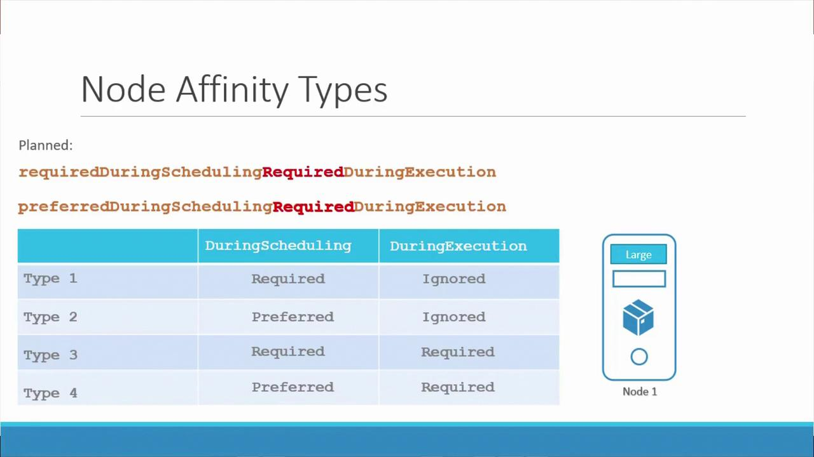

# my-scheduler-2.service
ExecStart=/usr/local/bin/kube-scheduler \
--config=/etc/kubernetes/config/my-scheduler-2-config.yaml
```

And the corresponding configuration file:

```yaml theme={null}
# my-scheduler-2-config.yaml
apiVersion: kubescheduler.config.k8s.io/v1
kind: KubeSchedulerConfiguration
profiles:
- schedulerName: my-scheduler-2
```

Each scheduler reads its configuration file—which includes its unique schedulerName—along with any additional options like the kubeconfig file necessary for connecting to the Kubernetes API.

## Deploying a Scheduler as a Pod

Another common approach is deploying the scheduler as a pod. In this setup, define a pod manifest that points to the custom kube-scheduler configuration file. Below is an example of a basic pod definition:

```yaml theme={null}
apiVersion: v1
kind: Pod
metadata:
  name: my-custom-scheduler
  namespace: kube-system
spec:
  containers:
    - name: kube-scheduler
      image: k8s.gcr.io/kube-scheduler-amd64:v1.11.3
      command:
        - kube-scheduler
        - --address=127.0.0.1
        - --kubeconfig=/etc/kubernetes/scheduler.conf
```

The custom scheduler configuration file might look as follows:

```yaml theme={null}
apiVersion: kubescheduler.config.k8s.io/v1
kind: KubeSchedulerConfiguration
profiles:
- schedulerName: my-scheduler
```

### Leader Election for High Availability

When running multiple instances of the same scheduler (such as on different master nodes), enable leader election to ensure only one instance is active at a time. The following pod manifest and configuration file enable leader election:

Pod manifest with leader election enabled:

```yaml theme={null}
apiVersion: v1
kind: Pod
metadata:
  name: my-custom-scheduler
  namespace: kube-system
spec:
  containers:
    - name: kube-scheduler
      image: k8s.gcr.io/kube-scheduler-amd64:v1.11.3
      command:
        - kube-scheduler
        - --address=127.0.0.1
        - --kubeconfig=/etc/kubernetes/scheduler.conf
        - --config=/etc/kubernetes/my-scheduler-config.yaml
```

And the corresponding configuration file:

```yaml theme={null}
apiVersion: kubescheduler.config.k8s.io/v1
kind: KubeSchedulerConfiguration
profiles:
- schedulerName: my-scheduler
  leaderElection:
    leaderElect: true
    resourceNamespace: kube-system
    resourceName: lock-o
```

This configuration differentiates your custom scheduler’s leader election mechanism from that of the default scheduler, ensuring seamless high availability in a multi-master setup.

## Deploying a Scheduler as a Deployment

In many Kubernetes environments, control plane components are deployed as pods or Deployments using kubeadm. You can also deploy your custom scheduler in this manner by building a custom Docker image.

### Building a Custom Scheduler Image

Clone the Kubernetes repository and build your scheduler:

```bash theme={null}
git clone https://github.com/kubernetes/kubernetes.git
cd kubernetes
make
```

Then create a Dockerfile that includes the scheduler binary:

```Dockerfile theme={null}
FROM busybox
ADD ./_output/local/bin/linux/amd64/kube-scheduler /usr/local/bin/kube-scheduler
```

Build and push your Docker image:

```bash theme={null}
docker build -t gcr.io/my-gcp-project/my-kube-scheduler:1.0 .
gcloud docker -- push gcr.io/my-gcp-project/my-kube-scheduler:1.0
```

### RBAC Setup for the Custom Scheduler

For secure deployment, create a ServiceAccount and bind the necessary ClusterRoles. Here’s an example configuration:

```yaml theme={null}
apiVersion: v1
kind: ServiceAccount
metadata:
  name: my-scheduler
  namespace: kube-system
---
apiVersion: rbac.authorization.k8s.io/v1
kind: ClusterRoleBinding
metadata:
  name: my-scheduler-as-kube-scheduler
subjects:
  - kind: ServiceAccount
    name: my-scheduler
    namespace: kube-system
roleRef:
  kind: ClusterRole
  name: system:kube-scheduler
  apiGroup: rbac.authorization.k8s.io
---
apiVersion: rbac.authorization.k8s.io/v1
kind: ClusterRoleBinding
metadata:
  name: my-scheduler-as-volume-scheduler
subjects:
  - kind: ServiceAccount
    name: my-scheduler
    namespace: kube-system
roleRef:
  kind: ClusterRole
  name: system:volume-scheduler
  apiGroup: rbac.authorization.k8s.io
```

### Deployment Manifest Example

Below is a sample Deployment manifest for your custom scheduler. This deployment uses a ConfigMap to mount the custom configuration file as a volume:

```yaml theme={null}
apiVersion: apps/v1
kind: Deployment
metadata:
  name: my-scheduler
  namespace: kube-system
  labels:
    component: scheduler
    tier: control-plane
spec:
  replicas: 1
  selector:
    matchLabels:
      component: scheduler
      tier: control-plane
  template:
    metadata:
      labels:
        component: scheduler
        tier: control-plane
        version: second
    spec:
      serviceAccountName: my-scheduler
      containers:
        - name: kube-second-scheduler
          image: gcr.io/my-gcp-project/my-kube-scheduler:1.0
          command:
            - /usr/local/bin/kube-scheduler
            - --config=/etc/kubernetes/my-scheduler/my-scheduler-config.yaml
          livenessProbe:
            httpGet:
              path: /healthz
              port: 10259
              scheme: HTTPS
            initialDelaySeconds: 15
          readinessProbe:
            httpGet:
              path: /healthz
              port: 10259
              scheme: HTTPS
          resources:
            requests:
              cpu: "0.1"
          securityContext:
            privileged: false
          volumeMounts:
            - name: config-volume
              mountPath: /etc/kubernetes/my-scheduler
      hostNetwork: false
      hostPID: false
      volumes:
        - name: config-volume
          configMap:
            name: my-scheduler-config
```

A corresponding ConfigMap that contains the scheduler configuration is as follows:

```yaml theme={null}
apiVersion: v1
kind: ConfigMap
metadata:
  name: my-scheduler-config
  namespace: kube-system
data:
  my-scheduler-config.yaml: |
    apiVersion: kubescheduler.config.k8s.io/v1beta2
    kind: KubeSchedulerConfiguration
    profiles:
      - schedulerName: my-scheduler
        leaderElection:
          leaderElect: false
```

For enhanced security, ensure your RBAC resources are correctly configured. Below is an example of a ClusterRole setup:

```yaml theme={null}
apiVersion: rbac.authorization.k8s.io/v1
kind: ClusterRole
metadata:
  name: system:kube-scheduler
  annotations:
    rbac.authorization.kubernetes.io/autoupdate: "true"
  labels:
    kubernetes.io/bootstrapping: rbac-defaults
rules:
  - apiGroups:
      - coordination.k8s.io
    resources:
      - leases
    verbs:
      - create
  - apiGroups:
      - coordination.k8s.io
    resources:
      - kube-scheduler
    verbs:
      - get
      - list
      - watch
```

When you run:

```bash theme={null}
kubectl get pods --namespace=kube-system
```

You should see your custom scheduler pod or Deployment along with the other control plane components.

## Using the Custom Scheduler for Pods

Once your custom scheduler is deployed, you can instruct specific pods to use it by setting the schedulerName field in their manifests. For example, here is a pod manifest for an nginx pod using the custom scheduler:

```yaml theme={null}
apiVersion: v1
kind: Pod
metadata:
  name: nginx
spec:
  containers:
    - name: nginx
      image: nginx
  schedulerName: my-custom-scheduler
```

Deploy the pod with:

```bash theme={null}
kubectl create -f nginx-pod.yaml
```

If the custom scheduler is not configured correctly, the pod will remain in a pending state. Use the following commands to inspect pod events and troubleshoot:

```bash theme={null}
kubectl describe pod nginx
kubectl get events -o wide
```

A typical events output might be:

| LAST SEEN | COUNT | NAME     | KIND | TYPE   | REASON    | SOURCE              | MESSAGE                                       |
| --------- | ----- | -------- | ---- | ------ | --------- | ------------------- | --------------------------------------------- |
| 9s        | 1     | nginx.15 | Pod  | Normal | Scheduled | my-custom-scheduler | Successfully assigned default/nginx to node01 |
| 8s        | 1     | nginx.15 | Pod  | Normal | Pulling   | kubelet, node01     | pulling image "nginx"                         |
| 2s        | 1     | nginx.15 | Pod  | Normal | Pulled    | kubelet, node01     | Successfully pulled image "nginx"             |
| 2s        | 1     | nginx.15 | Pod  | Normal | Created   | kubelet, node01     | Created container                             |
| 2s        | 1     | nginx.15 | Pod  | Normal | Started   | kubelet, node01     | Started container                             |

The event source confirms that the custom scheduler successfully handled pod scheduling.

<Callout icon="lightbulb">
  To troubleshoot your custom scheduler, view its logs with:

  kubectl logs my-custom-scheduler --namespace=kube-system

  Reviewing these logs will help pinpoint configuration errors or leader election issues.
</Callout>

## Conclusion

Deploying multiple schedulers in a Kubernetes cluster allows you to implement tailored scheduling strategies for different workloads while leaving the default scheduler in place. This guide outlined the configurations and deployment methods—ranging from running the scheduler as a service or pod to deploying it as a Deployment with proper RBAC and leader election setups.

Happy scheduling!

For more information on Kubernetes scheduling, visit the [Kubernetes Documentation](https://kubernetes.io/docs/) and explore additional resources on [Custom Schedulers](https://kubernetes.io/docs/concepts/scheduling-eviction/scheduler-perf-tuning/).

<CardGroup>
  <Card title="Watch Video" icon="video" href="https://learn.kodekloud.com/user/courses/kubernetes-and-cloud-native-associate-kcna/module/4fab542c-3091-4f8e-ad7c-91d96d54b049/lesson/d40a3617-69db-4325-8fd8-aad28639e0f0" />
</CardGroup>


# Node Affinity

Source: https://notes.kodekloud.com/docs/Kubernetes-and-Cloud-Native-Associate-KCNA/Scheduling/Node-Affinity/page

This comprehensive guide explains node affinity in Kubernetes, detailing how to control pod placement using advanced scheduling features and flexible operators.

Welcome to this comprehensive guide on node affinity in Kubernetes. Node affinity allows you to control the placement of your pods by specifying rules about which nodes are eligible for scheduling. While traditional node selectors provided basic control, node affinity offers advanced scheduling features with flexible operators and expressions.

## Simple Node Selector

Before exploring node affinity, consider a simple node selector that schedules a pod on a node labeled with size "Large":

```yaml theme={null}
apiVersion: 
kind: Pod
metadata:
  name: myapp-pod
spec:
  containers:
    - name: data-processor
      image: data-processor
  nodeSelector:
    size: Large
```

## Using Node Affinity

Node affinity uses a similar underlying concept but allows for more advanced expressions. The following example demonstrates how to schedule a pod on a node with a label `size` whose value is in the specified list:

```yaml theme={null}
apiVersion: 
kind: Pod
metadata:
  name: myapp-pod
spec:
  containers:
    - name: data-processor
      image: data-processor
  affinity:
    nodeAffinity:
      [SECRET_REDACTED]:
        nodeSelectorTerms:
          - matchExpressions:
              - key: size
                operator: In
                values:
                  - Large
```

<Callout icon="lightbulb">
  In this configuration:

  * The `affinity` block is defined under the pod `spec`.
  * `nodeAffinity` specifies the criteria used for node scheduling.
  * The field `[SECRET_REDACTED]` indicates a mandatory requirement for scheduling; if no node meets the criteria, the pod is not scheduled.
  * `nodeSelectorTerms` holds an array of conditions—in this case, ensuring that the node label `size` must have a value included in the specified list.
</Callout>

To allow flexibility—for example, if the pod can also run on a "Medium" node—you simply add that value to the list:

```yaml theme={null}
apiVersion: 
kind: Pod
metadata:
  name: myapp-pod
spec:
  containers:
    - name: data-processor
      image: data-processor
  affinity:
    nodeAffinity:
      [SECRET_REDACTED]:
        nodeSelectorTerms:
          - matchExpressions:
              - key: size
                operator: In
                values:
                  - Large
                  - Medium
```

Alternatively, if you want to exclude nodes labeled as "Small", you can use the `NotIn` operator:

```yaml theme={null}
apiVersion: 
kind: Pod
metadata:
  name: myapp-pod
spec:
  containers:
    - name: data-processor
      image: data-processor
  affinity:
    nodeAffinity:
      [SECRET_REDACTED]:
        nodeSelectorTerms:
          - matchExpressions:
              - key: size
                operator: NotIn
                values:
                  - Small
```

The `Exists` operator offers another approach. Rather than comparing against specific values, it checks for the presence of the label. This example schedules the pod on any node where the `size` label is defined:

```yaml theme={null}
apiVersion: 
kind: Pod
metadata:
  name: myapp-pod
spec:
  containers:
    - name: data-processor
      image: data-processor
  affinity:
    nodeAffinity:
      [SECRET_REDACTED]:
        nodeSelectorTerms:
          - matchExpressions:
              - key: size
                operator: Exists
```

For more details on the available operators, refer to the [Kubernetes documentation](https://kubernetes.io/docs/concepts/scheduling-eviction/assign-pod-node/).

## Behavior and Lifecycle of Node Affinity

When a pod is created, the Kubernetes scheduler evaluates its node affinity rules to determine the node on which to schedule the pod. However, several scenarios can occur if node conditions change over time.

### Node Affinity Types

There are two primary types of node affinity currently supported:

* **[SECRET_REDACTED]**:\
  The scheduler enforces that the pod be placed on a node that satisfies the affinity rules. If no matching node is available, the pod remains unscheduled. Once the pod is running, changes to node labels do not impact the running pod.

* **[SECRET_REDACTED]**:\
  The scheduler attempts to honor the specified node affinity rules. If a matching node is not found, the pod can be scheduled on a non-matching node. Similarly, node label changes after scheduling are ignored.

<Callout icon="lightbulb">
  Future releases of Kubernetes plan to introduce additional affinity types that enforce rules during both scheduling and execution:

  * [SECRET_REDACTED]
  * [SECRET_REDACTED]
</Callout>

### Scheduling vs. Execution

Node affinity rules are applied during two key phases of a pod's lifecycle:

1. **During Scheduling:**\
   At the time of pod creation, the scheduler evaluates the node affinity rules to determine an appropriate node. If using the required type and no matching node is found (for example, if a node is missing the expected label "Large"), the pod will not be scheduled.

2. **During Execution:**\
   Once the pod is running, changes in node labels are typically ignored for the current affinity types ("ignored during execution"). However, with forthcoming execution-enforced rules, pods might be evicted if the node subsequently fails to meet the affinity criteria.

Consider this scenario:\
A pod is scheduled on a node with the label `size=Large`. If an administrator later removes this label, the pod continues to run under the current behavior. Future implementations with the "required during execution" option could result in pod eviction.

<Frame>
  
</Frame>

## Conclusion

In this guide, we broke down the core components of node affinity and demonstrated how various operators and affinity types influence pod scheduling and execution in Kubernetes. Understanding and leveraging these advanced scheduling capabilities allows you to optimize node usage and ensure that pods are placed on nodes that best meet your application requirements.

For further reading and advanced configuration options, be sure to check out the [Kubernetes Documentation](https://kubernetes.io/docs/).

<CardGroup>
  <Card title="Watch Video" icon="video" href="https://learn.kodekloud.com/user/courses/kubernetes-and-cloud-native-associate-kcna/module/4fab542c-3091-4f8e-ad7c-91d96d54b049/lesson/ad9f1015-9e5d-47e8-a83a-875e16fab549" />
</CardGroup>
