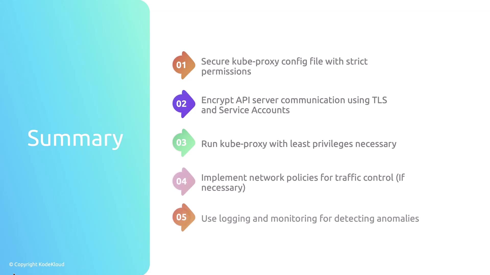
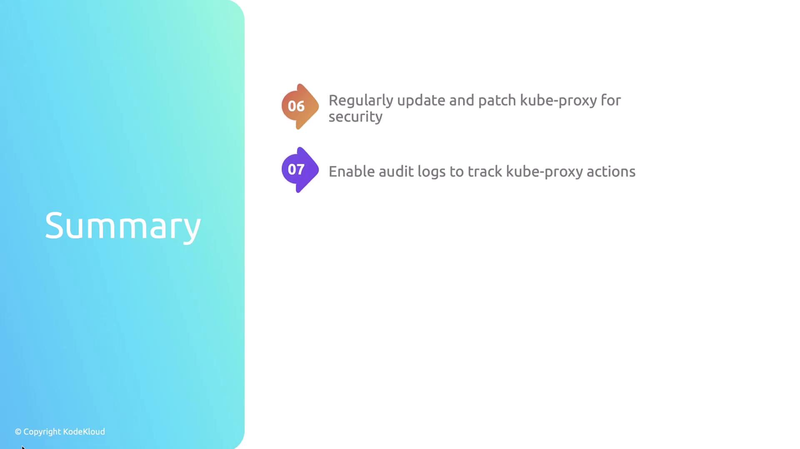

# Check permission
stat -c %a /var/lib/kube-proxy/kubeconfig.conf
# Check owner and group
stat -c %U:%G /var/lib/kube-proxy/kubeconfig.conf
```

<Callout icon="lightbulb">
  Always grant the minimum file permissions needed. Restrict write access to root (600) wherever possible.
</Callout>

***

## 3. Enforce TLS Encryption for API Connectivity

Open the kubeconfig to confirm TLS settings and service-account authentication:

```yaml theme={null}
apiVersion: v1
kind: Config
clusters:
- cluster:
    certificate-authority: /var/run/secrets/kubernetes.io/serviceaccount/ca.crt
    server: https://controlplane:6443
  name: default
contexts:
- context:
    cluster: default
    namespace: default
    user: default
  name: default
current-context: default
users:
- name: default
  user:
    tokenFile: /var/run/secrets/kubernetes.io/serviceaccount/token
```

* `certificate-authority` ensures the API server’s certificate is validated.
* `server: https://…` enforces encrypted HTTPS connections.
* Service-account `tokenFile` grants authenticated, RBAC-controlled access.

***

## 4. Enable Audit Logging

Audit logs help you monitor all kube-proxy actions and detect suspicious activity.

1. **Create an audit policy** (e.g., `/etc/kubernetes/audit-policy.yaml`):

   ```yaml theme={null}
   apiVersion: audit.k8s.io/v1
   kind: Policy
   rules:
     # Log all actions by kube-proxy
     - level: Metadata
       users: ["system:kube-proxy"]

     # Optionally monitor changes to core resources
     - level: Metadata
       resources:
         - group: ""
           resources: ["pods", "services", "endpoints"]

     # Skip logging for all other requests
     - level: None
   ```

2. **Stream audit events** to verify logs:

   ```bash theme={null}
   tail -f /var/log/audit/audit.log | jq .objectRef.resource
   ```

<Callout icon="triangle-alert">
  Ensure sufficient disk space and retention policies for your audit logs to prevent data loss.
</Callout>

***

## Summary of Best Practices

<Frame>
  
</Frame>

* Secure and limit access to `/var/lib/kube-proxy/config.conf` and `kubeconfig.conf`.
* Enforce TLS and service-account authentication for API traffic.
* Run kube-proxy with least privilege.
* Apply NetworkPolicies to control pod-to-pod traffic.
* Enable logging and monitoring to detect anomalies.

<Frame>
  
</Frame>

* Keep kube-proxy updated with the latest security patches.
* Enable and review audit logs to track every kube-proxy action.

## Further Reading and References

* [Kubernetes Official Documentation](https://kubernetes.io/docs/)
* [API Auditing in Kubernetes](https://kubernetes.io/docs/tasks/debug/debug-cluster/audit/)
* [Managing Kubernetes ServiceAccounts](https://kubernetes.io/docs/reference/access-authn-authz/service-accounts-admin/)

<CardGroup>
  <Card title="Watch Video" icon="video" href="https://learn.kodekloud.com/user/courses/kubernetes-and-cloud-native-security-associate-kcsa/module/ca772db3-53aa-44c1-b424-3d32a046b683/lesson/89baae49-473e-4b56-b53d-1a2c1cf5af1f" />
</CardGroup>


# Securing the Kubelet

Source: https://notes.kodekloud.com/docs/Kubernetes-and-Cloud-Native-Security-Associate-KCSA/Kubernetes-Cluster-Component-Security/Securing-the-Kubelet/page

This guide covers best practices for securing the kubelet in Kubernetes, including installation, configuration, and hardening techniques.

In Kubernetes, the **kubelet** acts as the “captain” on each worker node. It:

* Registers the node with the control plane.
* Starts and stops containers per Pod specs.
* Monitors Pod and container health, reporting back to the API Server.

Just like a ship’s captain must secure communications with the harbor master, you must lock down the kubelet so it only accepts instructions from your cluster’s API Server. In this guide, you’ll learn how to:

* Install and configure the kubelet securely
* Inspect its running configuration
* Harden authentication, authorization, and network access

***

## 1. Role & Installation of the Kubelet

### Key Responsibilities

1. **Node Registration**
2. **Pod Lifecycle Management**
3. **Health Reporting**

### Manual Installation

Download the kubelet binary and set up a `systemd` unit:

```bash theme={null}
wget https://storage.googleapis.com/kubernetes-release/release/v1.20.0/bin/linux/amd64/kubelet \
  -O /usr/local/bin/kubelet && chmod +x /usr/local/bin/kubelet
```

```ini theme={null}
