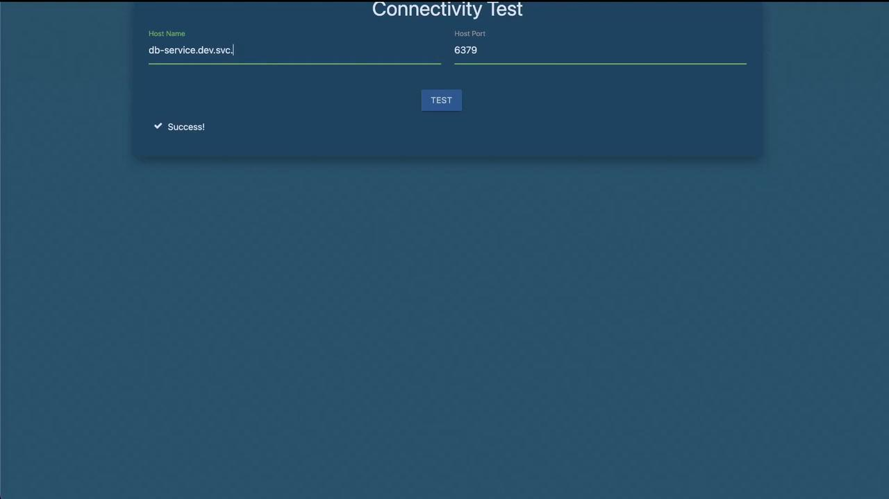

# or shorthand
kubectl get ns
```

| Command                  | Description                      |
| ------------------------ | -------------------------------- |
| `kubectl get namespaces` | List all namespaces (full form)  |
| `kubectl get ns`         | List all namespaces (short form) |

Example output:

```txt theme={null}
NAME              STATUS   AGE
default           Active   6m55s
kube-system       Active   6m54s
kube-public       Active   6m54s
kube-node-lease   Active   6m54s
finance           Active   32s
marketing         Active   32s
dev               Active   32s
prod              Active   32s
manufacturing     Active   32s
research          Active   32s
```

There are **10** namespaces in total.

<Callout icon="lightbulb">
  You can add `-o wide` or use `-o jsonpath` to customize the output format.
</Callout>

## 2. Count Pods in the `research` Namespace

To see how many pods are running in `research`:

```bash theme={null}
kubectl get pods -n research
```

Example:

```txt theme={null}
NAME   READY  STATUS             RESTARTS   AGE
dna-2  0/1    CrashLoopBackOff   3          76s
dna-1  0/1    CrashLoopBackOff   3          76s
```

There are **2** pods in this namespace.

## 3. Create a Pod in the `finance` Namespace

Deploy a Redis pod into `finance`:

```bash theme={null}
kubectl run redis --image=redis -n finance
```

Verify the pod:

```bash theme={null}
kubectl get pods -n finance
```

Example:

```txt theme={null}
NAME     READY  STATUS              RESTARTS   AGE
payroll  1/1    Running             0          2m20s
redis    0/1    ContainerCreating   0          8s
```

## 4. Locate the `blue` Pod Across All Namespaces

To identify which namespace hosts the `blue` pod:

```bash theme={null}
kubectl get pods --all-namespaces
# or shorthand
kubectl get pods -A
```

Sample output shows `blue` in `marketing`:

```txt theme={null}
NAMESPACE    NAME   READY  STATUS           RESTARTS   AGE
marketing    blue   1/1    CrashLoopBackOff 4          3m3s
...
```

## 5. Service DNS Within the Same Namespace

Services in the same namespace can be reached by `<service-name>:<port>`. In `marketing`:

```bash theme={null}
kubectl get svc -n marketing
```

Example:

```txt theme={null}
NAME           TYPE       CLUSTER-IP      PORT(S)
blue-service   NodePort   10.43.82.162    8080:30082/TCP
db-service     NodePort   10.43.134.33    6379:30758/TCP
```

The `blue` app connects to `db-service` on:

* **Host**: `db-service`
* **Port**: `6379`

<Frame>
  
</Frame>

## 6. Service DNS Across Namespaces

Accessing a service in a different namespace (e.g., `dev`) requires the full DNS name:

```text theme={null}
db-service.dev.svc.cluster.local:6379
```

Verify the service definition:

```bash theme={null}
kubectl get svc -n dev
```

Example:

```txt theme={null}
NAME        TYPE        CLUSTER-IP      PORT(S)
db-service  ClusterIP   10.43.252.9     6379/TCP
```

<Callout icon="triangle-alert">
  Always use the full DNS (`<svc>.<namespace>.svc.cluster.local`) when connecting across namespaces to avoid resolution errors.
</Callout>

***

## Links and References

* [Kubernetes Namespaces](https://kubernetes.io/docs/concepts/overview/working-with-objects/namespaces/)
* [kubectl Cheat Sheet](https://kubernetes.io/docs/reference/kubectl/cheatsheet/)
* [Service DNS in Kubernetes](https://kubernetes.io/docs/concepts/services-networking/dns-pod-service/)

<CardGroup>
  <Card title="Watch Video" icon="video" href="https://learn.kodekloud.com/user/courses/kubernetes-and-cloud-native-security-associate-kcsa/module/0148994b-9ccc-4725-a77b-a4a63592152f/lesson/a88eb99e-c5f6-4fb4-9e3a-3f48df198f15" />
</CardGroup>


# Solution RBAC

Source: https://notes.kodekloud.com/docs/Kubernetes-and-Cloud-Native-Security-Associate-KCSA/Kubernetes-Security-Fundamentals/Solution-RBAC/page

This lesson covers implementing Kubernetes Role-Based Access Control to manage permissions for users and services.

In this lesson, we’ll dive into Kubernetes Role-Based Access Control (RBAC) to manage permissions for users and services. We’ll cover:

1. Inspecting API server authorization modes
2. Counting existing Roles
3. Examining the built-in `kube-proxy` Role
4. Reviewing RoleBindings for `kube-proxy`
5. Verifying `dev-user` permissions
6. Granting Pod permissions to `dev-user`
7. Fixing Pod permissions in the `blue` namespace
8. Granting Deployment permissions in the `blue` namespace

***

## 1. Inspect API Server Authorization Modes

To confirm that RBAC is enabled, inspect the API server manifest:

```bash theme={null}
kubectl -n kube-system get pod kube-apiserver -o yaml
```

Look for the `--authorization-mode` flag:

```yaml theme={null}
- --authorization-mode=Node,RBAC
```

Alternatively, on the control-plane node:

```bash theme={null}
ps aux | grep kube-apiserver
```

```bash theme={null}
... --authorization-mode=Node,RBAC ...
```

<Frame>
  
</Frame>

<Callout icon="lightbulb">
  RBAC must be enabled on your API server for Roles and RoleBindings to function correctly.
</Callout>

***

## 2. Count Existing Roles

List Roles in the `default` namespace:

```bash theme={null}
kubectl get roles -n default
```

```text theme={null}
No resources found in default namespace.
```

Count all Roles across namespaces:

```bash theme={null}
kubectl get roles --all-namespaces --no-headers | wc -l
```

```text theme={null}
12
```

| Namespace | Role Count |
| --------- | ---------- |
| default   | 0          |
| all       | 12         |

***

## 3. Examine the kube-proxy Role

View the `kube-proxy` Role in `kube-system`:

```bash theme={null}
kubectl describe role kube-proxy -n kube-system
```

| Resource   | Non-Resource URLs | Resource Names | Verbs  |
| ---------- | ----------------- | -------------- | ------ |
| configmaps | \[]               | \[kube-proxy]  | \[get] |

True/False:

* **True**: It can **get** the ConfigMap named `kube-proxy`.
* **False**: It cannot delete or update the ConfigMap.
* **False**: It cannot list or watch ConfigMaps.

***

## 4. Identify the Subject of the kube-proxy RoleBinding

List RoleBindings in `kube-system`:

```bash theme={null}
kubectl get rolebindings -n kube-system
```

```text theme={null}
NAME          ROLE
kube-proxy    Role/kube-proxy
```

Describe the `kube-proxy` RoleBinding:

```bash theme={null}
kubectl describe rolebinding kube-proxy -n kube-system
```

| Kind  | Name                                                 |
| ----- | ---------------------------------------------------- |
| Group | system bootstrappers kube command default node token |

***

## 5. Verify dev-user Permissions

After adding `dev-user` to your kubeconfig:

```bash theme={null}
kubectl config view
```

Attempt to list Pods in `default`:

```bash theme={null}
kubectl get pods --as dev-user
```

```text theme={null}
Error from server (Forbidden): pods is forbidden: User "dev-user" cannot list resource "pods" in API group "" in the namespace "default"
```

<Callout icon="triangle-alert">
  `dev-user` currently has no permissions in `default`. You must create Roles and RoleBindings to grant access.
</Callout>

***

## 6. Grant Pod Permissions to dev-user

### 6.1 Create the `developer` Role

```bash theme={null}
kubectl create role developer \
  --verb=list,create,delete \
  --resource=pods \
  -n default
```

Verify:

```bash theme={null}
kubectl describe role developer -n default
```

### 6.2 Bind `dev-user` to the Role

```bash theme={null}
kubectl create rolebinding dev-user-binding \
  --role=developer \
  --user=dev-user \
  -n default
```

Confirm:

```bash theme={null}
kubectl describe rolebinding dev-user-binding -n default
```

Now `dev-user` can list Pods:

```bash theme={null}
kubectl get pods --as dev-user -n default
```

***

## 7. Fix Permissions for a Pod in the blue Namespace

1. Inspect existing Roles and RoleBindings:

   ```bash theme={null}
   kubectl get roles,rolebindings -n blue
   ```

2. Describe the `developer` Role:

   ```bash theme={null}
   kubectl describe role developer -n blue
   ```

3. Edit the Role to match the actual Pod name:

   ```bash theme={null}
   kubectl edit role developer -n blue
   ```

   Update to:

   ```yaml theme={null}
   rules:
   - apiGroups: ['']
     resources:
     - pods
     resourceNames:
     - dark-blue-app
     verbs:
     - get
     - watch
     - create
     - delete
   ```

4. Verify access:

   ```bash theme={null}
   kubectl get pod dark-blue-app -n blue --as dev-user
   ```

***

## 8. Grant Deployment Permissions in the blue Namespace

1. Edit the `developer` Role again:

   ```bash theme={null}
   kubectl edit role developer -n blue
   ```

2. Add a rule for `deployments` in the `apps` API group:

   ```yaml theme={null}
   rules:
   - apiGroups: ['']
     resources:
     - pods
     resourceNames:
     - dark-blue-app
     verbs:
     - get
     - watch
     - create
     - delete
   - apiGroups: ['apps']
     resources:
     - deployments
     verbs:
     - get
     - watch
     - create
     - delete
   ```

3. Verify:

   ```bash theme={null}
   kubectl describe role developer -n blue
   ```

4. Create a Deployment as `dev-user`:

   ```bash theme={null}
   kubectl create deployment nginx \
     --image=nginx \
     -n blue \
     --as dev-user
   ```

***

## Links and References

* [Kubernetes RBAC Documentation](https://kubernetes.io/docs/reference/access-authn-authz/rbac/)
* [kubectl Cheat Sheet](https://kubernetes.io/docs/reference/kubectl/cheatsheet/)
* [Configuring Service Accounts](https://kubernetes.io/docs/tasks/configure-pod-container/configure-service-account/)

<CardGroup>
  <Card title="Watch Video" icon="video" href="https://learn.kodekloud.com/user/courses/kubernetes-and-cloud-native-security-associate-kcsa/module/0148994b-9ccc-4725-a77b-a4a63592152f/lesson/b2056479-98ff-4f8f-a942-186d2a1f1dee" />
</CardGroup>
