# Scan with Trivy
trivy image --severity HIGH,CRITICAL team-a/crm:stable

# Scan with Clair via clair-scanner
clair-scanner --ip $(hostname -I | awk '{print $1}') team-a/crm:stable
```

<Frame>
  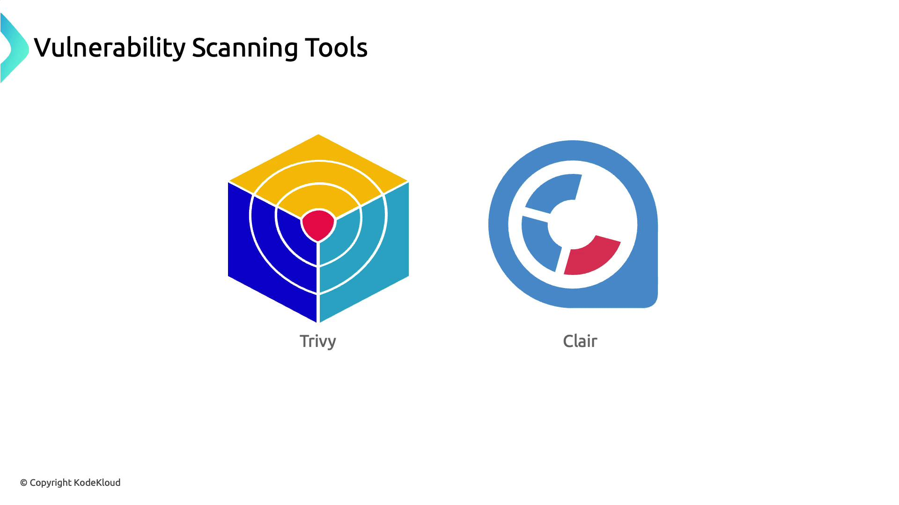
</Frame>

| Scanner | Description                                  | Command Example                        |
| ------- | -------------------------------------------- | -------------------------------------- |
| Trivy   | Lightweight, fast vulnerability scanner      | `trivy image <image>`                  |
| Clair   | Static analysis of vulnerabilities in images | `clair-scanner --ip <host-ip> <image>` |

## Adopting Minimal Official Base Images

After remediating all discovered flaws, Team A switched to an officially maintained minimal image (Ubuntu or Alpine). This approach reduces the attack surface and ensures timely security updates.

<Frame>
  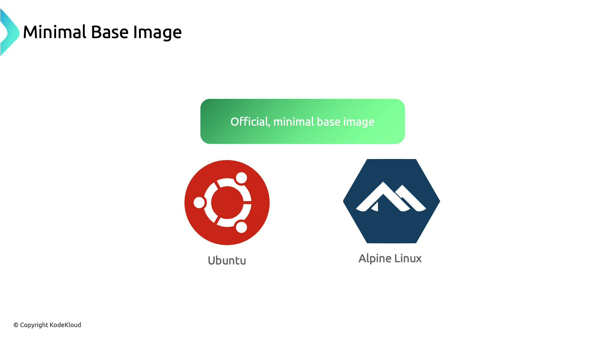
</Frame>

## Understanding Build Artifacts

Any output from your build process—compiled binaries, JAR/WAR files, logs, reports, and especially container images—counts as a build artifact.

<Frame>
  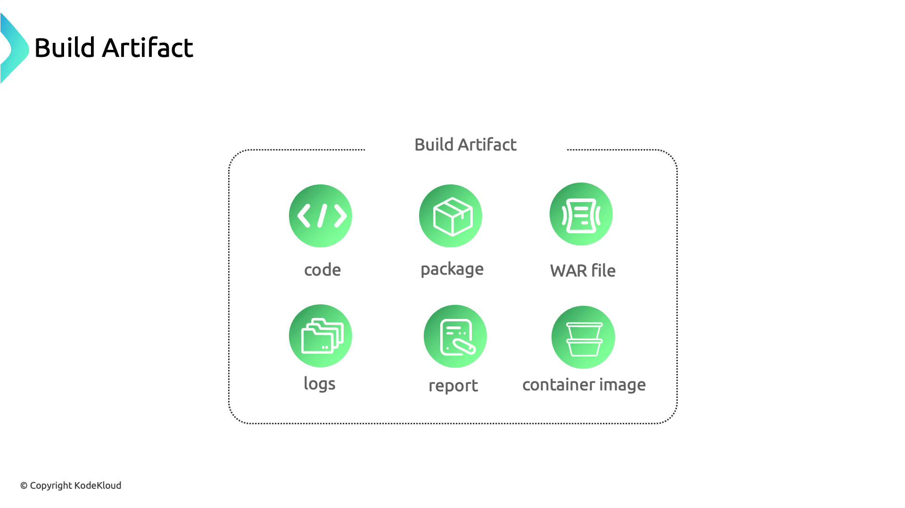
</Frame>

Securely managing container images requires a centralized artifact repository, which supports your CI/CD workflow and ensures consistent distribution.

## Storing Container Images

While Docker Hub is popular for hosting images, it has limited access controls and no built-in vulnerability scanning.

<Frame>
  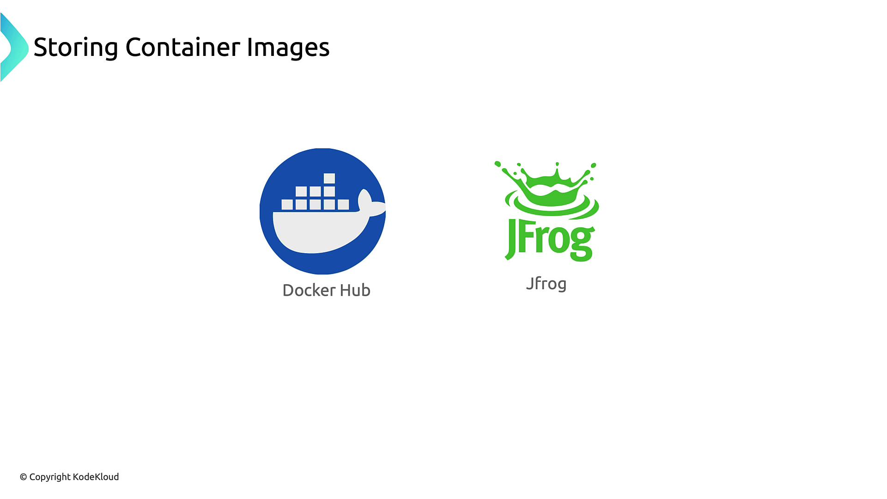
</Frame>

| Repository        | Access Control | Scanning   | Image Signing |
| ----------------- | -------------- | ---------- | ------------- |
| Docker Hub        | Basic          | No         | No            |
| Nexus Repository  | Fine-grained   | Via add-on | Limited       |
| GitHub Packages   | Fine-grained   | Yes        | Yes           |
| JFrog Artifactory | Fine-grained   | Yes        | Yes           |

## Advanced Artifact Repositories

For stricter compliance, consider:

* Nexus Repository ([https://www.sonatype.com/nexus-repository-oss](https://www.sonatype.com/nexus-repository-oss))
* GitHub Packages ([https://github.com/features/packages](https://github.com/features/packages))
* JFrog Artifactory ([https://jfrog.com/artifactory/](https://jfrog.com/artifactory/))

<Frame>
  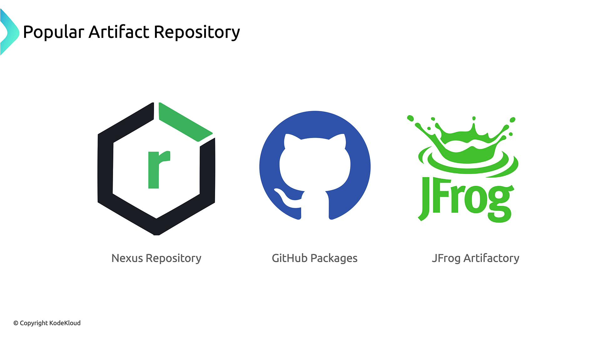
</Frame>

### JFrog Artifactory Security

JFrog Artifactory continuously scans stored images, integrates with vulnerability tools, and can enforce digital signatures to guarantee image authenticity.

<Frame>
  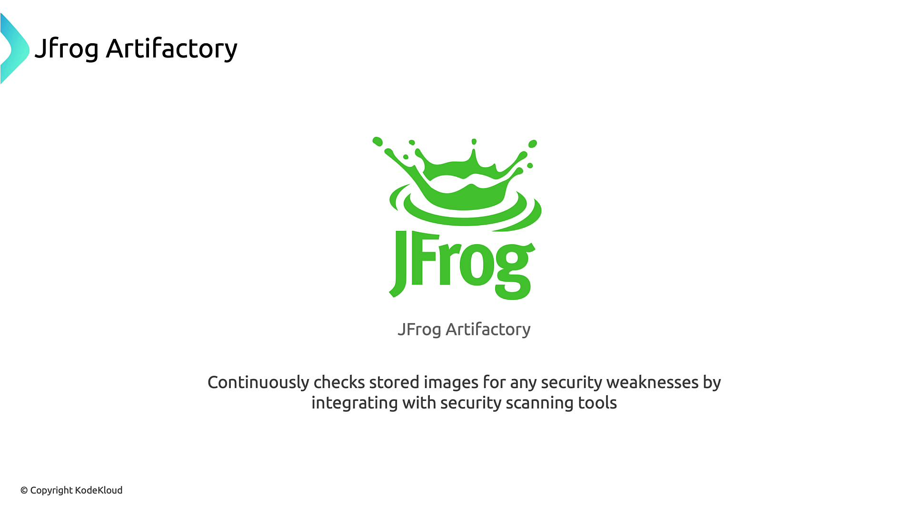
</Frame>

<Callout icon="lightbulb">
  Digital signatures on images detect unauthorized modifications and improve supply chain security.
</Callout>

<Frame>
  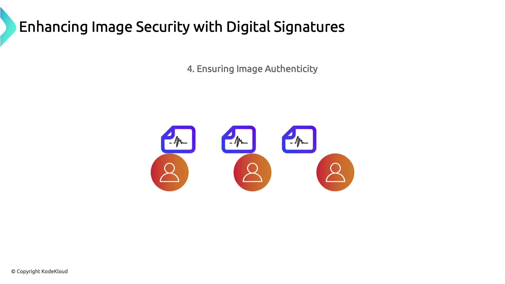
</Frame>

## Next Steps

1. Integrate automated scans in your CI/CD pipeline.
2. Standardize on minimal, official base images.
3. Use a robust artifact repository with access controls and signing.
4. Continuously monitor and update images to address new vulnerabilities.

## Links and References

* [Trivy GitHub Repository](https://github.com/aquasecurity/trivy)
* [Clair GitHub Repository](https://github.com/quay/clair)
* [Docker Hub](https://hub.docker.com/)
* [Nexus Repository](https://www.sonatype.com/nexus-repository-oss)
* [GitHub Packages](https://github.com/features/packages)
* [JFrog Artifactory](https://jfrog.com/artifactory/)

<CardGroup>
  <Card title="Watch Video" icon="video" href="https://learn.kodekloud.com/user/courses/kubernetes-and-cloud-native-security-associate-kcsa/module/a0ddd095-0114-4aa4-b3a5-2b31e773f241/lesson/6c0a9809-bf14-4680-b340-5d84343ad6c8" />
</CardGroup>


# Cloud Provider Security

Source: https://notes.kodekloud.com/docs/Kubernetes-and-Cloud-Native-Security-Associate-KCSA/Overview-of-Cloud-Native-Security/Cloud-Provider-Security/page

This article discusses cloud provider security, focusing on threat management, web application firewalls, container security, and the shared responsibility model.

In our Cats and Dogs election simulation, the attacker’s first move—after identifying host IPs—was a port scan. They discovered port 2375 (Docker) wide open, marking an entry point into the host and underlying Kubernetes infrastructure.

```bash theme={null}
zsh port-scan.sh 104.21.63.124
21 for ftp ...                     Fail
22 for ssh ...                     Fail
…  
2375 for docker...                 Success
…  
~ took 4s
```

<Callout icon="triangle-alert">
  Exposed Docker ports (2375) allow unauthenticated remote container management. Always restrict access or enable TLS authentication.
</Callout>

A simple preventative measure is a network firewall. By filtering traffic based on IP, port, and protocol, you can hide or block open ports on your servers.

<Frame>
  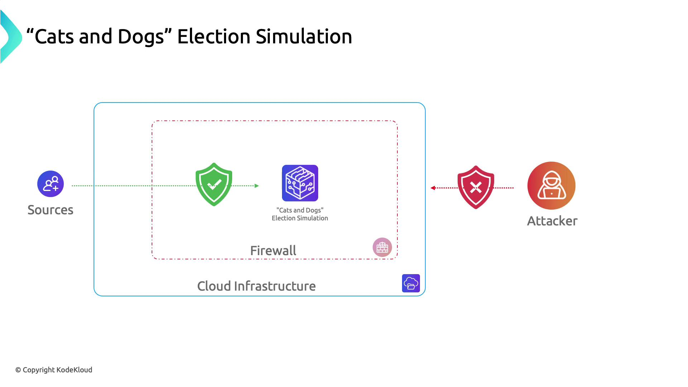
</Frame>

Cloud providers (AWS, Azure, GCP) supply multiple layers of infrastructure security—ranging from firewalls to advanced threat detection, WAFs, and container defenses. Below is an overview of these capabilities.

<Frame>
  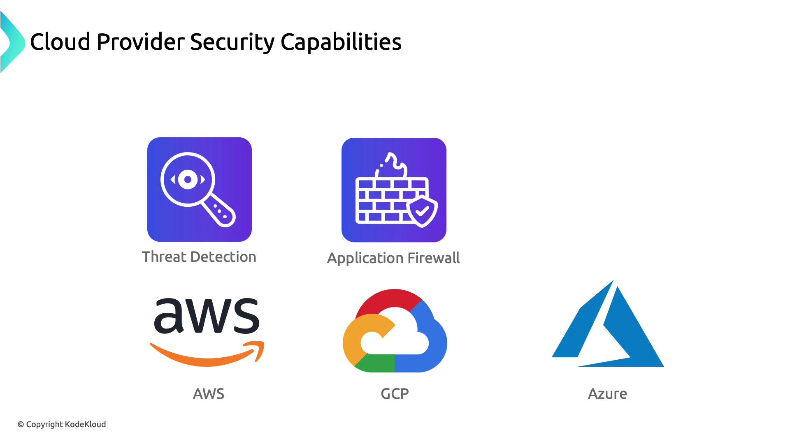
</Frame>

***

## Threat Management and Response

All three major cloud platforms offer managed SIEM/SOAR-style tools for continuous threat monitoring and automated response.

| Provider | Service                       | Description                                                                             | Docs                                                                                                 |
| -------- | ----------------------------- | --------------------------------------------------------------------------------------- | ---------------------------------------------------------------------------------------------------- |
| Azure    | Azure Sentinel                | Integrated SIEM + SOAR for threat detection, hunting, and automated playbooks.          | [https://docs.microsoft.com/azure/sentinel](https://docs.microsoft.com/azure/sentinel)               |
| AWS      | Amazon GuardDuty              | ML-driven threat detection for AWS accounts and workloads, no rule authoring required.  | [https://aws.amazon.com/guardduty](https://aws.amazon.com/guardduty)                                 |
| GCP      | Security Command Center (SCC) | Centralized dashboard for asset inventory, vulnerability scanning, and threat insights. | [https://cloud.google.com/security-command-center](https://cloud.google.com/security-command-center) |

<Frame>
  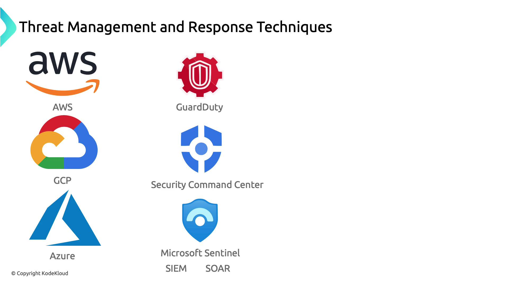
</Frame>

***

## Web Application Firewalls (WAF)

To defend against OWASP Top 10 attacks and DDoS, each provider offers a native WAF solution.

| Provider | Service     | Key Features                                                                | Docs                                                                                                                   |
| -------- | ----------- | --------------------------------------------------------------------------- | ---------------------------------------------------------------------------------------------------------------------- |
| Azure    | Azure WAF   | Integrated with Application Gateway, OWASP rule sets, custom rules.         | [https://docs.microsoft.com/azure/web-application-firewall](https://docs.microsoft.com/azure/web-application-firewall) |
| AWS      | AWS WAF     | Custom rule creation, integration with CloudFront & ALB, real-time metrics. | [https://docs.aws.amazon.com/waf](https://docs.aws.amazon.com/waf)                                                     |
| GCP      | Cloud Armor | DDoS protection, geo-based access controls, custom security policies.       | [https://cloud.google.com/armor](https://cloud.google.com/armor)                                                       |

<Frame>
  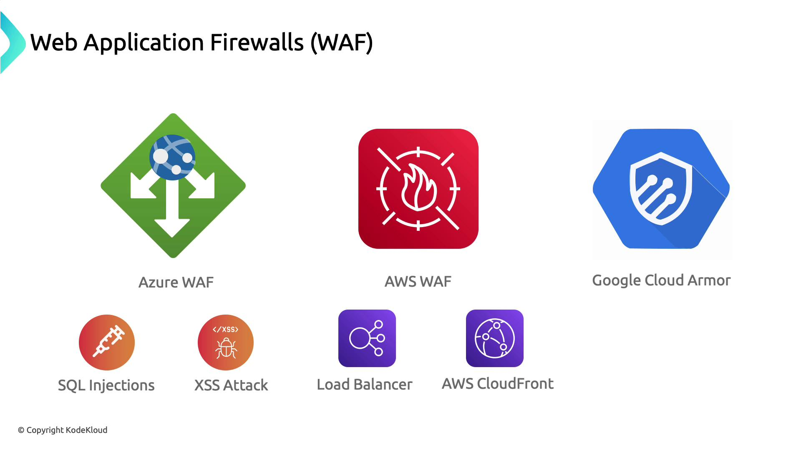
</Frame>

***

## Container Security

Container orchestration platforms combine built-in controls with ecosystem tools to enforce runtime and image compliance.

| Provider | Service                        | Security Features                                                           | Docs                                                                                                                                                               |
| -------- | ------------------------------ | --------------------------------------------------------------------------- | ------------------------------------------------------------------------------------------------------------------------------------------------------------------ |
| Azure    | Azure Kubernetes Service (AKS) | Control-plane hardening, Azure Policy integration, image scanning.          | [https://docs.microsoft.com/azure/aks](https://docs.microsoft.com/azure/aks)                                                                                       |
| AWS      | Amazon EKS + Bottlerocket      | Bottlerocket OS, `kube-bench` CIS checks, IAM roles for service accounts.   | [https://aws.amazon.com/eks](https://aws.amazon.com/eks)<br />[https://aws.amazon.com/bottlerocket](https://aws.amazon.com/bottlerocket)                           |
| GCP      | Google Kubernetes Engine (GKE) | Private clusters, Anthos policy enforcement with OPA, binary authorization. | [https://cloud.google.com/kubernetes-engine](https://cloud.google.com/kubernetes-engine)<br />[https://www.openpolicyagent.org/](https://www.openpolicyagent.org/) |

<Frame>
  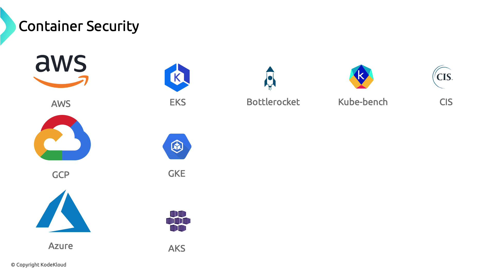
</Frame>

***

## Shared Responsibility Model

Cloud security is a partnership: the provider secures the cloud *infrastructure*, and you secure your workloads *in* the cloud.

<Frame>
  
</Frame>

Every service tier (IaaS, PaaS, SaaS) shifts certain responsibilities. In AWS, for example, customers manage security *in* the cloud, while AWS handles security *of* the cloud.

<Frame>
  
</Frame>

<Callout icon="lightbulb">
  Review the shared responsibility matrix for each cloud provider to ensure you cover all security controls—from networking rules to application hardening.
</Callout>

***

In this article, we examined how Azure, AWS, and Google Cloud approach:

* Threat Management & Response
* Web Application Firewalls
* Container Security
* The Shared Responsibility Model

Next, we’ll move into deeper infrastructure security practices.

<Frame>
  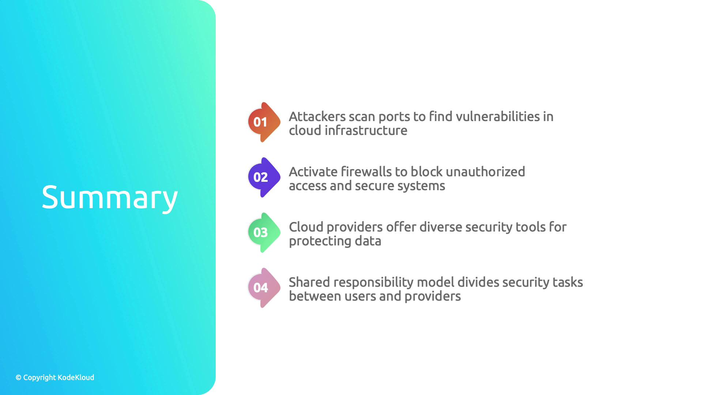
</Frame>

<CardGroup>
  <Card title="Watch Video" icon="video" href="https://learn.kodekloud.com/user/courses/kubernetes-and-cloud-native-security-associate-kcsa/module/a0ddd095-0114-4aa4-b3a5-2b31e773f241/lesson/12d92419-6307-474d-b78d-54eaea05ae23" />
</CardGroup>
