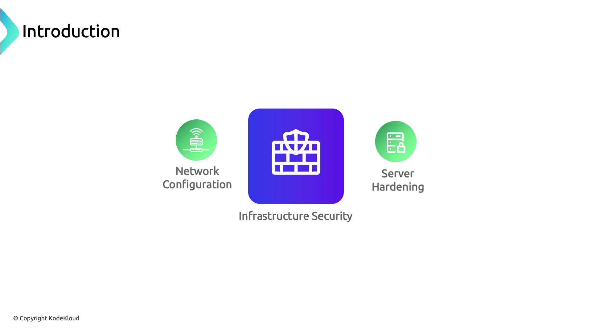
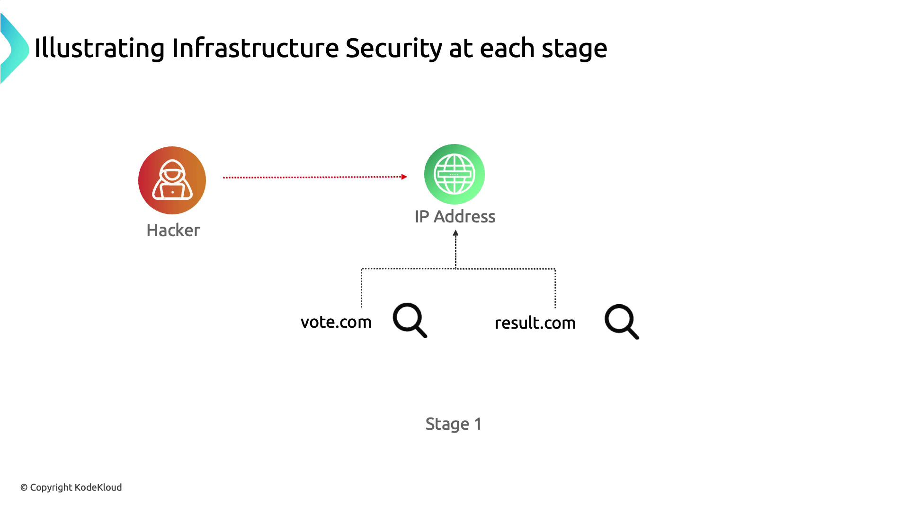
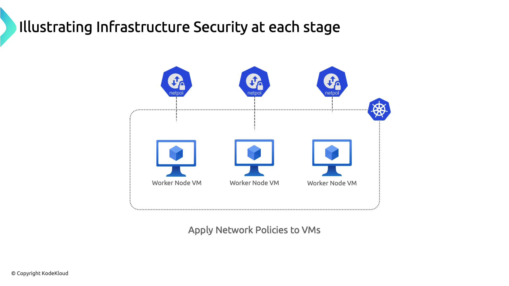
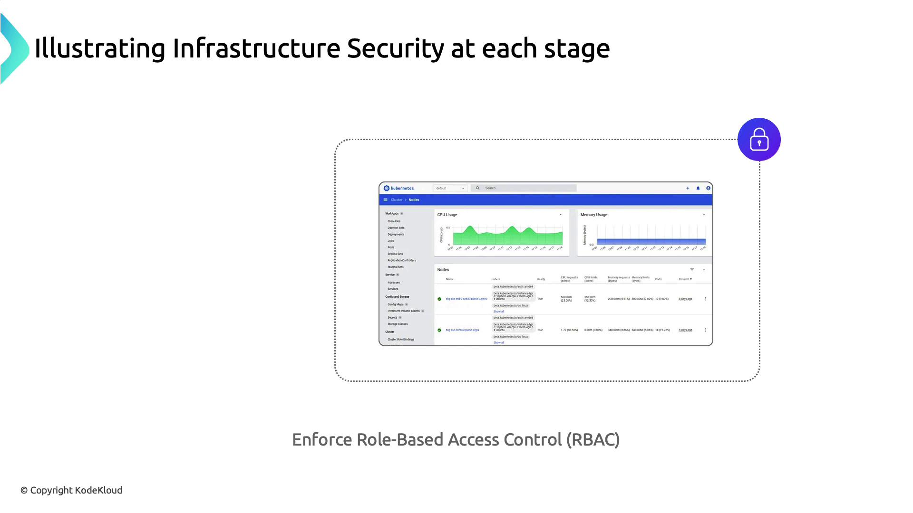
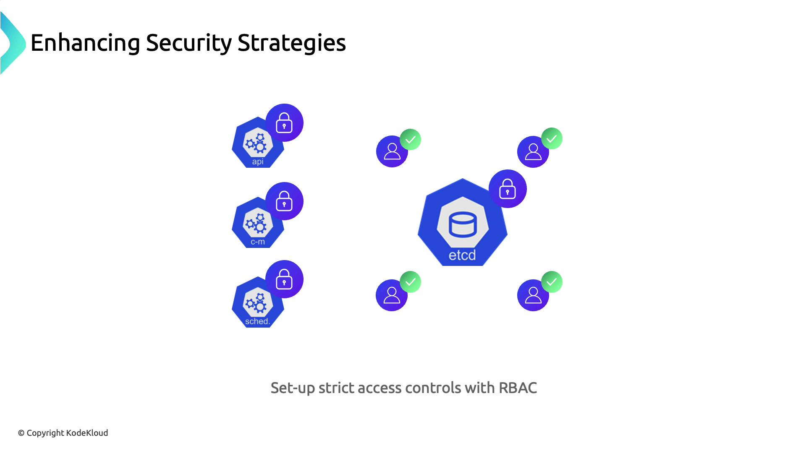

# Infrastructure Security

Source: https://notes.kodekloud.com/docs/Kubernetes-and-Cloud-Native-Security-Associate-KCSA/Overview-of-Cloud-Native-Security/Infrastructure-Security/page

This article focuses on infrastructure security in cloud-native environments, emphasizing network configuration, server hardening, and access control to prevent unauthorized access and data breaches.

As we shift from cloud provider security to infrastructure security, we focus on protecting the underlying compute, network, and storage resources in a cloud-native environment. Infrastructure security covers network configuration, server hardening, and access control to help prevent unauthorized access, lateral movement, and data breaches.

<Frame>
  
</Frame>

<Callout icon="lightbulb">
  Infrastructure security extends beyond individual containers or workloads. It requires a holistic approach that includes network policies, host configuration, and secure management of sensitive data.
</Callout>

## Stage 1: Network Segmentation & API Exposure

In our attack scenario, the adversary discovers that **vote.com** and **drizzle.com** resolve to the same IP address, revealing a lack of network segmentation that allows one compromised application to threaten the entire host.

<Frame>
  
</Frame>

| Vulnerability                      | Risk                                   | Mitigation                                         |
| ---------------------------------- | -------------------------------------- | -------------------------------------------------- |
| Shared IP hosting multiple domains | Compromise of one app exposes all apps | Use VPCs/Subnets or separate servers               |
| Public Kubernetes API endpoint     | Unrestricted API discovery and access  | Remove public IP, enforce VPN or private endpoints |

**Key Mitigations**

* Isolate applications in distinct networks or VPC subnets.
* Remove or restrict the Kubernetes API server’s public IP.
* Implement firewall rules and network access control lists (ACLs).

## Stage 2: Securing Docker Daemon Access

After identifying the host, the attacker scans open ports and finds Docker’s default remote port (`2375`) exposed without TLS:

```bash theme={null}
zsh port-scan.sh 104.21.63.124
...
2375 for docker...   Success
```

Without proper network controls, this allows remote container management and further lateral movement.

<Callout icon="lightbulb">
  Apply network policies or cloud firewall rules at the host level to restrict Docker daemon access to trusted IPs or management subnets.
</Callout>

* Use host-based firewalls (e.g., iptables, ufw) to block port 2375.
* Enable TLS authentication on the Docker daemon (`--tlsverify`).
* Apply [Kubernetes NetworkPolicies](https://kubernetes.io/docs/concepts/services-networking/network-policies/) to restrict Pod-to-Pod and Pod-to-Host traffic.

<Frame>
  
</Frame>

## Stage 3: Least Privilege & RBAC Enforcement

Leveraging a vulnerable privileged container (RDKALV), the attacker gains root on the node. A publicly accessible Kubernetes Dashboard then provides full cluster visibility and control.

<Frame>
  
</Frame>

**Best Practices**

* Enforce the principle of least privilege: run containers with non-root users and minimal capabilities.
* Secure the Kubernetes Dashboard with RBAC and authentication mechanisms.
* Rotate service account tokens and limit scope using [RBAC](https://kubernetes.io/docs/reference/access-authn-authz/rbac/) rules.

## Stage 4: Secure Management of Secrets & etcd

The attacker extracts database credentials from plain-text environment variables in a compromised Pod. Storing sensitive data securely is critical.

<Frame>
  
</Frame>

* Use [Kubernetes Secrets](https://kubernetes.io/docs/concepts/configuration/secret/) to encrypt sensitive values at rest.
* Enable encryption providers for etcd data following [etcd encryption documentation](https://kubernetes.io/docs/tasks/administer-cluster/encrypt-data/).
* Enforce TLS authentication for etcd client-server and peer communication.
* Apply tight RBAC rules to etcd access.

<Callout icon="lightbulb">
  In managed Kubernetes services, direct etcd access is usually abstracted. Review your provider’s security controls and backup strategies to ensure data durability and confidentiality.
</Callout>

## Summary

1. Segment critical workloads into separate networks or servers.
2. Block or secure Docker daemon ports with TLS and host-based firewalls.
3. Apply least-privilege principles and lock down the Kubernetes Dashboard with RBAC.
4. Store all secrets in Kubernetes Secrets and encrypt etcd data at rest.
5. Use TLS for etcd communication and enforce strict RBAC policies.

## Links and References

* [Kubernetes Secrets](https://kubernetes.io/docs/concepts/configuration/secret/)
* [Kubernetes RBAC](https://kubernetes.io/docs/reference/access-authn-authz/rbac/)
* [Kubernetes NetworkPolicy](https://kubernetes.io/docs/concepts/services-networking/network-policies/)
* [Encrypting Data at Rest in Kubernetes](https://kubernetes.io/docs/tasks/administer-cluster/encrypt-data/)
* [Kubernetes API Server Security](https://kubernetes.io/docs/tasks/administer-cluster/securing-a-cluster/)

<CardGroup>
  <Card title="Watch Video" icon="video" href="https://learn.kodekloud.com/user/courses/kubernetes-and-cloud-native-security-associate-kcsa/module/a0ddd095-0114-4aa4-b3a5-2b31e773f241/lesson/ea01d9f1-51cf-458a-86e8-0b9e0be29a8e" />
</CardGroup>
