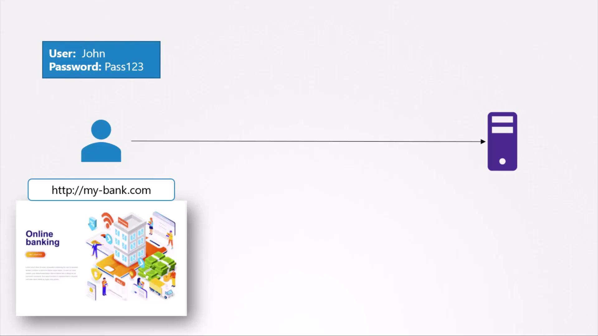
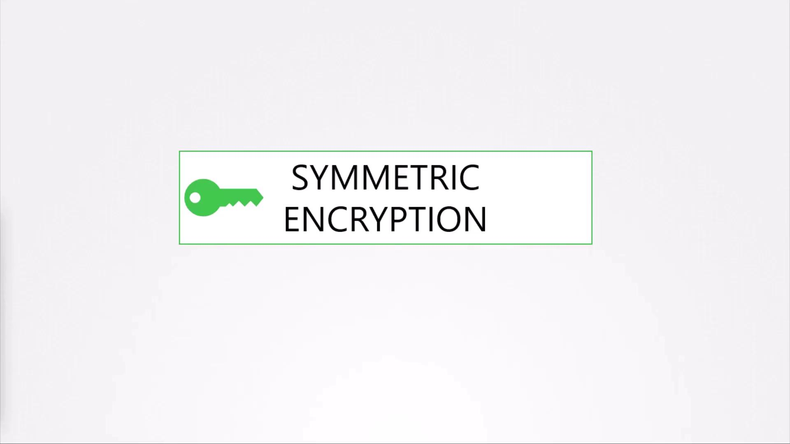
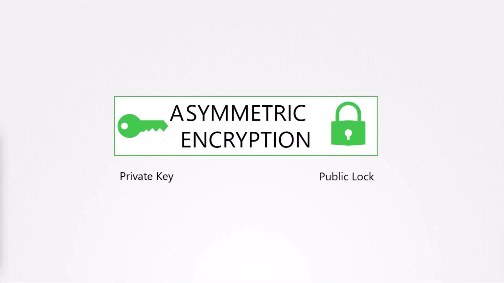

# 1. Create a Root CA
openssl genrsa -out ca.key 2048
openssl req -x509 -new -nodes -key ca.key -sha256 -days 365 \
  -out ca.crt \
  -subj "/C=US/ST=CA/O=MyOrg/CN=My Root CA"

# 2. Create Server Key & CSR
openssl genrsa -out server.key 2048
openssl req -new -key server.key -out server.csr \
  -subj "/C=US/ST=CA/O=MyOrg/CN=server.mybank.com"

# 3. Sign Server Certificate
openssl x509 -req -in server.csr -CA ca.crt -CAkey ca.key \
  -CAcreateserial -out server.crt -days 365 -sha256

# 4. Create Client Key & CSR
openssl genrsa -out client.key 2048
openssl req -new -key client.key -out client.csr \
  -subj "/C=US/ST=CA/O=MyOrg/CN=client.mybank.com"

# 5. Sign Client Certificate
openssl x509 -req -in client.csr -CA ca.crt -CAkey ca.key \
  -CAcreateserial -out client.crt -days 365 -sha256
```

## Securing Pod-to-Pod Communication in Kubernetes

In a Kubernetes cluster, you can enforce mTLS between services using service meshes like Istio or Linkerd. These platforms automate certificate issuance, rotation, and mutual authentication.

| Service Mesh | mTLS Support | Key Features                                  |
| ------------ | ------------ | --------------------------------------------- |
| Istio        | Built-in     | Policy-driven security, telemetry, routing.   |
| Linkerd      | Built-in     | Lightweight, auto-mTLS, simple configuration. |

## Links and References

* [Kubernetes Documentation: TLS Setup](https://kubernetes.io/docs/tasks/configure-pod-container/configure-ssl-tls/)
* [Istio Security Concepts](https://istio.io/latest/docs/concepts/security/)
* [Linkerd mTLS Guide](https://linkerd.io/2.11/tasks/automatic-mtls/)
* [RFC 5246: TLS 1.2 Specification](https://tools.ietf.org/html/rfc5246)

<CardGroup>
  <Card title="Watch Video" icon="video" href="https://learn.kodekloud.com/user/courses/kubernetes-and-cloud-native-security-associate-kcsa/module/8f0d5517-7d43-4d97-871d-234bb4503f7f/lesson/9e15339a-d05f-4c9c-ab66-427e84d1dae5" />
</CardGroup>


# Connectivity TLS Basics

Source: https://notes.kodekloud.com/docs/Kubernetes-and-Cloud-Native-Security-Associate-KCSA/Platform-Security/Connectivity-TLS-Basics/page

This article explains SSL/TLS certificates, encryption types, securing SSH access, digital certificates, and mutual TLS for secure communications.

## Introduction to SSL/TLS Certificates

Secure Sockets Layer (SSL) and Transport Layer Security (TLS) certificates establish trust and encrypt data between clients and servers. Without them, sensitive information—such as banking credentials—travels in plaintext and can be intercepted.

<Frame>
  
</Frame>

## Symmetric vs. Asymmetric Encryption

### Symmetric Encryption

Symmetric encryption uses a single secret key for both encryption and decryption. While efficient, distributing the shared key securely is challenging—if the key is intercepted, the data is compromised.

<Frame>
  
</Frame>

### Asymmetric Encryption

Asymmetric encryption solves the key-distribution problem by using a key pair:

* **Private Key**: Kept secret by the owner.
* **Public Key (Lock)**: Distributed openly.

Data encrypted with the public key can only be decrypted by the corresponding private key.

<Frame>
  
</Frame>

| Encryption Type | Key(s)                        | Use Case                              |
| --------------- | ----------------------------- | ------------------------------------- |
| Symmetric       | Single shared secret          | Bulk data transfer (e.g., HTTPS bulk) |
| Asymmetric      | Public key + Private key pair | Key exchange, digital signatures      |

## Securing SSH Access with Key Pairs

SSH replaces password logins with an asymmetric key pair:

```bash theme={null}
ssh-keygen
