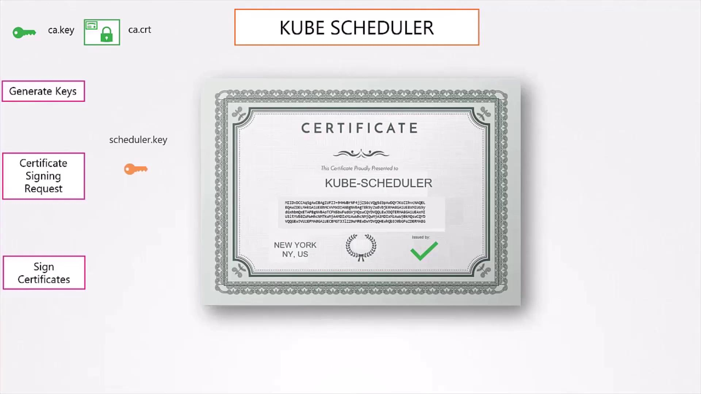
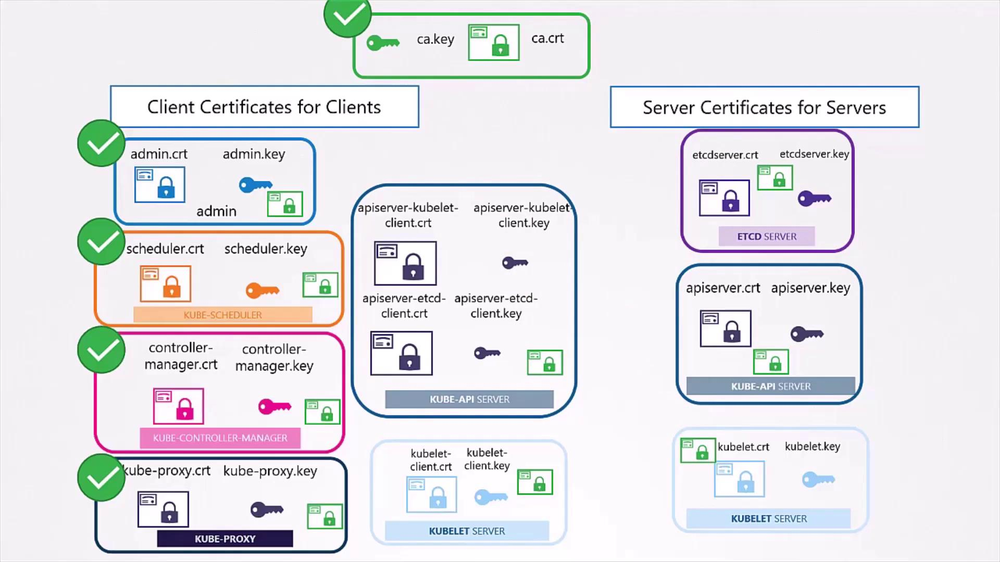

# K8s PKI Certificate Creation

Source: https://notes.kodekloud.com/docs/Kubernetes-and-Cloud-Native-Security-Associate-KCSA/Platform-Security/K8s-PKI-Certificate-Creation/page

Generate TLS certificates for securing a Kubernetes cluster using OpenSSL, including CA, client, and server certificates.

Secure your Kubernetes cluster by generating TLS certificates using OpenSSL. This guide walks through creating a root Certificate Authority (CA), issuing client certificates for users and system components, and setting up server certificates for etcd, the API server, and kubelet nodes.

<Callout icon="lightbulb">
  * Ensure OpenSSL is installed (`openssl version`).
  * Work in a secure directory with strict file permissions.
  * Replace placeholder IPs, hostnames, and node names to match your environment.
</Callout>

## Certificate Overview

| Artifact                              | Purpose                                  | Example Command Snippet                  |
| ------------------------------------- | ---------------------------------------- | ---------------------------------------- |
| `ca.key` / `ca.crt`                   | Root CA private key and self-signed cert | `openssl genrsa -out ca.key 2048`        |
| `admin.key` / `admin.crt`             | Cluster-admin user credentials           | `openssl req -new -key admin.key…`       |
| `etcd-server.key` / `etcd-server.crt` | etcd server TLS pair                     | `openssl x509 -req -in etcd-server.csr…` |

***

## 1. Generate the CA Certificate

Protect your CA private key at all costs—this key signs every other certificate in your cluster.

<Callout icon="triangle-alert">
  Protect `ca.key` securely. If compromised, all cluster certificates become untrusted.
</Callout>

```bash theme={null}
openssl genrsa -out ca.key 2048
openssl req -new -key ca.key -subj "/CN=KUBERNETES-CA" -out ca.csr
openssl x509 -req -in ca.csr -signkey ca.key -out ca.crt
```

* **ca.key**: Private key for your root CA.
* **ca.csr**: Certificate Signing Request with CA identity.
* **ca.crt**: Self-signed root certificate trusted by all components.

***

## 2. Generate Client Certificates

Client certificates authenticate users and system services to the API server. All CSRs are signed by the root CA.

### 2.1 Admin User

Create a key, CSR, and certificate for the cluster administrator. Membership in `system:masters` grants full control.

```bash theme={null}
openssl genrsa -out admin.key 2048
openssl req -new -key admin.key \
  -subj "/CN=kube-admin/O=system:masters" \
  -out admin.csr
openssl x509 -req -in admin.csr \
  -CA ca.crt -CAkey ca.key \
  -out admin.crt
```

* **Common Name (CN)**: Identifier seen in API audit logs.
* **Organization (O)**: Group membership.

### 2.2 System Component Users

Repeat the process for each Kubernetes control-plane component:

* kube-scheduler
* kube-controller-manager
* kube-proxy

<Frame>
  
</Frame>

Each CSR’s CN must be prefixed with `system:` (e.g., `/CN=system:kube-scheduler`).

***

## 3. Using Client Certificates

You can invoke the API directly with `curl`:

```bash theme={null}
curl https://kube-apiserver:6443/api/v1/pods \
  --key admin.key \
  --cert admin.crt \
  --cacert ca.crt
```

Or embed credentials in a `kubeconfig` file:

```yaml theme={null}
apiVersion: v1
clusters:
- cluster:
    certificate-authority: ca.crt
    server: https://kube-apiserver:6443
  name: kubernetes
contexts:
- context:
    cluster: kubernetes
    user: kube-admin
  name: admin-context
current-context: admin-context
kind: Config
users:
- name: kube-admin
  user:
    client-certificate: admin.crt
    client-key: admin.key
```

Most Kubernetes clients leverage `kubeconfig` to manage certificates and endpoints.

***

## 4. Server-Side Certificates

All Kubernetes servers must trust the CA root (`ca.crt`) and present valid certificates signed by it.

<Frame>
  
</Frame>

### 4.1 etcd Server and Peers

Generate a certificate for the etcd server and peers in HA clusters:

```bash theme={null}
openssl genrsa -out etcd-server.key 2048
openssl req -new -key etcd-server.key \
  -subj "/CN=etcd-server" \
  -out etcd-server.csr
openssl x509 -req -in etcd-server.csr \
  -CA ca.crt -CAkey ca.key \
  -out etcd-server.crt
```

For peer communication, use `/CN=etcd-peer`. Then configure your `etcd` service:

```yaml theme={null}
