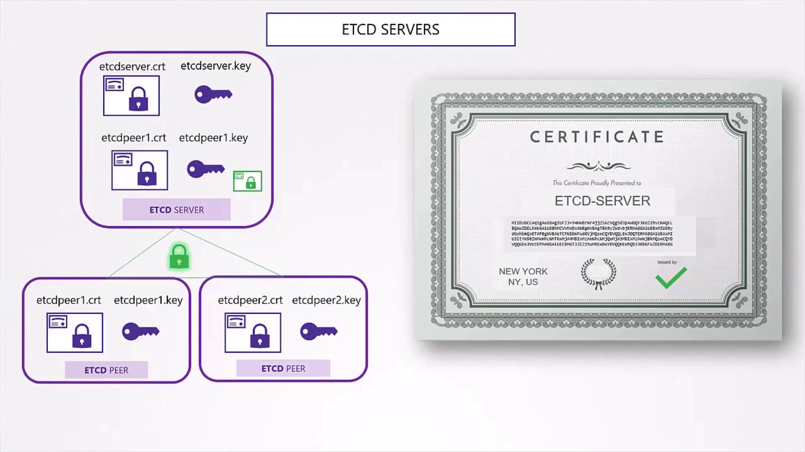
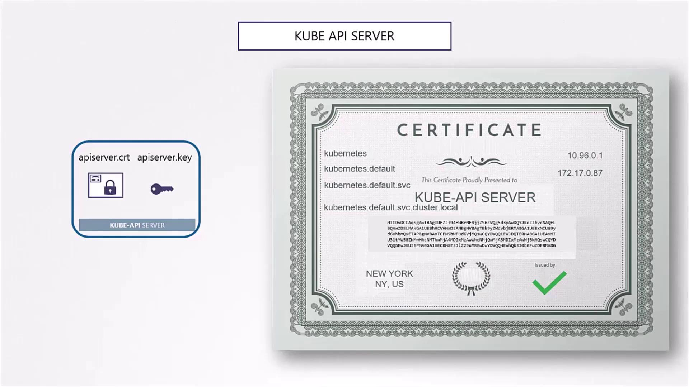
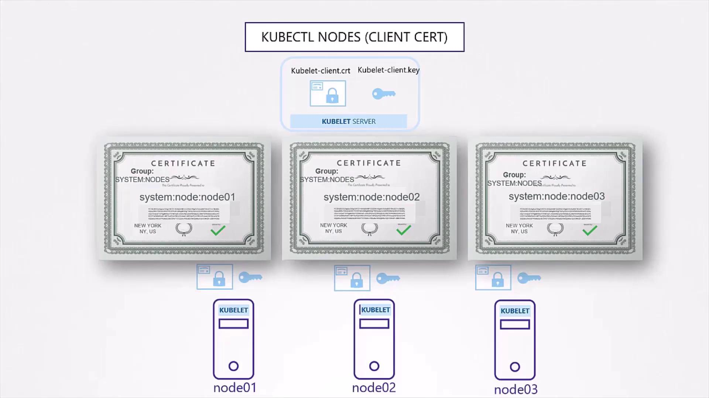
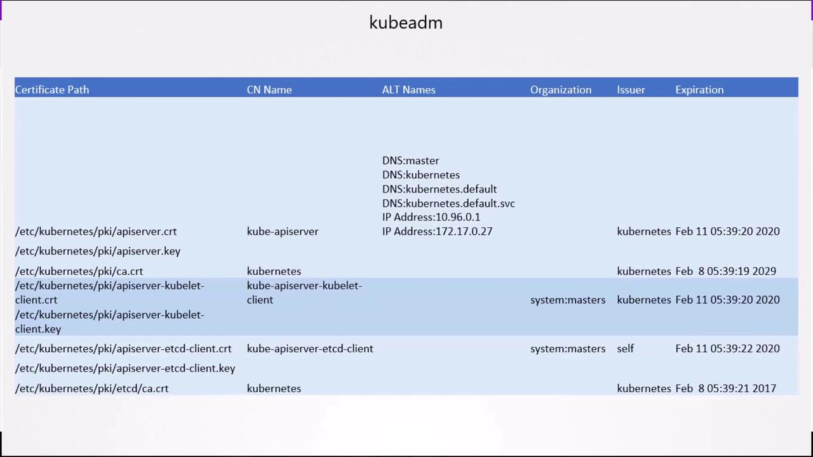

# etcd.yaml
etcd:
  --advertise-client-urls=https://127.0.0.1:2379
  --listen-client-urls=https://127.0.0.1:2379
  --cert-file=/path-to-certs/etcd-server.crt
  --key-file=/path-to-certs/etcd-server.key
  --client-cert-auth=true
  --trusted-ca-file=/path-to-certs/ca.crt
  --listen-peer-urls=https://127.0.0.1:2380
  --initial-advertise-peer-urls=https://127.0.0.1:2380
  --peer-cert-file=/path-to-certs/etcd-peer.crt
  --peer-key-file=/path-to-certs/etcd-peer.key
  --peer-client-cert-auth=true
  --peer-trusted-ca-file=/path-to-certs/ca.crt
```

<Frame>
  
</Frame>

### 4.2 kube-apiserver

The API server certificate must cover all DNS names and IP addresses used by the service. Create an OpenSSL config (`openssl.cnf`) with an `[ alt_names ]` section:

```ini theme={null}
[ req ]
distinguished_name = req_distinguished_name
req_extensions     = v3_req

[ v3_req ]
subjectAltName = @alt_names

[ alt_names ]
DNS.1 = kube-apiserver
DNS.2 = kubernetes
DNS.3 = kubernetes.default
DNS.4 = kubernetes.default.svc
DNS.5 = kubernetes.default.svc.cluster.local
IP.1  = 10.32.0.1
# Add more IPs/hostnames as needed
```

Generate and sign the CSR:

```bash theme={null}
openssl genrsa -out apiserver.key 2048
openssl req -new -key apiserver.key \
  -subj "/CN=kube-apiserver" \
  -config openssl.cnf \
  -out apiserver.csr
openssl x509 -req -in apiserver.csr \
  -CA ca.crt -CAkey ca.key \
  -extensions v3_req \
  -extfile openssl.cnf \
  -out apiserver.crt
```

<Frame>
  
</Frame>

Configure the API server service:

```bash theme={null}
ExecStart=/usr/local/bin/kube-apiserver \
  --advertise-address=${INTERNAL_IP} \
  --bind-address=0.0.0.0 \
  --etcd-servers=https://127.0.0.1:2379 \
  --etcd-cafile=/var/lib/kubernetes/ca.crt \
  --etcd-certfile=/var/lib/kubernetes/apiserver-etcd-client.crt \
  --etcd-keyfile=/var/lib/kubernetes/apiserver-etcd-client.key \
  --client-ca-file=/var/lib/kubernetes/ca.crt \
  --tls-cert-file=/var/lib/kubernetes/apiserver.crt \
  --tls-private-key-file=/var/lib/kubernetes/apiserver.key \
  --kubelet-certificate-authority=/var/lib/kubernetes/ca.crt \
  --kubelet-client-certificate=/var/lib/kubernetes/apiserver-kubelet-client.crt \
  --kubelet-client-key=/var/lib/kubernetes/apiserver-kubelet-client.key \
  --service-account-key-file=/var/lib/kubernetes/service-account.pem \
  --authorization-mode=Node,RBAC \
  --service-cluster-ip-range=10.32.0.0/24 \
  --service-node-port-range=30000-32767 \
  --v=2
```

### 4.3 Kubelet Server

Each Kubernetes node requires its own TLS certificate named after the node:

```bash theme={null}
openssl genrsa -out kubelet-node01.key 2048
openssl req -new -key kubelet-node01.key \
  -subj "/CN=system:node:node01/O=system:nodes" \
  -out kubelet-node01.csr
openssl x509 -req -in kubelet-node01.csr \
  -CA ca.crt -CAkey ca.key \
  -out kubelet-node01.crt
```

* **CN**: `system:node:<nodeName>`
* **O**: `system:nodes`

Embed the certificates in the kubelet configuration (`/var/lib/kubelet/config.yaml`):

```yaml theme={null}
kind: KubeletConfiguration
apiVersion: kubelet.config.k8s.io/v1beta1
authentication:
  x509:
    clientCAFile: "/var/lib/kubernetes/ca.crt"
authorization:
  mode: Webhook
clusterDomain: "cluster.local"
clusterDNS:
  - "10.32.0.10"
podCIDR: "${POD_CIDR}"
resolvConf: "/run/systemd/resolve/resolv.conf"
runtimeRequestTimeout: "15m"
tlsCertFile: "/var/lib/kubelet/kubelet-node01.crt"
tlsPrivateKeyFile: "/var/lib/kubelet/kubelet-node01.key"
```

<Frame>
  
</Frame>

***

That completes the Kubernetes PKI certificate generation process. For automation, explore how `kubeadm` handles this [in the docs](https://kubernetes.io/docs/reference/setup-tools/kubeadm/kubeadm-certs/).

## Links and References

* [Kubernetes TLS Bootstrapping](https://kubernetes.io/docs/reference/command-line-tools-reference/kubelet-tls-bootstrapping/)
* [OpenSSL Documentation](https://www.openssl.org/docs/)
* [Kubernetes Certificates with kubeadm](https://kubernetes.io/docs/reference/setup-tools/kubeadm/kubeadm-certs/)

<CardGroup>
  <Card title="Watch Video" icon="video" href="https://learn.kodekloud.com/user/courses/kubernetes-and-cloud-native-security-associate-kcsa/module/8f0d5517-7d43-4d97-871d-234bb4503f7f/lesson/1ec5483f-4641-4e58-af0c-a9b5b2b1357f" />
</CardGroup>


# K8s PKI View Certificate Details

Source: https://notes.kodekloud.com/docs/Kubernetes-and-Cloud-Native-Security-Associate-KCSA/Platform-Security/K8s-PKI-View-Certificate-Details/page

This guide explains how to locate, inspect, and verify TLS certificates in a Kubernetes cluster for certificate health checks.

In this guide, you’ll learn how to locate, inspect, and verify all TLS certificates in an existing Kubernetes cluster. As a cluster administrator, performing a certificate health check ensures control-plane components and nodes trust the correct Certificate Authority (CA) and have valid, unexpired certificates.

## 1. Cluster Provisioning Methods

First, determine how your control-plane is deployed. This affects where certificate files live and how services reference them.

### 1.1 Manual Deployment (Native OS Services)

When Kubernetes components are managed by **systemd**, certificate flags appear in each service unit. For example, view the API server unit:

```bash theme={null}
cat /etc/systemd/system/kube-apiserver.service
[Service]
ExecStart=/usr/local/bin/kube-apiserver \
  --advertise-address=172.17.0.32 \
  --client-ca-file=/var/lib/kubernetes/ca.pem \
  --etcd-cafile=/var/lib/kubernetes/ca.pem \
  --etcd-certfile=/var/lib/kubernetes/kubernetes.pem \
  --etcd-keyfile=/var/lib/kubernetes/kubernetes-key.pem \
  --kubelet-certificate-authority=/var/lib/kubernetes/ca.pem \
  --kubelet-client-cert-file=/var/lib/kubernetes/kubelet-client.crt \
  --kubelet-client-key=/var/lib/kubernetes/kubelet-client.key \
  --tls-cert-file=/var/lib/kubernetes/kubernetes.crt \
  --tls-private-key-file=/var/lib/kubernetes/kubernetes-key.pem \
  --allow-privileged=true \
  --service-node-port-range=30000-32767 \
  --v=2
```

### 1.2 kubeadm Deployment (Static Pods)

With **kubeadm**, control-plane components run as static pods. Check the manifest under `/etc/kubernetes/manifests/kube-apiserver.yaml`:

```yaml theme={null}
apiVersion: v1
kind: Pod
metadata:
  name: kube-apiserver
  namespace: kube-system
spec:
  containers:
  - name: kube-apiserver
    image: k8s.gcr.io/kube-apiserver:v1.X.Y
    command:
      - kube-apiserver
      - --client-ca-file=/etc/kubernetes/pki/ca.crt
      - --etcd-cafile=/etc/kubernetes/pki/etcd/ca.crt
      - --etcd-certfile=/etc/kubernetes/pki/apiserver-etcd-client.crt
      - --etcd-keyfile=/etc/kubernetes/pki/apiserver-etcd-client.key
      - --kubelet-client-certificate=/etc/kubernetes/pki/apiserver-kubelet-client.crt
      - --kubelet-client-key=/etc/kubernetes/pki/apiserver-kubelet-client.key
      - --tls-cert-file=/etc/kubernetes/pki/apiserver.crt
      - --tls-private-key-file=/etc/kubernetes/pki/apiserver.key
      - --service-account-key-file=/etc/kubernetes/pki/sa.pub
      - --secure-port=6443
      - --service-cluster-ip-range=10.96.0.0/12
      - --authorization-mode=Node,RBAC
```

## 2. Gather Certificate Paths

Extract every file path ending in `.crt`, `.key`, or `.pem` from service units or manifests.

| File Extension | Description                |
| -------------- | -------------------------- |
| .crt           | X.509 certificate          |
| .key           | Private key                |
| .pem           | Certificate or private key |

<Callout icon="lightbulb">
  Track each certificate’s path along with its Common Name (CN), Subject Alternative Names (SANs), issuer, organization (O), and expiration date.
</Callout>

## 3. Inspect Certificates with OpenSSL

For each certificate file, run:

```bash theme={null}
openssl x509 -in /etc/kubernetes/pki/apiserver.crt -text -noout
```

Key fields to verify:

* **Subject**: confirms the CN (e.g., `CN=kube-apiserver`)
* **X509v3 Subject Alternative Name**: ensure all required IPs/DNS entries exist
* **Issuer**: usually the Kubernetes CA (`O=kubernetes`)
* **Validity**: check `Not Before` and `Not After` dates for expiry

<Callout icon="triangle-alert">
  Expired or misconfigured certificates can prevent API server communication. Always verify the `Not After` date to avoid downtime!
</Callout>

## 4. Document Certificate Metadata

Organize certificate details in a spreadsheet or table for easy tracking. An example layout:

<Frame>
  
</Frame>

Refer to the [official Kubernetes certificates documentation](https://kubernetes.io/docs/concepts/cluster-administration/certificates/) for certificate requirements and best practices.

## 5. Troubleshooting and Logs

If a component fails due to certificate issues, view logs to pinpoint TLS errors.

### 5.1 Native Services

```bash theme={null}
journalctl -u etcd.service -l
```

Sample output snippet:

```plaintext theme={null}
2019-02-13T02:53:28.185353Z I | embed: ClientTLS: cert = /etc/kubernetes/pki/etcd/server.crt, key = /etc/kubernetes/pki/etcd/server.key
WARNING: transport: authentication handshake failed: remote error: tls: bad certificate
```

### 5.2 kubeadm (Static Pods)

Fetch API server logs:

```bash theme={null}
kubectl -n kube-system logs kube-apiserver-<node-name>
```

If `kubectl` is unavailable, use Docker:

```bash theme={null}
docker ps -a
docker logs <container-id>
```

***

## Links and References

* [Kubernetes Certificates](https://kubernetes.io/docs/concepts/cluster-administration/certificates/)
* [OpenSSL x509 Documentation](https://www.openssl.org/docs/man1.1.1/man1/openssl-x509.html)
* [kubeadm Init Certificates](https://kubernetes.io/docs/reference/setup-tools/kubeadm/kubeadm-init/#certificate-key)

<CardGroup>
  <Card title="Watch Video" icon="video" href="https://learn.kodekloud.com/user/courses/kubernetes-and-cloud-native-security-associate-kcsa/module/8f0d5517-7d43-4d97-871d-234bb4503f7f/lesson/51d1ce51-9556-426f-96ef-813db6a288b4" />

  <Card title="Practice Lab" icon="installation" href="https://learn.kodekloud.com/user/courses/kubernetes-and-cloud-native-security-associate-kcsa/module/8f0d5517-7d43-4d97-871d-234bb4503f7f/lesson/9c9acf86-2ae2-417b-9f84-c6a476e6edf5" />
</CardGroup>
