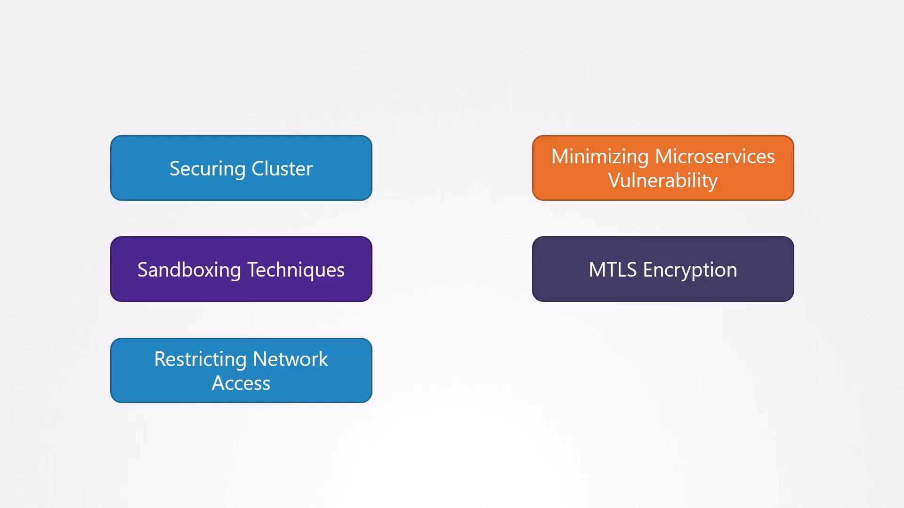
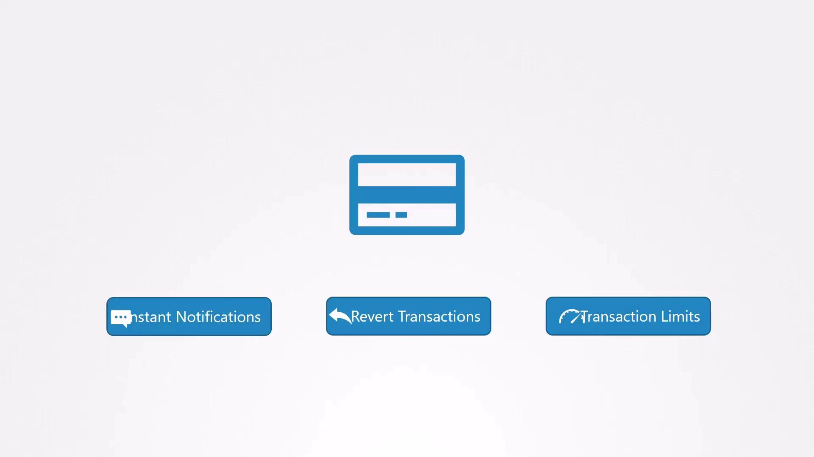
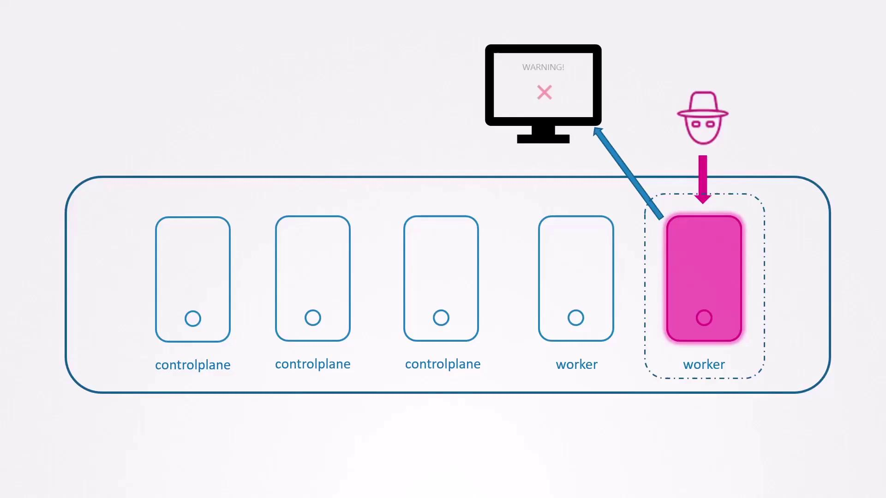
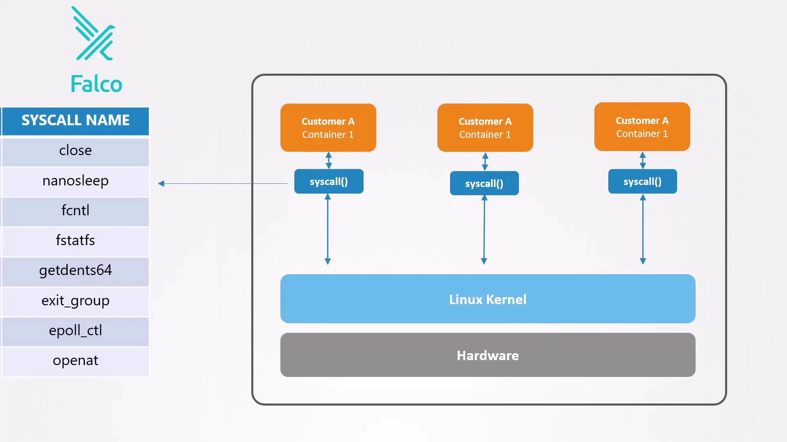

# Add the Falco GPG key and apt repo
curl -s https://falco.org/repo/falcosecurity-3672BA8F.asc | apt-key add -
echo "deb https://download.falco.org/packages/deb stable main" \
  | tee /etc/apt/sources.list.d/falcosecurity.list

# Update and install
apt-get update -y
apt-get install -y linux-headers-$(uname -r) falco

# Enable and start the Falco service
systemctl enable --now falco
```

### Deploying Falco in Kubernetes via Helm

If you’re on a managed Kubernetes service or prefer Kubernetes-native deployment, use Helm to install Falco as a DaemonSet:

<Callout icon="lightbulb">
  You can customize Falco’s configuration by passing values files (`-f values.yaml`) to `helm install`.
</Callout>

```bash theme={null}
# Add the Falco Helm repository
helm repo add falcosecurity https://falcosecurity.github.io/charts
helm repo update

# Install Falco
helm install falco falcosecurity/falco
```

After installation, verify that Falco agents are running on each node:

```bash theme={null}
kubectl get pods -l app=falco
# Example output:
# NAME         READY   STATUS    RESTARTS   AGE
# falco-7grdt  1/1     Running   0          2m21s
# falco-tmq28  1/1     Running   0          2m21s
```

## Next Steps

* Customize or create [Falco rules](https://falco.org/docs/rules/) to detect specific threats.
* Integrate alerts with your SIEM, Slack, or PagerDuty for real-time notifications.
* Monitor Falco logs and metrics to fine-tune performance and rule accuracy.

## Links and References

* [Falco Documentation](https://falco.org/docs/)
* [Kubernetes Official Docs](https://kubernetes.io/docs/)
* [Aqua Security Tracee (eBPF)](https://github.com/aquasecurity/tracee)

<CardGroup>
  <Card title="Watch Video" icon="video" href="https://learn.kodekloud.com/user/courses/kubernetes-and-cloud-native-security-associate-kcsa/module/8f0d5517-7d43-4d97-871d-234bb4503f7f/lesson/21203b3d-64b3-4ed1-ab02-2a111b6e7e9d" />
</CardGroup>


# Observability Overview

Source: https://notes.kodekloud.com/docs/Kubernetes-and-Cloud-Native-Security-Associate-KCSA/Platform-Security/Observability-Overview/page

This article explores monitoring Kubernetes clusters for abnormal behavior, cyber attacks, and security breaches using observability techniques and tools like Falco.

In this lesson, we’ll explore how to monitor your Kubernetes clusters for abnormal behavior, ongoing cyber attacks, and security breaches. Even with hardened control planes, workload isolation, sandboxing, mTLS, and strict network policies, attackers may eventually find a way in. Observability lets us detect compromises early, reduce the blast radius, and recover swiftly.

Throughout this course, we’ve covered techniques to secure Kubernetes infrastructure:

<Frame>
  
</Frame>

## Why Early Detection Matters

It might seem that once an attacker breaches your perimeter, the damage is done. However, just as banks now send instant alerts for credit card transactions to limit fraud, rapid detection in Kubernetes prevents lateral movement and stops attackers before they can escalate privileges or exfiltrate data.

## Real-World Analogy: Credit Card Alerts

Imagine your debit card is stolen. In the past, you might not notice fraudulent withdrawals until reviewing your statement days later. Today, banks send instant notifications, allow you to revert unauthorized transactions, and let you set spending limits:

<Frame>
  
</Frame>

Similarly, when a container is compromised:

* Instant alerts tell you *when* and *where* the breach happened.
* Automated workflows can isolate or replace affected pods.
* Policy limits (e.g., resource quotas, network policies) contain the impact.

## Detecting Breaches in Kubernetes

Once a container is breached, rapid detection prevents further spread:

<Frame>
  
</Frame>

What we need is a runtime security tool that inspects syscalls and flags suspicious activities in real time. Enter **Falco**.

## Introducing Falco

[Falco](https://falco.org) is an open-source runtime security project by Sysdig. It hooks into the Linux kernel to capture syscalls from containers and applies rules to detect:

<Frame>
  
</Frame>

* **Unexpected shell access** inside a container
* **Reading sensitive files** like `/etc/shadow`
* **Deleting or truncating logs** to cover tracks

<Callout icon="lightbulb">
  Falco requires privileged permissions to monitor syscalls. Make sure to deploy it with appropriate security contexts and RBAC settings.
</Callout>

## Common Indicators of Compromise

| Suspicious Activity               | Description                                                 |
| --------------------------------- | ----------------------------------------------------------- |
| Unexpected shell in container     | `kubectl exec -ti <pod> -- bash` opens an interactive shell |
| Accessing password hashes         | `cat /etc/shadow`                                           |
| Deleting or truncating audit logs | `> /opt/logs/audit.log`                                     |

Example session that Falco would flag:

```bash theme={null}
