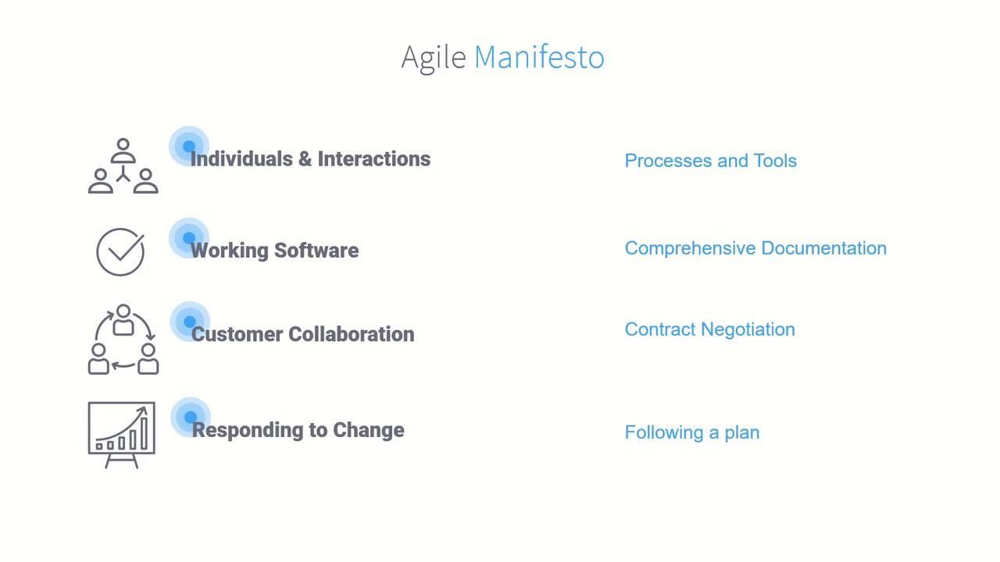
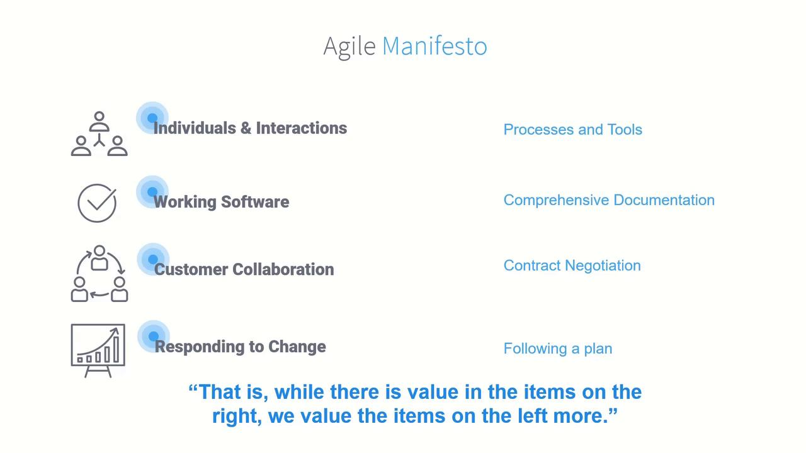
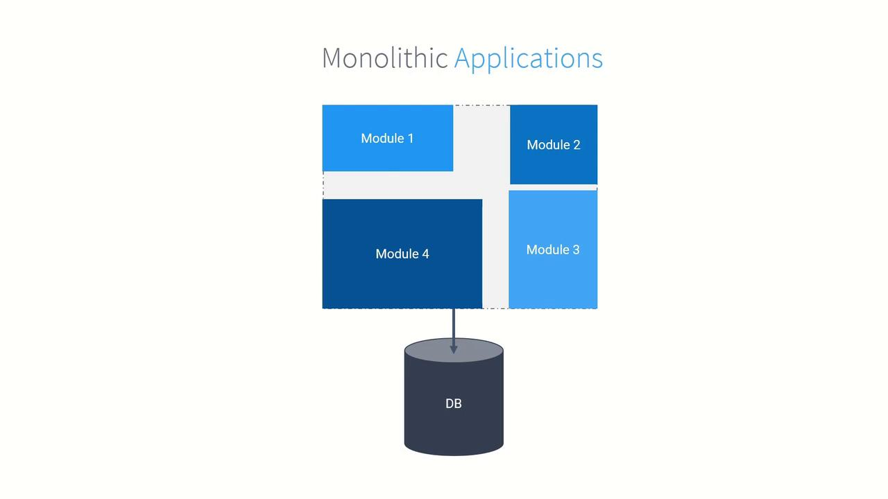
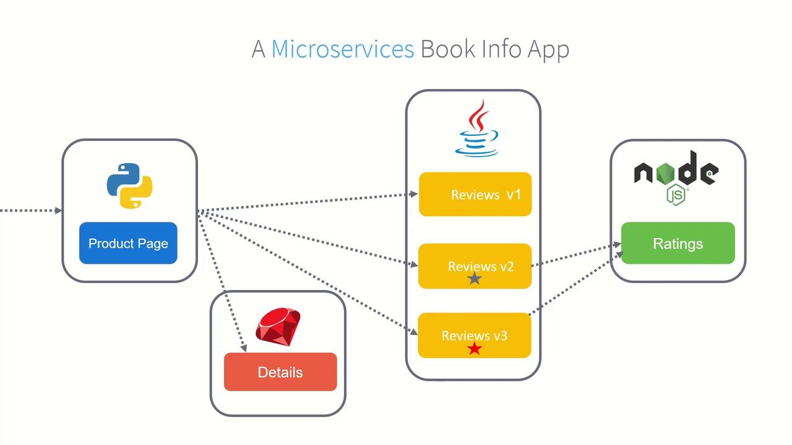
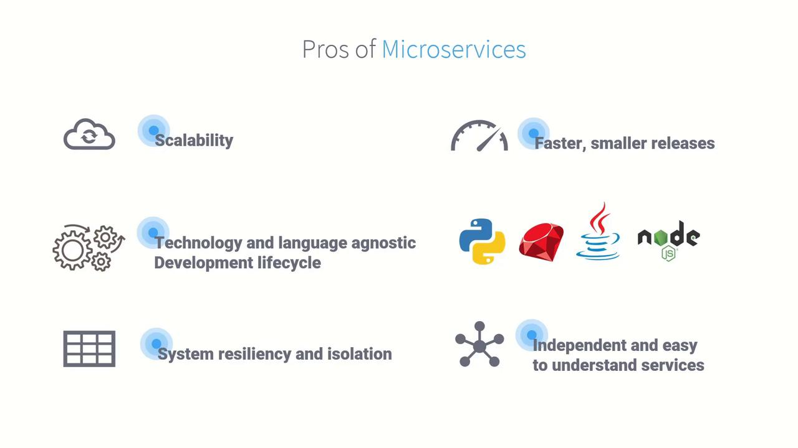
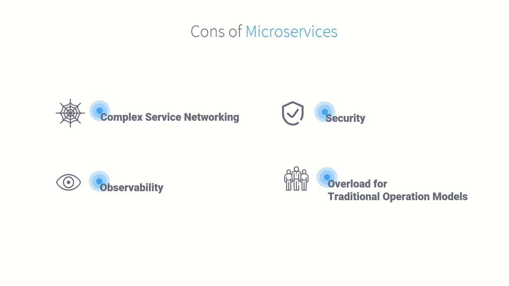

# Example: Inject Envoy sidecars into a namespace
kubectl label namespace default istio-injection=enabled
```

### Istio Agent

The Istio Agent runs as a sidecar alongside Envoy. It bootstraps the proxy, delivers configuration and certificates, and ensures Envoy stays up to date:

* Retrieves x.509 certificates for mTLS
* Streams dynamic configuration to Envoy via SDS/CDS
* Monitors proxy health and restarts on failure

<Callout icon="triangle-alert">
  Ensure that your Istio Agent has access to the correct ServiceAccount and RBAC permissions; misconfiguration can prevent certificate delivery and break service-to-service TLS.
</Callout>

## Quick Reference Table

| Component   | Plane         | Responsibility                                                         |
| ----------- | ------------- | ---------------------------------------------------------------------- |
| Istiod      | Control Plane | Configuration distribution, policy enforcement, certificate management |
| Envoy       | Data Plane    | Traffic management, telemetry collection, security enforcement         |
| Istio Agent | Data Plane    | Proxy bootstrap, configuration & certificate delivery                  |

## Links and References

* [Istio Official Site](https://istio.io/)
* [Kubernetes Documentation](https://kubernetes.io/docs/)
* [Envoy Proxy](https://www.envoyproxy.io/)
* [Service Mesh Patterns](https://docs.microsoft.com/azure/architecture/patterns/service-mesh)

<CardGroup>
  <Card title="Watch Video" icon="video" href="https://learn.kodekloud.com/user/courses/kubernetes-and-cloud-native-security-associate-kcsa/module/8f0d5517-7d43-4d97-871d-234bb4503f7f/lesson/55123797-80f2-42ec-ae37-57d6478d3c2b" />
</CardGroup>


# Service Mesh Monolithics vs Microservices

Source: https://notes.kodekloud.com/docs/Kubernetes-and-Cloud-Native-Security-Associate-KCSA/Platform-Security/Service-Mesh-Monolithics-vs-Microservices/page

This article discusses the evolution from monolithic applications to microservices and the role of Service Meshes in modern cloud-native environments.

Before diving into [Service Mesh](https://en.wikipedia.org/wiki/Service_mesh) and [Istio](https://istio.io/), it helps to understand how software architecture has evolved—from monolithic applications to distributed microservices. This background sets the stage for why Service Meshes are crucial in modern cloud-native environments.

## Evolution of Software Development

### The Agile Revolution

In the early 2000s, lengthy, rigid development cycles often meant that delivered software no longer matched business needs. The publication of the [Agile Manifesto](https://agilemanifesto.org/) in 2001 ushered in a new era:

> We value **Individuals & Interactions** over processes and tools\
> **Working Software** over comprehensive documentation\
> **Customer Collaboration** over contract negotiation\
> **Responding to Change** over following a plan

<Frame>
  
</Frame>

This shift encouraged faster feedback loops, closer customer engagement, and iterative releases that adapt to real-world feedback.

<Frame>
  
</Frame>

## Why Break Up Monoliths?

Monolithic applications bundle all features—presentation, business logic, data access—into a single deployable unit. While simple at first, they become bottlenecks for scaling, team autonomy, and innovation.

### Monolithic Architecture

A **monolith** shares one codebase, one process, and typically a single database. Any update, no matter how small, requires redeploying the entire system.

<Frame>
  
</Frame>

#### Example: Book Info Monolith

Imagine a Book Info application in Java containing:

* **Details**
* **Reviews**
* **Ratings**
* **Product Page**

All modules live in one jar, calling each other and sharing a database.

<Frame>
  
</Frame>

Key drawbacks of this approach:

* Any change requires a full redeploy.
* You scale all modules together, even if only one needs it.
* Introducing new languages or modules means reworking the entire app.
* A single failure can bring down the whole system.

Over time, this pattern often devolves into a tangled “big ball of mud.”

<Frame>
  
</Frame>

<Callout icon="lightbulb">
  Refactoring a large monolith into services is a complex journey—both technically and culturally.
</Callout>

## Transition to Microservices

Breaking your application into independently deployable services addresses many monolithic drawbacks. In our Book Info example:

* **Product Page** → Python service
* **Details** → Ruby app
* **Reviews** → Java service (now with A/B versions: no stars, black stars, red stars)
* **Ratings** → Node.js microservice

Users still see a unified page, but each component is separately scalable and upgradable.

<Frame>
  
</Frame>

### Benefits of Microservices

| Benefit                | Description                                    |
| ---------------------- | ---------------------------------------------- |
| Scalability            | Scale only the services under load             |
| Faster Releases        | Deploy small changes independently             |
| Technology Agnosticism | Use the best language or framework per service |
| Resilience             | Isolate failures and limit blast radius        |
| Team Autonomy          | Teams own services end-to-end                  |

<Frame>
  
</Frame>

### New Challenges with Microservices

While microservices solve many monolithic issues, they introduce cross-cutting concerns:

| Challenge            | Impact                                                            |
| -------------------- | ----------------------------------------------------------------- |
| Service Discovery    | How services locate and communicate with each other               |
| Security             | Encrypting and authenticating inter-service and client-to-service |
| Observability        | Correlating logs, metrics, and traces across distributed services |
| Operational Overhead | Managing multiple frameworks, languages, and deployment patterns  |

<Frame>
  
</Frame>

<Callout icon="triangle-alert">
  Without a consistent platform for networking, security, and telemetry, microservices can become as difficult to manage as monoliths.
</Callout>

Emerging practices like [DevOps](https://en.wikipedia.org/wiki/DevOps) bridge development and operations, but a dedicated layer—namely a Service Mesh—is often needed to handle these complexities at scale.

***

In upcoming sections, we’ll explore how Service Meshes simplify networking, security, and observability across microservices.

## References

* [Agile Manifesto](https://agilemanifesto.org/)
* [Service Mesh Overview](https://en.wikipedia.org/wiki/Service_mesh)
* [Istio](https://istio.io/)

<CardGroup>
  <Card title="Watch Video" icon="video" href="https://learn.kodekloud.com/user/courses/kubernetes-and-cloud-native-security-associate-kcsa/module/8f0d5517-7d43-4d97-871d-234bb4503f7f/lesson/c8305051-1ba7-4616-8bb6-7fb79c74076a" />
</CardGroup>
