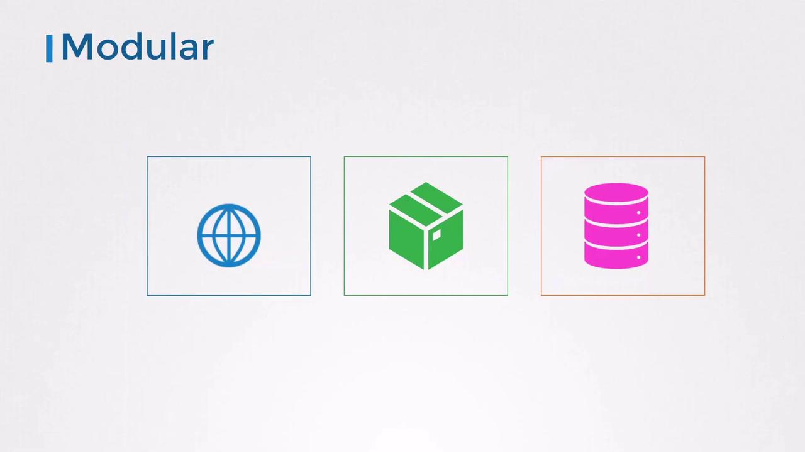
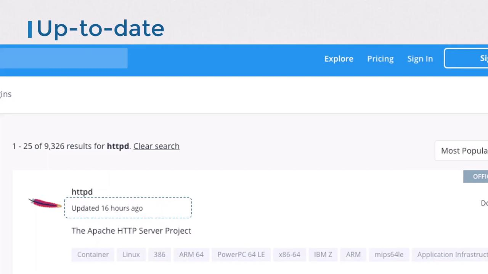
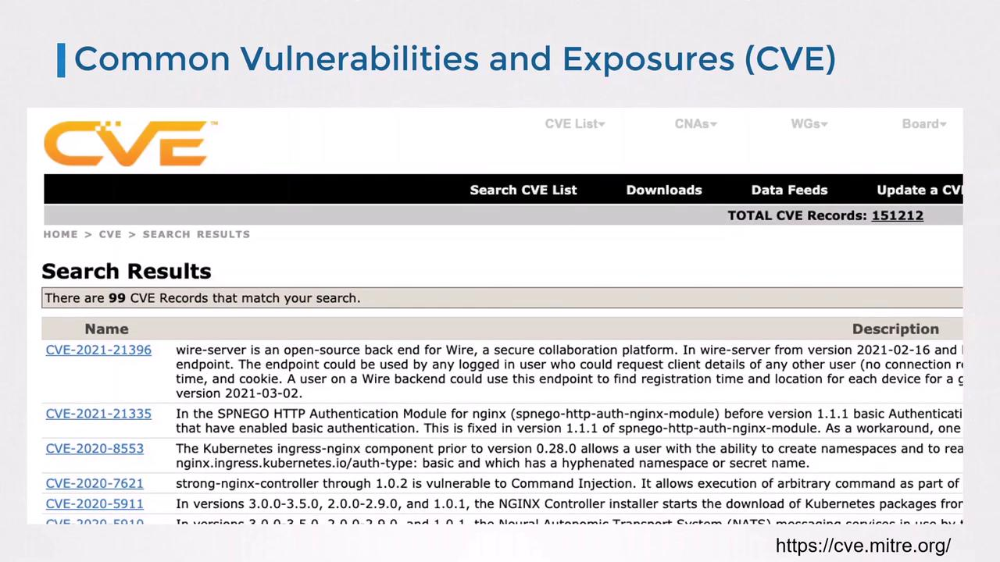
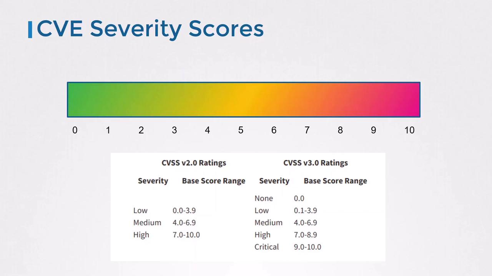
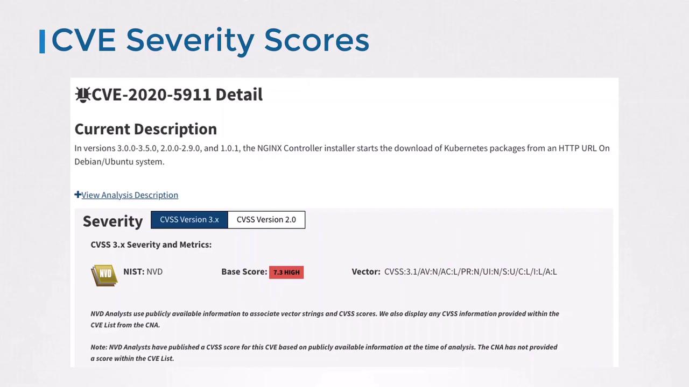
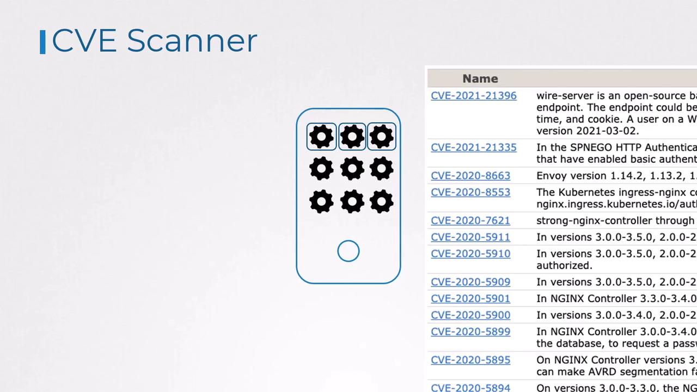

# 1. Your application image
FROM httpd
COPY index.html /usr/local/apache2/htdocs/index.html
```

Here, `httpd` is the *parent*. But what is `httpd` built from?

```dockerfile theme={null}
# 2. The httpd image
FROM debian:buster-slim
ENV HTTPD_PREFIX=/usr/local/apache2
ENV PATH=$HTTPD_PREFIX/bin:$PATH
WORKDIR $HTTPD_PREFIX
# ...install Apache HTTP Server...
```

And finally:

```dockerfile theme={null}
# 3. The Debian image
FROM scratch
ADD rootfs.tar.xz /
CMD ["bash"]
```

When an image starts `FROM scratch`, it sits at the bottom of the chain—there are no layers beneath it.

<Callout icon="lightbulb">
  Images built `FROM scratch` are true minimal bases. Everything in your container must be added explicitly.
</Callout>

## Best Practices for Building Minimal Images

1. **Design for Modularity**\
   Build one service per image. Compose them together at runtime for scalability and separation of concerns.

<Frame>
  
</Frame>

2. **Keep Containers Stateless**\
   Containers should be ephemeral. Persist data in external volumes or managed services like [Redis](https://redis.io).

3. **Choose an Appropriate Base**\
   Official, regularly-updated images (e.g., `nginx`, `httpd`) reduce risk. Verify publishers and check update frequency.

   ```dockerfile theme={null}
   FROM httpd:2.4-alpine
   COPY index.html /usr/local/apache2/htdocs/index.html
   ```

<Frame>
  
</Frame>

4. **Keep Images Small**

   * Start from minimal OS distributions (Alpine, Debian Slim).
   * Only install required libraries.
   * Clean up caches and package metadata.
   * Remove build tools (`curl`, `wget`, package managers) after install.
   * Use multi-stage builds for production artifacts.

   | Strategy              | Description                             | Example Snippet                                                        |
   | --------------------- | --------------------------------------- | ---------------------------------------------------------------------- |
   | Multi-stage builds    | Separate build and runtime dependencies | `FROM golang:1.19 AS builder`<br />`RUN go build -o app .`             |
   | Minimal OS            | Use Alpine or slim variants             | `FROM python:3.10-alpine`                                              |
   | Cleanup after install | Remove package caches and temp files    | `RUN apk add --no-cache build-base && \`<br />`    apk del build-base` |

<Frame>
  
</Frame>

<Callout icon="triangle-alert">
  Leaving package managers or shells in production images increases the attack surface. Always strip out unused binaries.
</Callout>

One popular set of ultra-minimal images is [Google’s Distroless](https://github.com/GoogleContainerTools/distroless), which include only your app and runtime libraries—no shell, no package manager.

## Security Benefits of Minimal Images

Smaller images have fewer components to scan—and fewer vulnerabilities. For instance, scanning the Debian-based `httpd` image with [Trivy](https://github.com/aquasecurity/trivy) reports:

```bash theme={null}
trivy image httpd
httpd (debian 10.8)
====================
Total: 124 (UNKNOWN: 0, LOW: 88, MEDIUM: 9, HIGH: 25, CRITICAL: 2)
```

Switching to an Alpine-based `httpd` drops known issues to zero:

| Image                   | OS            | Total Vulnerabilities | High / Critical |
| ----------------------- | ------------- | --------------------- | --------------- |
| `httpd:2.4-buster-slim` | Debian Buster | 124                   | 27              |
| `httpd:2.4-alpine`      | Alpine Linux  | 0                     | 0               |

## References

* [Docker Official Images](https://hub.docker.com/search?q=\&type=image)
* [Trivy Vulnerability Scanner](https://github.com/aquasecurity/trivy)
* [Google Distroless Images](https://github.com/GoogleContainerTools/distroless)

<CardGroup>
  <Card title="Watch Video" icon="video" href="https://learn.kodekloud.com/user/courses/kubernetes-and-cloud-native-security-associate-kcsa/module/8f0d5517-7d43-4d97-871d-234bb4503f7f/lesson/03bf5b94-11ed-41a7-a8a0-0751868b8ba6" />
</CardGroup>


# Supply Chain Security Scan images for known vulnerabilities

Source: https://notes.kodekloud.com/docs/Kubernetes-and-Cloud-Native-Security-Associate-KCSA/Platform-Security/Supply-Chain-Security-Scan-images-for-known-vulnerabilities/page

This guide covers container image scanning, CVEs, CVSS ratings, and using Trivy to detect and remediate vulnerabilities in container images.

Container image scanning is a critical step in supply-chain security. In this guide, you’ll learn about CVEs, CVSS ratings, and how to use Trivy to automatically detect and remediate known vulnerabilities in your container images.

## What Is a CVE?

**Common Vulnerabilities and Exposures (CVE)** is the industry-standard database for public security flaws. Each vulnerability gets a unique identifier, helping you avoid duplicates and streamline research.

<Callout icon="lightbulb">
  Visit the [CVE Database](https://cve.mitre.org/) to search for published vulnerabilities and track remediation status.
</Callout>

<Frame>
  
</Frame>

Typical CVE categories include:

* Unauthorized access bypasses (e.g., confidential data exposure)
* Denial-of-service or performance degradation bugs

## Understanding CVSS Severity Ratings

The [Common Vulnerability Scoring System (CVSS)](https://www.first.org/cvss/) provides both a numeric score (0–10) and a qualitative severity label. Use the table below to interpret scores:

| Severity | CVSS Score Range |
| -------- | ---------------- |
| None     | 0.0              |
| Low      | 0.1 – 3.9        |
| Medium   | 4.0 – 6.9        |
| High     | 7.0 – 8.9        |
| Critical | 9.0 – 10.0       |

<Frame>
  
</Frame>

## Example: CVE-2020-5911

**CVE-2020-5911** affects the NGINX Ingress Controller installer on Debian/Ubuntu by downloading packages over HTTP instead of HTTPS. Its CVSS base score is **7.3 (High)**, indicating a serious risk.

<Frame>
  
</Frame>

## Why Scan Container Images?

Containers often bundle multiple libraries and OS packages, each a potential vector for attacks. Automated scanners help you:

* Identify and upgrade vulnerable packages
* Apply patches or workarounds
* Remove unused components to reduce risk

<Frame>
  
</Frame>

## Container Vulnerability Scanner: Trivy

[Trivy](https://github.com/aquasecurity/trivy) by Aqua Security is a fast, user-friendly scanner that integrates easily into Docker workflows and CI/CD pipelines.

### Installing Trivy on Debian/Ubuntu

```bash theme={null}
sudo apt-get update
sudo apt-get install -y wget apt-transport-https gnupg lsb-release
wget -qO - https://aquasecurity.github.io/trivy-repo/deb/public.key | sudo apt-key add -
echo "deb https://aquasecurity.github.io/trivy-repo/deb $(lsb_release -sc) main" \
  | sudo tee /etc/apt/sources.list.d/trivy.list
sudo apt-get update
sudo apt-get install -y trivy
```

### Running a Basic Scan

```bash theme={null}
trivy image nginx:1.18.0
```

```plaintext theme={null}
2021-03-21T02:54:18.240Z    INFO    Detecting Debian vulnerabilities...
2021-03-21T02:54:18.295Z    INFO    Trivy skips scanning programming language libraries because no supported file was detected

nginx:1.18.0 (debian 10.8)
Total: 155 (UNKNOWN: 0, LOW: 110, MEDIUM: 9, HIGH: 33, CRITICAL: 3)

LIBRARY     VULNERABILITY ID  SEVERITY  INSTALLED VERSION    FIXED VERSION    TITLE
-------------------------------------------------------------------------------------------------------
apt         CVE-2011-3374     LOW       1.8.2.2                                Incorrect handling in apt-key
bash        CVE-2019-18276    MEDIUM    5.0-4                                  When effective UID != real UID
coreutils   CVE-2016-2781     MEDIUM    8.30-3                                 Session escape in chroot
curl        CVE-2020-8169     HIGH      7.64.0-4+deb10u1                       libcurl: partial password leak
...
```

## Filtering and Advanced Options

```bash theme={null}
