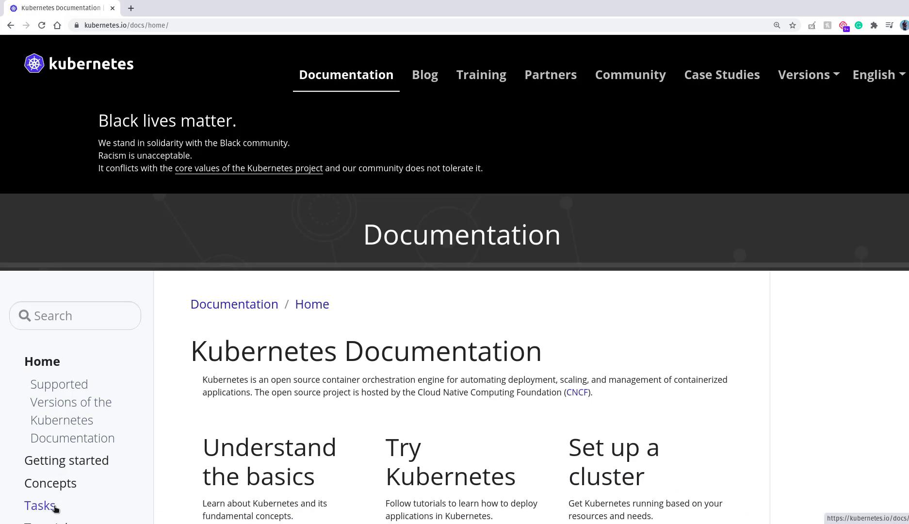
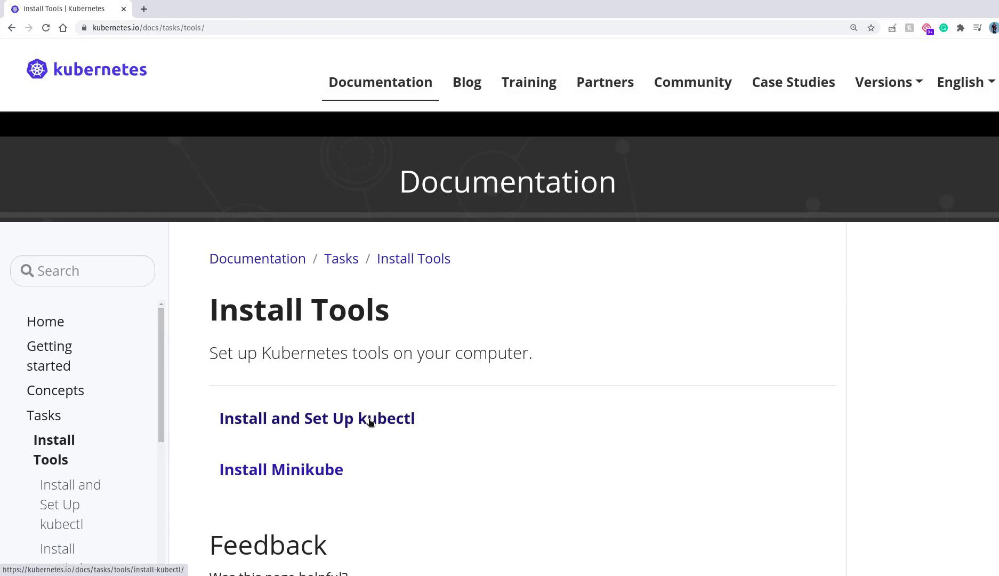
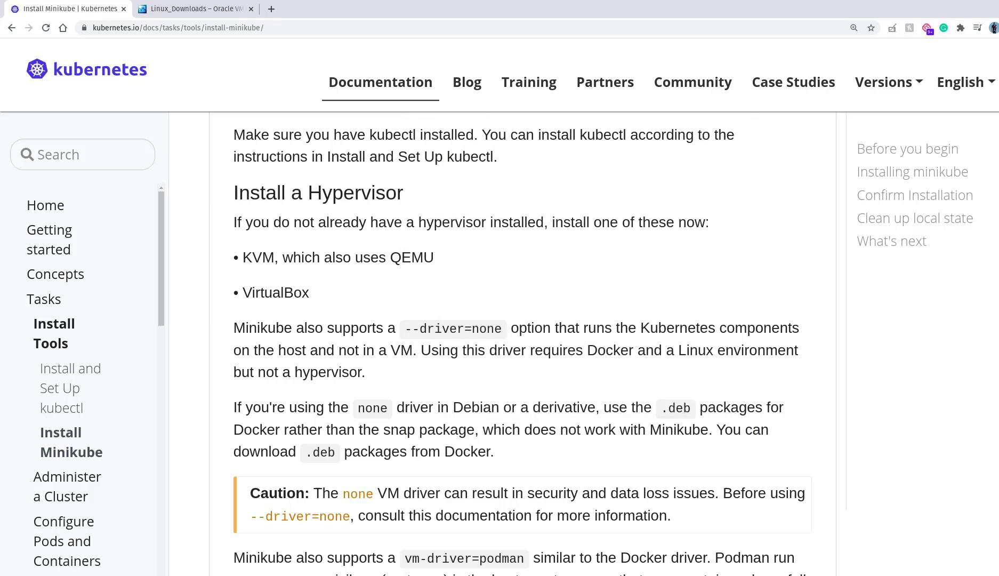
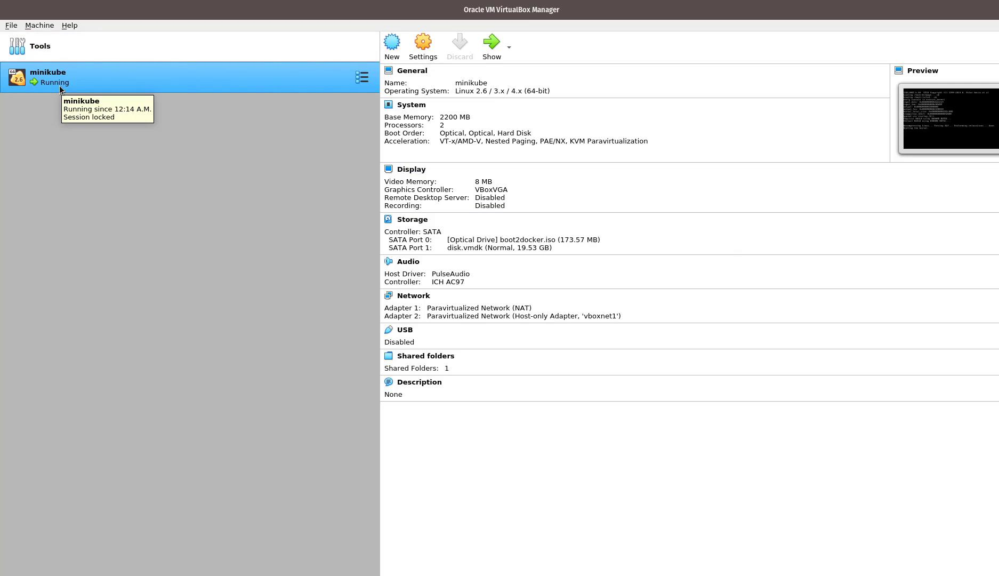

# rc-definition.yml
apiVersion: v1
kind: ReplicationController
metadata:
  name: myapp-rc
  labels:
    app: myapp
    type: front-end
spec:
  replicas: 3
  template:
    metadata:
      name: myapp-pod
      labels:
        app: myapp
        type: front-end
    spec:
      containers:
      - name: nginx-container
        image: nginx
```

After saving the file, create the Replication Controller by executing:

```bash theme={null}
kubectl create -f rc-definition.yml
```

You should see a confirmation that the replication controller "myapp-rc" has been created. To verify, use:

```bash theme={null}
kubectl get replicationcontroller
```

This command displays the desired number of replicas, the number currently running, and the number ready. To view the individual pods managed by the replication controller, run:

```bash theme={null}
kubectl get pods
```

Pods created by the controller will typically begin with the name "myapp-rc," indicating they are managed automatically.

***

## Creating a ReplicaSet

ReplicaSets are similar to Replication Controllers but use the `apps/v1` API version and require an explicit selector. The `selector` field determines which pods the ReplicaSet should manage by matching labels.

Below is an example of a ReplicaSet definition file named `replicaset-definition.yml`:

```yaml theme={null}
# replicaset-definition.yml
apiVersion: apps/v1
kind: ReplicaSet
metadata:
  name: myapp-replicaset
  labels:
    app: myapp
    type: front-end
spec:
  replicas: 3
  selector:
    matchLabels:
      type: front-end
  template:
    metadata:
      name: myapp-pod
      labels:
        app: myapp
        type: front-end
    spec:
      containers:
      - name: nginx-container
        image: nginx
```

Notice that even if there are already three pods matching the selector, the template must be provided. The template ensures that any new pod created after a failure adheres to the desired configuration.

To create the ReplicaSet, run:

```bash theme={null}
kubectl create -f replicaset-definition.yml
```

Verify the creation of your ReplicaSet with:

```bash theme={null}
kubectl get replicaset
```

And check the pods by executing:

```bash theme={null}
kubectl get pods
```

***

## Scaling a ReplicaSet

Scaling a ReplicaSet allows you to adjust the number of pod replicas based on demand. Suppose you start with three replicas and later need to scale to six. You have two options:

1. Update the `replicas` number in your definition file (change from `3` to `6`) and apply the change:

   ```bash theme={null}
   kubectl replace -f replicaset-definition.yml
   ```

2. Use the `kubectl scale` command directly. You can specify the new replica count using either the file or the ReplicaSet name:

   ```bash theme={null}
   kubectl scale --replicas=6 -f replicaset-definition.yml
   ```

   or

   ```bash theme={null}
   kubectl scale --replicas=6 replicaset myapp-replicaset
   ```

<Callout icon="triangle-alert">
  Scaling a ReplicaSet using `kubectl scale` does not update the replica count in your definition file. The file will still display the original number, so remember to update your file manually if you want consistency between configuration and actual state.
</Callout>

Automated scaling based on load is also possible, but it is beyond the scope of this article.

***

## Essential Kubernetes Commands

Below is a summary of common commands to manage Replication Controllers and ReplicaSets:

| Operation            | Command         | Example                                                  |
| -------------------- | --------------- | -------------------------------------------------------- |
| Create objects       | kubectl create  | `kubectl create -f rc-definition.yml`                    |
| View objects         | kubectl get     | `kubectl get replicaset`<br />`kubectl get pods`         |
| Delete ReplicaSet    | kubectl delete  | `kubectl delete replicaset myapp-replicaset`             |
| Update configuration | kubectl replace | `kubectl replace -f replicaset-definition.yml`           |
| Scale ReplicaSet     | kubectl scale   | `kubectl scale --replicas=6 replicaset myapp-replicaset` |

***

By understanding how labels, selectors, and pod templates interact, you can ensure high availability and efficient scaling of your Kubernetes applications. Whether you choose to work with the classic Replication Controller or the more robust ReplicaSet, these controllers are fundamental to managing your containerized applications effectively.

For further details, explore the official [Kubernetes Documentation](https://kubernetes.io/docs/).

<CardGroup>
  <Card title="Watch Video" icon="video" href="https://learn.kodekloud.com/user/courses/kubernetes-for-the-absolute-beginners-hands-on-tutorial/module/0919dae3-bc94-479f-b205-d52156817c98/lesson/e906151f-510c-48c7-8b82-86fe8ba10946" />
</CardGroup>


# Demo Minikube Setup

Source: https://notes.kodekloud.com/docs/Kubernetes-for-the-Absolute-Beginners-Hands-on-Tutorial/Kubernetes-Concepts/Demo-Minikube-Setup/page

This article provides a beginner-friendly guide to installing and

In this lesson, we install a basic Kubernetes cluster using the Minikube utility. This beginner-friendly guide focuses on the core installation and configuration steps. For more advanced provisioning options such as using kubeadm, please refer to the [CKA Certification Course - Certified Kubernetes Administrator](https://learn.kodekloud.com/user/courses/cka-certification-course-certified-kubernetes-administrator).

We start by visiting the official Kubernetes website. Navigate to the Documentation section, then proceed to the Tasks and Install Tools area.

<Frame>
  
</Frame>

## Installing kubectl

Before installing Minikube, it is essential to install the kubectl command-line tool. Kubectl manages your Kubernetes resources and interacts with your cluster once it is set up via Minikube. Installing kubectl first enables Minikube to configure it correctly during provisioning.

<Frame>
  
</Frame>

While you might see various ways of fine-tuning its name, they all refer to this single utility.

To download the latest stable version of kubectl, run:

```bash theme={null}
curl -LO https://storage.googleapis.com/kubernetes-release/release/$(curl -s https://storage.googleapis.com/kubernetes-release/release/stable.txt)/bin/linux/amd64/kubectl
```

After the download is complete, make the binary executable and move it to a directory included in your PATH:

```bash theme={null}
chmod +x ./kubectl
sudo mv ./kubectl /usr/local/bin/kubectl
```

Verify the installation by checking the client version. Note that until a cluster is running, you might encounter a message about the connection being refused:

```bash theme={null}
kubectl version
```

Example output:

```plaintext theme={null}
Client Version: version.Info{Major:"1", Minor:"18", GitVersion:"v1.18.5", GitCommit:"6503f8d8f769ace2f338794c914a96fc335df0f", GitTreeState:"clean", BuildDate:"2020-06-26T03:47:41Z", GoVersion:"go1.13.9", Compiler:"gc", Platform:"linux/amd64"}
The connection to the server localhost:8080 was refused - did you specify the right host or port?
```

Other installation methods are available in the Kubernetes documentation. For example, on Ubuntu you might use:

```bash theme={null}
sudo apt-get update && sudo apt-get install -y apt-transport-https gnupg2
curl -s https://packages.cloud.google.com/apt/doc/apt-key.gpg | sudo apt-key add -
echo "deb https://apt.kubernetes.io/ kubernetes-xenial main" | sudo tee /etc/apt/sources.list.d/kubernetes.list
sudo apt-get update
sudo apt-get install -y kubectl
```

## Verifying Virtualization Support

Before installing Minikube, ensure virtualization is enabled on your machine. This check is essential regardless of whether you are on Linux, Windows, or macOS. On Linux, you can check for the necessary virtualization flags (`vmx` for Intel or `svm` for AMD) with the following command:

```bash theme={null}
grep -E --color 'vmx|svm' /proc/cpuinfo
```

<Callout icon="triangle-alert">
  If no output is returned from the command above, virtualization may be disabled in your BIOS settings. Consult your laptop's manual or search online using your specific model to enable virtualization.
</Callout>

## Installing Minikube

After installing kubectl and verifying that virtualization is enabled, the next step is to install Minikube. On Linux, you typically choose between two hypervisors: VirtualBox or KVM. In this lesson, VirtualBox is the chosen hypervisor because of its cross-platform availability (Linux, Windows, and macOS) and ease of resetting via snapshots.

If VirtualBox is not installed on your system, download the appropriate package from the [VirtualBox website](https://www.virtualbox.org/). For systems using yum (such as CentOS or RHEL), install VirtualBox with:

```bash theme={null}
yum install VirtualBox-6.1
```

Once VirtualBox is installed, launch it to see its interface. The image below shows VirtualBox with no running virtual machines—a new one will appear when Minikube starts the cluster.

<Frame>
  
</Frame>

## Downloading and Installing Minikube

Download the latest Minikube binary and make it executable:

```bash theme={null}
curl -Lo minikube https://storage.googleapis.com/minikube/releases/latest/minikube-linux-amd64 && chmod +x minikube
```

Then, add Minikube to your PATH by installing it to /usr/local/bin:

```bash theme={null}
sudo mkdir -p /usr/local/bin/
sudo install minikube /usr/local/bin/
```

## Starting the Minikube Cluster

With both kubectl and Minikube now installed, you can start your local Kubernetes cluster. Specify the virtualization driver—in this example, VirtualBox—with the following command:

```bash theme={null}
minikube start --driver=virtualbox
```

Minikube will download the necessary ISO image and Kubernetes binaries (for example, Kubernetes v1.18.3) to set up your cluster. You will notice a new virtual machine named "minikube" appear in VirtualBox once the provisioning process begins.

Example session output:

```bash theme={null}
admin@ubuntu-server kubernetes-for-beginners # curl -Lo minikube https://storage.googleapis.com/minikube/releases/latest/minikube-linux-amd64 && chmod +x minikube
admin@ubuntu-server kubernetes-for-beginners # ls -ld /usr/local/bin/
drwxr-xr-x 2 root root 4096 Jul 11 00:03 /usr/local/bin/
admin@ubuntu-server kubernetes-for-beginners # sudo install minikube /usr/local/bin/
admin@ubuntu-server kubernetes-for-beginners # minikube start --driver=virtualbox
minikube v1.12.0 on Debian bullseye/sid
Using the virtualbox driver based on user configuration
Downloading VM boot image ...
> minikube-v1.12.0.iso.sha256: 65 B / 65 B [--------------] 100.00%
> minikube-v1.12.0.iso: 173.57 MiB / 173.57 MiB [--------------] 100.00%
Starting control plane node minikube in cluster minikube
Downloading Kubernetes v1.18.3 preload ...
> preloaded-images-k8s-v4-v1.18.3-docker-overlay2-amd64.tar.lz4: 176.78 MiB
```

In the VirtualBox Manager, you will see the "minikube" virtual machine running with 2 CPUs and 2 GB of RAM.

<Frame>
  
</Frame>

After the setup completes, kubectl is automatically configured to use the new Kubernetes cluster.

## Verifying the Cluster

To ensure everything is functioning correctly, check the status of your Minikube cluster with:

```bash theme={null}
minikube status
```

Expected output:

```plaintext theme={null}
minikube
type: Control Plane
host: Running
kubelet: Running
apiserver: Running
kubeconfig: Configured
```

Next, verify that the node is ready by listing all nodes:

```bash theme={null}
kubectl get nodes
```

Expected output:

```plaintext theme={null}
NAME       STATUS   ROLES    AGE   VERSION
minikube   Ready    master   88s   v1.18.3
```

## Deploying a Sample Application

With your cluster up and running, deploy a sample application to verify that the environment is fully operational.

### 1. Create a Deployment

Deploy a sample echoserver application with the following command:

```bash theme={null}
kubectl create deployment hello-minikube --image=k8s.gcr.io/echoserver:1.10
```

You should see a confirmation message:

```plaintext theme={null}
deployment.apps/hello-minikube created
```

### 2. Verify the Deployment

Check the deployment status with:

```bash theme={null}
kubectl get deployments
```

Expected output:

```plaintext theme={null}
NAME              READY   UP-TO-DATE   AVAILABLE   AGE
hello-minikube    1/1     1            1           22s
```

### 3. Expose the Deployment as a Service

Expose the deployment on port 8080 using a NodePort service:

```bash theme={null}
kubectl expose deployment hello-minikube --type=NodePort --port=8080
```

To obtain the URL of the exposed service, run:

```bash theme={null}
minikube service hello-minikube --url
```

Open the URL in your browser to view details of the application. Although the interface may be basic, this confirms your cluster's functionality.

### 4. Cleaning Up

After testing, remove the service and deployment:

```bash theme={null}
kubectl delete service hello-minikube
kubectl delete deployment hello-minikube
```

You can verify that the pod is terminating with:

```bash theme={null}
kubectl get pods
```

Example output:

```plaintext theme={null}
NAME                                     READY   STATUS        RESTARTS   AGE
hello-minikube-64b64df8c9-4vcrm            1/1     Terminating   0          3m3s
```

## Conclusion

Your Minikube-based Kubernetes cluster is now operational, and you have successfully deployed and exposed a sample application. This setup forms a solid foundation for upcoming lessons where more complex deployments and Kubernetes concepts will be explored.

Happy learning, and see you in the next lesson!

<Callout icon="lightbulb">
  Consider exploring additional Kubernetes resources such as the [Kubernetes Documentation](https://kubernetes.io/docs/) and tutorials to deepen your understanding of cluster management and container orchestration.
</Callout>

<CardGroup>
  <Card title="Watch Video" icon="video" href="https://learn.kodekloud.com/user/courses/kubernetes-for-the-absolute-beginners-hands-on-tutorial/module/5b966a64-54c6-46ff-b284-4299f34c8f84/lesson/6adccdb7-fa4b-4882-ab0d-7143abf61403" />
</CardGroup>
