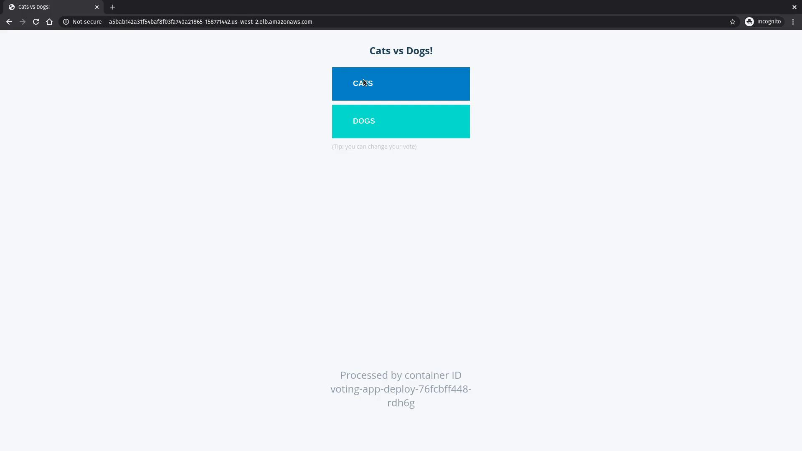
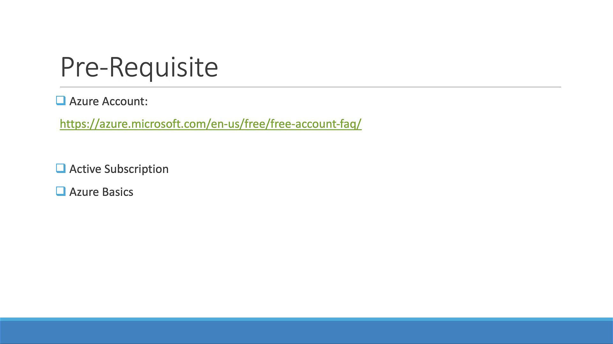
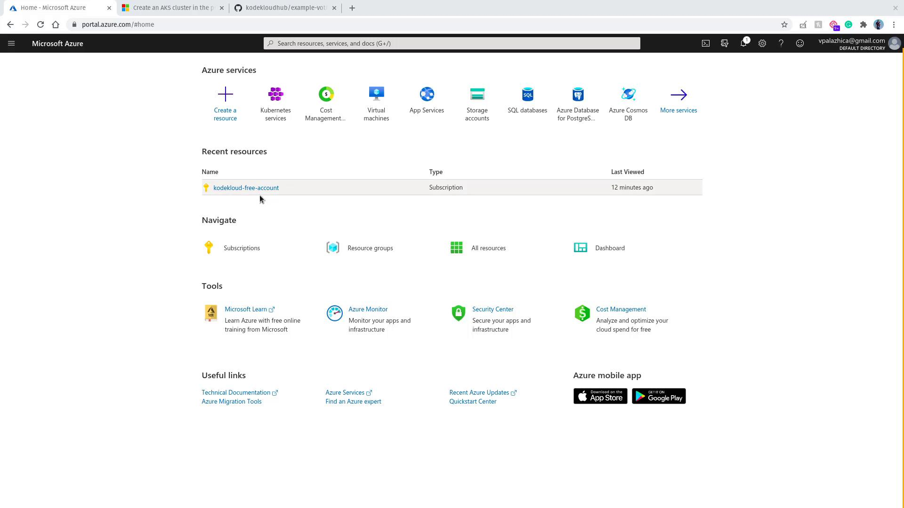
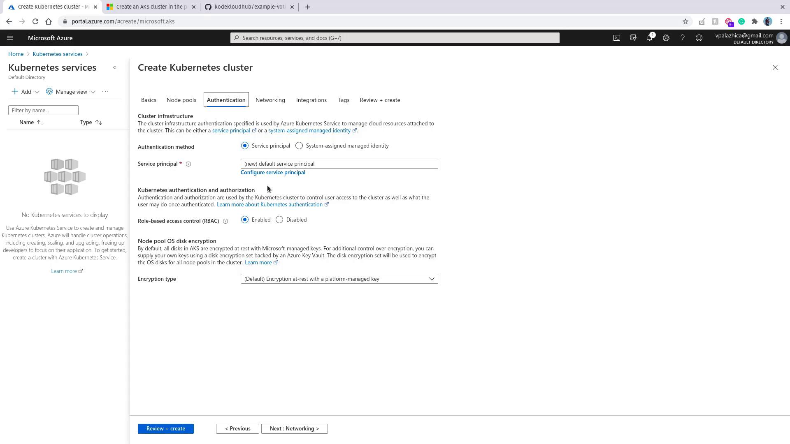
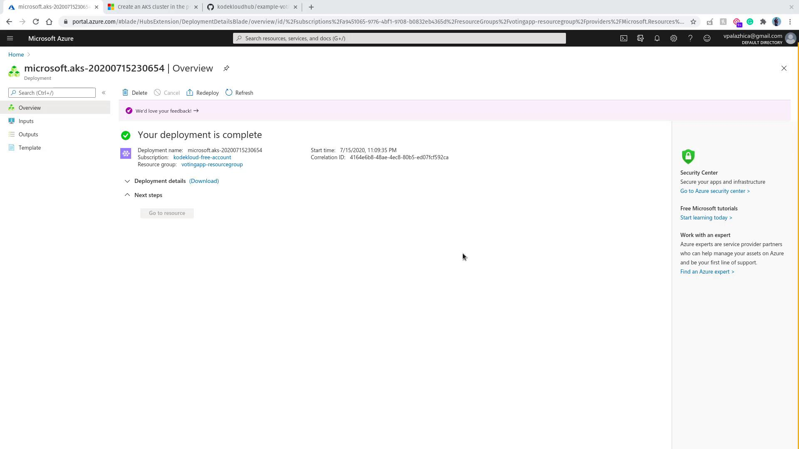

# git clone https://github.com/kODEKLOUDHUB/example-voting-app.git
Cloning into 'example-voting-app'...
remote: Enumerating objects: 12, done.
remote: Counting objects: 100% (12/12), done.
remote: Compressing objects: 100% (7/7), done.
remote: Total 872 (delta 5), reused 11 (delta 5), pack-reused 860
Receiving objects: 100% (872/872), 958.67 KiB | 1.25 MiB/s, done.
Resolving deltas: 100% (307/307), done.
# cd example-voting-app/k8s-specifications
```

Inside the `k8s-specifications` directory, you will find several YAML files defining deployments and services:

```text theme={null}
postgres-deploy.yaml    redis-deploy.yaml      voting-app-deploy.yaml
postgres-service.yaml   result-app-deploy.yaml voting-app-service.yaml
                        worker-app-deploy.yaml
```

Deploy the Kubernetes resources in the order outlined below:

1. **Voting App Deployment and Service:**

   ```bash theme={null}
   kubectl create -f voting-app-deploy.yaml
   kubectl create -f voting-app-service.yaml
   ```

2. **Redis Deployment and Service:**

   ```bash theme={null}
   kubectl create -f redis-deploy.yaml
   kubectl create -f redis-service.yaml
   ```

3. **PostgreSQL Deployment and Service:**

   ```bash theme={null}
   kubectl create -f postgres-deploy.yaml
   kubectl create -f postgres-service.yaml
   ```

4. **Worker and Results App Deployments and Services:**

   ```bash theme={null}
   kubectl create -f worker-app-deploy.yaml
   kubectl create -f result-app-deploy.yaml
   ```

After deploying these resources, verify their status by running:

```bash theme={null}
kubectl get deployments,svc
```

A typical output might resemble:

```text theme={null}
NAME                                    READY   UP-TO-DATE   AVAILABLE   AGE
deployment.apps/postgres-deploy         1/1     1            1           26s
deployment.apps/redis-deploy            1/1     1            1           34s
deployment.apps/result-app-deploy       1/1     1            1           13s
deployment.apps/voting-app-deploy       1/1     1            1           43s
deployment.apps/worker-app-deploy       0/1     1            0           18s

NAME                        TYPE           CLUSTER-IP      PORT(S)         AGE
service/db                 ClusterIP      10.100.250.53   <none>          22s
service/kubernetes         ClusterIP      10.100.0.1      443/TCP         22m
service/redis              ClusterIP      10.100.46.144   443/TCP         30s
service/result-service     LoadBalancer   10.100.222.36   <port-info>     9s
service/voting-service     LoadBalancer   10.100.173.35   <port-info>     39s
```

Once all deployments (including the worker application) have the desired number of ready pods, access the application using the Load Balancer URLs provided for the `voting-service` and `result-service`. Open the voting service URL in your web browser to view the voting interface.

<Frame>
  
</Frame>

Vote for your preferred option and verify that the results update accordingly.

***

## Cleanup

<Callout icon="triangle-alert">
  After reviewing the application, ensure that you delete the EKS cluster and any deployed resources to avoid unnecessary charges.
</Callout>

Thank you for following this lesson. Happy clustering!

<CardGroup>
  <Card title="Watch Video" icon="video" href="https://learn.kodekloud.com/user/courses/kubernetes-for-the-absolute-beginners-hands-on-tutorial/module/2f291cbc-acc2-4250-b96c-2094daff556d/lesson/07c2aa87-c9ea-47c1-b254-f3a6504f16b0" />
</CardGroup>


# Kubernetes on Azure AKS

Source: https://notes.kodekloud.com/docs/Kubernetes-for-the-Absolute-Beginners-Hands-on-Tutorial/Kubernetes-on-the-Cloud/Kubernetes-on-Azure-AKS/page

This guide teaches beginners to provision a Kubernetes cluster using

In this guide, you'll learn how to provision a Kubernetes cluster using Azure Kubernetes Service (AKS) on Microsoft Azure. This step-by-step tutorial is designed for beginners and includes detailed instructions to help you get started quickly.

<Callout icon="lightbulb">
  Before you begin, ensure you have an active [Azure account](https://azure.microsoft.com/free/). If you’re new to Azure, take advantage of the 12-month free access and familiarize yourself with basic Azure configurations.
</Callout>

<Frame>
  
</Frame>

## Accessing the Azure Dashboard

Once logged into your Azure account, you will be greeted with a dashboard displaying various services. In this demonstration, we are using the free "KodeKloud free account." To find the Azure Kubernetes Service (AKS), either search for "AKS" or select it directly from the available services list.

<Frame>
  
</Frame>

## Creating Your Kubernetes Cluster

Since no cluster exists yet, you'll need to add a new cluster. This will take you to the "Create Kubernetes cluster" screen. Make sure that the appropriate subscription is selected, especially if you are using a free-tier subscription.

1. **Resource Group**: Create a new resource group. For demonstration purposes, name it "voting app resource group".
2. **Cluster Name**: Choose an identifiable name such as "example voting app".
3. **Kubernetes Version**: Leave the default version (e.g., 1.16).
4. **Node Configuration**: Considering this is a free-tier demonstration, select one node for the node size and leave the remaining options at their default values.

Under **Authentication settings**, select the option to create a new service principal. This service principal allows AKS to manage associated cloud resources seamlessly.

<Frame>
  
</Frame>

After verifying your configuration, click on **Review and create**. Once the **Create** button becomes available, click it to initiate the deployment. The process starts with provisioning your resource groups, followed by the creation of your Kubernetes cluster. Please be patient, as the full deployment might take some time.

Upon successful deployment, Azure will display a confirmation message.

<Frame>
  
</Frame>

## Connecting to Your Cluster with Azure Cloud Shell

To locate your newly created resources, enter "voting app" in the Azure search bar. You should see both the Kubernetes service and your cluster. Next, access your cluster using the Azure Cloud Shell, which appears at the bottom portion of the screen. If prompted, follow the steps to create storage for Cloud Shell.

While the Cloud Shell initializes, review these essential commands to connect to your AKS cluster:

```bash theme={null}
az aks get-credentials --resource-group myResourceGroup --name myAKSCluster

kubectl get nodes
```

```bash theme={null}
