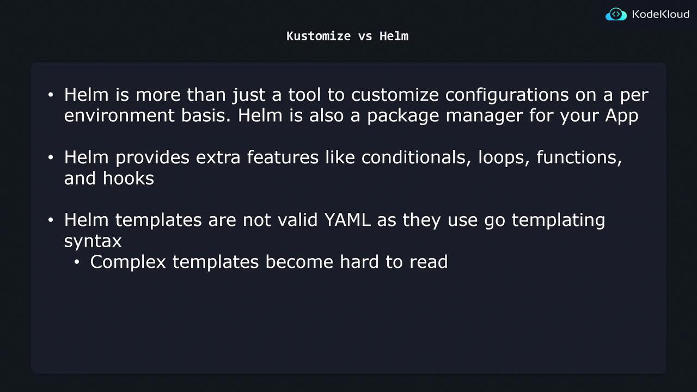

# templates/nginx-deployment.yaml
apiVersion: apps/v1
kind: Deployment
metadata:
  name: {{ .Values.name }}
spec:
  replicas: {{ .Values.replicaCount }}
  selector:
    matchLabels:
      app: {{ .Values.name }}
  template:
    metadata:
      labels:
        app: {{ .Values.name }}
    spec:
      containers:
        - name: {{ .Chart.Name }}
          image: "nginx:{{ .Values.image.tag }}"
```

```yaml theme={null}
# values.yaml
replicaCount: 1
image:
  tag: "2.4.4"
name: "my-app"
```

When you run `helm install my-app ./chart -f values.yaml`, Helm merges the values into the templates, producing valid Kubernetes YAML:

```yaml theme={null}
apiVersion: apps/v1
kind: Deployment
metadata:
  name: my-app
spec:
  replicas: 1
  selector:
    matchLabels:
      app: my-app
  template:
    metadata:
      labels:
        app: my-app
    spec:
      containers:
        - name: my-chart
          image: "nginx:2.4.4"
```

<Callout icon="lightbulb">
  Use `--values` (or `-f`) to specify different environment files, e.g., `-f values.prod.yaml`.
</Callout>

## Helm Chart Structure

A typical Helm chart directory might look like:

```text theme={null}
k8s/
├── environments/
│   ├── values.dev.yaml
│   ├── values.stg.yaml
│   └── values.prod.yaml
└── templates/
    ├── nginx-deployment.yaml
    ├── nginx-service.yaml
    ├── db-deployment.yaml
    └── db-service.yaml
```

* **templates/**: Kubernetes manifests with Go templating syntax.
* **environments/**: Separate `values.*.yaml` files for each environment.

## Feature Comparison

| Feature                       | Helm                                                 | Kustomize                      |
| ----------------------------- | ---------------------------------------------------- | ------------------------------ |
| Template Syntax               | Go templates (`{{ }}`)                               | Pure YAML overlays and patches |
| Conditional Logic & Loops     | ✔️ Supports `if`, `range`, custom functions          | ❌ Not supported                |
| Packaging & Versioning        | ✔️ Full-fledged chart packaging, dependencies, hooks | ❌ No built-in packaging        |
| Valid YAML Before Rendering   | ❌ Not valid until `helm template` runs               | ✔️ Always valid YAML           |
| Native Kubernetes Integration | ✔️ Widely adopted, independent CLI                   | ✔️ Built into `kubectl`        |

<Callout icon="triangle-alert">
  Complex Helm charts with extensive logic can become hard to read and maintain. Ensure you document templates and values clearly.
</Callout>

## Trade-offs: When to Use Each Tool

* **Use Helm if**\
  • You need advanced templating (conditionals, loops, custom functions)\
  • You want packaging, versioning, and chart dependencies\
  • You require lifecycle hooks (e.g., pre-install, post-upgrade)

* **Use Kustomize if**\
  • You prefer pure YAML without an extra rendering step\
  • You want easy-to-read overlays and patches\
  • Your customization needs are straightforward (e.g., changing images, labels)

Balance your project’s complexity and team familiarity when choosing between the two.

<Frame>
  
</Frame>

## References

* [Helm Documentation](https://helm.sh/docs/)
* [Kustomize Documentation](https://kustomize.io/)
* [Kubernetes Basics](https://kubernetes.io/docs/concepts/overview/what-is-kubernetes/)

<CardGroup>
  <Card title="Watch Video" icon="video" href="https://learn.kodekloud.[SECRET_REDACTED]-c083-49c0-8003-114e0ce66e15/lesson/3bd51d55-c169-4207-9fcc-70ac7bb0082e" />
</CardGroup>


# Edit CICD Use Case

Source: https://notes.kodekloud.com/docs/Kustomize/Other-Commands/Edit-CICD-Use-Case/page

Learn to integrate `kustomize edit set image` in your CI/CD pipeline to automatically update Kubernetes manifests with new image tags after successful builds.

In this guide, you’ll learn how to integrate the `kustomize edit set image` command into your CI/CD pipeline. By the end, you’ll understand how to automatically update your Kubernetes manifests with a new image tag whenever a build completes successfully.

## Table of Contents

1. [CI/CD Pipeline Overview](#cicd-pipeline-overview)
2. [1. Triggering the Pipeline](#1-triggering-the-pipeline)
3. [2. Installing Dependencies & Running Tests](#2-installing-dependencies--running-tests)
4. [3. Building & Tagging the Container Image](#3-building--tagging-the-container-image)
5. [4. Updating Manifests with `kustomize edit`](#4-updating-manifests-with-kustomize-edit)
6. [5. Deploying to Kubernetes](#5-deploying-to-kubernetes)
7. [References](#references)

***

## CI/CD Pipeline Overview

This is a typical flow for deploying code changes:

| Stage      | Description                                           | Example Command                                                                                |
| ---------- | ----------------------------------------------------- | ---------------------------------------------------------------------------------------------- |
| Push Code  | Developer pushes to GitHub                            | `git push origin main`                                                                         |
| Build      | Install deps & run tests                              | `go mod download` / `go test ./...`                                                            |
| Tag & Push | Build Docker image with commit hash, push to registry | `docker build -t myrepo/api:$GIT_COMMIT_HASH .`<br />`docker push myrepo/api:$GIT_COMMIT_HASH` |
| Update     | Use Kustomize to set the new image in manifests       | `kustomize edit set image api=myrepo/api:$GIT_COMMIT_HASH`                                     |
| Deploy     | Apply the updated overlay to production cluster       | `kubectl apply -k overlays/production`                                                         |

<Callout icon="lightbulb">
  Using a Git commit hash (or semantic version) as your Docker image tag ensures traceability between your code and the container you deploy.
</Callout>

***

## 1. Triggering the Pipeline

Any push to the main branch starts the CI/CD process. For example:

```bash theme={null}
git push origin main
```

Your CI system (GitHub Actions, Jenkins, GitLab CI, etc.) detects the new commit and enters the build stage.

***

## 2. Installing Dependencies & Running Tests

In the build stage, install dependencies and execute tests:

```bash theme={null}
