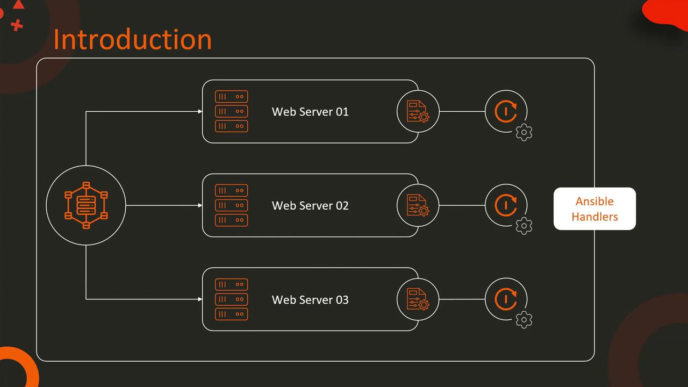
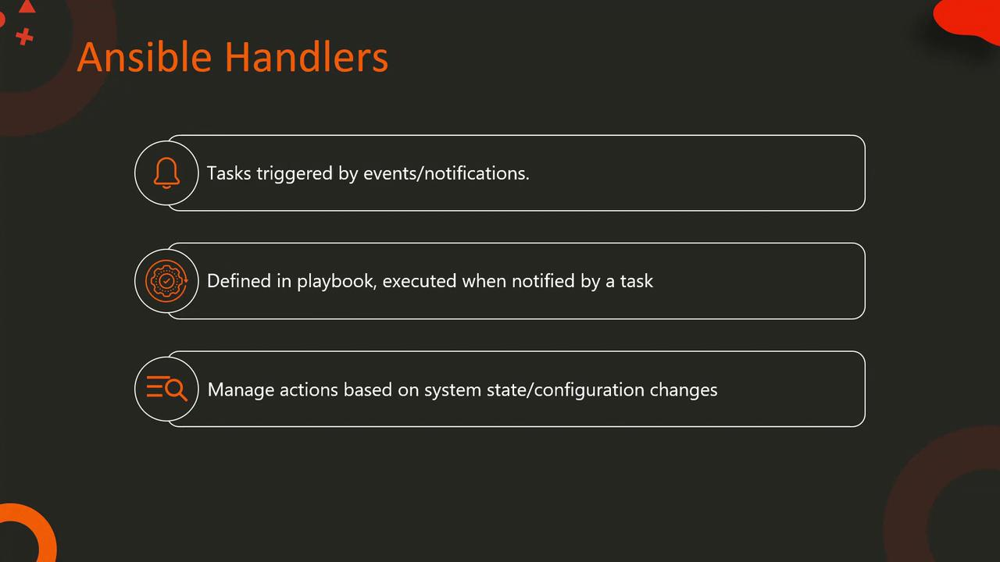

# Introduction to Handlers

Source: https://notes.kodekloud.com/docs/Learn-Ansible-Basics-Beginners-Course/Ansible-Handlers-Roles-and-Collections/Introduction-to-Handlers/page

This article explains how Ansible handlers automate service restarts in response to configuration changes, enhancing efficiency and reducing manual intervention in web server management.

Imagine managing a web server infrastructure with multiple servers. In such environments, simply modifying a web server's configuration file is not enough—the changes only take effect after the service is restarted. As your infrastructure scales, manually restarting services becomes both time-consuming and error-prone.

This is where Ansible handlers become indispensable. Handlers enable you to define specific actions (for example, restarting a web server service) that are automatically triggered when a related task, such as modifying a configuration file, is executed. By creating a reliable link between a configuration change and the required restart action, handlers eliminate the need for manual intervention, streamline operations, and reduce human error.

<Frame>
  
</Frame>

Whenever a configuration file is updated during a Playbook run, the corresponding handler is automatically triggered. This ensures that your infrastructure management and automation processes are both efficient and resilient.

<Callout icon="lightbulb">
  Handlers in Ansible are special tasks that run only when notified by another task. They’re defined within a Playbook and execute actions in response to changes in the system’s state or configuration.
</Callout>

<Frame>
  
</Frame>

## Playbook Example: Deploying an Application with a Handler

The example below demonstrates how to use a handler in an Ansible Playbook. In this scenario, the task "Copy Application Code" deploys the application code to the target servers. Once this task is complete, it notifies the handler "Restart Application Service," which then ensures that the application service is restarted automatically.

```yaml theme={null}
- name: Deploy Application
  hosts: application_servers
  tasks:
    - name: Copy Application Code
      copy:
        src: app_code/
        dest: /opt/application/
      notify: Restart Application Service

  handlers:
    - name: Restart Application Service
      service:
        name: application_service
        state: restarted
```

The handler "Restart Application Service" leverages the service module to ensure that the application service is restarted. This automated approach guarantees that any deployment updates are immediately applied across all target servers without the need for any manual steps.

For further reading on automating server configurations and managing infrastructure efficiently, consider exploring the following resources:

* [Ansible Documentation](https://docs.ansible.com/)
* [Kubernetes Basics](https://kubernetes.io/docs/concepts/overview/what-is-kubernetes/)
* [Docker Hub](https://hub.docker.com/)

<CardGroup>
  <Card title="Watch Video" icon="video" href="https://learn.kodekloud.com/user/courses/learn-ansible-basics-beginners-course/module/e98a2ff3-ee65-4cf3-9bf3-b91507d617e3/lesson/5f650207-beb9-45ee-9704-eb0ba0cc1918" />
</CardGroup>
