# Demo Setup Ansible Local Environment Using VirtualBox

Source: https://notes.kodekloud.com/docs/Learn-Ansible-Basics-Beginners-Course/Appendix/Demo-Setup-Ansible-Local-Environment-Using-VirtualBox/page

This guide explains how to set up a local Ansible lab environment using Oracle VirtualBox on your laptop.

Welcome to this comprehensive guide on building a complete lab environment for experimenting with Ansible. In this lesson, we will create a self-contained lab on your laptop using Oracle VirtualBox—a versatile virtualization tool compatible with Windows, Linux, and macOS.

## Lab Overview

Our setup plan includes:

1. Installing Oracle VirtualBox on your laptop.
2. Creating a CentOS template virtual machine.
3. Deploying an Ansible control machine and two target machines using the CentOS template.

<Frame>
  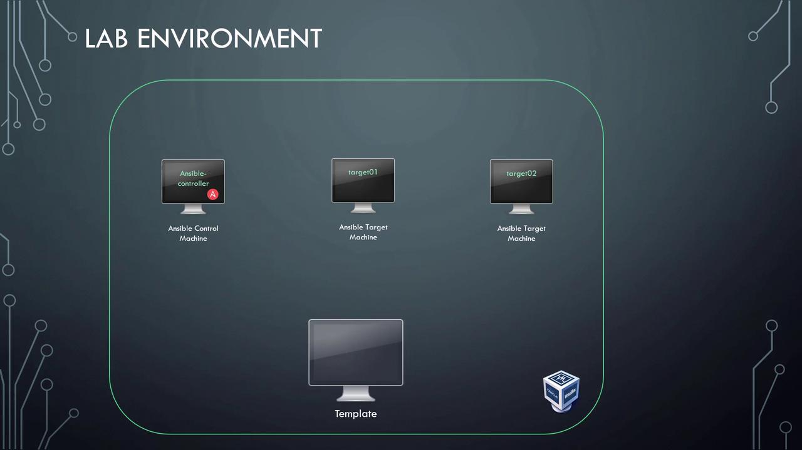
</Frame>

## Installing Oracle VirtualBox

Although these instructions are written from a Windows perspective, they apply equally to Linux or macOS. Begin by visiting the [VirtualBox website](https://www.virtualbox.org/) and download the appropriate software for your operating system.

<Frame>
  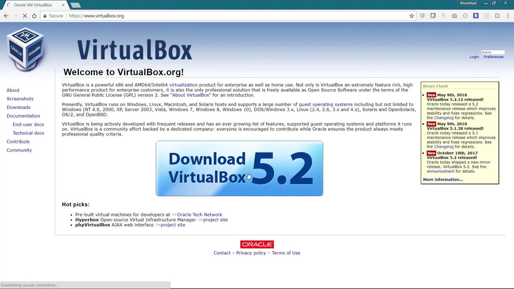
</Frame>

On the download page, you will find links for various operating systems.

<Frame>
  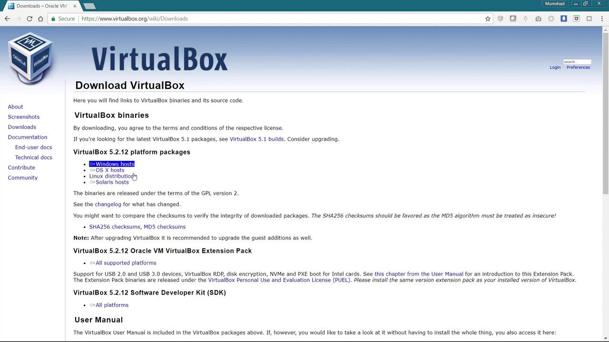
</Frame>

For this guide, I downloaded the Windows version. Simply run the executable and follow the installation wizard. If VirtualBox is already installed on your system, you can skip this step.

After installation, open the Oracle VM VirtualBox interface. You will see a layout similar to the example below as you prepare to deploy virtual machines:

<Frame>
  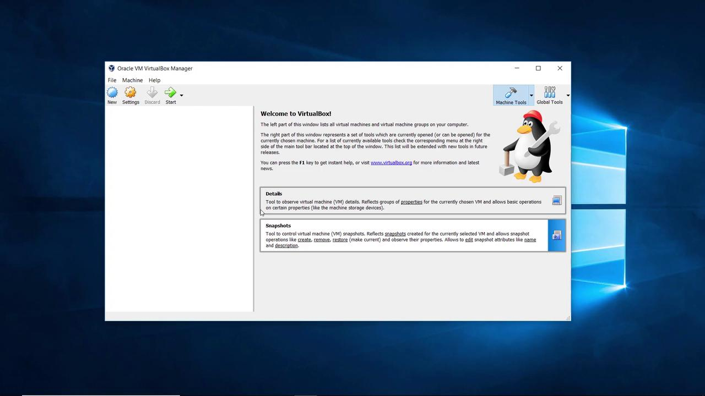
</Frame>

## Deploying Virtual Machines

There are two main methods to deploy virtual machines in VirtualBox:

* **New Installation:** Create a new machine by attaching an operating system’s CD drive and performing a standard installation.
* **Using Pre-built Images:** Download pre-installed, pre-configured virtual machine images available online for easier deployment.

For simplicity, we will use the pre-built images. Visit [osboxes.org](https://www.osboxes.org/), click the VirtualBox images link at the top, and select your desired operating system. For this lesson, we recommend the CentOS image. You will be directed to a page detailing the CentOS image download; choose the VirtualBox image for CentOS 7 (64-bit).

<Frame>
  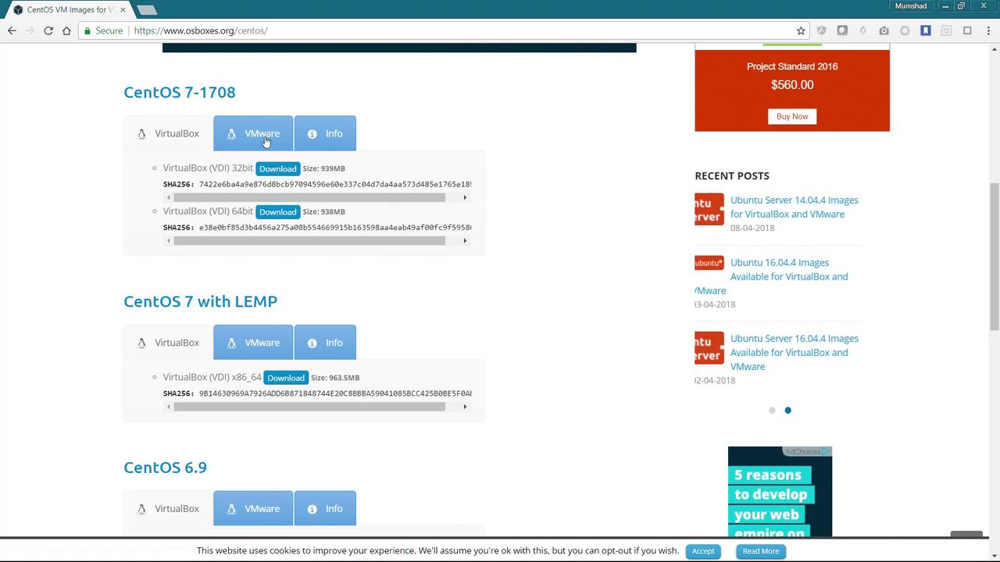
</Frame>

The download comes as a .7z compressed file. You will need extraction software such as [7-Zip](https://www.7-zip.org/), tar, or WinZip to extract the contents.

<Frame>
  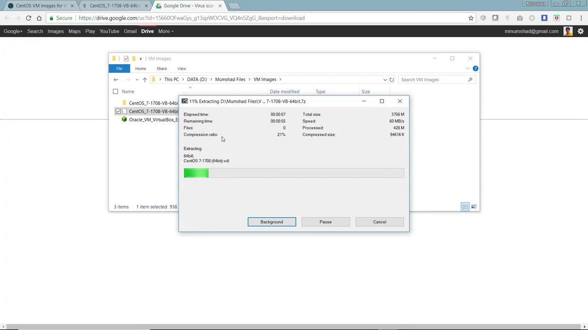
</Frame>

After extraction, navigate to the folder and locate the "64-bit" subfolder. Inside, you'll find a file with the .vdi extension representing the virtual disk for your new virtual machine.

## Creating the CentOS Template Virtual Machine

1. **Launch VirtualBox and start a New VM:**\
   Click on "New" to launch the creation wizard.

<Frame>
  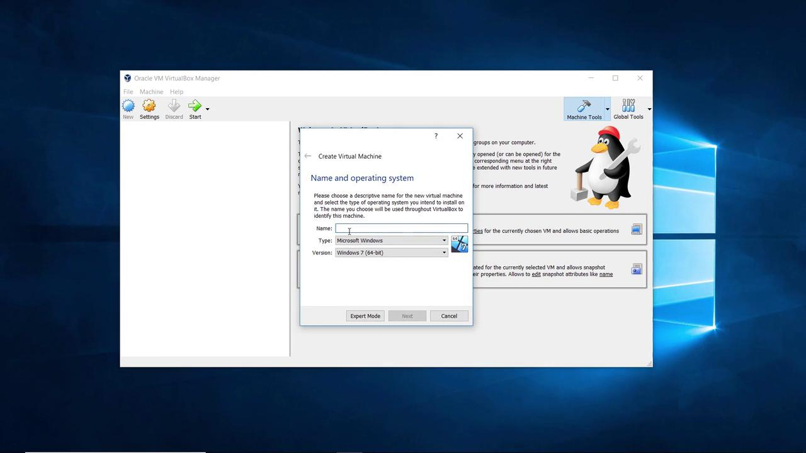
</Frame>

2. **Configure VM Details:**\
   Name your virtual machine "CentOS-Template". Set its type to Linux and select "Other Linux (64-bit)".

<Callout icon="lightbulb">
  If you do not see 64-bit options, reboot your laptop and enable "Virtualization Technology" in your BIOS settings.
</Callout>

<Frame>
  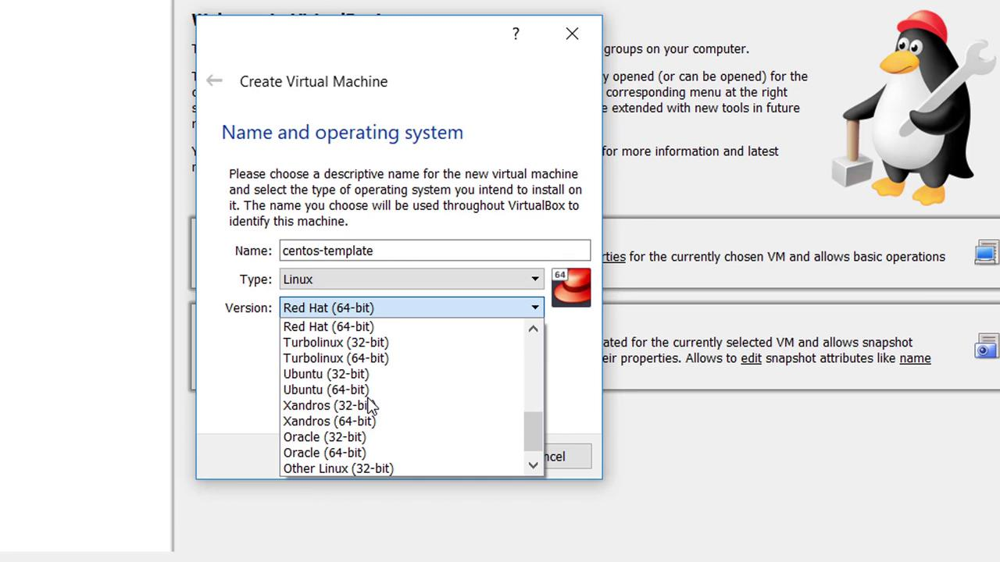
</Frame>

3. **Adjust Memory and Disk Settings:**\
   Increase the memory allocation from the default 512 MB to approximately 2 GB. Choose "Use an existing virtual hard disk file" and browse to select the extracted CentOS 7 .vdi file.

<Frame>
  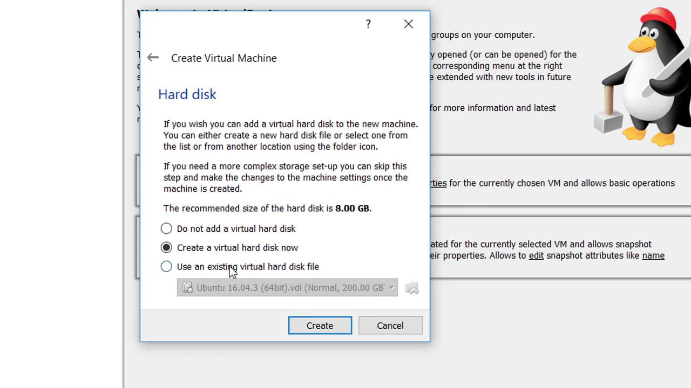
</Frame>

4. **Configure Additional Settings:**\
   Open the "Settings" for the created VM. Under the "System" tab, increase the CPU allocation to 2 cores. Later, in the "Network" tab, choose "Bridged Adapter" for Adapter 1. This setting allows the virtual machine to access network resources, essential for package downloads and updates.

<Frame>
  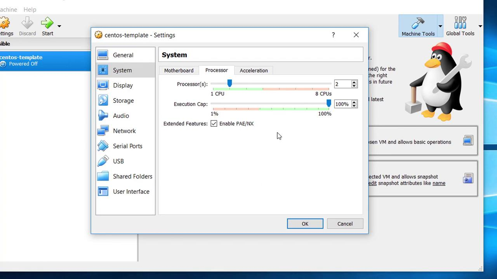
</Frame>

<Frame>
  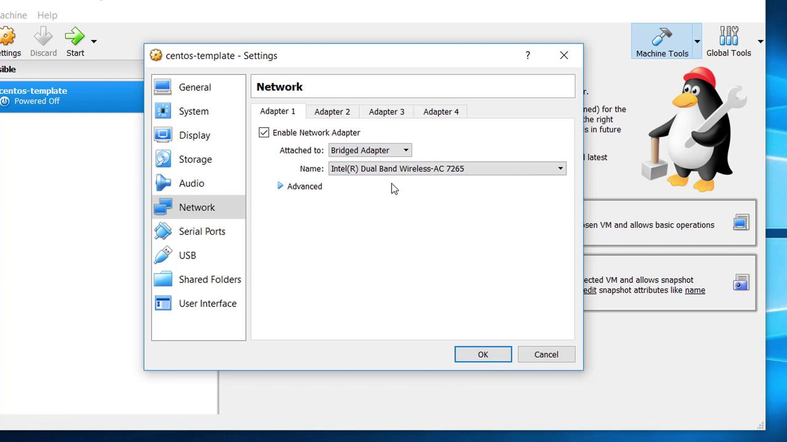
</Frame>

## Booting and Configuring the Template

1. **Start the Virtual Machine:**\
   Power on your newly created CentOS template VM. At the login prompt, select the default user "osboxes". For OSBoxes images, the password is typically "osboxes.org" (refer to the Info section on their website for confirmation).

2. **Verify Network Configuration:**\
   Open a terminal in your CentOS system and run the following command to check the network interface and verify the IP address:

   ```bash theme={null}
   [osboxes@osboxes ~]$ ifconfig
   enp0s3: flags=4163<UP,BROADCAST,RUNNING,MULTICAST>  mtu 1500
           inet 192.168.1.112  netmask 255.255.255.0  broadcast 192.168.1.255
           inet6 fe80::761a:9917:d9b2:7a11  prefixlen 64  scopeid 0x20<link>
           ether 08:00:27:37:22:f9  txqueuelen 1000  (Ethernet)
           RX packets 234  bytes 16860 (16.4 KiB)
           RX errors 0  dropped 0  overruns 0  frame 0
           TX packets 75  bytes 9212 (8.9 KiB)
           TX errors 0  dropped 0  overruns 0  carrier 0  collisions 0

   lo: flags=73<UP,LOOPBACK,RUNNING>  mtu 65536
           inet 127.0.0.1  netmask 255.0.0.0
           inet6 ::1  prefixlen 128  scopeid 0x10<link>
           loop  txqueuelen 1  (Local Loopback)
           RX packets 0  bytes 0 (0.0 B)
           RX errors 0  dropped 0  overruns 0  frame 0
           TX packets 0  bytes 0 (0.0 B)
           TX errors 0  dropped 0  overruns 0  carrier 0  collisions 0

   virbr0: flags=4099<UP,BROADCAST,MULTICAST>  mtu 1500
           inet 192.168.122.1  netmask 255.255.255.0  broadcast 192.168.122.255
           ether 52:54:00:ed:da:3f  txqueuelen 1000  (Ethernet)
           RX packets 0  bytes 0 (0.0 B)
           RX errors 0  dropped 0  overruns 0  frame 0
   ```

## Establishing an SSH Connection

Use an SSH client to securely connect to your CentOS virtual machine. In this guide, I used [MobaXterm](https://mobaxterm.mobatek.net/), but you can also use [PuTTY](https://www.putty.org/) or any other SSH client.

1. **SSH Session Configuration:**\
   Create a new SSH session aimed at the IP address (e.g., 192.168.1.112) obtained from the previous step.

   ```bash theme={null}
   osboxes@osboxes:~$ ifconfig
   enp0s3: flags=4163<UP,BROADCAST,RUNNING,MULTICAST>  mtu 1500
           inet 192.168.1.112  netmask 255.255.255.0  broadcast 192.168.1.255
           inet6 fe80::7619:91f9:bd9a:7211  prefixlen 64  scopeid 0x20<link>
           ether 08:00:27:32:79:29  txqueuelen 1000  (Ethernet)
           RX packets 234  bytes 168696 (164.1 KiB)
           RX errors 0  dropped 0  overruns 0  frame 0
           TX packets 75  bytes 9212 (9.0 KiB)
           TX errors 0  dropped 0  overruns 0  carrier 0  collisions 0

   lo: flags=73<UP,LOOPBACK,RUNNING>  mtu 65536
           inet 127.0.0.1  netmask 255.0.0.0
           inet6 ::1  prefixlen 128  scopeid 0x10<host>
           RX packets 1  bytes 64 (64.0 B)
           RX errors 0  dropped 0  overruns 0  frame 0
           TX packets 1  bytes 64 (64.0 B)
           TX errors 0  dropped 0  overruns 0  carrier 0  collisions 0

   virbr0: flags=4099<BROADCAST,MULTICAST>  mtu 1500
           inet 192.168.122.1  netmask 255.255.255.0  broadcast 192.168.122.255
           ether 52:54:00:9a:7f:08  txqueuelen 0  (Ethernet)
           RX packets 0  bytes 0 (0.0 B)
           RX errors 0  dropped 0  overruns 0  frame 0
           TX packets 0  bytes 0 (0.0 B)
           TX errors 0  dropped 0  overruns 0  carrier 0  collisions 0
   ```

2. **Login Credentials:**\
   When prompted, use the username "osboxes" and the password "osboxes.org".

<Frame>
  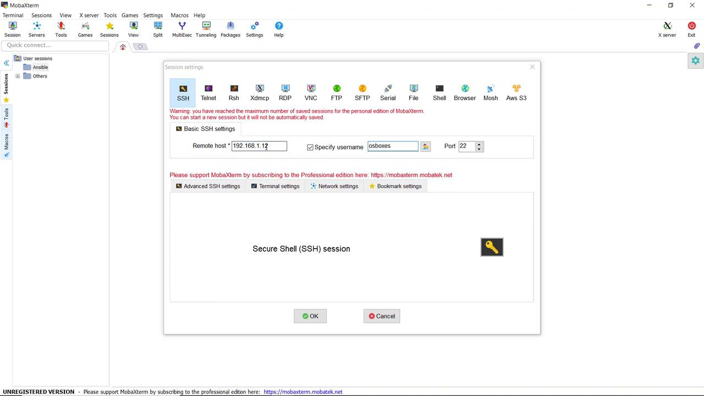
</Frame>

Once you have confirmed that the SSH connection is successfully established, shut down this virtual machine—this will serve as the template from which you can clone additional VMs for your Ansible lab.

<Callout icon="lightbulb">
  With your CentOS template configured and verified, you can now proceed to clone this virtual machine. This cloned environment will be used to set up both the control machine and the target nodes in your Ansible lab.
</Callout>

Happy learning and experimenting with Ansible!

<CardGroup>
  <Card title="Watch Video" icon="video" href="https://learn.kodekloud.com/user/courses/learn-ansible-basics-beginners-course/module/a1ba12c0-66c7-4d81-bede-62917ee0b1cf/lesson/371a5d25-c693-4aaf-a340-050ad961af0d" />
</CardGroup>
