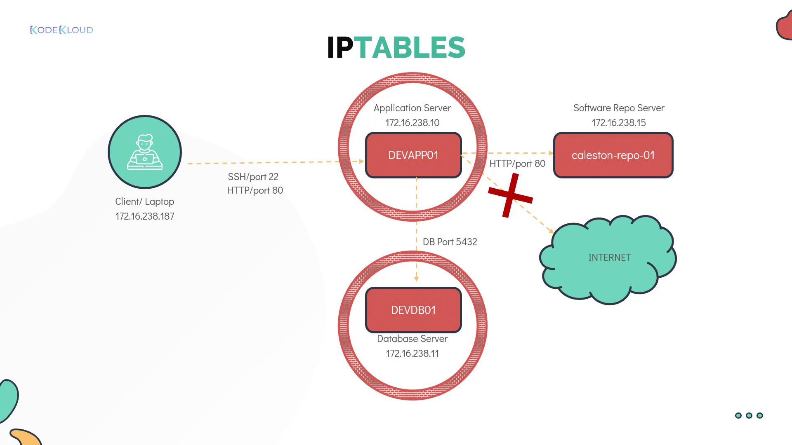
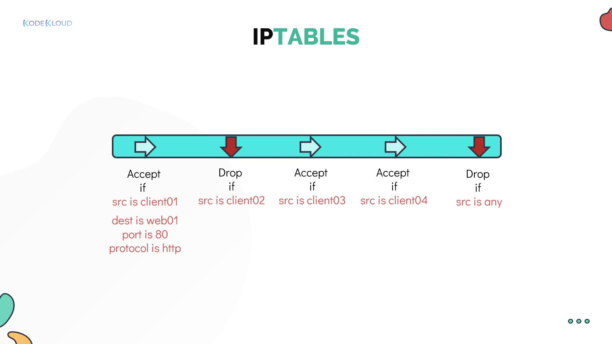

# IPTABLES Introduction

Source: https://notes.kodekloud.com/docs/Learning-Linux-Basics-Course-Labs/Security-and-File-Permissions/IPTABLES-Introduction/page

This article explores configuring IP table rules on Linux servers to enhance network security and regulate traffic.

In this article, we explore network security by configuring IP table rules on Linux servers. Securing remote access, such as SSH and SCP file transfers, requires that the SSH service is active on the remote server, allowing you to connect from your client.

Before proceeding, ensure the following prerequisites are met:

* Valid authentication mechanisms (username/password or SSH key-based).
* Port 22 open between your client and the remote server.

<Callout icon="lightbulb">
  In complex environments featuring multiple clients and servers interconnected by various routers and switches, implementing robust network security is essential. You can secure the network using external firewall appliances or apply filtering rules directly on each server with tools like iptables, firewalld on Linux, or the built-in firewalls on Windows.
</Callout>

In this guide, we demonstrate how to configure local iptables rules on a Linux server to regulate network traffic. Consider the following Project Mercury environment setup:

| Device             | IP Address     |
| ------------------ | -------------- |
| Client laptop      | 172.16.238.187 |
| Application server | 172.16.238.10  |
| Database server    | 172.16.238.11  |

Without a firewall, all servers can communicate freely. We will enhance security by enforcing these rules:

* Allow SSH access from your laptop to the application server.
* Permit HTTP access (port 80) to the application server only from the client laptop, blocking other servers (e.g., devdb01).
* Allow the application server to connect to the database server on port 5432 for database operations.
* Grant the application server HTTP access to the software repository server (kailston-repo-01).
* Block outgoing internet access from the application server.
* Restrict the database server to accept connections on port 5432 solely from the application server.

<Frame>
  
</Frame>

## Establishing SSH Connectivity

Begin by establishing an SSH connection to the devapp01 server from your client. Once connected, you will use iptables to filter network traffic. On Red Hat and CentOS, iptables is installed by default. On Ubuntu, installation may be required:

```bash theme={null}
[bob@devapp01 ~]$ sudo apt install iptables
```

After installation, list the default iptables rules with:

```bash theme={null}
[bob@devapp01 ~]$ sudo iptables -L
Chain INPUT (policy ACCEPT)
target     prot opt source               destination

Chain FORWARD (policy ACCEPT)
target     prot opt source               destination

Chain OUTPUT (policy ACCEPT)
target     prot opt source               destination
```

## Understanding IPTABLES Chains

Iptables uses three main chains, each serving a distinct purpose:

* **INPUT Chain:** Manages incoming traffic. For instance, adding a rule here allows SSH connections from your client laptop.
* **OUTPUT Chain:** Controls traffic originating from the server, including outbound connections like database queries.
* **FORWARD Chain:** Typically used by network routers to forward traffic between devices. Standard Linux servers rarely use this chain.

With no custom rules in place, the default policy is to accept all incoming and outgoing traffic:

```bash theme={null}
[bob@devapp01 ~]$ sudo iptables -L
Chain INPUT (policy ACCEPT)
target     prot opt source               destination

Chain FORWARD (policy ACCEPT)
target     prot opt source               destination

Chain OUTPUT (policy ACCEPT)
target     prot opt source               destination
```

<Callout icon="lightbulb">
  A "chain" is essentially a list of rules. Each rule checks network packets and decides whether to accept or drop them based on defined conditions such as source IP, destination IP, port number, or protocol. If a packet does not match any rule, it continues to the next rule until it either matches one or reaches the chain's end.
</Callout>

For example:

* A packet from client 01 meets the first rule in the INPUT chain and is accepted.
* A packet from client 02 does not match the first rule and is evaluated by subsequent rules.
* A packet from client 05 might not match any allow rules and is eventually dropped by a default drop rule.

<Frame>
  
</Frame>

<CardGroup>
  <Card title="Watch Video" icon="video" href="https://learn.kodekloud.com/user/courses/learning-linux-basics-course-labs/module/6c7e1a9b-9ecc-43c5-9dce-8031ab5d3fe2/lesson/a64c5795-84a5-4820-86cb-c244243aab08" />
</CardGroup>
