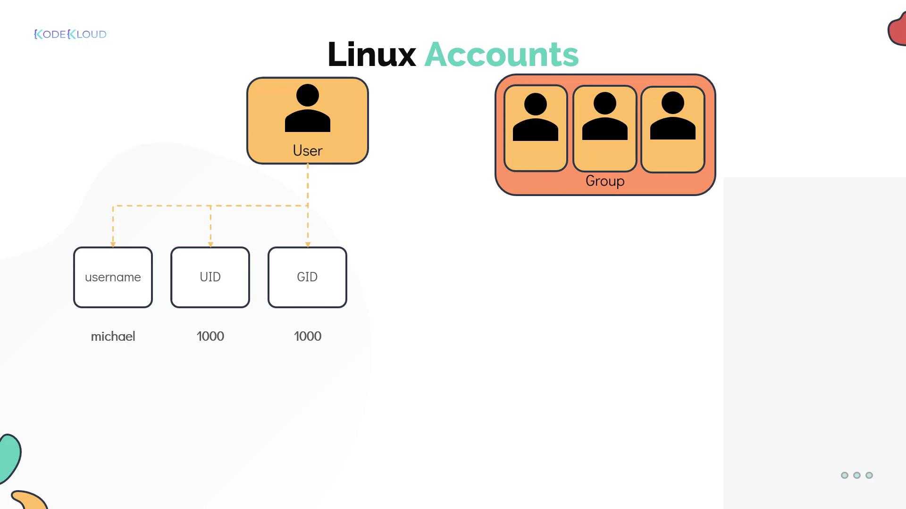

# Linux Accounts

Source: https://notes.kodekloud.com/docs/Learning-Linux-Basics-Course-Labs/Security-and-File-Permissions/Linux-Accounts/page

This article covers security and access control in Linux, focusing on account types, user management, file ownership, and permissions.

In this lesson, we explore security and access control in Linux. You will learn about account types, access control files, user switching, and privilege escalation, along with hands-on labs to reinforce your skills. We focus on key security concepts including user management, file-level ownership, and permissions.

Security in Linux employs user and password-based authentication mechanisms to control system access. Several tools and frameworks are available to manage authentication:

* **PAM (Pluggable Authentication Modules):** Governs how programs and services handle authentication.
* **Network Security Tools:** Utilities such as iptables and Firewalld regulate access to network services.
* **SSH (Secure Shell):** Provides secure remote access over unsecured networks, with SSH hardening ensuring only authorized users can connect.
* **SELinux:** Enforces security policies to isolate applications running on the same system.

<Callout icon="lightbulb">
  While numerous tools exist to secure a Linux system, this article focuses on basic access control, file ownership, and permissions.
</Callout>

***

## User and Group Accounts

### What is a Linux Account?

Each Linux user is associated with an account that holds critical details such as the username, password, and a unique identifier (UID). Account details such as the home directory and default shell are stored in the `/etc/passwd` file. For example:

```bash theme={null}
[~]$ cat /etc/passwd
root:x:0:0:root:/root:/bin/bash
daemon:x:1:1:daemon:/usr/sbin/nologin
bin:x:2:2:bin:/usr/sbin/nologin
sys:x:3:3:sys:/dev:/usr/sbin/nologin
sync:x:4:65534:sync:/bin:/bin/sync
games:x:5:60:games:/usr/games:/usr/sbin/nologin
man:x:6:12:man:/var/cache/man:/usr/sbin/nologin
lp:x:7:7:lp:/var/spool/lpd:/usr/sbin/nologin
mail:x:8:8:mail:/var/mail:/usr/sbin/nologin
uucp:x:10:10:uucp:/var/spool/uucp:/usr/sbin/nologin
www-data:x:33:33:www-data:/var/www:/usr/sbin/nologin
bob:1000:1000:Bob Kingsley,,,:/home/bob:/bin/bash
```

Linux groups enable you to organize users based on roles or functions. Group-related information, including the unique group identifier (GID), is maintained in the `/etc/group` file.

### Example: Grouping Developers

Consider a scenario with two developers, Bob and Mumshad Mannambeth, working on the same system. They can be grouped under a Linux group called "developers" to facilitate shared access to particular files and directories. For instance:

```bash theme={null}
[~]$ cat /etc/passwd
root:x:0:0:root:/root:/bin/bash
daemon:x:1:1:daemon:/usr/sbin/nologin
bin:x:2:2:bin:/usr/sbin/nologin
sys:x:3:3:sys:/dev:/usr/sbin/nologin
sync:x:4:65534:sync:/bin:/bin/sync
games:x:5:60:games:/usr/games:/usr/sbin/nologin
man:x:6:12:man:/var/cache/man:/usr/sbin/nologin
lp:x:7:7:lp:/var/spool/lpd:/usr/sbin/nologin
mail:x:8:8:mail:/var/mail:/usr/sbin/nologin
uucp:x:10:10:uucp:/var/spool/uucp:/usr/sbin/nologin
www-data:x:33:33:www-data:/var/www:/usr/sbin/nologin
bob:1000:1000:Bob Kingsley,,,:/home/bob:/bin/bash

[~]$ cat /etc/group
ssh:x:118:
lpadmin:x:119:
scanner:x:120:saned
avahi:x:121:
saned:x:122:
color:x:123:
geoclue:x:124:
pulse:x:125:
pulse-access:x:126:
gdm:x:127:
systemd-coredump:x:999:
bob:x:1000:
developers:x:1003:bob,michael
```

Each user account comprises a username, UID, a primary GID (typically matching the username), the home directory, and the default shell. To review detailed information about a specific user account and its group memberships, you can use the `id` command:

```bash theme={null}
[~]$ id michael
uid=1001(michael) gid=1001(michael) groups=1001(michael),1003(developers)
```

User accounts fall into different types:

* **Regular User Account:** Represents an individual person requiring system access.
* **Superuser Account:** The root account (UID 0) with full system privileges.
* **System Accounts:** Created during OS installation for software and services; typically have UIDs under 100 (or between 500 and 1000) and usually lack dedicated home directories.
* **Service Accounts:** Similar to system accounts, these are created for specific services such as NGINX.

<Frame>
  
</Frame>

***

## Switching Users and Privilege Escalation

Linux offers multiple methods for switching between users:

### Using the su Command

The `su` (substitute user) command enables you to switch to another user, including the root account. For example, to switch to root:

```bash theme={null}
[~]$ su -
Password:
root ~#
```

Alternatively, execute a specific command as another user using `su -c` (which requires the target user's password):

```bash theme={null}
[~]$ su -c "whoami"
Password:
root
```

Even though `su` is a useful utility, it is generally recommended to use `sudo` for enhanced security.

### Using the sudo Command

The `sudo` command allows trusted users to execute administrative commands using their own password. This method avoids the need to log in as root directly. For example:

```bash theme={null}
[michael@ubuntu-server ~]$ sudo apt-get install nginx
[sudo] password for michael:
```

The default `sudo` configuration is defined in the `/etc/sudoers` file, where administrators can configure specific privileges. For example, Bob may have full administrative rights while Sarah might be restricted to rebooting the system only.

<Callout icon="triangle-alert">
  When using `sudo`, ensure that only trusted users are granted access to prevent unauthorized system changes.
</Callout>

A common security practice is to set the root account to a no-login shell:

```bash theme={null}
[~]$ grep -i ^root /etc/passwd
root:x:0:0:root:/root:/usr/sbin/nologin
```

Below is an example configuration found in a `/etc/sudoers` file:

```bash theme={null}
[~]$ cat /etc/sudoers
User privilege specification
root    ALL=(ALL:ALL) ALL
