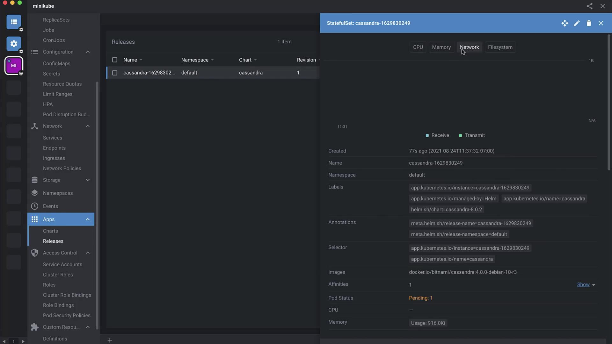

# Add Bitnami repository (if not already added)
helm repo add bitnami https://charts.bitnami.com/bitnami

# Install Cassandra with default settings
helm install my-release bitnami/cassandra

# Install Cassandra with custom values
helm install my-release -f values.yaml bitnami/cassandra
```

Back in Lens, click **Install**, review the form, then click **Install** again. Lens will deploy the chart to your cluster.

***

## 4. Review and Customize Default Values

Before finalizing, Lens displays the `values.yaml`. Tweak global settings, storage, and more:

```yaml theme={null}
## Global Docker image parameters
global:
  imageRegistry: ""
  imagePullSecrets: []
  storageClass: ""

## Common parameters
nameOverride: ""
fullnameOverride: ""
commonLabels: {}
commonAnnotations: {}
clusterDomain: cluster.local
extraDeploy: []

## Diagnostic mode
diagnosticMode:
  enabled: false
  command:
    - sleep
```

<Callout icon="lightbulb">
  Customize `storageClass` and `imagePullSecrets` to match your Kubernetes environment.
</Callout>

***

## 5. Inspect Deployed Resources

After installation, click **View Helm Release** in Lens to explore all resources:

| Resource Type  | Description                           |
| -------------- | ------------------------------------- |
| ServiceAccount | Identity for Cassandra pods           |
| Secret         | Stores credentials (`cassandra` user) |
| Service        | Exposes port 9042                     |
| StatefulSet    | Manages Cassandra pods with storage   |
| ConfigMap      | Configuration for Cassandra           |

<Frame>
  
</Frame>

Lens lets you edit metadata (labels, annotations) on the fly and view logs, metrics, and YAML definitions.

***

## 6. Connect to Cassandra

### A. Using a Temporary Pod

```bash theme={null}
kubectl run cassandra-client --rm -i --tty --restart=Never \
  --namespace default \
  --env CASSANDRA_PASSWORD=$CASSANDRA_PASSWORD \
  --image docker.io/bitnami/cassandra:4.0.0-debian-10-r3 -- bash
```

Inside the pod:

```bash theme={null}
cqlsh -u cassandra -p $CASSANDRA_PASSWORD cassandra
```

### B. Port-Forward from Local Host

```bash theme={null}
kubectl port-forward --namespace default svc/my-release-cassandra 9042:9042 &
cqlsh -u cassandra -p $CASSANDRA_PASSWORD 127.0.0.1 9042
```

***

## Links and References

* [Helm Documentation][helm-docs]
* [Kubernetes Documentation][k8s-docs]
* [Lens Documentation][lens-docs]
* [Bitnami Cassandra Helm Chart][cassandra-helm]

[helm-docs]: https://helm.sh/docs/

[k8s-docs]: https://kubernetes.io/docs/

[lens-docs]: https://docs.k8slens.dev/

[cassandra-helm]: https://github.com/bitnami/charts/tree/master/bitnami/cassandra

<CardGroup>
  <Card title="Watch Video" icon="video" href="https://learn.kodekloud.com/user/courses/lens-kubernetes-ide/module/5612678e-a690-4e4e-b43d-966183dffdbf/lesson/9fc751f1-d8b5-4bd5-abb5-6c034f76da99" />
</CardGroup>


# Course Introduction

Source: https://notes.kodekloud.com/docs/Linode-Kubernetes-Engine/Introduction/Course-Introduction/page

This hands-on course teaches deploying and managing Kubernetes workloads using Linode Kubernetes Engine.

Welcome to the Linode Kubernetes Engine (LKE) course at KodeKloud. I’m Michael Levan, and in this lesson we’ll explore how to leverage LKE for deploying and managing Kubernetes workloads.

This hands-on course guides you through:

* Exploring the official LKE documentation
* Provisioning Kubernetes clusters on Linode
* Deploying and scaling applications with kubectl

While Kubernetes fundamentals are covered in our dedicated course, here we’ll contrast using a managed service like LKE against running an on-premises cluster.

## Learning Objectives

By the end of this lesson, you will be able to:

* Compare managed Kubernetes (LKE) with self-managed, on-premises clusters
* Create and configure LKE clusters
* Connect to your LKE clusters using kubectl
* Deploy and manage applications on LKE

<Callout icon="lightbulb">
  Before you begin, ensure you have:

  * A Linode account
  * kubectl installed (see [Kubectl Installation Guide](https://kubernetes.io/docs/tasks/tools/))
  * Basic familiarity with Kubernetes concepts
</Callout>

## Managed vs Self-Managed Kubernetes

| Feature                  | Managed LKE                                  | Self-Managed (On-Premises)               |
| ------------------------ | -------------------------------------------- | ---------------------------------------- |
| Control Plane Management | Linode-managed with SLA                      | You manage API server, etcd, etc.        |
| Upgrades & Patching      | Automated rolling updates                    | Manual patching and version upgrades     |
| Node Provisioning        | One-click node pool creation                 | Custom scripts or tooling                |
| Scalability              | Scale clusters in minutes via the LKE UI/CLI | Requires capacity planning and scripting |
| Cost Structure           | Pay per node instance                        | Infrastructure + operational overhead    |

## Links and References

* [Linode Kubernetes Engine Documentation](https://www.linode.com/docs/guides/lke-overview/)
* [Kubernetes Basics](https://kubernetes.io/docs/concepts/overview/what-is-kubernetes/)
* [Kubectl Installation Guide](https://kubernetes.io/docs/tasks/tools/)

<CardGroup>
  <Card title="Watch Video" icon="video" href="https://learn.kodekloud.com/user/courses/linode-kubernetes-engine/module/c530412c-19ac-4b5a-a852-d025b095a75c/lesson/31143899-7ded-48d9-95c1-5c42433aca37" />
</CardGroup>
