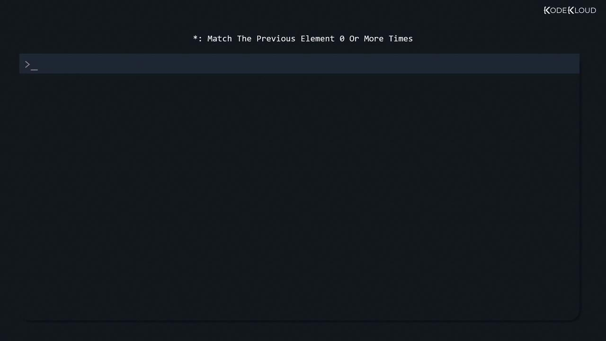
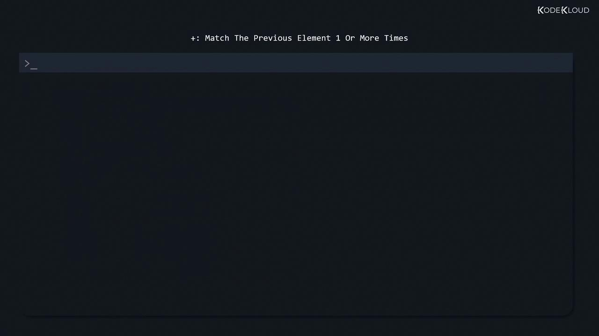

# Finds every line that contains a literal dot.
```

## Quantifiers: `*` and `+`

### `*` (Zero or More)

The asterisk matches zero or more occurrences of the previous element:

```bash theme={null}
$ grep -r 'let*' /etc/
/etc/pnm2ppa.conf:#silent 1
/etc/pnm2ppa.conf:#leftmargin      10
...
```

Combine `.` and `*` to match any sequence between delimiters:

```bash theme={null}
$ grep -r '/.*/' /etc/
/etc/man_db.conf:# before /usr/man.
/etc/man_db.conf:MANDB_MAP             /usr/man
...
```

<Frame>
  
</Frame>

### `+` (One or More)

In basic `grep`, `+` is literal unless escaped. To require at least one occurrence:

<Frame>
  
</Frame>

```bash theme={null}
# Zero or more matches still include lines without '0':
$ grep -r '0*' /etc/
/etc/pnm2ppa.conf:#

# Require one or more zeros:
$ grep -r '0\+' /etc/
/etc/brltty/Keyboard/keypad.ktb:bind KP0:!KP2 MENU_NEXT_ITEM
```

<Callout icon="lightbulb">
  Basic `grep` treats `+`, `?`, `{}`, `|`, and `()` as literals. To use them without escaping, switch to extended regex mode:

  ```bash theme={null}
  grep -E 'pattern+|another' file.txt
  # or
  egrep 'pattern+|another' file.txt
  ```
</Callout>

## Next Steps

With these operators in your toolkit, you can build advanced patterns to extract IPs, parse log entries, and automate complex text-processing tasks across your Linux systems.

## References

* [GNU grep Manual](https://www.gnu.org/software/grep/manual/grep.html)
* [Regular Expressions – Tutorialspoint](https://www.tutorialspoint.com/regular_expressions/index.htm)
* [Kubernetes Basics](https://kubernetes.io/docs/concepts/overview/what-is-kubernetes/)

<CardGroup>
  <Card title="Watch Video" icon="video" href="https://learn.kodekloud.com/user/courses/linux-professional-institute-lpic-1-exam-101/module/2490f961-886c-4531-be8c-915cccff60a9/lesson/f01cd944-5755-477b-a37b-271639396ce9" />
</CardGroup>


# Process Text Streams Using Filters

Source: https://notes.kodekloud.com/docs/Linux-Professional-Institute-LPIC-1-Exam-101/GNU-and-Unix-Commands/Process-Text-Streams-Using-Filters/page

Mastering text filters in Linux for efficient viewing, transforming, and comparing plain text streams at the command line.

In Linux, nearly every interaction—SSH sessions, command outputs, system logs, and configuration files—is plain text. Mastering text filters allows you to view, transform, and compare these streams efficiently at the command line.

## Viewing Files with `cat`, `tac`, `head`, and `tail`

### Displaying Entire and Reversed Files

Use `cat` for quick, on-screen dumps of small files:

```bash theme={null}
cat /home/users.txt
