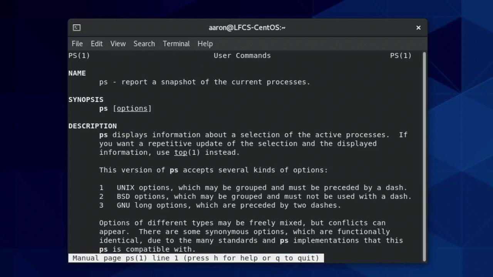

# 2022-12-13
```

Here, `date +%Y-%m-%d` generates `2022-12-13`, which `mkdir` uses as the directory name.

<Callout icon="lightbulb">
  Backquotes can be harder to nest and read. Consider using `$(...)` for complex commands.
</Callout>

### Using `$(...)` Syntax

The `$(...)` form improves readability and nesting:

```bash theme={null}
rmdir 2022-12-13
mkdir $(date +%Y-%m-%d)
ls
# 2022-12-13
```

Both backquotes and `$(...)` produce identical results.

### Assigning Output to a Variable

Store command output in a variable for reuse:

```bash theme={null}
OS=$(uname -o)
echo "Operating System: $OS"
# Operating System: GNU/Linux
```

***

## Processing Input with xargs

`xargs` builds and executes command lines from standard input. It’s perfect for bulk processing of filenames and other arguments.

### Basic xargs Example

Find all files in `/usr/share/icons` starting with `debian` and report their dimensions via ImageMagick’s `identify`:

```bash theme={null}
find /usr/share/icons -name 'debian*' \
  | xargs identify -format "%f: %wx%h\n"
```

Output:

```text theme={null}
debian-swirl.svg: 48x48
debian-swirl.png: 22x22
...
```

Steps:

1. `find` lists matching files.
2. Pipe the list into `xargs`.
3. `xargs` runs `identify` with `-format` to print `filename: width×height`.

### Limiting Arguments per Invocation

By default, `xargs` packs as many items as possible per command. Use `-n` or `-L` to control batching:

```bash theme={null}
# One file per identify invocation
find /usr/share/icons -name 'debian*' \
  | xargs -n 1 identify -format "%f: %wx%h\n"

# Three files at a time
find /usr/share/icons -name 'debian*' \
  | xargs -L 3 identify -format "%f: %wx%h\n"
```

### Handling Filenames with Spaces

Filenames containing spaces or special characters require a null separator:

```bash theme={null}
find . \
  -name '*.avi' -print0 \
  -o -name '*.mp4' -print0 \
  -o -name '*.mkv' -print0 \
  | xargs -0 du | sort -n
```

1. Each match is terminated with `\0`.
2. `xargs -0` reads these safely.
3. `du` shows disk usage, then `sort -n` orders by size.

<Callout icon="triangle-alert">
  Always use `-print0` with `find` and `-0` with `xargs` when processing arbitrary filenames to avoid word-splitting issues.
</Callout>

### Placing Arguments at a Specific Position

Use `-I` with a placeholder (e.g., `{}` or `PATH`) to insert items at a custom position:

```bash theme={null}
find . \
  -mindepth 2 \
  \( -name '*.avi' -o -name '*.mp4' -o -name '*.mkv' \) -print0 \
  | xargs -0 -I {} mv {} ./
```

This moves each video file from subdirectories into the current directory, replacing `{}` with the filename.

***

## Common xargs Options

| Option | Description                               | Example                         |
| ------ | ----------------------------------------- | ------------------------------- |
| -n N   | Use at most N arguments per command       | `xargs -n 1 echo`               |
| -L N   | Use at most N lines per command           | `xargs -L 3 ls -l`              |
| -0     | Input items are null-terminated (`\0`)    | `find . -print0 \| xargs -0 rm` |
| -I X   | Replace placeholder X in the command line | `xargs -I {} cp {} /backup/`    |
| -P N   | Run up to N processes in parallel         | `xargs -P 4 -n 1 gzip`          |

***

## Links and References

* [Bash Command Substitution](https://www.gnu.org/software/bash/manual/html_node/Command-Substitution.html)
* [xargs Manual](https://man7.org/linux/man-pages/man1/xargs.1.html)
* [find(1) – GNU findutils](https://man7.org/linux/man-pages/man1/find.1.html)
* [ImageMagick identify](https://imagemagick.org/script/identify.php)

<CardGroup>
  <Card title="Watch Video" icon="video" href="https://learn.kodekloud.com/user/courses/linux-professional-institute-lpic-1-exam-101/module/2490f961-886c-4531-be8c-915cccff60a9/lesson/8bc8d1be-2bf6-4a77-a9c2-87896e510687" />
</CardGroup>


# Create Monitor and Kill Processes

Source: https://notes.kodekloud.com/docs/Linux-Professional-Institute-LPIC-1-Exam-101/GNU-and-Unix-Commands/Create-Monitor-and-Kill-Processes/page

This article explains how to create, monitor, and manage processes in Linux using various commands and techniques.

Understanding how to manage processes is fundamental for any Linux administrator. A process is simply a running instance of a program, from short-lived commands like `ls` to long-running services.

## 1. Launching a Process

For example, running:

```bash theme={null}
[aaron@LFCS-CentOS ~]$ ls
absolute_picture_shortcut  all_output.txt  archive.tar  archive.zip  Desktop
Documents                 Downloads       file1        file1.gz     file2
file2.bz2                 file3           file3.xz     fstab_shortcut Music
nomachine_7.7.4_1_x86_64.rpm Pictures    Public       shortcut_to_directory
script.sh                 Templates       testfile     videos
[aaron@LFCS-CentOS ~]$
```

creates a short-lived `ls` process that exits once the directory contents are shown.

***

## 2. Inspecting Processes with `ps`

The `ps` command lists active processes. It has two distinct option styles:

| Syntax Style | Example  | Description                           |
| ------------ | -------- | ------------------------------------- |
| UNIX-style   | `ps -e`  | Show every process                    |
| BSD-style    | `ps axu` | All processes in user-oriented format |

To view all processes in a user-friendly layout, combine `a` (others’ processes), `x` (no controlling terminal), and `u` (user format):

```bash theme={null}
ps aux
```

```text theme={null}
USER       PID %CPU %MEM    VSZ   RSS TTY      STAT START   TIME COMMAND
root         1  0.0  0.3 241296 14000 ?        Ss   Mar23   0:01 /usr/lib/systemd/systemd
aaron     6601  6.2  4.8 3142460 185096 ?       S    10:27   0:06 gnome-shell
… more …
```

### 2.1 Exploring `ps` Options

<Frame>
  
</Frame>

Common invocations from the manual:

* **Full format**
  ```bash theme={null}
  ps -ef       # UNIX full format
  ps axu       # BSD with user columns
  ```
* **Process tree**
  ```bash theme={null}
  ps -ejH
  ps axjf
  ```
* **Thread details**
  ```bash theme={null}
  ps -Elf
  ps axms
  ```

### 2.2 Understanding `ps aux` Columns

| Column  | Description              |
| ------- | ------------------------ |
| USER    | Process owner            |
| PID     | Process ID               |
| %CPU    | CPU usage at sample time |
| %MEM    | Physical memory usage    |
| VSZ     | Virtual memory size (KB) |
| RSS     | Resident Set Size (KB)   |
| STAT    | Process state            |
| START   | Start time or date       |
| TIME    | Cumulative CPU time      |
| COMMAND | Command with arguments   |

<Callout icon="lightbulb">
  Kernel threads run in kernel space and appear in square brackets, e.g., `[kworker/0:1]`.
</Callout>

***

## 3. Real-Time Monitoring with `top`

To watch processes live:

```bash theme={null}
top
```

```text theme={null}
top - 10:15:42 up 2:31, 1 user, load average: 0.01, 0.05, 0.03
Tasks: 236 total,   1 running, 235 sleeping, 0 stopped, 0 zombie
%Cpu(s): 0.5 us, 0.2 sy, 99.3 id, 0.0 wa, 0.0 hi, 0.0 si, 0.0 st
MiB Mem : 3731.4 total, 1588.9 free, 915.6 used, 1227.1 buff/cache
MiB Swap: 2048.0 total, 2048.0 free,   0.0 used. 2554.1 avail Mem

  PID USER   PR  NI    VIRT    RES    SHR S  %CPU %MEM     TIME+ COMMAND
 6601 aaron  20   0 3142460 185096 104268 S   6.2  4.8   00:06.60 gnome-shell
    1 root   20   0 241296   14000   8912 S   0.0  0.4   00:01.26 systemd
…
```

* Use arrow keys or Page Up/Page Down to navigate.
* Press `Q` to quit.

***

## 4. Targeted Process Listings

| Task                   | Command                   |
| ---------------------- | ------------------------- |
| By PID                 | `ps -p 1` or `ps -p 1 -u` |
| By user                | `ps -u aaron`             |
| By name (with `pgrep`) | `pgrep -a syslog`         |

```bash theme={null}
