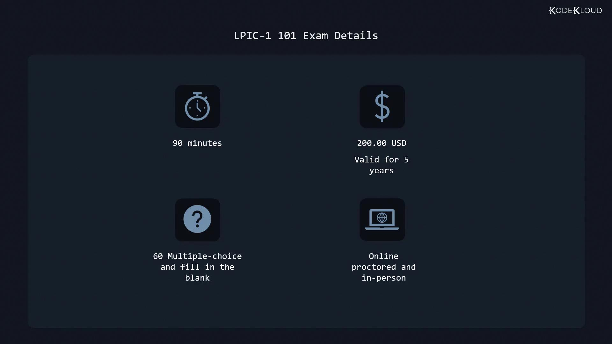

# /home/aaron
```

Use these expansions for platform-independent scripting:

```bash theme={null}
touch "$HOME/saved_file"
```

Each user running this command will create `saved_file` in their own home directory.

## Setting Persistent Environment Variables

User-specific variables can go in `~/.bashrc` or `~/.profile`, but for system-wide settings, use `/etc/environment`.

<Callout icon="lightbulb">
  Line-based syntax only—no shell expansions or functions.\
  Example entries look like `KEY="value"`.
</Callout>

### Edit `/etc/environment`

1. Open the file with root privileges:
   ```bash theme={null}
   sudo vim /etc/environment
   ```
2. Add your variable:
   ```bash theme={null}
   KODEKLOUD="https://kodekloud.com"
   ```
3. Save and exit.
4. Log out and back in, then verify:
   ```bash theme={null}
   echo $KODEKLOUD
   # https://kodekloud.com
   ```

<Callout icon="triangle-alert">
  Changes in `/etc/environment` affect all users and services.\
  Always back up `/etc/environment` before editing.
</Callout>

## Automating Commands on Login

To execute commands for every user at login, place shell scripts in `/etc/profile.d/`. For instance, record the last login time:

1. Create a script file:
   ```bash theme={null}
   sudo vim /etc/profile.d/lastlogin.sh
   ```
2. Add the following (no shebang required):
   ```bash theme={null}
   echo "Your last login was at:" > "$HOME/lastlogin"
   date >> "$HOME/lastlogin"
   ```
3. Save and exit.
4. Log out and back in, then check:
   ```bash theme={null}
   ls | grep lastlogin
   # lastlogin

   cat lastlogin
   # Your last login was at:
   # Thu Dec 16 10:42:37 UTC 2021
   ```

This script uses `$HOME` and demonstrates how to run tasks automatically upon user login.

***

## Links and References

* [Bash Reference Manual](https://www.gnu.org/software/bash/manual/)
* [Linux Environment Variables (TLDP)](https://tldp.org/LDP/abs/html/internalvariables.html)
* [Kubernetes Documentation](https://kubernetes.io/docs/)
* [Docker Hub](https://hub.docker.com/)

<CardGroup>
  <Card title="Watch Video" icon="video" href="https://learn.kodekloud.com/user/courses/linux-professional-institute-lpic-1-exam-101/module/2490f961-886c-4531-be8c-915cccff60a9/lesson/17bd8d4d-47ab-4066-b887-b70f7c853f05" />
</CardGroup>


# Certification Details

Source: https://notes.kodekloud.com/docs/Linux-Professional-Institute-LPIC-1-Exam-101/Introduction/Certification-Details/page

Prepare for the LPIC-1 101 exam with essential knowledge and hands-on practice to master Linux system fundamentals.

Prepare for the LPIC-1 101 exam with confidence. This course delivers the essential knowledge and hands-on practice you need to master Linux system fundamentals and succeed on exam day.

<Callout icon="lightbulb">
  There are **no formal prerequisites** for LPIC-1 101—anyone with basic Linux skills can enroll.
</Callout>

## Exam Overview

The LPIC-1 101 exam evaluates your proficiency in core Linux administration. You can choose to take it online with a proctor or at an approved VUE test center.

## Exam Objectives

You will be tested on four main domains:

* **System Architecture**
* **Linux Installation & Package Management**
* **GNU & UNIX Commands**
* **Devices, Linux File Systems & Filesystem Hierarchy Standard**

## Course Structure

This self-paced course is organized into modules that align directly with the exam objectives:

1. System Architecture
2. Linux Installation & Package Management
3. GNU & UNIX Commands
4. Devices, File Systems & FHS Compliance

## Exam Details

| Attribute           | Description                                       |
| ------------------- | ------------------------------------------------- |
| Duration            | 90 minutes                                        |
| Number of Questions | 60 (multiple-choice and fill-in-the-blank)        |
| Exam Fee            | USD 200\*                                         |
| Validity            | 5 years                                           |
| Delivery            | Online proctored or in-person at VUE test centers |

\*Fees may vary by country—check local pricing before registering.

<Frame>
  
</Frame>

<Callout icon="triangle-alert">
  Exam content and fees are subject to change. Always verify the latest information on the [Linux Professional Institute website](https://www.lpi.org/).
</Callout>

## Registration Details

Toward the end of this article, you’ll find a step-by-step guide to register for the LPIC-1 101 exam, select your preferred delivery method, and prepare for exam day.

## Links and References

* [LPIC-1 Certification Overview](https://www.lpi.org/our-certifications/linux-professional-institute-certification-lpic-1)
* [Linux Professional Institute](https://www.lpi.org/)
* [VUE Test Centers](https://home.pearsonvue.com/)

<CardGroup>
  <Card title="Watch Video" icon="video" href="https://learn.kodekloud.com/user/courses/linux-professional-institute-lpic-1-exam-101/module/d4be6e48-68fa-4f21-a1d8-f53d01c122a4/lesson/5a924e16-3892-4fac-9847-30e786acdcf5" />
</CardGroup>
