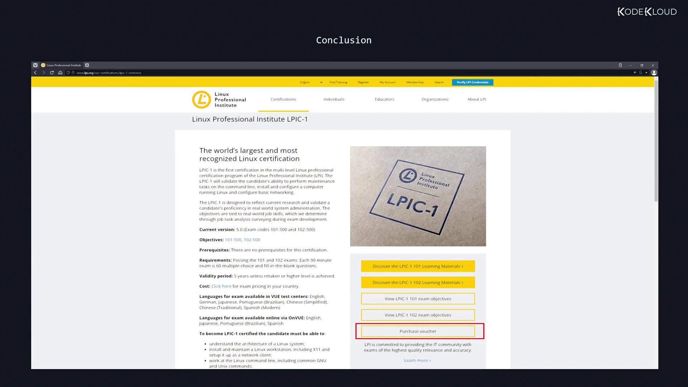

# Allow members of group sudo to execute any command
%sudo   ALL=(ALL:ALL) ALL
```

This line consists of:

1. User/Group: `%sudo` indicates that the policy applies to all users in the sudo group.
2. Host: `ALL` specifies that the rule applies on any host.
3. Run as user and group: `(ALL:ALL)` means that commands can be executed as any user and any group.
4. Command list: The final `ALL` grants permission to execute any command.

The general syntax for an entry in the sudoers file is:

```plaintext theme={null}
user_or_group   host=(run_as_user:run_as_group) command_list
```

### Example Policies

To define a policy that allows Trinity to run any sudo command as any user, add an entry like this:

```bash theme={null}
trinity   ALL=(ALL)       ALL
```

If you prefer to grant permissions to a whole group (for example, the developers group), prepend the group name with a percent sign:

```bash theme={null}
%developers ALL=(ALL)     ALL
```

These entries allow the specified user or all members of the developers group to execute any command using sudo.

It is also possible to restrict the commands that a user can execute. For instance, if you want Trinity to run only specific commands such as ls or stat, you can limit her permissions accordingly. Consider the following example:

```bash theme={null}
$ sudo -u trinity ls /home/trinity
Desktop  Documents  Downloads  Music  Pictures
```

With a restricted sudoers entry, if Trinity attempts to execute an unauthorized command, she might receive an error message like:

```bash theme={null}
$ sudo echo "Test passed?"
Sorry, user trinity is not allowed to execute '/bin/echo Test passed?' as root on kodekloud.
```

<Callout icon="lightbulb">
  By default, sudo commands run as root. To run a command as a different user, specify the desired user with the `-u` option.
</Callout>

For example, to run a command as Trinity herself:

```bash theme={null}
$ sudo -u trinity ls /home/trinity
```

If the run-as field is set to `ALL`, the policy permits execution as any user. However, to restrict Trinity so she can only execute commands as specific users (for example, Aaron or John), list those names in the sudoers file.

Additionally, the first time a sudo command is executed in a session, it prompts for the current user’s password. The sudoers file also provides options to disable this password prompt for specific users if configured appropriately.

<Callout icon="triangle-alert">
  Always back up your sudoers file before making changes. Use the visudo utility to edit this file, ensuring that syntax errors do not lock you out of administrative privileges.
</Callout>

By carefully setting these policies, you can secure your system with fine-tuned administrative rights rather than granting universal sudo access.

For more detailed guidance on managing user privileges in Linux, consider exploring [Linux Administration Best Practices](https://www.linux.com/).

<CardGroup>
  <Card title="Watch Video" icon="video" href="https://learn.kodekloud.com/user/courses/linux-foundation-certified-system-administrator-lfcs/module/b36d272b-24e2-44e1-82cb-20a5cfa93635/lesson/1f6adaa6-ada5-47f3-add4-8c2c0861fa69" />

  <Card title="Practice Lab" icon="installation" href="https://learn.kodekloud.com/user/courses/linux-foundation-certified-system-administrator-lfcs/module/b36d272b-24e2-44e1-82cb-20a5cfa93635/lesson/b9cd8286-ad81-4652-99c2-34dc337a10d1" />
</CardGroup>


# Conclusion

Source: https://notes.kodekloud.com/docs/Linux-Professional-Institute-LPIC-1-Exam-101/Conclusion-and-Mock-Exam/Conclusion/page

This article guides you through registering for the LPIC-1 101 exam and purchasing the exam voucher.

Congratulations on completing this lesson! You’re now ready to register for the LPIC-1 101 exam—the first step toward earning your LPIC-1 certification.

## Step 1: Create Your LPI Account

1. Visit [LPI Member Sign Up](https://lpi.org/member/join).
2. Click **Sign Up** and fill in your details.
3. Check your inbox for your LPI ID.

<Callout icon="lightbulb">
  Your LPI ID is required when registering for any LPI exam and viewing your results.
</Callout>

## Step 2: Purchase Your LPIC-1 101 Exam Voucher

1. Log in to your [LPI account](https://lpi.org).
2. Navigate to **Certifications** → **LPIC-1**.

<Frame>
  
</Frame>

3. Click **Purchase Voucher** to be redirected to Pearson VUE.
4. Select your region and country.
5. Choose the **LPIC-1 101** voucher and complete payment (current price: USD 200).

<Callout icon="triangle-alert">
  Exam fees vary by country. Always confirm the latest cost before checkout.
</Callout>

## Registration Summary

| Step | Action                           | Link                                   |
| ---- | -------------------------------- | -------------------------------------- |
| 1    | Create your LPI account          | [Sign Up](https://lpi.org/member/join) |
| 2    | Purchase LPIC-1 101 exam voucher | Inside **Certifications → LPIC-1**     |

## After Your Exam

* LPI will email your LPIC-1 101 results.
* View your score in your LPI account dashboard.
* Start preparing for the **LPIC-1 102** exam to complete your certification journey.

## Additional Resources

* [LPI Certification Overview](https://lpi.org/our-certifications/professional-certifications/lpic-1)
* [Pearson VUE Exam Center Locator](https://home.pearsonvue.com/test-taker)

Best of luck on your exams! We hope this lesson empowers you to achieve LPIC-1 success.

<CardGroup>
  <Card title="Watch Video" icon="video" href="https://learn.kodekloud.com/user/courses/linux-professional-institute-lpic-1-exam-101/module/81f13773-2c1f-492a-87b9-0d537670bd90/lesson/74dbc20c-ee21-4dac-bc69-a9089179cabe" />
</CardGroup>
