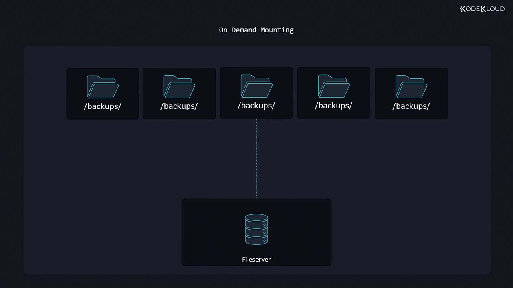

# -rw-rw-r--. 1 aaron aaron 0 Jan 31 14:30 testfile
```

Use `lsblk` to confirm the mount point:

```bash theme={null}
lsblk
# NAME    MAJ:MIN RM  SIZE RO TYPE MOUNTPOINT
# vdb     8:16   0   10G  0 disk 
# └─vdb1  8:17   0    4G  0 part /mnt
```

### 1.3 Unmount the Filesystem

To detach the filesystem:

```bash theme={null}
sudo umount /mnt
```

Then verify it’s no longer mounted:

```bash theme={null}
lsblk
ls /mnt/
```

***

## 2. Automatic Mounting at Boot with `/etc/fstab`

The `/etc/fstab` file defines filesystems to mount automatically during system startup.

### 2.1 Create the Mount Point

```bash theme={null}
sudo mkdir /mybackups
```

### 2.2 Understand `/etc/fstab` Fields

| Field             | Description                                      | Example                   |
| ----------------- | ------------------------------------------------ | ------------------------- |
| Device            | Block device path or UUID                        | `/dev/vdb1` or `UUID=...` |
| Mount point       | Directory to attach the filesystem               | `/mybackups`              |
| Filesystem type   | `xfs`, `ext4`, `swap`, etc.                      | `xfs`, `swap`             |
| Options           | Mount options, e.g., `defaults`, `rw`, `noexec`  | `defaults`                |
| Dump              | `0` = disable, `1` = enable (for `dump` utility) | `0`                       |
| Pass (fsck order) | `0` = skip, `1` = root, `2` = other filesystems  | `2`                       |

### 2.3 Add an XFS Entry

Open `/etc/fstab` in your editor:

```bash theme={null}
sudo vim /etc/fstab
```

Append:

```fstab theme={null}
/dev/vdb1    /mybackups    xfs    defaults    0    2
```

<Callout icon="lightbulb">
  If you don’t plan to reboot immediately, apply the new mounts with:

  ```bash theme={null}
  sudo mount -a
  ```
</Callout>

### 2.4 Verify and Reboot

Confirm `/mybackups` is not yet mounted:

```bash theme={null}
ls /mybackups/
lsblk | grep mybackups
```

Reboot the system:

```bash theme={null}
sudo systemctl reboot
```

After login, verify the mount:

```bash theme={null}
ls -l /mybackups/
lsblk | grep mybackups
# vdb1   8:17   0   4G  0 part /mybackups
```

***

## 3. Enabling Swap at Boot

If you created a swap partition on `/dev/vdb3`, add it to `/etc/fstab` so it’s activated at startup.

### 3.1 Add Swap Entry

Edit `/etc/fstab` and append:

```fstab theme={null}
/dev/vdb3    none    swap    defaults    0    0
```

Here, the mount point is `none`, and `0 0` disables dump and fsck.

### 3.2 Verify Swap

Reload systemd (or reboot) and check:

```bash theme={null}
sudo systemctl daemon-reload
sudo swapon --show
# NAME        TYPE      SIZE USED PRIO
# /dev/vdb3   partition 2G   0B   -2
```

***

## 4. Using UUIDs Instead of Device Names

Device names can change if hardware is reconfigured. UUIDs remain constant.

### 4.1 Retrieve a Device’s UUID

```bash theme={null}
sudo blkid /dev/vdb1
# /dev/vdb1: LABEL="FirstFS" UUID="9ab8cfa5-2813-4b70-ada0-7abd0ad9d289" TYPE="xfs"
```

### 4.2 Example `/etc/fstab` Entry with UUID

```fstab theme={null}
UUID=9ab8cfa5-2813-4b70-ada0-7abd0ad9d289    /mybackups    xfs    defaults    0    2
```

***

## Links and References

* [mount(8) Manual](https://man7.org/linux/man-pages/man8/mount.8.html)
* [fstab(5) Manual](https://man7.org/linux/man-pages/man5/fstab.5.html)
* [XFS Filesystem Documentation](https://docs.kernel.org/filesystems/xfs/index.html)
* [Linux Swap – ArchWiki](https://wiki.archlinux.org/title/Swap)
* [blkid(8) Manual](https://man7.org/linux/man-pages/man8/blkid.8.html)

<CardGroup>
  <Card title="Watch Video" icon="video" href="https://learn.kodekloud.com/user/courses/linux-professional-institute-lpic-1-exam-101/module/de71b96a-9dc0-4e92-987a-6c7055c44e8b/lesson/5c4b052f-b036-43ee-af83-f7cfc6fe73f9" />
</CardGroup>


# Control Mounting and Unmounting of Filesystems Part 1 Mount on demand

Source: https://notes.kodekloud.com/docs/Linux-Professional-Institute-LPIC-1-Exam-101/Devices-Linux-Filesystems-Filesystem-Hierarchy-Standard/Control-Mounting-and-Unmounting-of-Filesystems-Part-1-Mount-on-demand/page

Learn to optimize Linux performance by mounting filesystems on demand, reducing network traffic and server load for rarely accessed directories.

In this lesson, you’ll learn how to optimize Linux system performance by mounting filesystems only when they’re accessed. This technique, known as **on-demand mounting**, reduces unnecessary network traffic—especially for remote filesystems like NFS—and keeps your server load light.

## Why On-Demand Mounting?

* Defers mounting until a path is accessed
* Saves network bandwidth for NFS and CIFS shares
* Automatically unmounts after inactivity
* Simplifies management of rarely used mount points

Consider a rarely used directory such as `/backups`. With on-demand mounting, nothing is mounted at boot or during idle periods. As soon as an application or user reads or writes `/backups`, the OS mounts the remote share automatically:

<Frame>
  
</Frame>

## Prerequisites

* A Linux distribution with `dnf` or `yum` (RHEL, CentOS, Fedora)
* Root or sudo privileges
* Basic knowledge of NFS or other network filesystems

***

## 1. Install and Enable AutoFS

The most common tool for on-demand mounts is **autofs**. Install and start the service:

```bash theme={null}
sudo dnf install autofs
sudo systemctl enable --now autofs.service
```

<Callout icon="lightbulb">
  If you’re using a different package manager such as `yum` or `apt`, adjust the install command accordingly.
</Callout>

***

## 2. Set Up a Simple NFS Server

To demonstrate, we’ll configure a basic NFS export on the local machine.

1. Install NFS utilities:
   ```bash theme={null}
   sudo dnf install nfs-utils
   ```
2. Start and enable the NFS server:
   ```bash theme={null}
   sudo systemctl enable --now nfs-server.service
   ```
3. Add an export in `/etc/exports`:
   ```bash theme={null}
   sudo vim /etc/exports
   ```
   ```text theme={null}
   /etc 127.0.0.1(ro)
   ```
4. Reload the server to apply changes:
   ```bash theme={null}
   sudo systemctl reload nfs-server.service
   ```

***

## 3. Configure AutoFS Maps

AutoFS uses a **master map** and one or more **map files** to define mounts.

### 3.1 /etc/auto.master

Open the master configuration:

```bash theme={null}
sudo vim /etc/auto.master
```

Add at the end:

```bash theme={null}
/shares  /etc/auto.shares  --timeout=300
```

* **/shares**: Parent directory that AutoFS will create
* **/etc/auto.shares**: Map file listing the mounts
* **--timeout=300**: Unmount after 300 seconds of inactivity

### 3.2 /etc/auto.shares

Edit the map file to define individual mounts:

```bash theme={null}
sudo vim /etc/auto.shares
```

```text theme={null}
