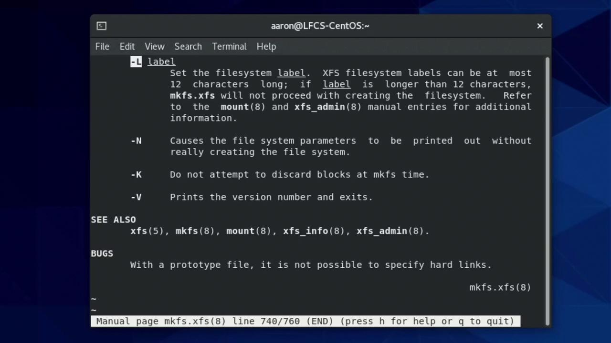

# Create Partitions and Filesystems Use various mkfs commands to create various filesystems

Source: https://notes.kodekloud.com/docs/Linux-Professional-Institute-LPIC-1-Exam-101/Devices-Linux-Filesystems-Filesystem-Hierarchy-Standard/Create-Partitions-and-Filesystems-Use-various-mkfs-commands-to-create-various-filesystems/page

This guide explains how to format and optimize Linux partitions using XFS and ext4 filesystems for various storage needs.

In this guide, you’ll learn how to format and optimize Linux partitions using XFS and ext4 filesystems. Whether you’re preparing storage for backups or application data, these commands help you tailor performance and capacity to your needs. We’ll cover:

* Formatting a partition with XFS
* Inspecting and tuning XFS filesystems
* Formatting a partition with ext4
* Inspecting and tuning ext4 filesystems

***

## Formatting with XFS

XFS is the default filesystem on CentOS and is known for high performance and scalability.

<Callout icon="triangle-alert">
  Running `mkfs.xfs` on a device will destroy all existing data. Double-check the device name (e.g., `/dev/sdb1`) before proceeding.
</Callout>

### 1. Create an XFS Filesystem

To format `/dev/sdb1` with the default XFS settings:

```bash theme={null}
sudo mkfs.xfs /dev/sdb1
```

### 2. Read the Manual and Set a Label

Consult the `mkfs.xfs` manual for all available options, such as adding a volume label:

```bash theme={null}
man mkfs.xfs
```

<Frame>
  
</Frame>

To assign a label (up to 12 characters):

```bash theme={null}
sudo mkfs.xfs -L "BackupVolume" /dev/sdb1
```

### 3. View All Creation Options

Running `mkfs.xfs` without arguments displays a summary of flags:

```bash theme={null}
mkfs.xfs
```

Example excerpt:

```text theme={null}
/* blocksize */        [-b size=num]
/* label */            [-L label (maximum 12 characters)]
/* inode size */       [-i size=num,...]
...
<devicename> is required ...
```

### 4. Custom Inode Size and Label

Combine options to fine-tune your filesystem. For instance, set 512-byte inodes and a label:

```bash theme={null}
sudo mkfs.xfs -i size=512 -L "BackupVolume" /dev/sdb1
```

Sample output:

```text theme={null}
meta-data=/dev/sdb1           isize=512    agcount=4, agsize=262144 blks
data     =                     bsize=4096    blocks=1048576, imaxpct=25
naming   =version 2
log      =internal log
realtime =none
```

### 5. Explore XFS Utilities

The XFS toolset lets you inspect and manage filesystems. Typing `xfs_` lists available commands:

| Utility     | Purpose                             |
| ----------- | ----------------------------------- |
| xfs\_admin  | View or change the filesystem label |
| xfs\_info   | Display geometry and layout details |
| xfs\_growfs | Expand a mounted XFS filesystem     |
| xfs\_quota  | Manage project and user quotas      |

### 6. Change an Existing XFS Label

To view the current label:

```bash theme={null}
sudo xfs_admin -l /dev/sdb1
