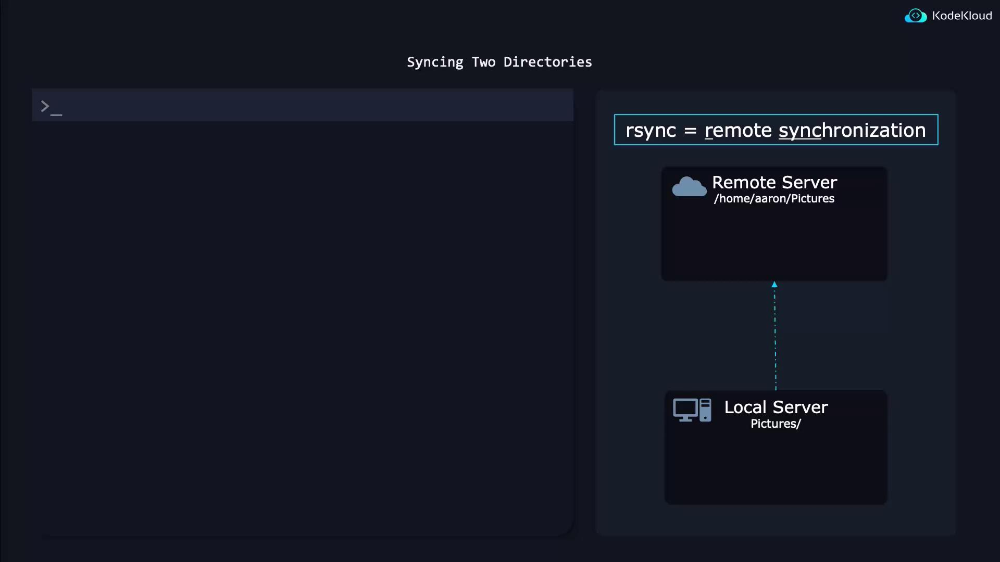

# Long form
tar --create --file archive.tar file1

# Short form
tar -cf archive.tar file1
```

### Append Files or Directories

```bash theme={null}
# Add a single file
tar --append --file archive.tar file2
# Short form
tar -rf archive.tar file2

# Add an entire directory
tar --create --file archive.tar pictures/
# Short form
tar -cf archive.tar pictures/
```

* Using a **relative path** like `pictures/` stores entries as `pictures/...`.
* An **absolute path** (`/home/aaron/pictures/`) preserves the full directory structure inside the archive.

## Extracting an Archive

Always list contents before extracting:

```bash theme={null}
tar --list --file archive.tar
tar -tf archive.tar
```

Example output:

```text theme={null}
Pictures/
Pictures/family_dog.jpg
```

### Extract into Current Directory

```bash theme={null}
tar --extract --file archive.tar
# or
tar -xf archive.tar
```

If you’re in `/home/aaron/work`, the files will unpack into `/home/aaron/work/Pictures/`.

### Extract to a Specific Directory

```bash theme={null}
tar --extract --file archive.tar --directory /tmp
# or
tar -xf archive.tar -C /tmp
```

## Preserving Ownership and Permissions

By default, `tar` preserves permissions and ownership metadata in the archive. However, regular users cannot restore files to other owners. To fully retain all metadata, run extraction as root:

```bash theme={null}
sudo tar -xf archive.tar -C /desired/path
```

<Callout icon="triangle-alert">
  Extracting as root (`sudo`) may overwrite critical system files if the archive contains absolute paths. Always verify archive contents before restoring.
</Callout>

***

## References

* [GNU tar Manual](https://www.gnu.org/software/tar/manual/tar.html)
* [Linux File Permissions](https://www.kernel.org[AWS_SECRET_ACCESS_KEY].html)

<CardGroup>
  <Card title="Watch Video" icon="video" href="https://learn.kodekloud.com/user/courses/linux-system-administration-for-beginners/module/cc1949d1-8171-4c8c-b69f-86f96cad0bbe/lesson/22512b65-d060-43a4-926c-d161e0fa3a66" />
</CardGroup>


# Backup files to a Remote System Optional

Source: https://notes.kodekloud.com/docs/Linux-System-Administration-for-Beginners/Essential-Commands/Backup-files-to-a-Remote-System-Optional/page

Learn to back up files on Linux using command-line tools like rsync and dd for efficient synchronization and disk imaging.

In this lesson, you’ll learn how to back up files on Linux using native command-line tools. We’ll cover:

* Synchronizing directories over the network with **rsync**
* Creating full disk or partition images with **dd**

These simple yet powerful utilities preserve file attributes, transfer only changed data when possible, and let you store backups remotely or locally.

***

## Synchronize Directories with rsync

`rsync` (remote synchronization) is a fast, versatile tool that copies files between local and remote directories while preserving permissions, timestamps, and symbolic links. It only transfers the differences between the source and destination, making repeated backups efficient.

<Frame>
  
</Frame>

### Basic Syntax

```bash theme={null}
rsync -a [source/] user@remote_host:[destination/]
```

| Option | Description                                                                    |
| ------ | ------------------------------------------------------------------------------ |
| -a     | Archive mode: preserves symbolic links, permissions, timestamps, and recursion |
| -v     | Verbose output                                                                 |
| -h     | Human-readable numbers                                                         |
| -P     | Show progress and keep partially transferred files                             |

<Callout icon="lightbulb">
  Adding a trailing slash to the source (e.g., `~/pics/`) copies *contents* of the directory. Omitting the slash (e.g., `~/pics`) copies the directory itself.
</Callout>

### Examples

Push local directory to a remote server:

```bash theme={null}
rsync -a ~/pictures/ AaronLockhart@9.9.9.9:/backup/pictures/
```

Pull a remote directory to your local system:

```bash theme={null}
rsync -a AaronLockhart@9.9.9.9:/backup/pictures/ ~/pictures/
```

Synchronize two local directories:

```bash theme={null}
rsync -a /path/to/source/ /path/to/destination/
```

On subsequent runs, only changed files are transferred, dramatically speeding up your backups.

***

## Bit-by-Bit Backups with dd

When you need a complete disk or partition image (for cloning or disaster recovery), use `dd`. It performs a raw, byte-for-byte copy.

<Callout icon="triangle-alert">
  Always unmount the target device before creating or restoring an image with `dd` to avoid data corruption.
</Callout>

### Create an Image

```bash theme={null}
sudo dd if=/dev/vda of=diskimage.raw bs=1M status=progress
```

* `if=/dev/vda` Input file (source disk or partition)
* `of=diskimage.raw` Output file (raw image)
* `bs=1M` Block size of 1 MiB for faster transfers
* `status=progress` Show live progress statistics

### Restore an Image

```bash theme={null}
sudo dd if=diskimage.raw of=/dev/vda bs=1M status=progress
```

Example output:

```bash theme={null}
$ sudo dd if=/dev/vda of=diskimage.raw bs=1M status=progress
1340080128 bytes (1.3GB, 1.2GiB) copied, 3s, 432 MB/s

$ sudo dd if=diskimage.raw of=/dev/vda bs=1M status=progress
1340080128 bytes (1.3GB, 1.2GiB) copied, 3s, 432 MB/s
```

***

## References

* [rsync manual](https://linux.die.net/man/1/rsync)
* [dd command reference](http://man7.org/linux/man-pages/man1/dd.1.html)
* [Linux System Administration Basics](https://tldp.org/)

<CardGroup>
  <Card title="Watch Video" icon="video" href="https://learn.kodekloud.com/user/courses/linux-system-administration-for-beginners/module/cc1949d1-8171-4c8c-b69f-86f96cad0bbe/lesson/3fad6b37-b828-41a0-a6ea-cb10e78f1b1b" />
</CardGroup>
