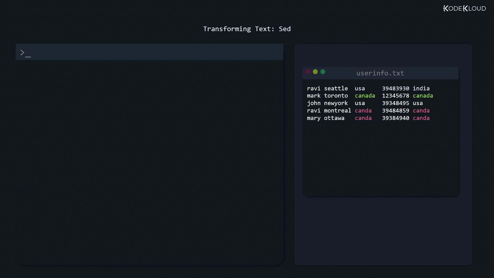

# Show all lines in order
$ cat /home/users.txt
user1
user2
user3
user4
user5
user6

# Show lines in reverse order
$ tac /home/users.txt
```

### Inspecting Beginnings and Endings: `head` and `tail`

* `head -n N`: Display the first N lines.
* `tail -n N`: Display the last N lines (default is 10).

```bash theme={null}
# First 20 lines of a log
$ head -n 20 /var/log/dnf.log

# Last 20 lines of a log
$ tail -n 20 /var/log/dnf.log
```

### Quick Reference: File Viewing Commands

| Command     | Description          | Example                        |
| ----------- | -------------------- | ------------------------------ |
| `cat file`  | Dump whole file      | `cat /etc/hosts`               |
| `tac file`  | Dump file in reverse | `tac /home/users.txt`          |
| `head -n N` | First N lines        | `head -n 10 /var/log/syslog`   |
| `tail -n N` | Last N lines         | `tail -n 50 /var/log/auth.log` |

***

## Transforming Text with `sed`

<Frame>
  
</Frame>

Imagine `userinfo.txt` contains a typo—“canda” instead of “canada.” You can preview a global replacement without altering the file:

```bash theme={null}
$ sed 's/canda/canada/g' userinfo.txt
```

Breakdown of the substitute command (`s`):

* Pattern delimiters wrapped in single quotes prevent shell expansion.
* First token (`canda`) is the search string.
* Second token (`canada`) is the replacement.
* `g` (global) applies to every match on each line.
* Specify the file at the end.

<Callout icon="lightbulb">
  By default, omitting `g` (i.e., `sed 's/canda/canada/'`) replaces only the first occurrence per line.
</Callout>

Once you’re ready to edit the file in place, add `-i`:

```bash theme={null}
$ sed -i 's/canda/canada/g' userinfo.txt
```

Verify with:

```bash theme={null}
$ cat userinfo.txt
```

***

## Extracting Columns with `cut`

Field extraction is straightforward using `cut`. For space-delimited data, grab usernames from `userinfo.txt`:

```bash theme={null}
$ cut -d ' ' -f 1 userinfo.txt
ravi
mark
john
ravi
mary
```

* `-d ' '` specifies a space delimiter.
* `-f 1` selects the first field.

For comma-separated files, pull the third field (country) and save it:

```bash theme={null}
$ cut -d ',' -f 3 userinfo.txt > countries.txt
```

Now `countries.txt` holds all the country names, including duplicates.

***

## Filtering Unique Entries with `uniq`

The `uniq` command collapses only adjacent duplicate lines. To get a sorted list of unique countries:

```bash theme={null}
# Collapse adjacent duplicates
$ uniq countries.txt

# Sort and then collapse duplicates
$ sort countries.txt | uniq
canada
usa
```

<Callout icon="lightbulb">
  Always sort before piping to `uniq` if you want to remove all duplicate entries, not just adjacent ones.
</Callout>

***

## Comparing Files with `diff`

When a package upgrade modifies a configuration, `diff` helps you spot exactly what's changed.

### Summary of `diff` Options

| Option          | Description                            | Example               |
| --------------- | -------------------------------------- | --------------------- |
| (none)          | Plain diff                             | `diff file1 file2`    |
| `-c`            | Context diff (shows surrounding lines) | `diff -c file1 file2` |
| `-y` or `sdiff` | Side-by-side diff alignment            | `diff -y file1 file2` |

### 1. Plain `diff`

```bash theme={null}
$ diff file1 file2
1c1
< only exists in file 1
---
> only exists in file 2
4c4
< only exists in file 1
---
> only exists in file 2
```

* `1c1`: Change at line 1.
* `<`: Content from the first file.
* `>`: Content from the second file.

### 2. Context Diff (`-c`)

Shows a few lines of context around each change, marked with `!`:

```bash theme={null}
$ diff -c file1 file2
*** file1
--- file2
***************
*** 1,4 ****
! only exists in file 1
  identical line 2
  identical line 3
! only exists in file 1
--- 1,4 ----
! only exists in file 2
  identical line 2
  identical line 3
! only exists in file 2
```

### 3. Side-by-Side Diff (`-y` / `sdiff`)

Aligns both files in columns for easy scanning:

```bash theme={null}
$ diff -y file1 file2
only exists in file 1    | only exists in file 2
identical line 2         | identical line 2
identical line 3         | identical line 3
only exists in file 1    | only exists in file 2

$ sdiff file1 file2
only exists in file 1    | only exists in file 2
identical line 2         unchanged
identical line 3         unchanged
only exists in file 1    | only exists in file 2
```

Here, `|` separates differing lines; identical lines may appear without markers.

***

## Links and References

* [Linux Command Basics](https://linuxcommand.org/)
* [GNU `sed` Manual](https://www.gnu.org/software/sed/manual/sed.html)
* [GNU `cut` Documentation](https://www.gnu.org/software/coreutils/manual/html_node/cut-invocation.html)
* [GNU `diff` Manual](https://www.gnu.org/software/diffutils/manual/diffutils.html)
* [Advanced Text Processing with `awk`](https://www.gnu.org/software/gawk/manual/gawk.html)

<CardGroup>
  <Card title="Watch Video" icon="video" href="https://learn.kodekloud.com/user/courses/linux-system-administration-for-beginners/module/cc1949d1-8171-4c8c-b69f-86f96cad0bbe/lesson/419c27b6-b09c-442a-a3db-72d166e96e0e" />
</CardGroup>


# Compress and Uncompress files Optional

Source: https://notes.kodekloud.com/docs/Linux-System-Administration-for-Beginners/Essential-Commands/Compress-and-Uncompress-files-Optional/page

Learn to compress and decompress files and directories using common Linux utilities like gzip, bzip2, xz, zip, and tar.

Managing file sizes is essential for saving disk space and speeding up transfers. In this guide, you'll learn how to compress and decompress files and directories using the most common Linux utilities: `gzip`, `bzip2`, `xz`, `zip`, and `tar`.

## Table of Contents

* [Compression Tools Overview](#compression-tools-overview)
* [Compressing and Decompressing Single Files](#compressing-and-decompressing-single-files)
* [Preserving Original Files](#preserving-original-files)
* [Inspecting Compressed Archives](#inspecting-compressed-archives)
* [Working with ZIP Archives](#working-with-zip-archives)
* [Combining `tar` with Compression](#combining-tar-with-compression)
* [References](#references)

***

## Compression Tools Overview

Linux distributions typically include these single-file compressors by default:

| Utility | File Extension | Compression Ratio | Typical Speed |
| ------- | -------------- | ----------------- | ------------- |
| gzip    | .gz            | Moderate          | Fast          |
| bzip2   | .bz2           | Better            | Moderate      |
| xz      | .xz            | Best              | Slow          |

Each tool replaces the original file with the compressed version unless instructed otherwise.

***

## Compressing and Decompressing Single Files

Use the following commands to compress and decompress individual files:

```bash theme={null}
