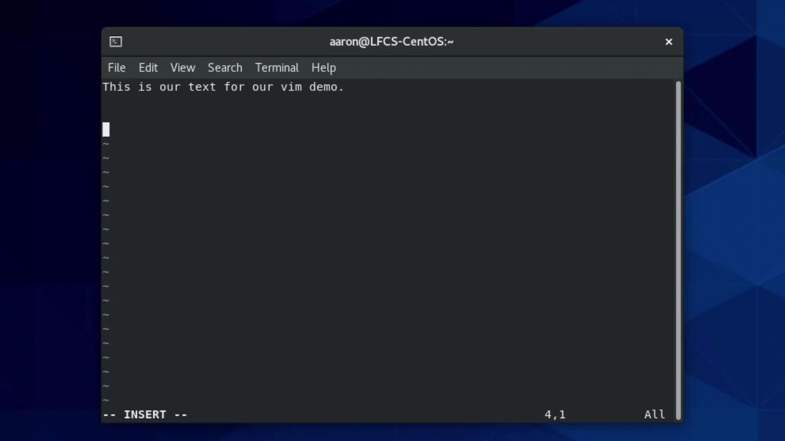
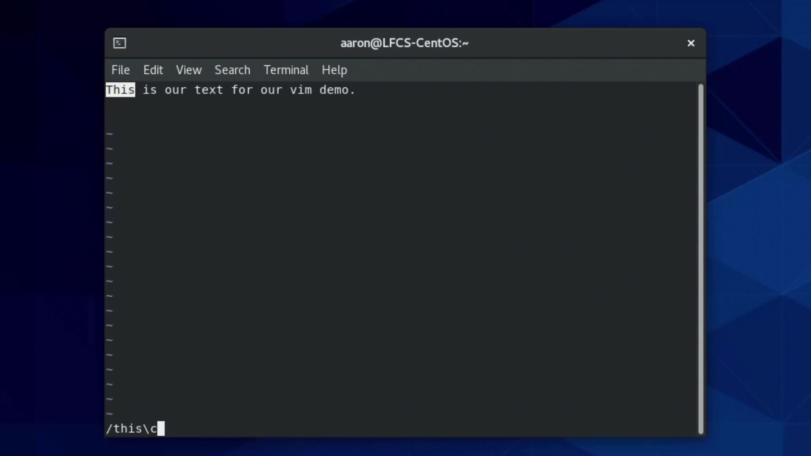

# Output:
# lrwxrwxrwx. 1 aaron aaron 28 Jan 14 10:30 family_dog_shortcut.jpg -> /home/aaron/Pictures/family_dog.jpg
```

To display the stored path directly, use `readlink`:

```bash theme={null}
readlink family_dog_shortcut.jpg
# /home/aaron/Pictures/family_dog.jpg
```

<Callout icon="lightbulb">
  Permissions on a symlink itself are always shown as `rwxrwxrwx`, but access is controlled by the target file’s permissions.
</Callout>

## Handling Permissions

If the target file is read-only, attempts to modify it via the symlink will fail:

```bash theme={null}
echo "Test" >> fstab_shortcut
# bash: fstab_shortcut: Permission denied
```

## Absolute vs. Relative Links

Absolute paths embed the full directory tree, which can break if you move or rename parent directories:

<Callout icon="triangle-alert">
  Absolute symlinks may become invalid if you relocate or rename directories in the path.\
  Use relative paths when moving link and target together.
</Callout>

From `/home/aaron`, create a relative link:

```bash theme={null}
ln -s Pictures/family_dog.jpg relative_dog_shortcut.jpg
```

This link remains valid as long as you move both the `Pictures` directory and `relative_dog_shortcut.jpg` together.

## Linking Directories

You can create symlinks to directories—or even across filesystems (unlike hard links):

```bash theme={null}
ln -s /mnt/data/projects my_projects_link
```

## Comparing Symbolic and Hard Links

| Feature                | Symbolic Link              | Hard Link                                        |
| ---------------------- | -------------------------- | ------------------------------------------------ |
| Can cross filesystems  | Yes                        | No                                               |
| Links to directories   | Yes (with `-s`)            | Typically no (restricted by OS)                  |
| Indicates broken link  | Yes                        | No (hard link always valid until target deleted) |
| Independent attributes | No (permissions inherited) | Shares same inode and attributes                 |

## Further Reading

* [ln(1) – manual page for ln](https://man7.org/linux/man-pages/man1/ln.1.html)
* [readlink(1) – manual page for readlink](https://man7.org/linux/man-pages/man1/readlink.1.html)
* [Linux Symbolic Links on Wikipedia](https://en.wikipedia.org/wiki/Symbolic_link)

<CardGroup>
  <Card title="Watch Video" icon="video" href="https://learn.kodekloud.com/user/courses/linux-system-administration-for-beginners/module/cc1949d1-8171-4c8c-b69f-86f96cad0bbe/lesson/396169a0-709c-40c6-b930-bde83da7fde4" />

  <Card title="Practice Lab" icon="installation" href="https://learn.kodekloud.com/user/courses/linux-system-administration-for-beginners/module/cc1949d1-8171-4c8c-b69f-86f96cad0bbe/lesson/3e166726-098f-4bba-9706-15470b44add4" />
</CardGroup>


# Demo Pagers and VI

Source: https://notes.kodekloud.com/docs/Linux-System-Administration-for-Beginners/Essential-Commands/Demo-Pagers-and-VI/page

This article covers terminal pagers less and more, and the Vim text editor for navigating and editing text in the Linux terminal.

In this lesson, we’ll cover two essential terminal pagers—**less** and **more**—and then explore the **Vim** (VI Improved) text editor. You’ll learn how to view, search, and navigate text in the shell, as well as basic editing workflows in Vim.

## Terminal Pagers

Pagers allow you to open large text files inside your shell session and move around without opening a full editor.

### less: Feature-Rich File Viewer

The `less` pager is highly configurable and supports backward navigation, incremental search, and more.

Open a file:

```bash theme={null}
[aaron@LFCS-CentOS ~]$ less /var/log/dnf.log
```

Navigation keys:

* Up/Down arrows or `j`/`k`
* `Space` to scroll forward one page
* `b` to scroll back one page

Searching inside `less`:

1. Press `/`
2. Enter your search term (e.g., `debug`)
3. Hit `Enter`
4. Use `n` for next match and `N` for previous match

By default searches are case-sensitive. To ignore case, launch with `-I`:

```bash theme={null}
[aaron@LFCS-CentOS ~]$ less -I /var/log/dnf.log
```

Exit `less`:

```bash theme={null}
q
```

### more: Simple Pager for Quick Viewing

The `more` pager is straightforward and ideal for quick lookups.

Open a file:

```bash theme={null}
[aaron@LFCS-CentOS ~]$ more /var/log/dnf.log
```

Basic navigation:

* `Space` for the next page
* `Enter` for the next line

Quit `more`:

```bash theme={null}
q
```

### Comparing less vs more

| Pager | Use Case                     | Primary Navigation          |
| ----- | ---------------------------- | --------------------------- |
| less  | Advanced, searchable viewing | `j`/`k`, `Space`, `/search` |
| more  | Simple, sequential paging    | `Space`, `Enter`            |

***

## Vim (VI Improved) Editor

Vim is a powerful modal editor that’s ubiquitous on Linux systems. Understanding its modes is key to efficient editing.

### Launching Vim

Start without a file (you’ll assign a name before saving):

```bash theme={null}
[aaron@LFCS-CentOS ~]$ vim
```

Or open an existing/new file directly:

```bash theme={null}
[aaron@LFCS-CentOS ~]$ vim testfile
```

### Vim Modes

* **Normal** (default): Navigate & issue commands
* **Insert**: Enter text
* **Command-line**: Save, quit, or run Ex commands

<Callout icon="lightbulb">
  Vim’s modal design separates navigation from text entry. Mastering mode transitions is the first step.
</Callout>

#### Entering Insert Mode

Press `i` to insert text. You’ll see `-- INSERT --` at the bottom.

<Frame>
  
</Frame>

Type content:

```text theme={null}
This is our text for our vim demo.
```

Press `Esc` to return to Normal mode.

#### Searching in Normal Mode

1. Press `/`
2. Type your search (e.g., `is`)
3. Hit `Enter`

For case-insensitive matches, append `\c`:

```text theme={null}
/is\c
```

<Frame>
  
</Frame>

#### Jump to a Specific Line

In Normal mode, type `:` plus the line number:

```text theme={null}
:3
```

#### Yanking, Cutting & Pasting

| Action      | Command | Description                   |
| ----------- | ------- | ----------------------------- |
| Copy line   | `yy`    | Yank (copy) the current line  |
| Cut line    | `dd`    | Delete (cut) the current line |
| Paste after | `p`     | Put (paste) after the cursor  |

### Saving & Exiting

Switch to Command-line mode by typing `:` in Normal mode, then use:

* `:w`   — write (save)
* `:q`   — quit
* `:wq`  — write and quit
* `:q!`  — quit without saving

<Callout icon="triangle-alert">
  Using `:q!` will discard all unsaved changes. Be sure you intend to lose your edits before forcing a quit.
</Callout>

#### Example Workflow

```bash theme={null}
[aaron@LFCS-CentOS ~]$ vim testfile
