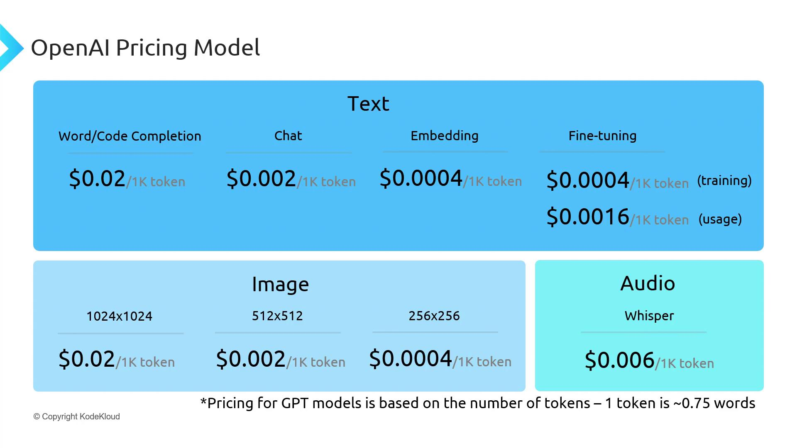

# OpenAI Pricing

Source: https://notes.kodekloud.com/docs/Mastering-Generative-AI-with-OpenAI/Getting-Started-with-OpenAI/OpenAI-Pricing/page

OpenAIs pricing guide details billing for text, image, and audio models, including costs per tokens, images, and audio duration.

<Callout icon="triangle-alert">
  OpenAI’s pricing is dynamic and may change at any time. For the most current rates, please visit [openai.com/pricing][pricing].
</Callout>

OpenAI categorizes its foundation models into three primary types—text, image, and audio—each charged using a distinct unit:

| Model Category  | Billing Unit        | Basis                                           |
| --------------- | ------------------- | ----------------------------------------------- |
| Text            | 1,000 tokens        | \~750 words per 1,000 tokens                    |
| Image           | Per generated image | Cost varies by image resolution                 |
| Audio (Whisper) | Per second of audio | Charged by duration (transcription/translation) |

<Callout icon="lightbulb">
  A token corresponds to roughly 0.75 English words. Tools like [tiktoken][tiktoken] help estimate token counts before you send requests.
</Callout>

## Text-Based Use Cases

Text models support a variety of tasks, each billed per 1,000 tokens:

| Use Case             | Description                        |
| -------------------- | ---------------------------------- |
| Word/Code Completion | Predictive text or code generation |
| Chat                 | Conversational AI interactions     |
| Embeddings           | Semantic vector generation         |
| Fine-Tuning          | Custom model training              |

<Frame>
  
</Frame>

<Callout icon="lightbulb">
  Always check the [official pricing page][pricing] before planning your integration or budgeting for production workloads.
</Callout>

***

We’ll now take a closer look at ChatGPT—how it works and how to integrate it into your applications.

## Links and References

* [OpenAI Pricing][pricing]
* [tiktoken GitHub Repository][tiktoken]

[pricing]: https://openai.com/pricing

[tiktoken]: https://github.com/openai/tiktoken

<CardGroup>
  <Card title="Watch Video" icon="video" href="https://learn.kodekloud.com/user/courses/mastering-generative-ai-with-openai/module/7cf291c5-4705-4a69-965a-b0ba7d2169c6/lesson/e77a45ed-debb-4df4-bdf9-a3a767c9357f" />
</CardGroup>
