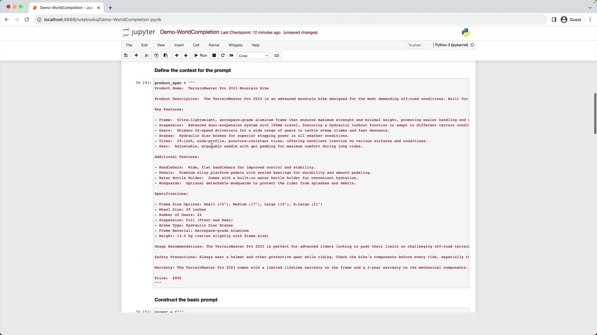
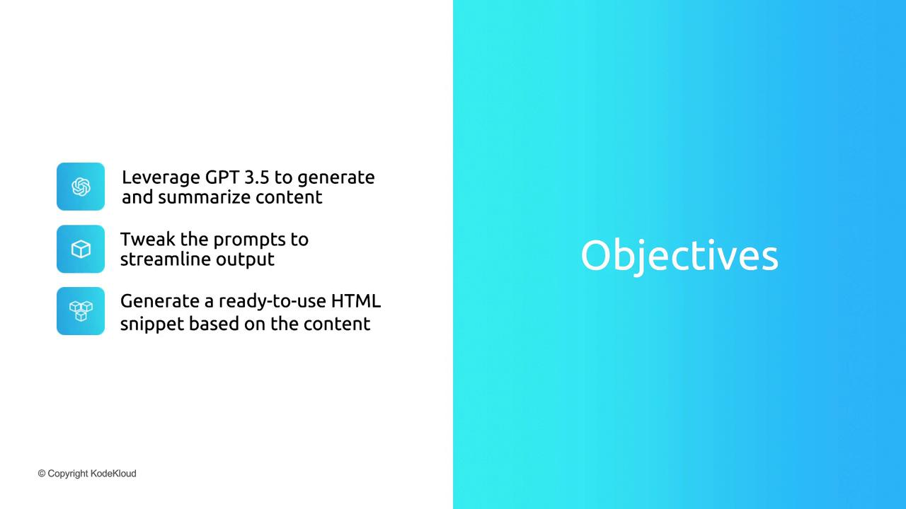

# Securely load your API key; do NOT hardcode in notebooks shared publicly
openai.api_key = os.getenv("OPENAI_API_KEY")
# Uncomment the line below if you prefer to paste your key directly:
# openai.api_key = "<YOUR_API_KEY>"
```

<Callout icon="triangle-alert">
  Never commit your API key to source control. Use environment variables or a secrets manager to keep credentials safe.
</Callout>

***

## 2. Define the `get_word_completion` Helper Function

Encapsulate the ChatCompletion call in a function to simplify reuse:

```python theme={null}
def get_word_completion(prompt: str) -> str:
    """
    Sends a list of messages to the ChatCompletion endpoint 
    and returns the assistant's content.
    """
    messages = [
        {"role": "system", "content": "You are a helpful assistant."},
        {"role": "user",   "content": prompt}
    ]
    response = openai.ChatCompletion.create(
        model="gpt-3.5-turbo",
        messages=messages,
        max_tokens=3000,
        temperature=1.2,
        n=1
    )
    return response.choices[0].message.content
```

### ChatCompletion.create Parameters

| Parameter   | Purpose                                 | Example         |
| ----------- | --------------------------------------- | --------------- |
| model       | Specifies which OpenAI model to use     | `gpt-3.5-turbo` |
| messages    | Conversation roles & content array      | system + user   |
| max\_tokens | Max tokens in the generated response    | `3000`          |
| temperature | Controls randomness (0 = deterministic) | `1.2`           |
| n           | Number of completions to generate       | `1`             |

<Callout icon="lightbulb">
  Adjust `temperature` to control creativity; lower values yield more focused outputs, higher values produce varied text.
</Callout>

***

## 3. Prepare the Product Specification

We'll use a multi-line string as our product spec for a fictional **TerrainMaster Pro 2023 Mountain Bike**:

```python theme={null}
product_spec = """
Product Name:  TerrainMaster Pro 2023 Mountain Bike
Product Description:  The TerrainMaster Pro 2023 is an advanced mountain bike designed for the most demanding off-road conditions.

Key Features:
- Frame: Aerospace-grade aluminum frame for maximum strength and minimal weight.
- Suspension: Dual-suspension system with 180mm travel and hydraulic lockout.
- Gears: Shimano 24-speed drivetrain.
- Brakes: Hydraulic disc brakes.
- Tires: 29-inch, wide-profile, puncture-resistant tires.
- Seat: Ergonomic saddle with gel padding.

Additional Features:
- Handlebars: Wide, flat handlebars for improved control.
- Pedals: Alloy platform pedals with sealed bearings.
- Water Bottle Holder: Built-in for convenient hydration.
- Mudguards: Optional detachable mudguards.

Specifications:
- Frame Size: Small (15"), Medium (17"), Large (19"), X-Large (21").
- Wheel Size: 29 inches.
- Suspension: Full (front and rear).
- Brake Type: Hydraulic Disc.
- Frame Material: Aerospace-grade Aluminum.
- Weight: 13.5 kg (varies with frame size).

Usage Recommendations: Ideal for advanced riders on challenging off-road terrain.
Safety Precautions: Always wear protective gear and inspect components before riding.
Warranty: Limited lifetime frame warranty; 2-year warranty on other components.
Price: $900
"""
```

***

## 4. Example 1: Generating a Full Product Description

Use the full specification to generate a detailed website description.

````python theme={null}
prompt = f"""
Your task is to help the marketing team create a description 
for a product website based on the product spec.

Write a description using the information provided 
in the specifications delimited by triple backticks.

Technical specifications:
```{product_spec}```
"""

response = get_word_completion(prompt)
print(response)
```text

---

## 5. Example 2: Creating a Concise Version

To craft a shorter pitch for a landing page, simply instruct the model to be concise.

```python
prompt = f"""
Your task is to help the marketing team create a 
description for a product website based on the product spec.

Write a concise description from the specifications 
delimited by triple backticks.

Technical specifications:
```{product_spec}```
"""

response = get_word_completion(prompt)
print(response)
````

***

## 6. Example 3: Generating HTML with a Specifications Table

Ask GPT-3.5 Turbo to output a complete HTML snippet, including:

* An `<h1>` with the product name
* A `<div>` styled in 12pt FireBrick font for the description
* A titled table (`Product Specifications`) with two columns: name & value
* Table CSS: DarkSlateGray text, 100% width, 12pt font

````python theme={null}
prompt = f"""
Your task is to help the marketing team create 
HTML for a product website based on the product spec.

- Add a <h1> header with the product name.
- Wrap the description in a <div> styled with font-size:12pt; color:FireBrick.
- Include a 'Product Specifications' table:
  - Two columns: specification name | value
  - Table style: color DarkSlateGray; width 100%; font-size 12pt

Product specifications:
```{product_spec}```
"""

response = get_word_completion(prompt)
print(response)
```text

---

## 7. Previewing HTML in Jupyter Notebook

Render the generated HTML inline using `IPython.display`:

```python
from IPython.display import display, HTML

display(HTML(response))
````

<Frame>
  
</Frame>

***

You’ve now implemented a flexible word completion demo! Next up, we’ll explore GPT-3.5 Turbo’s code-completion capabilities.

<CardGroup>
  <Card title="Watch Video" icon="video" href="https://learn.kodekloud.com/user/courses/mastering-generative-ai-with-openai/module/81cc1b8d-42c4-4867-8161-f3cd89f745bf/lesson/79bf0b01-0fda-47f3-9e6f-4e2a84184647" />

  <Card title="Practice Lab" icon="installation" href="https://learn.kodekloud.com/user/courses/mastering-generative-ai-with-openai/module/81cc1b8d-42c4-4867-8161-f3cd89f745bf/lesson/93913a1f-9199-4739-9520-1ad029ec2ce9" />
</CardGroup>


# Implementing Word Completion

Source: https://notes.kodekloud.com/docs/Mastering-Generative-AI-with-OpenAI/Implementing-Word-Completion/Implementing-Word-Completion/page

Learn to use GPT-3.5 for intelligent word completion, text generation, prompt optimization, and HTML snippet creation in web applications.

Unlock the power of OpenAI’s GPT-3.5 to build intelligent word-completion features, generate concise summaries, and produce embeddable HTML snippets for your web applications. In this hands-on guide, you will:

| Goal                | Description                                                                |
| ------------------- | -------------------------------------------------------------------------- |
| Content Generation  | Leverage GPT-3.5 to expand, complete, and summarize text efficiently.      |
| Prompt Optimization | Tweak and refine prompts to control the style, length, and accuracy.       |
| HTML Embedding      | Generate a ready-to-use, responsive HTML snippet to integrate on any page. |

<Frame>
  
</Frame>

Let’s dive into the step-by-step demonstration and see how to implement word completion with GPT-3.5.

<CardGroup>
  <Card title="Watch Video" icon="video" href="https://learn.kodekloud.com/user/courses/mastering-generative-ai-with-openai/module/81cc1b8d-42c4-4867-8161-f3cd89f745bf/lesson/8d667851-b5ad-478b-8751-267637dca19c" />
</CardGroup>
