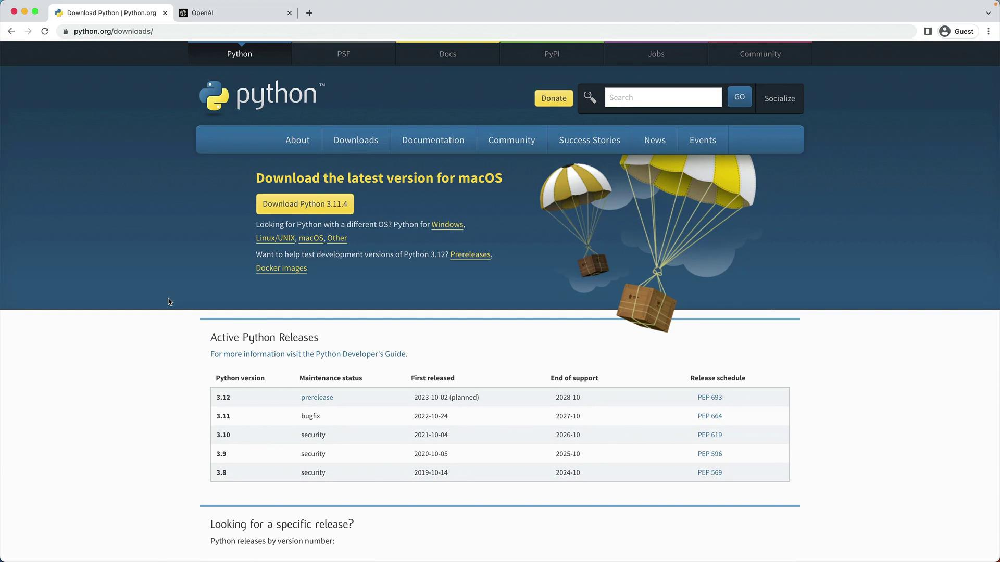
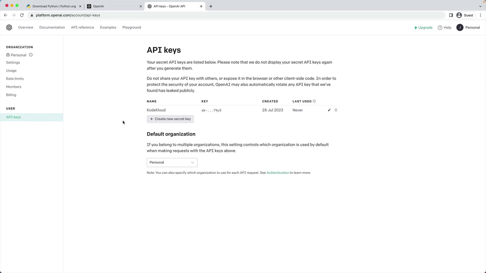
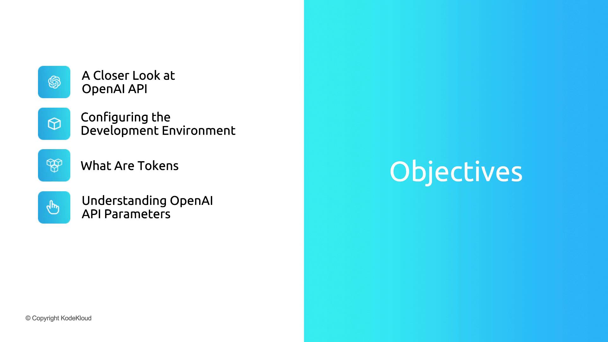

# Expected output:
# Python 3.11.4
```

Launch the REPL to confirm everything works:

```python theme={null}
>>> print("Hello, I'm Python!")
Hello, I'm Python!
>>> name = input("What is your name?\n")
# What is your name?
# Alice
>>> print(f"Hi, {name}.")
Hi, Alice.
```

<Frame>
  
</Frame>

<Callout icon="lightbulb">
  Using Python 3.10 or later ensures compatibility with the latest OpenAI Python client.
</Callout>

***

## 2. Create and Activate a Virtual Environment

Isolate your project dependencies:

```bash theme={null}
python -m venv venv
```

Activate the environment:

```bash theme={null}
# macOS/Linux
source venv/bin/activate

# Windows (PowerShell)
venv\Scripts\Activate.ps1
```

Your shell prompt should now include `(venv)`.

***

## 3. Install OpenAI and Jupyter

With the virtual environment active, install the required packages:

```bash theme={null}
pip install openai jupyter
```

| Package | Purpose                          | Documentation                                                                      |
| ------- | -------------------------------- | ---------------------------------------------------------------------------------- |
| openai  | OpenAI API client for Python     | [https://github.com/openai/openai-python](https://github.com/openai/openai-python) |
| jupyter | Interactive notebook environment | [https://jupyter.org/documentation](https://jupyter.org/documentation)             |

***

## 4. Obtain an OpenAI API Key

1. Sign in at the [OpenAI Dashboard](https://platform.openai.com/).
2. Navigate to **API Keys**.
3. Generate a new secret key (e.g., “KodeKloud”) and copy it immediately.

<Frame>
  
</Frame>

<Callout icon="triangle-alert">
  Your API key grants access to your account—never expose it in public repositories or share it.
</Callout>

***

## 5. Export the `OPENAI_API_KEY` Environment Variable

Avoid hardcoding your key by exporting it:

```bash theme={null}
# macOS/Linux
export OPENAI_API_KEY="sk-..."

# Windows (PowerShell)
setx OPENAI_API_KEY "sk-..."
```

To persist this on macOS/Linux, add the export line to `~/.bashrc` or `~/.zshrc`.

***

## 6. Verify Your Setup

### 6.1 Test with curl

Send a sample request to the Chat Completions endpoint:

```bash theme={null}
curl https://api.openai.com/v1/chat/completions \
  -H "Content-Type: application/json" \
  -H "Authorization: Bearer $OPENAI_API_KEY" \
  -d '{
    "model": "gpt-3.5-turbo",
    "messages": [
      {"role": "system", "content": "You are an AI assistant for timezones."},
      {"role": "user",   "content": "If it is 9AM in London, what time is it in Hyderabad?"}
    ]
  }'
```

A successful JSON response will include fields like `id`, `choices`, and `usage`.

### 6.2 Test in a Jupyter Notebook

1. Launch Jupyter:

   ```bash theme={null}
   jupyter notebook
   ```

2. Create a new notebook (for example, `test_openai.ipynb`) and enter:

   ```python theme={null}
   import os
   import openai

   openai.api_key = os.getenv("OPENAI_API_KEY")

   response = openai.ChatCompletion.create(
       model="gpt-3.5-turbo",
       messages=[
           {"role": "system", "content": "You are an AI assistant for timezones."},
           {"role": "user",   "content": "If it is 9AM in London, what time is it in Hyderabad?"}
       ]
   )

   print(response.choices[0].message.content)
   ```

If the notebook returns the expected answer, your development environment is correctly configured!

***

## Links and References

* [Python Downloads](https://python.org/downloads)
* [OpenAI Python Library](https://github.com/openai/openai-python)
* [Jupyter Documentation](https://jupyter.org/documentation)
* [OpenAI API Reference](https://platform.openai.com/docs/api-reference/overview/)

<CardGroup>
  <Card title="Watch Video" icon="video" href="https://learn.kodekloud.com/user/courses/mastering-generative-ai-with-openai/module/e983525e-3a5a-4043-9319-4f259e41bc79/lesson/66ce9135-5ded-4123-9234-cfb7335f37c1" />
</CardGroup>


# Section Intro

Source: https://notes.kodekloud.com/docs/Mastering-Generative-AI-with-OpenAI/Understanding-Tokens-and-API-Parameters/Section-Intro/page

This lesson covers the OpenAI platform, API configuration, and key parameters for effective use in development.

Welcome back! In this lesson, we’ll revisit the OpenAI platform’s big picture, configure our development environment to invoke the API, and explore the key parameters available in the OpenAI Playground, so you can hit the ground running.

<Callout icon="lightbulb">
  Make sure you have an active OpenAI account and your API key ready. You’ll also need a recent version of [Node.js](https://nodejs.org/) or Python installed.
</Callout>

<Frame>
  
</Frame>

**What We’ll Cover:**

* A closer look at the OpenAI API and its core capabilities
* Setting up your development environment and authenticating requests
* Understanding tokens, usage limits, and cost implications
* Key parameters in the Playground for fine-tuning outputs

Let’s get started and move from high-level concepts to hands-on implementation!

<CardGroup>
  <Card title="Watch Video" icon="video" href="https://learn.kodekloud.com/user/courses/mastering-generative-ai-with-openai/module/e983525e-3a5a-4043-9319-4f259e41bc79/lesson/5f9019d2-37c8-4e7f-83dd-64f829ea6e8d" />
</CardGroup>
