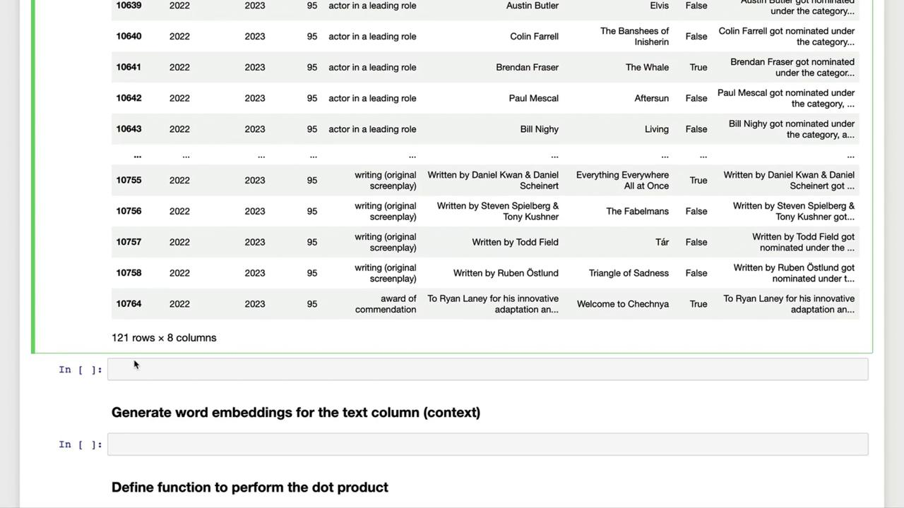

# Load API key
openai.api_key = os.getenv("OPENAI_API_KEY")
```

### Helper Functions

```python theme={null}
def text_embedding(text) -> list[float]:
    """
    Generate embeddings using OpenAI.
    """
    response = openai.Embedding.create(
        model="text-embedding-ada-002",
        input=text
    )
    return response["data"][0]["embedding"]

def get_word_completion(prompt: str) -> str:
    """
    Query GPT-3.5 Turbo for Oscar-related questions.
    """
    messages = [
        {"role": "system", "content": "You answer questions about the 95th Oscar awards."},
        {"role": "user",   "content": prompt},
    ]
    response = openai.ChatCompletion.create(
        model="gpt-3.5-turbo",
        messages=messages,
        max_tokens=3000,
        n=1
    )
    return response.choices[0].message.content
```

## 2. Loading and Preprocessing the Oscar Dataset

The lab environment already includes `data/oscars.csv`. Let’s read and trim it:

```python theme={null}
# Load the dataset
df = pd.read_csv("data/oscars.csv")
df.head()
```

We focus only on the 2023 ceremony, remove missing film entries, and standardize categories to lowercase.

| Step               | Operation                        | Code Example                                  |
| ------------------ | -------------------------------- | --------------------------------------------- |
| Filter by year     | Keep only 2023 ceremony          | `df = df[df["year_ceremony"] == 2023]`        |
| Drop missing films | Remove rows where `film` is null | `df = df.dropna(subset=["film"])`             |
| Normalize category | Lowercase all category names     | `df["category"] = df["category"].str.lower()` |

```python theme={null}
# 1. Keep only the 2023 ceremony
df = df[df["year_ceremony"] == 2023]

# 2. Remove entries with no film listed
df = df.dropna(subset=["film"])

# 3. Convert category names to lowercase
df["category"] = df["category"].str.lower()

print(df.shape)  # Expect (121, 7)
```

## 3. Creating Dynamic Context Sentences

Next, we generate a self-contained sentence for each nomination, combining name, category, film title, and win status.

```python theme={null}
def make_context(row) -> str:
    status = "and won the award" if row["winner"] else "but did not win"
    return (
        f"{row['name']} got nominated under the category {row['category']} "
        f"for the film {row['film']} {status}"
    )

df["text"] = df.apply(make_context, axis=1)
df.head(3)
```

<Frame>
  
</Frame>

### Example Context Sentences

```python theme={null}
# Example entry #12
print(df["text"].iloc[11])
# Ana de Armas got nominated under the category actress in a leading role
# Example entry #101
print(df["text"].iloc[100])
# Viktor Prášil, Frank Kruse, Markus Stemler, Lars Ginzel and Stefan Korte
# got nominated under the category sound for the film All Quiet on the Western Front
# but did not win
```

## 4. Next Steps

With the `text` column in place, you can now:

* Generate embeddings for each sentence
* Compute similarity scores via dot-product matching
* Build dynamic prompts by selecting the most relevant contexts

In **Part 2**, we’ll dive into [OpenAI Embeddings] and similarity matching to power intelligent chatbot responses.

***

## Links and References

* [Kaggle Dataset]: https://www.kaggle.com/datasets/sohier/film-awards
* [OpenAI Embeddings]: https://platform.openai.com/docs/guides/embeddings
* [GPT-3.5 Turbo]: https://platform.openai.com/docs/models/gpt-3-5

<CardGroup>
  <Card title="Watch Video" icon="video" href="https://learn.kodekloud.com/user/courses/mastering-generative-ai-with-openai/module/cf879fc5-dcc3-4470-830d-4393645105c9/lesson/0150c68f-e590-43db-a8a1-68c0f4388db7" />
</CardGroup>


# Demo Building Dynamic Context with Custom Data Part 2

Source: https://notes.kodekloud.com/docs/Mastering-Generative-AI-with-OpenAI/Using-Word-Embeddings-For-Dynamic-Context/Demo-Building-Dynamic-Context-with-Custom-Data-Part-2/page

This workflow builds dynamic context from a DataFrame using embeddings and crafts prompts for OpenAI API calls.

In this guide, we'll continue from having a `text` column ready as context. Next, we'll generate word embeddings for each sentence, compute similarities, and dynamically build context for OpenAI API calls—all using a pandas DataFrame.

## 1. Generate Embeddings for the `text` Column

Use your embedding function to vectorize each row in the DataFrame:

```python theme={null}
