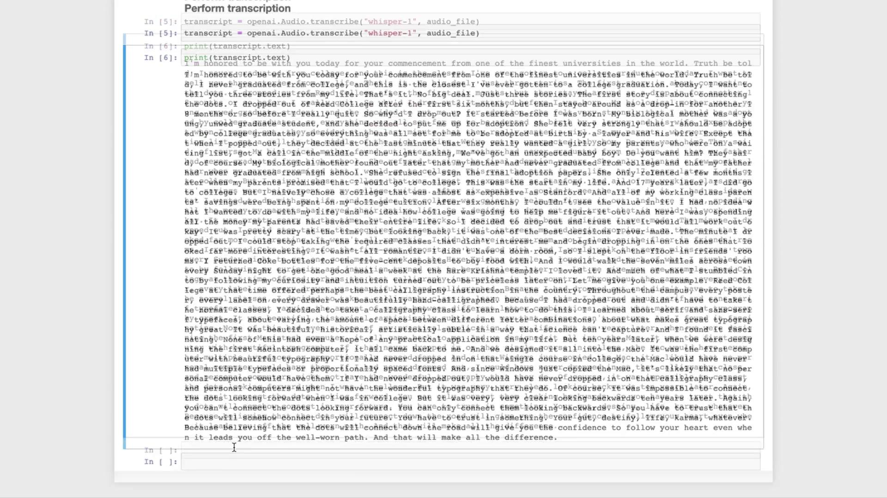

# Load your OpenAI API key from environment
openai.api_key = os.getenv("OPENAI_API_KEY")

file_name = "data/jobs.mp3"
with open(file_name, "rb") as audio_file:
    transcript = openai.Audio.transcribe("whisper-1", audio_file)

print(transcript.text)
```

<Callout icon="lightbulb">
  Make sure `OPENAI_API_KEY` is correctly set. On macOS/Linux:

  ```bash theme={null}
  export OPENAI_API_KEY="your_api_key_here"
  ```
</Callout>

## 3. Next Steps: NLP Pipelines

Once you have the raw transcript, you can feed it into large language models like [GPT-3.5 Turbo][1] or [GPT-4][2] to:

* Summarize the speech
* Generate Q\&A bots
* Classify or analyze sentiment
* Extract key topics

| Use Case           | Model         | Example Link              |
| ------------------ | ------------- | ------------------------- |
| Summarization      | GPT-3.5 Turbo | [API Reference][1]        |
| Question & Answer  | GPT-4         | [API Reference][2]        |
| Sentiment Analysis | GPT-3.5 Turbo | Custom prompt engineering |

## 4. Run Whisper Locally

If you prefer not to use the API, you can run Whisper on your machine via the [open-source repository][3]:

<Frame>
  
</Frame>

## References

* [1]: https://platform.openai.com/docs/models/gpt-3-5-turbo
* [2]: https://platform.openai.com/docs/models/gpt-4
* [3]: https://github.com/openai/whisper

<CardGroup>
  <Card title="Watch Video" icon="video" href="https://learn.kodekloud.com/user/courses/mastering-generative-ai-with-openai/module/574a8a5c-b7a8-4902-aa33-c26eff12ee0b/lesson/8d23bf62-f4b5-42c8-b193-908989182ca9" />

  <Card title="Practice Lab" icon="installation" href="https://learn.kodekloud.com/user/courses/mastering-generative-ai-with-openai/module/574a8a5c-b7a8-4902-aa33-c26eff12ee0b/lesson/61015f41-8233-46a7-9e17-44dea34d524e" />
</CardGroup>


# Demo Audio Translation

Source: https://notes.kodekloud.com/docs/Mastering-Generative-AI-with-OpenAI/Audio-Transcription-Translation/Demo-Audio-Translation/page

This tutorial demonstrates translating a Spanish audio clip into English text using OpenAI’s Whisper API.

In this tutorial, we’ll demonstrate how to translate a short Spanish audio clip into English text using OpenAI’s Whisper API. We'll process a 20-second MP3 segment (up to 25 MB) extracted from an Easy Spanish YouTube video and send it to the API in one request.

## Prerequisites

* Python 3.7+
* `openai` Python SDK
* An OpenAI API key

Install the SDK with:

```bash theme={null}
pip install --upgrade openai
```

<Callout icon="lightbulb">
  Ensure your MP3 file is under 25 MB. Whisper supports formats like MP3, WAV, and FLAC.
</Callout>

## Translation Code Example

```python theme={null}
import os
import openai
import IPython.display as ipd
